# 1: Introduction to Event-Driven Architectures

## Overview

- EDA models changes in the system as events.
- Events are facts that already happened.
- That gives looser coupling than direct request/response integrations.
- Tradeoff: easier extensibility and resilience, harder consistency and tracing.

## Core Concepts

### Events are past-tense facts

- event = something that already happened
- should be treated as immutable
- usually represented as a small value object / struct
- `PaymentReceived` is a fact, not a command

Simple event shape:

```go
type PaymentReceived struct {
    PaymentID string
    OrderID   string
    Amount    int
}
```

### Three event patterns

1. Event notifications
2. Event-carried state transfer
3. Event sourcing

#### Event notification

- minimal payload
- consumers may need to call back for more data

```go
type PaymentReceived struct {
    PaymentID string
}
```

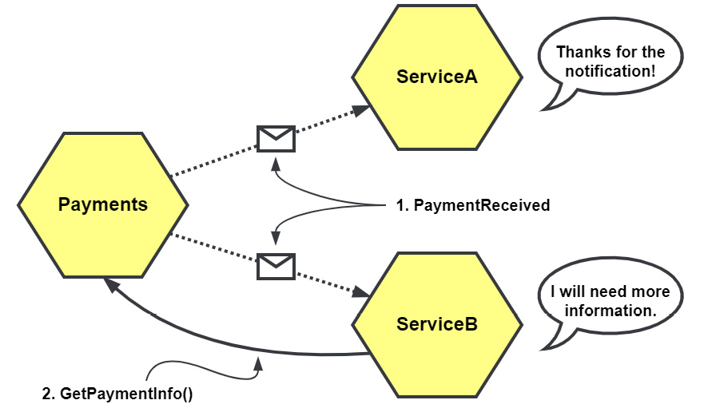

Figure 1.1: thin event, low payload, more follow-up lookups.

#### Event-carried state transfer

- richer payload
- consumers can often continue work without calling back

```go
type PaymentReceived struct {
    PaymentID  string
    CustomerID string
    OrderID    string
    Amount     int
}
```

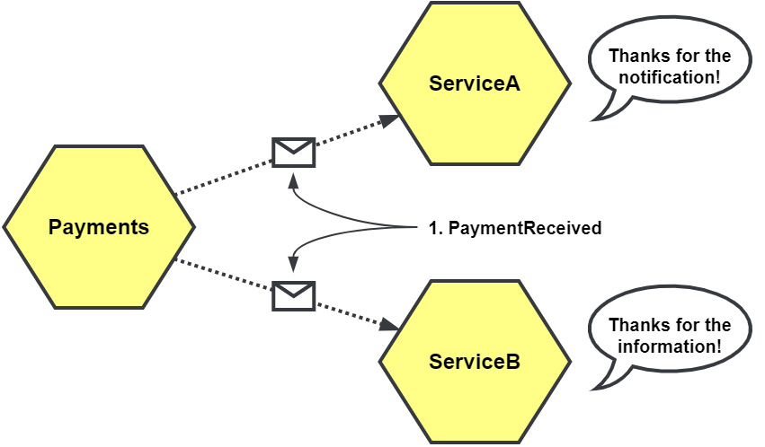

Figure 1.2: fatter event, less need for callback chatter.

#### Event sourcing

- instead of overwriting current state, store all state changes as events
- rebuild aggregate state by replaying its event history

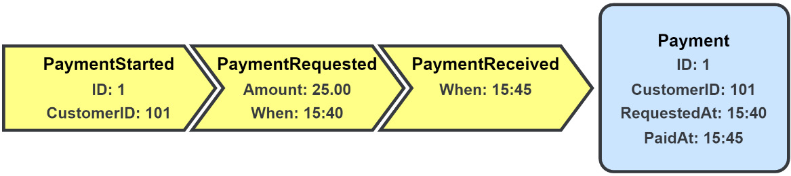

Figure 1.3: event store keeps the full history, not just the latest row.

### Common building blocks

Every pattern still revolves around the same pieces:

- event
- producer
- queue / broker / stream / store
- consumer

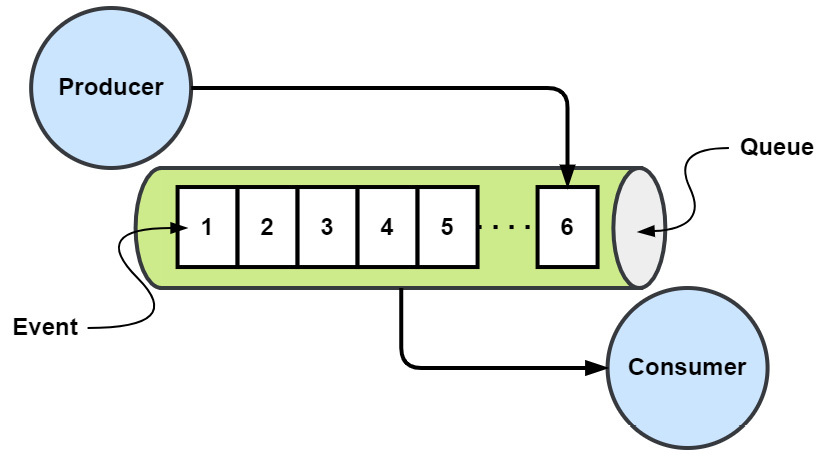

Figure 1.4: base mental model for the rest of these notes.

Important distinctions:

- message queue = transient delivery
- event stream = retained, replayable sequence
- event store = append-only history for an entity/aggregate

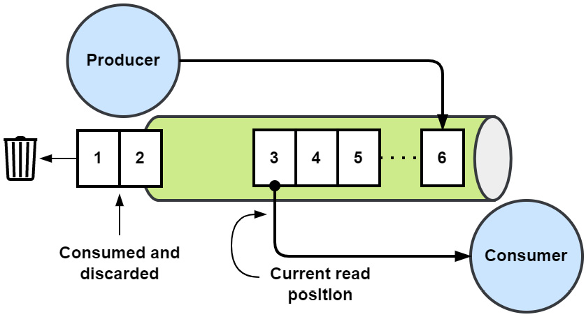

Figure 1.5: delivery-oriented, not history-oriented.

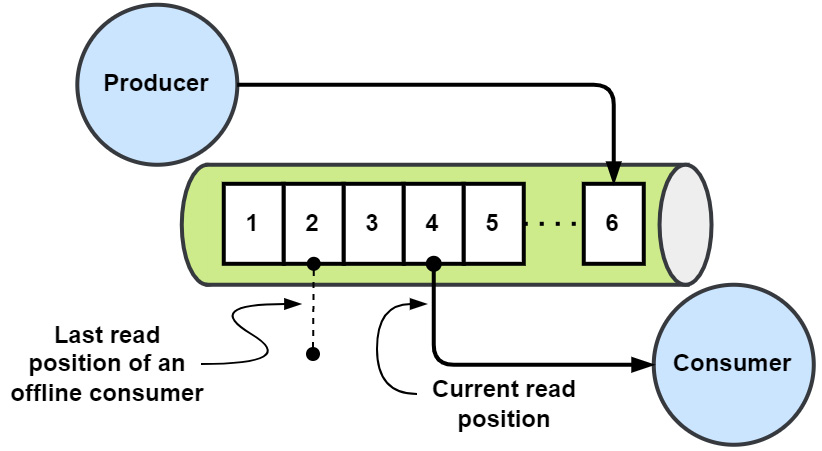

Figure 1.6: consumers can resume or replay.

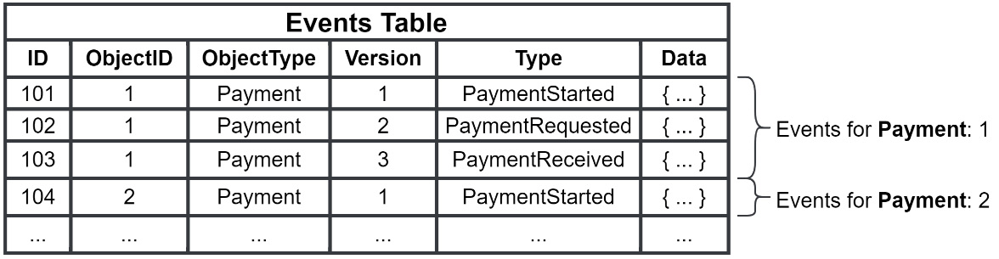

Figure 1.7: persistence of aggregate history, not generic pub/sub.

## MallBots Example System

MallBots is the running example used throughout these notes.

Main business areas introduced here:

- orders
- stores
- payments
- depot

Different clients talk through different interfaces:

- REST for kiosk/customer flows
- WebSockets for staff/admin flows
- gRPC streams for bots

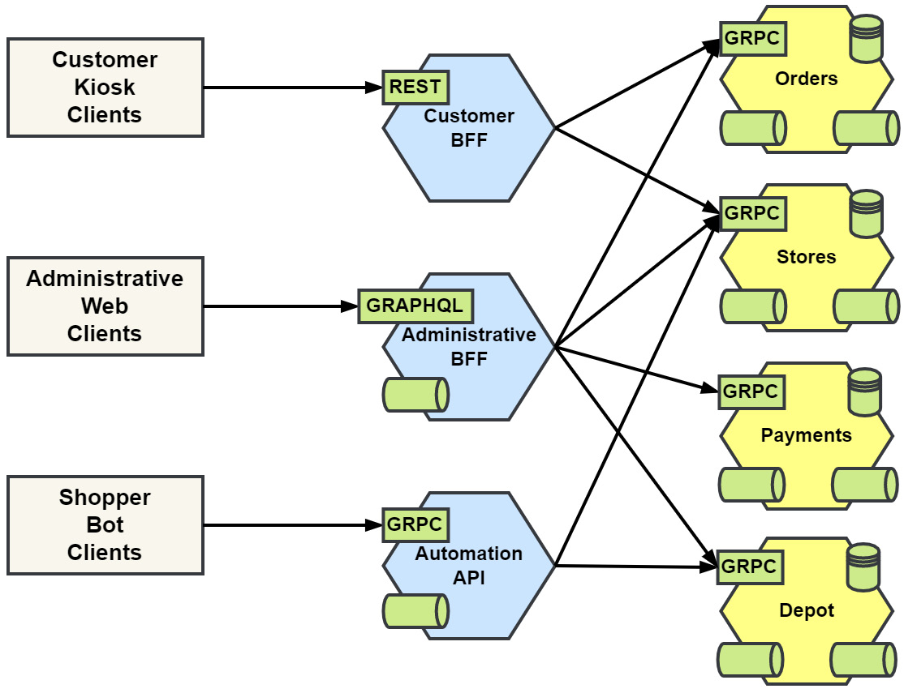

Figure 1.8: system overview used again in later chapters.

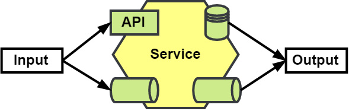

Figure 1.9: hexagon diagrams represent ports/adapters and inside/outside boundaries.

## Benefits of EDA

### Resiliency

- direct synchronous calls create immediate runtime dependency
- a broker decouples producer from consumer timing
- failures become delayed-processing problems instead of immediate blocking in many cases

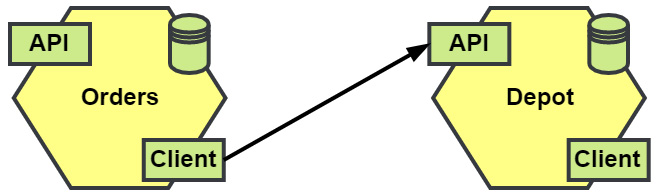

Figure 1.10: direct chains are brittle.

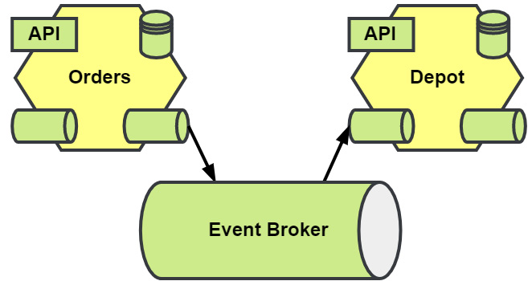

Figure 1.11: brokered communication removes some immediate coupling.

### Agility

- new consumers can subscribe without rewriting the producer
- teams can build side capabilities from existing events
- replayable streams make bootstrapping new consumers easier

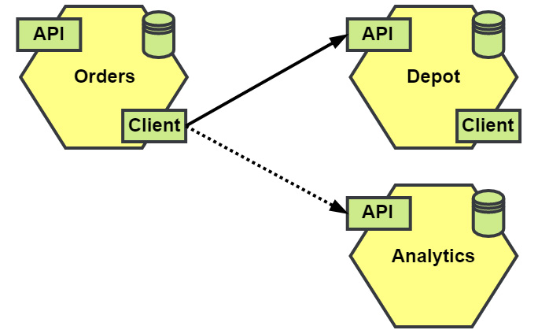

Figure 1.12: adding a direct integration usually forces upstream changes.

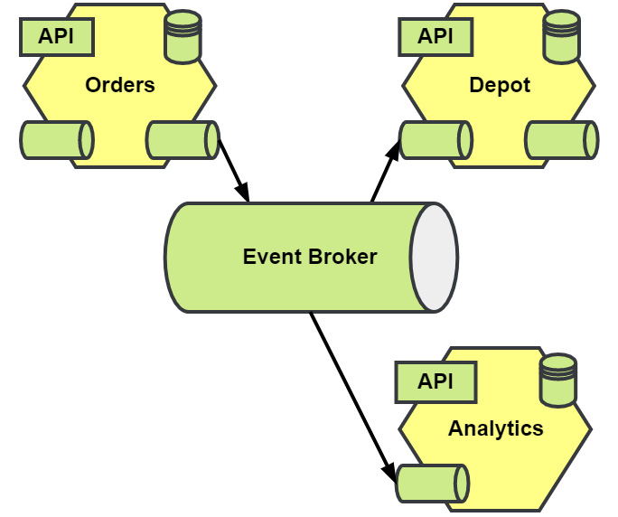

Figure 1.13: a new consumer can often attach with much less coordination.

### UX, analytics, auditing

- natural fit for live status updates
- event history helps auditing
- downstream analytics become easier because change data already exists

## Challenges of EDA

### Eventual consistency

- not every component sees the same truth at the same time
- stale reads are normal
- UI and workflow design must account for that

### Dual writes

- changing local state and publishing an event as two separate operations is dangerous
- one can succeed while the other fails
- outbox pattern is the usual fix

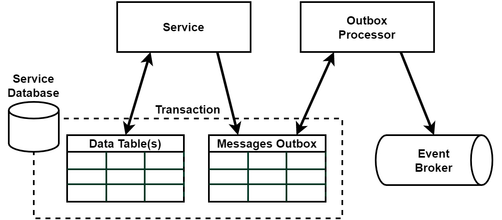

Figure 1.14: persist business change and outgoing event together, publish later from durable storage.

### Distributed async workflows

- no single request/response pair shows the whole process
- user feedback is harder because completion may happen later
- two coordination styles appear repeatedly:
  - choreography = each service reacts on its own
  - orchestration = central coordinator drives the flow

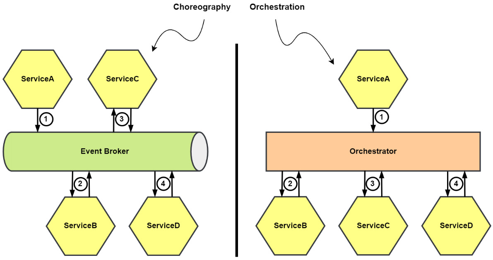

Figure 1.15: autonomy vs central coordination.

### Debugging and design risk

- tracing cause/effect is harder in event-driven systems
- correlation IDs and observability are mandatory
- bad event boundaries produce a Big Ball of Mud with events instead of with APIs

## Key Takeaways

- EDA is about communicating business state changes through events.
- event notification, event-carried state transfer, and event sourcing solve different problems.
- message queues, event streams, and event stores are not interchangeable.
- EDA improves decoupling and extensibility but makes consistency and tracing harder.

## How This Connects to the Repo

- The repository mirrors the architecture progression instead of starting at the final architecture immediately.
- `02_Modular_Monolith/` shows the baseline synchronous modular monolith.
- `03_Domain_Events/` introduces internal domain events for in-process coordination.
- `04_Event_Sourcing/` turns selected modules into event-sourced write models with projections.

That progression separates three distinct ideas instead of collapsing them into one giant pattern:

1. how to model meaningful business facts
2. how to decouple reactions from commands
3. how to decide when facts should be transient notifications versus durable history

Practical reading rule:

- if the event only coordinates logic inside one module, think Chapter 4 domain event
- if the event is the persisted source of truth for an aggregate, think Chapter 5 event-sourcing event
- if the event crosses service or bounded-context boundaries, think later integration-event chapters

# 2: Supporting Patterns in Brief

## Overview

- EDA alone is not enough
- supporting patterns are needed to keep boundaries, models, and reads/writes under control
- this chapter focuses on DDD, domain-centric architecture, CQRS, and deployment shape

## Domain-Driven Design

### What matters most

- DDD is primarily about modeling the business well
- not just tactical patterns like entities/repositories/value objects
- strategic DDD matters most here:
  - ubiquitous language
  - subdomains
  - bounded contexts
  - context mapping

### Common misconceptions

- DDD is not just a bag of code patterns
- DDD is not only for giant enterprise systems

Real warning:

- teams often copy the tactical parts and skip the actual modeling work

### Ubiquitous language

- domain experts and developers need shared terminology
- terms should mean one thing inside one bounded context
- language should show up in code, tests, APIs, and conversations

### Subdomains

Three categories:

- core = source of real business differentiation
- supporting = useful, but not the competitive edge
- generic = commodity capability, often buy-not-build

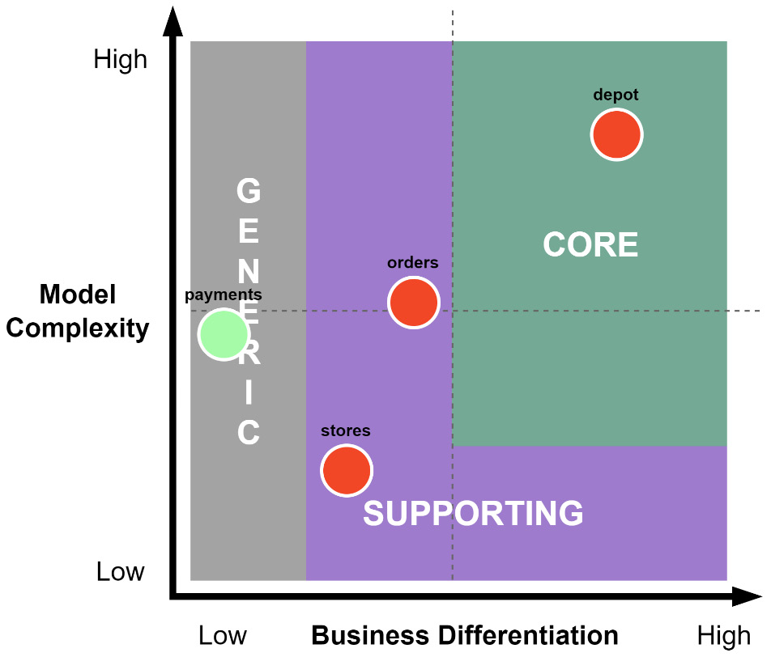

Figure 2.1: in MallBots, depot is core, orders/stores are supporting, payments is generic.

### Bounded contexts

- each context owns its own model and language
- same word can mean different things in different contexts
- one shared noun does not imply one shared model

Important example:

- `Product` in store management is not necessarily the same model as `Product` in ordering or depot

### Context mapping

- after splitting contexts, map how they relate
- patterns are descriptive relationship types, not implementation recipes

Patterns listed:

- open host service
- event publisher
- shared kernel
- published language
- separate ways
- partnership
- customer/supplier
- conformist
- anticorruption layer

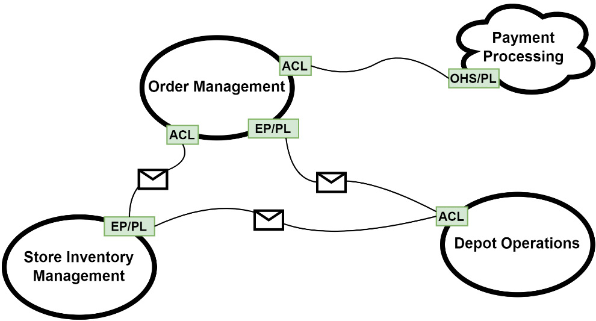

Figure 2.2: useful for deciding where integration contracts belong and how contexts should depend on each other.

### Why DDD matters for EDA

- better event names
- clearer ownership
- clearer internal vs external event boundaries

Without DDD work, event-driven systems become vague and tightly coupled in disguise.

## Domain-Centric Architectures

### Core idea

- keep the domain in the center
- infrastructure stays outside
- application layer coordinates between domain and outside world
- goal: stop business logic from leaking into UI, database, transport, or framework code

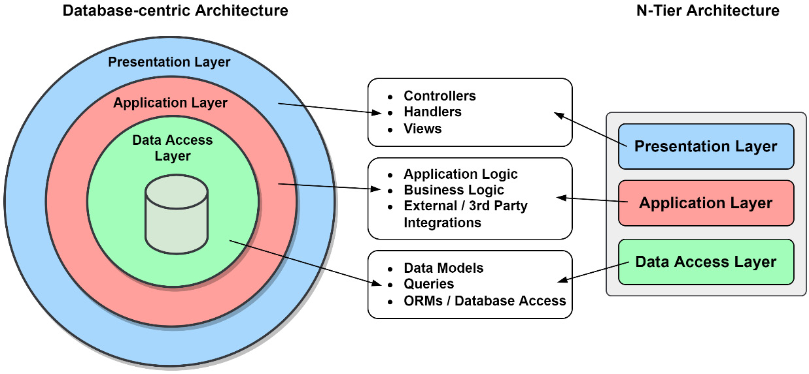

Figure 2.3: traditional layered systems often end up coupling everything to shared models.

### Architecture family

Related styles covered:

- hexagonal architecture
- onion architecture
- clean architecture

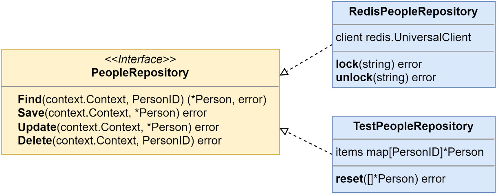

Figure 2.4: ports-and-adapters basics.

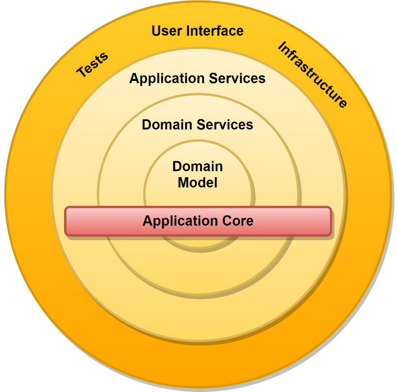

Figure 2.5: dependencies point inward.

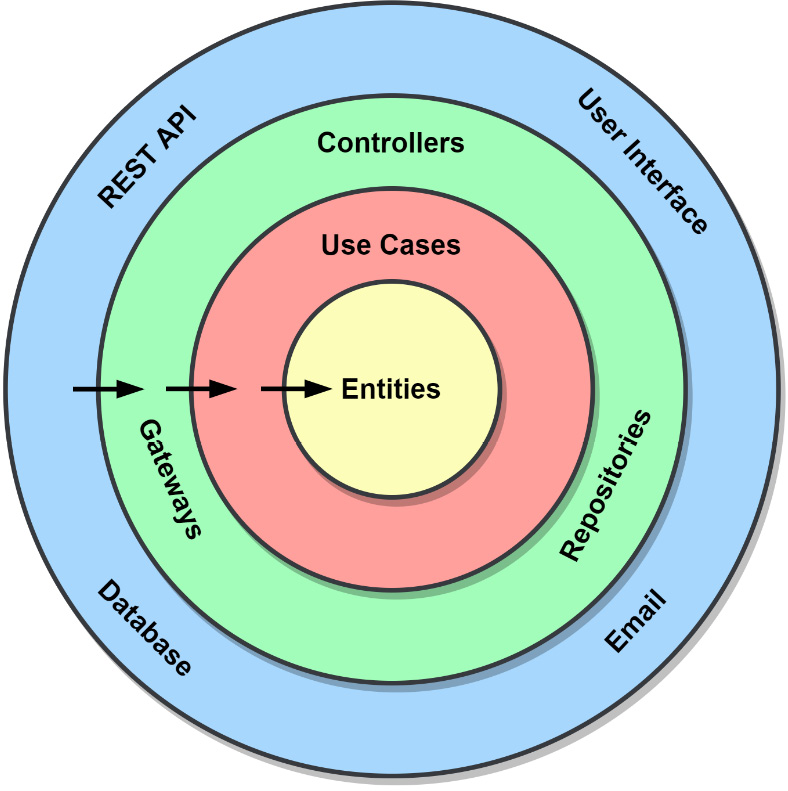

Figure 2.6: same inward-dependency rule with different naming.

### Dependency inversion

- inner layers should not know outer-layer details
- outer adapters implement interfaces owned closer to the core

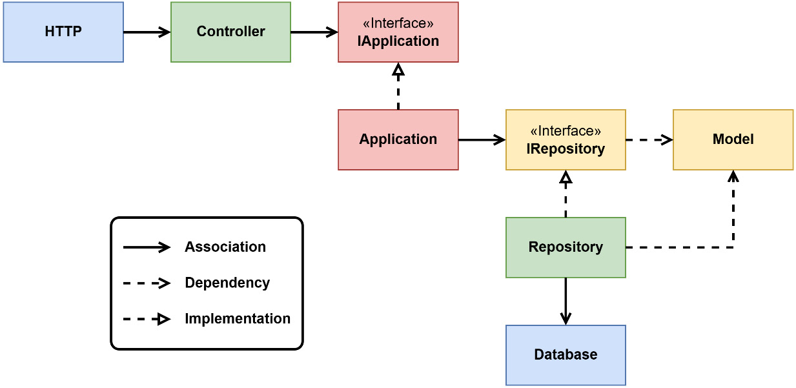

Figure 2.7: code dependencies point inward, not outward.

### Practical hexagonal split

- domain = model + business rules
- application = use cases + contracts
- outside world = DBs, APIs, brokers, UI, frameworks

Two adapter directions:

- driver/primary adapters push data into the app
- driven/secondary adapters are called by the app

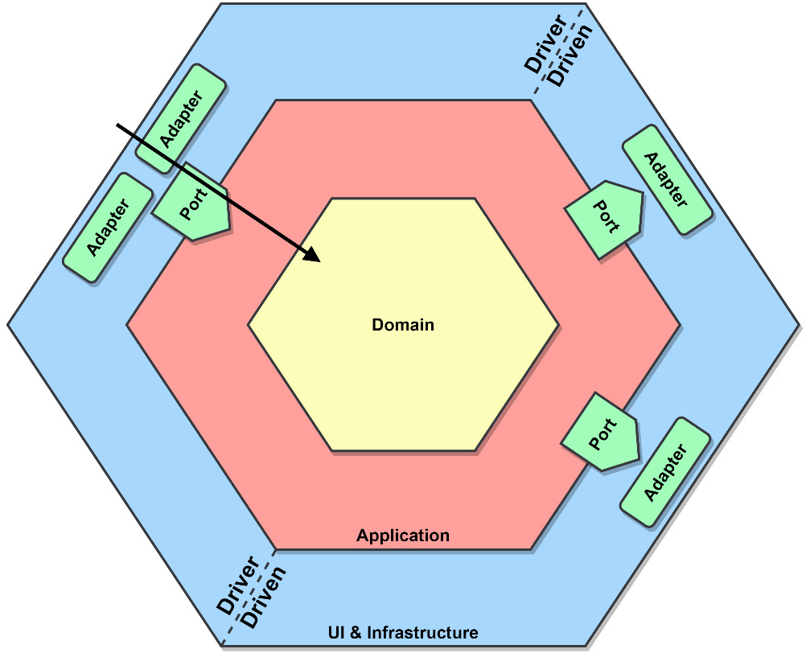

Figure 2.8: practical combined view used throughout the rest of these notes.

### Why use it

- easier testing
- lower framework coupling
- easier adapter replacement
- better protection of the domain model

### Costs

- more abstractions
- more upfront design
- easy to overdo if the team is inexperienced

## CQRS

### Definition

- commands change state
- queries return state
- one operation should not try to do both

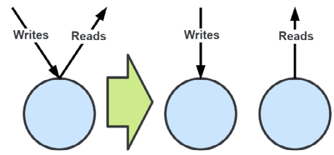

Figure 2.9: smallest CQRS split is separating write and read responsibilities on one model.

### Problem CQRS solves

- write models and read models often want different shapes
- forcing one model to do both can distort the domain and bloat the code

### CQRS is a spectrum

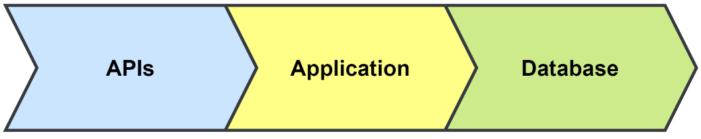

Figure 2.10: where you cut determines how much CQRS you adopt.

#### Application-level CQRS

- separate command/query code paths
- same DB can still be used

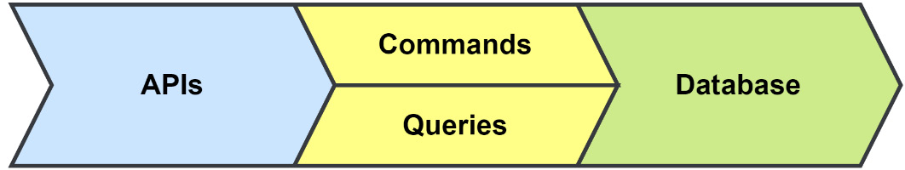

Figure 2.11: lightest-weight CQRS.

#### Database-level CQRS

- read models/projections can live separately
- queries can be optimized independently

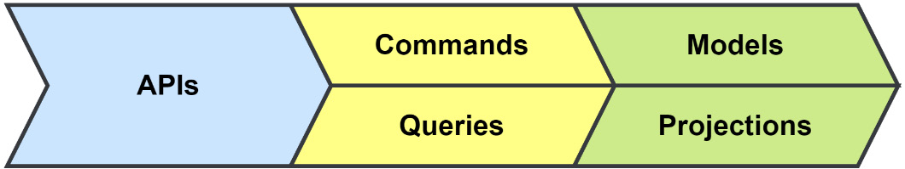

Figure 2.12: events can feed specialized read projections.

#### Service-level CQRS

- separate read and write services
- independent scaling and deployment

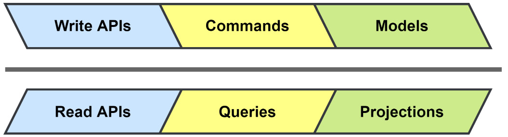

Figure 2.13: maximum flexibility, maximum complexity.

### When CQRS is worth it

- reads dominate writes
- read/write security differs
- read models need very different shapes
- reads need separate scaling or availability
- event sourcing or projections already exist

### CQRS and event sourcing

- CQRS is not itself an event-driven pattern
- it works very well with event sourcing because append-only events naturally feed projections

### Task-based UI

- CQRS works better when commands express intent clearly
- prefer behavior-oriented actions over generic CRUD labels
- `ChangeMailingAddress` is better than `UpdateUser`

## Application Architectures

### Monolith

- single codebase
- single deployable
- operationally simple early on
- often blamed for bad design problems that are really just bad design problems

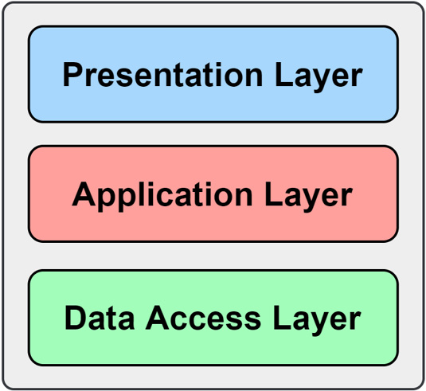

Figure 2.14: simple deployment, but internal structure matters a lot.

### Modular monolith

- one deployable unit
- strong internal module boundaries
- keeps many monolith operational benefits
- gets some structural advantages of microservices without the operational cost

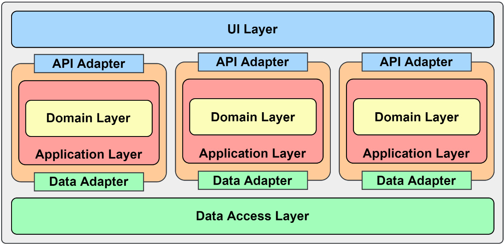

Figure 2.15: recommended default starting point.

### Microservices

- independent deployables
- independent scaling
- better fault isolation when done well

Costs:

- more operational complexity
- eventual consistency issues
- harder integration testing
- more coordination overhead

### Default recommendation

- start with a modular monolith
- get domain boundaries right first
- split into microservices only when the real pressure appears

## Key Takeaways

- DDD sharpens boundaries, ownership, and event naming.
- domain-centric architecture protects business logic from infrastructure coupling.
- CQRS separates read and write concerns when one model no longer fits both.
- modular monolith is the recommended default for greenfield systems.

## How This Connects to the Repo

The repository takes this chapter very literally:

- business modules sit at the top level: `stores/`, `ordering/`, `baskets/`, `customers/`, `payments/`, `depot/`, `notifications/`
- implementation details are hidden under each module's `internal/` directory
- startup wiring happens in each module's `module.go`
- cross-cutting infrastructure is assembled from the monolith entrypoint instead of being created deep inside business code

Representative examples:

- `02_Modular_Monolith/cmd/mallbots/monolith.go`
- `02_Modular_Monolith/stores/module.go`
- `02_Modular_Monolith/ordering/module.go`
- `02_Modular_Monolith/internal/ddd/`

The main architectural takeaway is that the repo does not treat hexagonal architecture as a folder naming trick. It treats it as a dependency rule:

- domain code should not know about Postgres, gRPC, HTTP, or Swagger
- adapters depend on the application/domain, not the other way around
- CQRS starts small, usually as separate command and query handlers before it grows into separate read models

## Further Reading

- *Domain-Driven Design Reference* by Eric Evans: <https://www.domainlanguage.com/wp-content/uploads/2016/05/DDD_Reference_2015-03.pdf>
- *CQRS Documents* by Greg Young: <https://cqrs.files.wordpress.com/2010/11/cqrs_documents.pdf>
- *Modular Monolith: A Primer* by Kamil Grzybek: <https://www.kamilgrzybek.com/design/modular-monolith-primer/>

# 3: Design and Planning

## Overview

Design sequence:

1. discover the domain with EventStorming
2. turn discoveries into executable specifications with BDD
3. record important architecture decisions with ADRs

Design emphasis:

- do not jump from a vague product pitch straight into implementation
- reduce ambiguity before coding starts

## EventStorming

### What it is for

- rapid domain discovery
- shared language building
- exposing hidden assumptions and missing rules
- identifying candidate bounded contexts

Main sticky-note concepts:

- domain events in past tense
- commands
- policies
- actors
- external systems
- aggregates / business areas

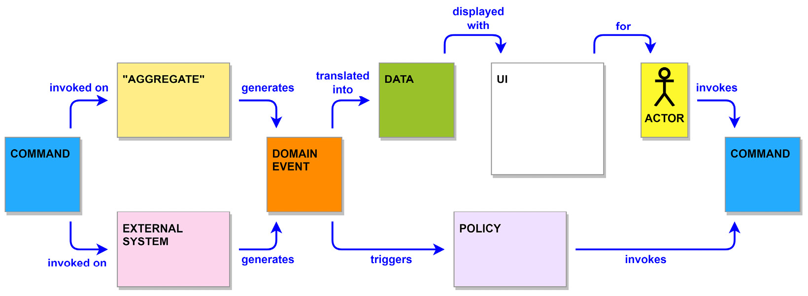

Figure 3.1: legend for the whole workshop notation.

### Why sticky notes matter

- easy to move
- cheap to replace
- supports collaborative discovery better than polished diagrams too early

## Big Picture EventStorming

### Step 1: Kick-off

- align on goals
- explain notation
- set workshop rules

Useful rules:

- do not rewrite someone else's note without discussion
- get ideas onto the wall quickly
- do not get attached to early wording

### Step 2: Chaotic exploration

- everyone starts placing events
- messy output is expected
- volume and discovery matter more than order at first

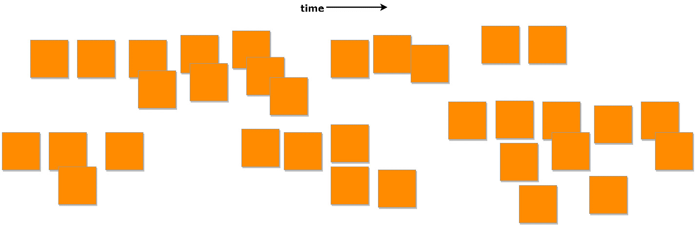

Figure 3.2: expected early mess.

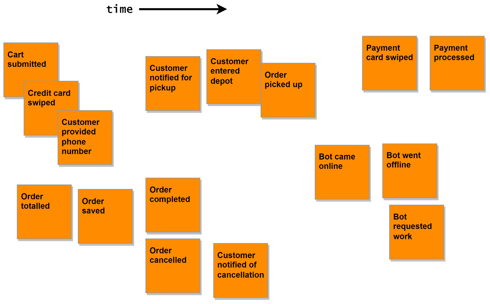

Figure 3.3: disorder is normal at this stage.

Language gets refined during this step too, for example:

- store
- participating store
- catalog
- cart
- order

### Step 3: Enforcing the timeline

- organize events chronologically
- group events into flows
- branch unhappy paths and alternatives

Techniques mentioned:

- pivotal events
- swim lanes
- temporal milestones

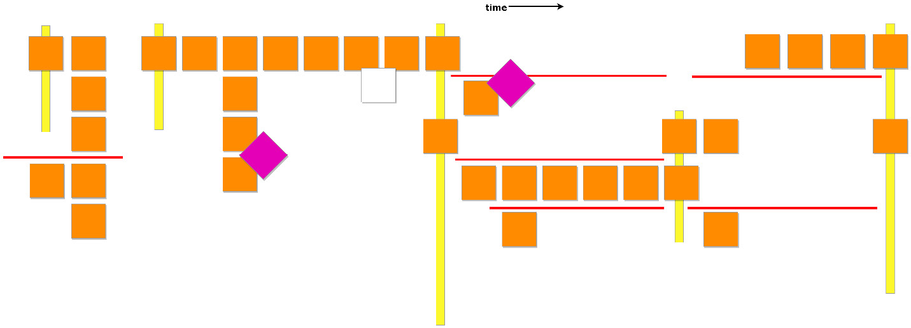

Figure 3.4: chaos starts turning into usable flows.

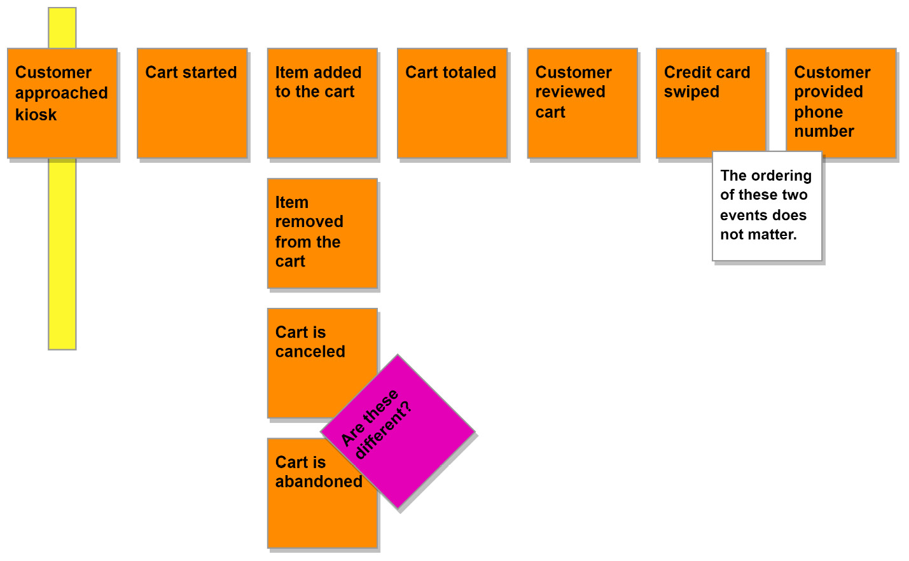

Figure 3.5: horizontal time, vertical alternatives.

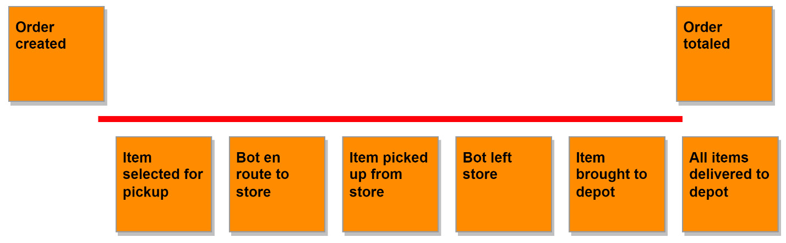

Figure 3.6: dependencies and parallel flows become visible.

### Step 4: People and systems

- add actors
- add external systems
- discover triggers and dependencies that were missing

Actors found in MallBots:

- store owners
- store administrators
- customers
- bots
- depot administrators
- depot staff

External systems found:

- SMS notification service
- payment service

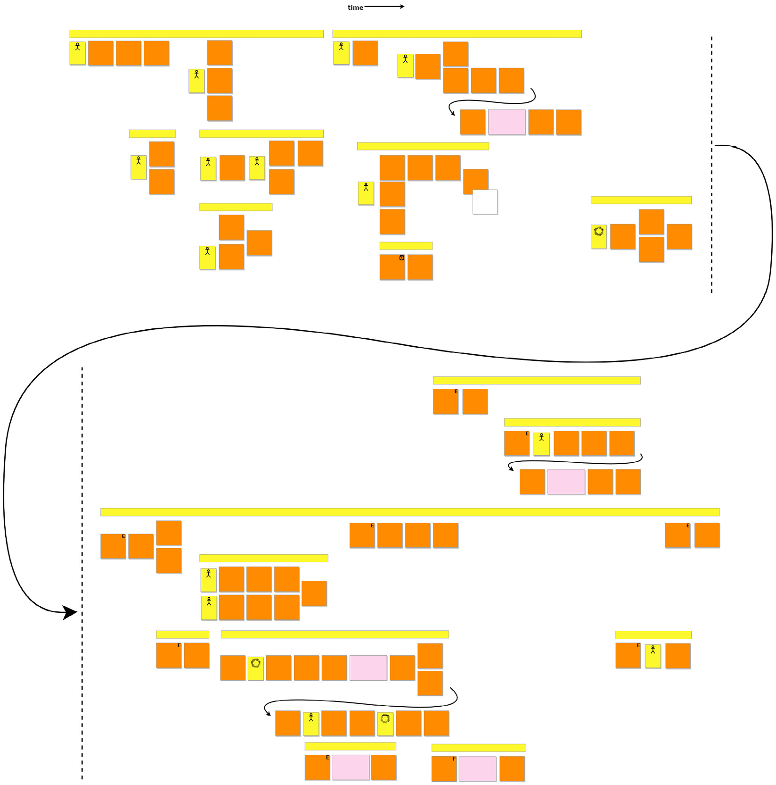

Figure 3.7: flows become much richer once triggers and outside dependencies are visible.

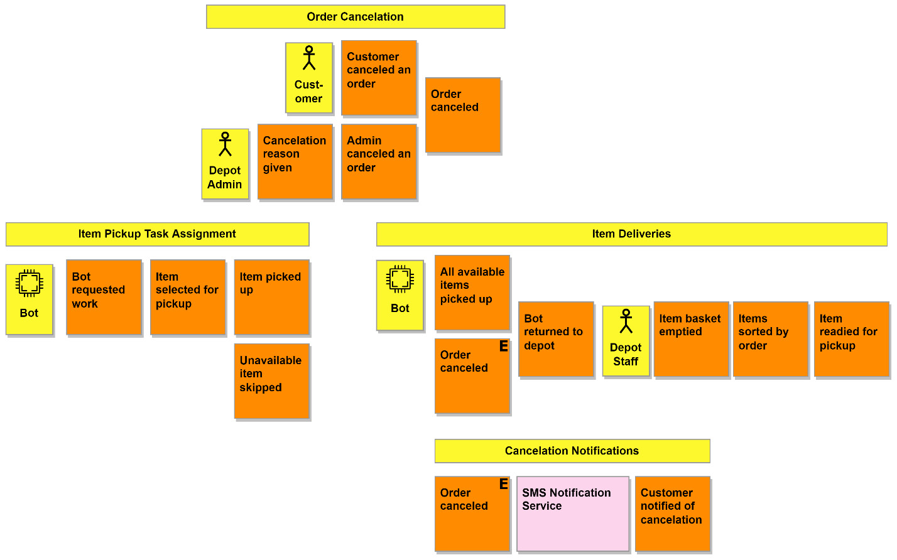

Figure 3.8: labels above flows help people recognize business areas.


Figure 3.9: variations like time-based or externally triggered events can be marked explicitly.

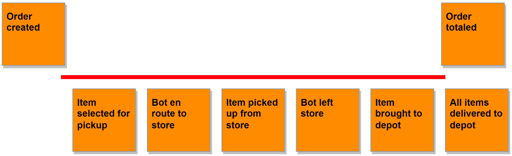

Figure 3.10: terminology and ownership get corrected during refinement.

### Step 5: Explicit walk-through

- tell the story of the flow out loud
- use storytelling to expose missing prerequisites and hidden assumptions
- reverse storytelling also helps: start near the end and work backward

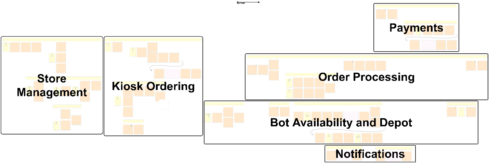

Figure 3.11: storytelling groups create natural review chunks.

Main discoveries surfaced during walkthroughs:

- store creation does not imply products already exist
- closing a store is different from disabling automated shopping
- customer kiosk flow needed explicit store selection and clearer cart updates
- `cart saved` was dropped as a bad concept
- bot availability means on + idle, not just on
- order cancellation needed explicit entry points
- bot work shifted from item-by-item pickup to shopping-list assignment
- invoice/payment flow needed customer review and alignment with pre-authorization

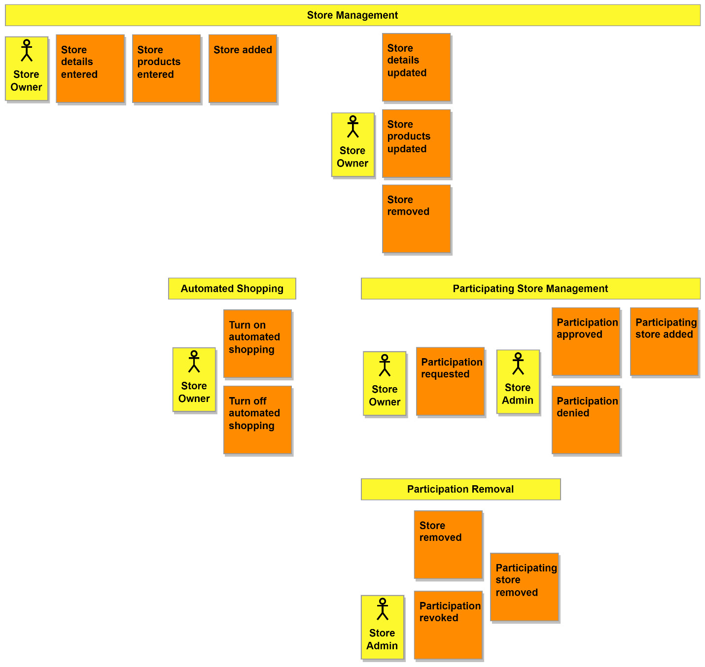

Figure 3.12: vague store-management flows became explicit.

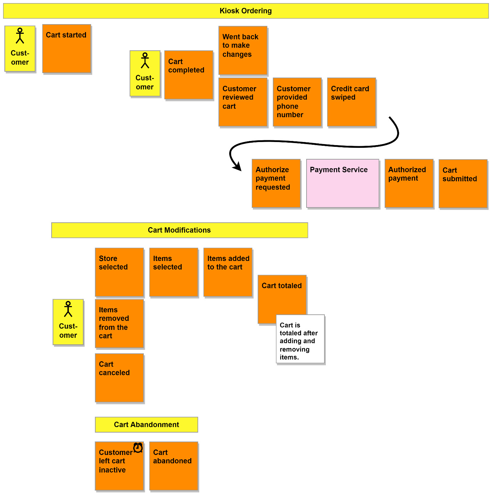

Figure 3.13: user-facing behavior was underspecified until the story was narrated.

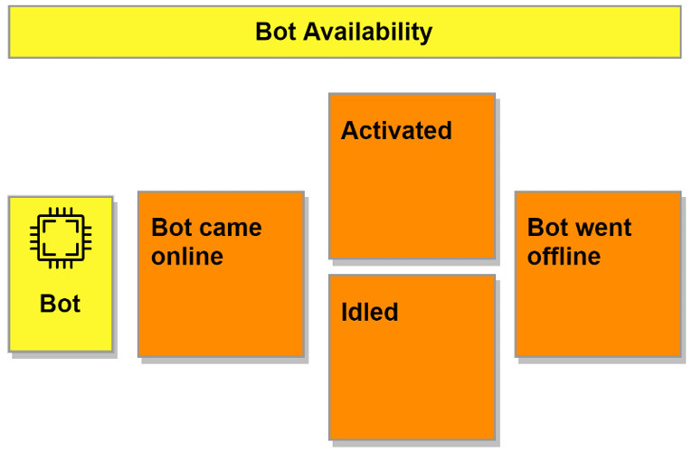

Figure 3.14: operational language got tightened into a proper domain concept.

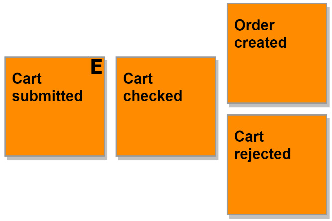

Figure 3.15: cart-to-order transition was cleaned up.

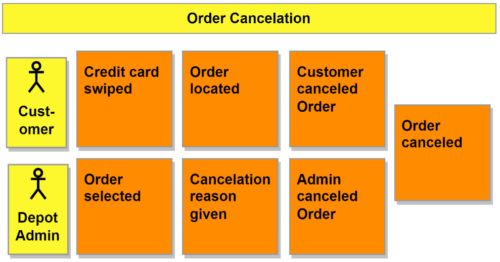

Figure 3.16: cancellation now has explicit preconditions.

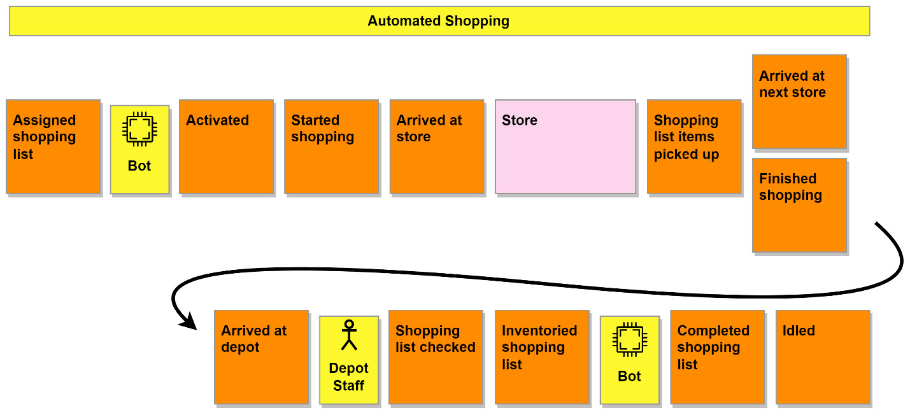

Figure 3.17: major redesign around shopping lists and bot assignment.

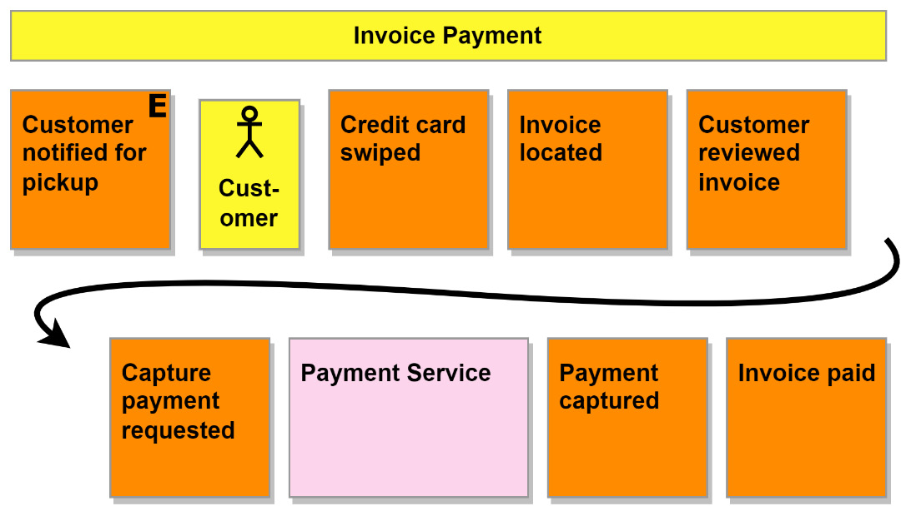

Figure 3.18: payment flow changed even late in discovery.

### Step 6: Problems and opportunities

- mark unresolved problems in the current version
- capture future opportunities separately

This keeps the workshop honest while still preserving ideas for later.

### Candidate bounded contexts

- after the flows are clear enough, draw likely context boundaries
- these are proposals, not mathematical truths


Figure 3.19: output of EventStorming should include candidate boundaries, not just event lists.

### Design-level EventStorming

- big-picture workshop is for broad discovery
- design-level workshop zooms into one complex bounded context
- likely deep-focus contexts here: depot and order processing
- store management can stay simpler; payments and notifications remain likely externals

## BDD and Executable Specifications

### Why BDD is used here

- discovery results need to turn into something implementable and testable
- BDD keeps documentation close to acceptance criteria
- scenarios should describe what the system does, not UI mechanics

Bad example: too tied to one UI interaction style

```go
Feature: Authenticate Users
  Scenario: Login to the application
    Given a user with username "alice" and password
      "itsasecret"
    When I enter the username "alice"
    And I enter the password "itsasecret"
    And I click the "Login" button
    Then I see the application dashboard
```

Better example: behavior-focused

```go
Feature: Authenticate Users
  Scenario: Login to the application
    Given an active user "alice"
    When "alice" authenticates correctly
    Then "alice" can access the application dashboard
```

### Gherkin feature example

```go
Feature: Creating Stores
  As a store owner
  I should be able to create new stores
  Scenario: Creating a store called "Waldorf Books"
    Given a valid store owner is logged in
    And no store called "Waldorf Books" exists
    When I create the store called "Waldorf Books"
    Then a store called "Waldorf Books" exists
```

Structure:

- feature name
- optional user-story framing
- scenarios as concrete examples

### Godog binding example

```go
var storeName = ""

func aStoreExists(name string) error {
    if storeName != name {
        return fmt.Errorf("store does not exist: %s", name)
    }
    return nil
}

func aValidStoreOwner() error {
    return nil
}

func iCreateTheStore(name string) error {
    storeName = name
    return nil
}

func noStoreExists(name string) error {
    if storeName == name {
        return fmt.Errorf("store does exist: %s", name)
    }
    return nil
}

func InitializeScenario(ctx *godog.ScenarioContext) {
    ctx.Step(`^a store called "([^"]*)" exists$`, aStoreExists)
    ctx.Step(`^a valid store owner is logged in$`, aValidStoreOwner)
    ctx.Step(`^I create the store called "([^"]*)"$`, iCreateTheStore)
    ctx.Step(`^no store called "([^"]*)" exists$`, noStoreExists)
}
```

Point of the example:

- feature text becomes executable acceptance criteria
- domain experts can read it, tests can execute it

## ADRs

### Why ADRs matter

- significant technical decisions outlive the memory of why they were made
- ADRs preserve context, not just outcome

Template used:

```go
### {RecordNum}. {Title}
#### Context
What is the issue that we're seeing that is motivating this decision or change?
#### Decision
What is the change that we're proposing and/or doing?
#### Status
Proposed, Accepted, Rejected, Superseded, Deprecated
#### Consequences
What becomes easier or more difficult to do because of this change
```

Good ADR candidates:

- cloud provider choices
- infrastructure changes
- unusual technical decisions
- language choices
- adopting DDD or similar patterns

Two initial MallBots decisions called out:

- keep an architecture decision log
- use a modular monolith architecture

## Key Takeaways

- EventStorming is the discovery mechanism.
- storytelling is what turns sticky-note flows into believable domain behavior.
- BDD turns discoveries into executable specifications.
- ADRs preserve the why behind technical choices.

## Repo Artifacts

The planning artifacts are checked in:

- EventStorming workshop outputs live under `01_Designing_And_Planning/docs/EventStorming/BigPicture/`
- ADRs live under `01_Designing_And_Planning/docs/ADL/`
- executable BDD examples live under `01_Designing_And_Planning/stores/features/`

Concrete examples:

```text
01_Designing_And_Planning/docs/ADL/0001-keep-an-architecture-decision-log.md
01_Designing_And_Planning/docs/ADL/0002-use-a-modular-monolith-architecture.md
01_Designing_And_Planning/stores/features/create_store.feature
```

The checked-in feature file is almost exactly the kind of example the design process produces:

```gherkin
Feature: Create Store

  As a store owner
  I should be able to create new stores

  Scenario: Creating a store called "Waldorf Books"
    Given a valid store owner
    And no store called "Waldorf Books" exists
    When I create the store called "Waldorf Books"
    Then a store called "Waldorf Books" exists
```

That makes the design flow in the first three chapters concrete:

1. discover the flow with EventStorming
2. capture important decisions with ADRs
3. pin behavior down with executable scenarios

## Further Reading

- *Introducing EventStorming*, by Alberto Brandolini, available at <https://leanpub.com/introducing_eventstorming>
- *Awesome EventStorming*: <https://github.com/mariuszgil/awesome-eventstorming>
- *Awesome BDD*: <https://github.com/omergulen/awesome-bdd>

# 4: Event Foundations

## Overview

- MallBots starts as a synchronous modular monolith with strong internal boundaries.
- Synchronous cross-module calls quickly grow into deep dependency chains.
- Domain events refactor side effects into explicit internal reactions.
- Communication still stays in-process; no async broker is involved yet.

## MallBots Structure

### Modular monolith

- still one deployable app
- internally split into business modules: baskets, stores, ordering, depot, payments, notifications
- each module is treated like a bounded context
- root package names are business-facing, not technical-layer names

Useful term: screaming architecture

- directory structure should reflect the domain
- repository should look like a shopping application, not a generic web app skeleton

### Shared infrastructure is created at the top

- the monolith creates DB connections, RPC servers, and other shared infra
- modules receive dependencies from the top-level startup code
- modules do not create shared infra by themselves

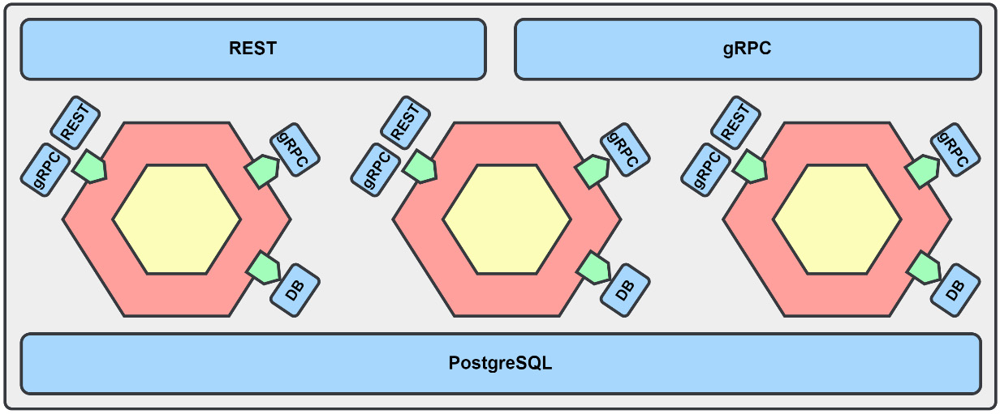

Figure 4.1: monolith owns the outer wiring, modules sit inside and receive what they need.

### Internal packages enforce module boundaries

- each module exposes a small public surface
- implementation details stay under `internal`
- Go import rules help prevent accidental cross-module reach-through

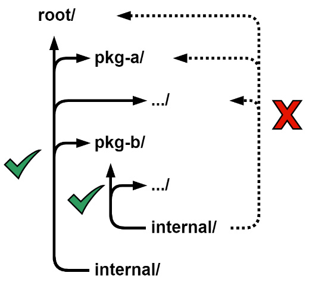

Figure 4.2: `internal` is doing real boundary enforcement, not just folder organization.

### Accept interfaces, return structs

Important Go guideline:

- consumers define small interfaces
- implementations can stay concrete
- smaller interfaces reduce coupling and improve testability

```go
type ProductRepository struct{}

func NewProductRepository() *ProductRepository {}
func (r ProductRepository) Find() error {}
func (r ProductRepository) Save() error {}
func (r ProductRepository) Update() error {}
func (r ProductRepository) Delete() error {}

type ProductFinder interface {
    Find() error
}

func NewService(finder ProductFinder) *Service {}
```

Note:

- `NewService` only depends on `Find()`, not the whole repository API
- this is close to ports-and-adapters, but not the same thing
- in hexagonal design, interfaces are often explicit application contracts, not just tiny local consumer interfaces

Good compile-time trick when no static conversion already proves interface conformance:

```go
var _ TheContractInterface = (*TheContractImplementation)(nil)
```

This catches drift at compile time.

### Composition root

Module startup pattern:

1. build driven adapters
2. build application layer
3. build driver adapters

```go
// setup Driven adapters
conn, err := grpc.Dial(ctx, mono.Config().Rpc.Address())
if err != nil { return err }
customers := grpc.NewCustomerRepository(conn)

// setup application
var app application.App
app = application.New(customers)
app = logging.LogApplicationAccess(app, mono.Logger())

// setup Driver adapters
grpc.RegisterServer(ctx, app, mono.RPC())
```

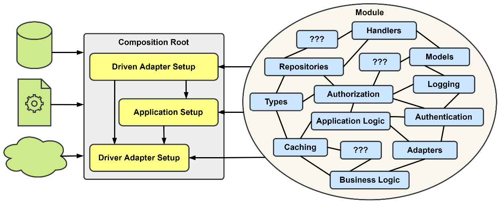

Figure 4.3: composition root is where the object graph is assembled.

Takeaway:

- dependency injection here is just explicit startup wiring
- DI tools like Wire or Dig are optional; plain code is fine until the graph gets hard to manage

### Current module communication

- modules talk synchronously over gRPC
- protobuf APIs live outside module internals
- REST endpoints are exposed through `grpc-gateway`
- Swagger UI is there for exploration/testing

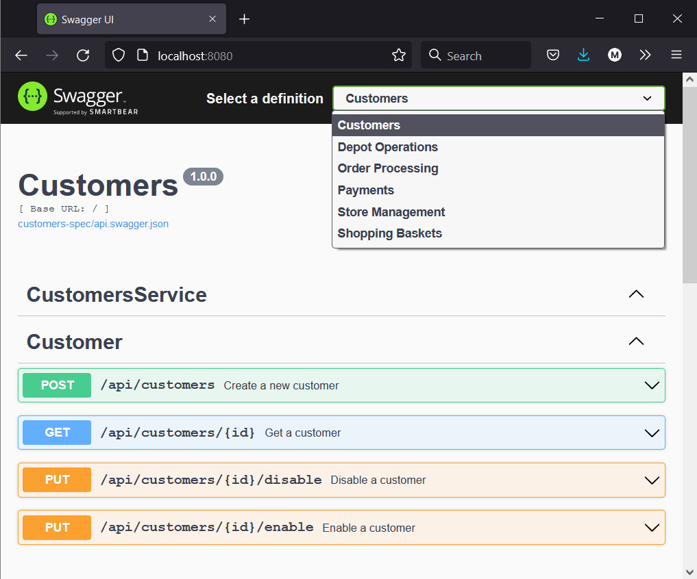

Figure 4.4: the outer interface is still very request/response oriented.

## Integration Patterns Inside the Monolith

Two reasons one bounded context talks to another:

- it needs data
- it needs another context to perform an action

### Pulling external data

Options when one module needs data owned by another:

- share the database
- push copies of data out to interested modules
- pull the data on demand

Notes:

- shared DB is risky because invariants get bypassed
- pushing data to many consumers creates maintenance overhead
- pulling data is usually the simplest default, but it increases runtime dependency

Example: basket item add flow

- `Baskets.AddItem` needs product and store info
- it calls `Stores.GetProduct`
- then `Stores.GetStore`

```text
monolith | INF --> Baskets.AddItem
monolith | INF --> Stores.GetProduct
monolith | INF <-- Stores.GetProduct
monolith | INF --> Stores.GetStore
monolith | INF <-- Stores.GetStore
monolith | INF <-- Baskets.AddItem
```

This is easy to implement, but call depth grows quickly.

### Sending commands to other modules

Two basic options:

- push the command to the other component
- poll for work from the other side

Direct push is simpler, so it is the normal choice.

Example: checkout flow

```text
monolith | INF --> Baskets.CheckoutBasket
monolith | INF --> Ordering.CreateOrder
monolith | INF --> Customers.AuthorizeCustomer
monolith | INF <-- Customers.AuthorizeCustomer
monolith | INF --> Payments.ConfirmPayment
monolith | INF <-- Payments.ConfirmPayment
monolith | INF --> Depot.CreateShoppingList
monolith | INF --> Stores.GetStore
monolith | INF <-- Stores.GetStore
monolith | INF --> Stores.GetProduct
monolith | INF <-- Stores.GetProduct
monolith | INF <-- Depot.CreateShoppingList
monolith | INF --> Notifications.NotifyOrderCreated
monolith | INF <-- Notifications.NotifyOrderCreated
monolith | INF <-- Ordering.CreateOrder
monolith | INF <-- Baskets.CheckoutBasket
```

Important point:

- one customer action now spans seven modules
- synchronous chains like this are easy to create and hard to keep resilient

## Event Types

### Domain events

- internal to a bounded context
- represent important domain state changes
- usually handled synchronously and in-process
- no serialization/versioning needed here

### Event-sourcing events

- persisted as aggregate history
- need serialization
- belong to streams and carry metadata

### Integration events

- cross context boundaries
- asynchronous
- serialized and shared as contracts
- usually go through a broker

Quick distinction to remember:

- domain events = internal coordination
- event-sourcing events = persisted history
- integration events = external communication contract

## Refactoring Side Effects with Domain Events

### Problem: command handlers accumulate side effects

Naive version:

```go
if err = h.orders.Save(ctx, order); err != nil {
    return errors.Wrap(err, "order creation")
}

if err = h.notifications.NotifyOrderCreated(
    ctx, order.ID, order.CustomerID,
); err != nil {
    return errors.Wrap(err, "customer notification")
}
```

Problem with this style:

- handler keeps gaining responsibilities
- adding rewards, invoicing, analytics, etc. means editing the same command flow again and again
- rule handling is implicit instead of explicit

### Better model: raise a domain event

Instead of directly triggering every side effect:

- command changes aggregate state
- aggregate records a domain event
- handlers react to the event

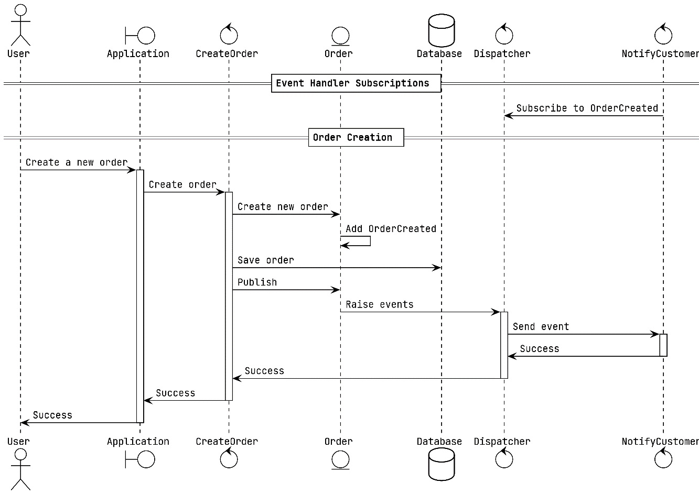

Figure 4.5: `CreateOrder` raises `OrderCreated`; notification logic moves behind event handling.

### AggregateBase

`Order` before:

```go
type Order struct {
    ID         string
    CustomerID string
    PaymentID  string
    InvoiceID  string
    ShoppingID string
    Items      []*Item
    Status     OrderStatus
}
```

`Order` after embedding aggregate support:

```go
type Order struct {
    ddd.AggregateBase
    CustomerID string
    PaymentID  string
    InvoiceID  string
    ShoppingID string
    Items      []*Item
    Status     OrderStatus
}
```

New instance setup:

```go
order := &Order{
    AggregateBase: ddd.AggregateBase{
        ID: id,
    },
    // ...
}
```

Notes:

- `AggregateBase` now owns the ID and event collection behavior
- composition avoids repeating the same event-management code across aggregates
- fields stay public in this codebase to avoid lots of getter/setter boilerplate

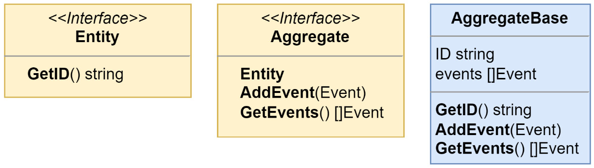

Figure 4.6: shared aggregate behavior is extracted into reusable base types and interfaces.

### Event shape

First event example:

```go
type OrderCreated struct {
    Order *Order
}

func (OrderCreated) EventName() string {
    return "ordering.OrderCreated"
}
```

Why this can carry a full `*Order`:

- it never leaves the bounded context
- no external consumer contract to preserve
- no persistence requirement yet

### Raising the event

Inside `CreateOrder`:

```go
order.AddEvent(&OrderCreated{
    Order: order,
})
return order, nil
```

Pattern repeats for other order lifecycle events:

- `OrderCanceled`
- `OrderReadied`
- `OrderCompleted`

### Event handler contract

Handlers are grouped behind an interface with one method per event.

Problem:

- a concrete handler may only care about a subset of events
- forcing every handler to define empty methods is noisy

Solution:

```go
type ignoreUnimplementedDomainEvents struct{}

var _ DomainEventHandlers = (*ignoreUnimplementedDomainEvents)(nil)

func (ignoreUnimplementedDomainEvents) OnOrderCreated(...) error   { ... }
func (ignoreUnimplementedDomainEvents) OnOrderReadied(...) error   { ... }
func (ignoreUnimplementedDomainEvents) OnOrderCanceled(...) error  { ... }
func (ignoreUnimplementedDomainEvents) OnOrderCompleted(...) error { ... }
```

Embed it in real handlers:

```go
type NotificationHandlers struct {
    notifications domain.NotificationRepository
    ignoreUnimplementedDomainEvents
}
```

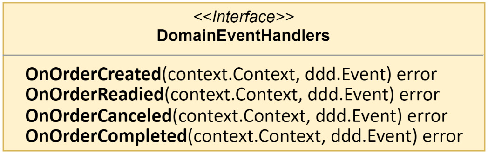

Figure 4.7: compile-time safety without making every concrete handler define unused no-op methods.

### EventDispatcher

Simple in-process observer:

```go
func (h *EventDispatcher) Subscribe(event, handler EventHandler) {
    h.mu.Lock()
    defer h.mu.Unlock()
    h.handlers[event.EventName()] = append(
        h.handlers[event.EventName()],
        handler,
    )
}

func (h *EventDispatcher) Publish(ctx context.Context, events ...Event) error {
    for _, event := range events {
        for _, handler := range h.handlers[event.EventName()] {
            err := handler(ctx, event)
            if err != nil {
                return err
            }
        }
    }
    return nil
}
```

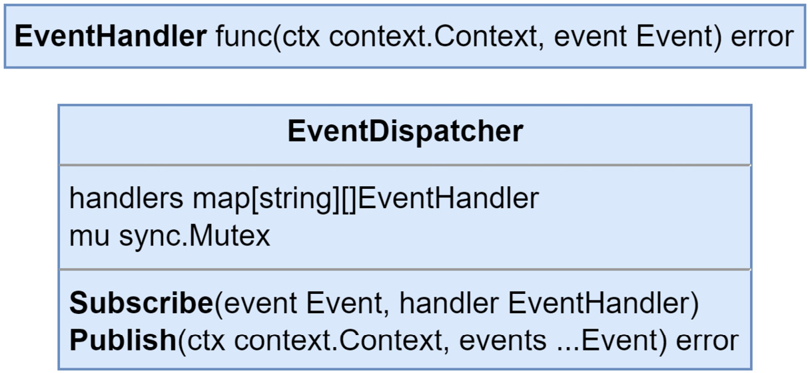

Figure 4.8: this is not a broker. It is just synchronous in-process dispatch inside one bounded context.

### Registration and startup wiring

Subscription wiring:

```go
func RegisterNotificationHandlers(
    notificationHandlers application.DomainEventHandlers,
    domainSubscriber ddd.EventSubscriber,
) {
    domainSubscriber.Subscribe(
        domain.OrderCreated{},
        notificationHandlers.OnOrderCreated,
    )
    domainSubscriber.Subscribe(
        domain.OrderReadied{},
        notificationHandlers.OnOrderReadied,
    )
    domainSubscriber.Subscribe(
        domain.OrderCanceled{},
        notificationHandlers.OnOrderCanceled,
    )
}
```

Composition root changes:

```go
func (Module) Startup(...) error {
    // setup Driven adapters
    domainDispatcher := ddd.NewEventDispatcher()
    ...

    // setup application
    app = application.New(..., domainDispatcher)
    ...

    // setup application handlers
    var notificationHandlers application.DomainEventHandlers
    notificationHandlers = application.NewNotificationHandlers(notifications)
    ...

    // setup Driver adapters
    ...
    handlers.RegisterNotificationHandlers(
        notificationHandlers, domainDispatcher,
    )
    return nil
}
```

Key wiring change:

- app no longer directly owns notification side effects
- app publishes domain events
- handlers subscribe separately

### Publishing from command handlers

Generic publish step after state changes:

```go
if err = h.domainPublisher.Publish(
    ctx, order.GetEvents()...,
); err != nil {
    return err
}
```

This is the actual refactor payoff:

- command handlers stop knowing which side effects exist
- they only publish the facts recorded by the aggregate
- new reactions can be added by registering handlers instead of editing the command path again

## Scope Note

- not every module needs DDD or domain events
- simple modules should stay simple
- use this pattern when domain complexity and side effects justify it

## Key Takeaways

- modular monolith boundaries are enforced with package structure plus startup wiring discipline
- synchronous pull/call patterns are simple but create deep dependency chains
- domain events are internal, synchronous, and short-lived
- `AggregateBase` gives aggregates a reusable way to collect domain events
- event handlers move side effects out of command handlers
- `EventDispatcher` is just an in-process observer used to decouple rule handling inside one bounded context

## Repo Anchors

The material maps closely to `03_Domain_Events/`, especially the ordering module:

- `03_Domain_Events/ordering/module.go`
- `03_Domain_Events/ordering/internal/domain/order.go`
- `03_Domain_Events/ordering/internal/domain/order_events.go`
- `03_Domain_Events/internal/ddd/aggregate.go`
- `03_Domain_Events/internal/ddd/event_dispatcher.go`

The shift from command-side side effects to domain events is visible in the aggregate itself:

```go
type Order struct {
    ddd.AggregateBase
    CustomerID string
    PaymentID  string
    InvoiceID  string
    ShoppingID string
    Items      []*Item
    Status     OrderStatus
}

func CreateOrder(id, customerID, paymentID string, items []*Item) (*Order, error) {
    // validation omitted

    order := &Order{
        AggregateBase: ddd.AggregateBase{ID: id},
        CustomerID:    customerID,
        PaymentID:     paymentID,
        Items:         items,
        Status:        OrderIsPending,
    }

    order.AddEvent(&OrderCreated{Order: order})
    return order, nil
}
```

And the in-process dispatcher is intentionally small and synchronous:

```go
type EventDispatcher struct {
    handlers map[string][]EventHandler
    mu       sync.Mutex
}

func (h *EventDispatcher) Publish(ctx context.Context, events ...Event) error {
    for _, event := range events {
        for _, handler := range h.handlers[event.EventName()] {
            if err := handler(ctx, event); err != nil {
                return err
            }
        }
    }
    return nil
}
```

That is the most important constraint in this chapter: these are not integration events yet. They are an internal refactoring tool for clearer business workflows inside one process.

# 5: Tracking Changes with Event Sourcing

## Overview

- Aggregate changes are persisted as append-only event streams.
- The simple in-process domain-event model becomes a richer stored-event model that can be serialized and replayed.
- CQRS becomes more explicit because event-store writes and practical queries want different models.
- Snapshots are an optimization for long-lived streams, not a default requirement.

Core distinction:

- event sourcing = internal persistence model for one bounded context
- event streaming = integration between bounded contexts
- they can work together, but they are not the same thing

## What Event Sourcing Changes

- CRUD stores the latest row
- event sourcing stores every meaningful change
- current state is rebuilt by replaying the stream
- optimistic concurrency matters because two writers cannot both append the same next version safely

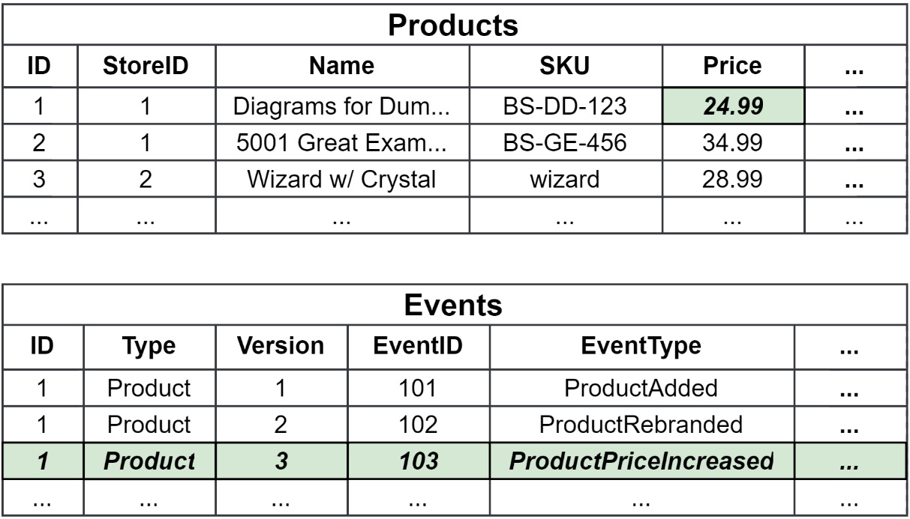

Figure 5.1: CRUD keeps latest state; event sourcing keeps history plus intent.

Useful mental model:

- CRUD answers: what does the entity look like now?
- event sourcing answers: how did it become this?

## Richer Event Model

Previous domain-event shape was intentionally minimal:

```go
type EventHandler func(ctx context.Context, event Event) error

type Event interface {
    EventName() string
}
```

That was fine for in-process reactions, but not enough for persistence. Stored events now need:

- event identity
- occurrence timestamp
- aggregate metadata
- serializable payloads

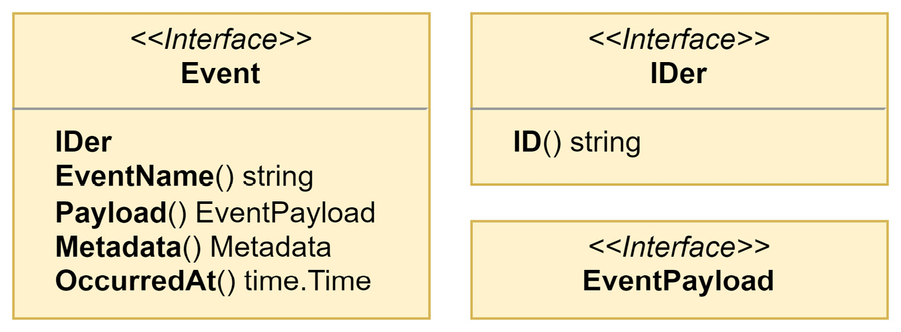

Figure 5.2: stored events need more than just `EventName()`.

Constructor pattern used for the new richer event:

```go
type EventOption interface {
    configureEvent(*event)
}

func newEvent(
    name string, payload EventPayload,
    options ...EventOption,
) event {
    evt := event{
        Entity:     NewEntity(uuid.New().String(), name),
        payload:    payload,
        metadata:   make(Metadata),
        occurredAt: time.Now(),
    }
    for _, option := range options {
        option.configureEvent(&evt)
    }
    return evt
}
```

Important design shift:

- old event structs become payloads
- event name is separated from payload type
- the same payload shape can be reused by multiple event names

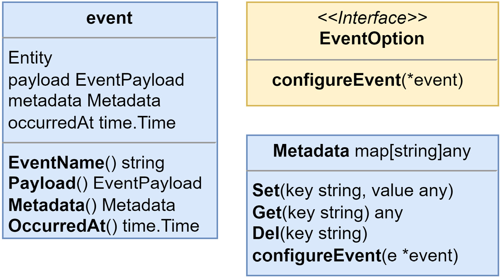

Figure 5.3: package-private event struct protects invariants; options decorate the event before return.

Small Go note used here:

- `any` is just an alias for `interface{}`
- useful when writing generic-ish plumbing around registries and serde

## Upgrading Aggregates

Previous aggregate support was basic:

```go
type Aggregate interface {
    Entity
    AddEvent(event Event)
    GetEvents() []Event
}

type AggregateBase struct {
    ID     string
    events []Event
}
```

Event-sourced aggregates need to stamp aggregate identity and version onto each event.

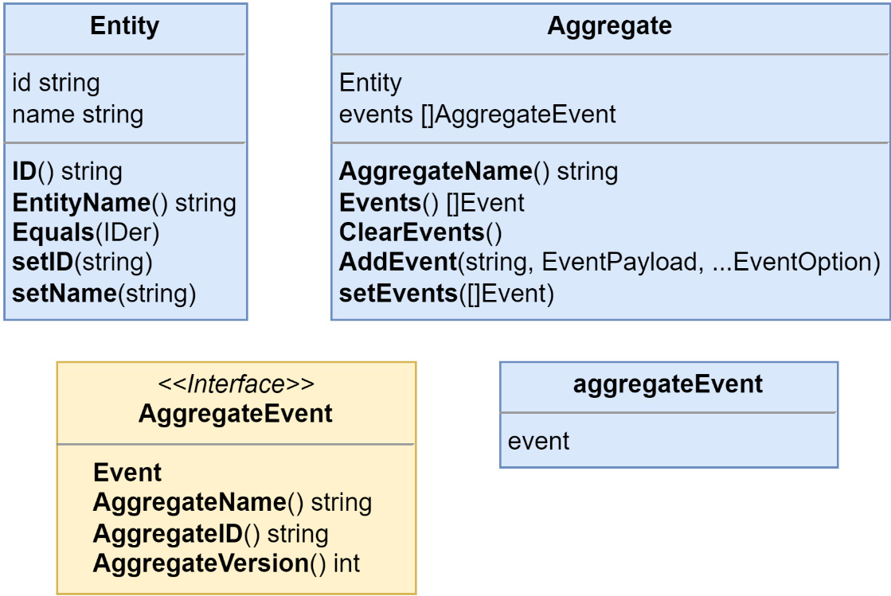

Figure 5.4: aggregate metadata becomes part of event creation, not something callers remember manually.

Updated `AddEvent`:

```go
func (a *Aggregate) AddEvent(
    name string, payload EventPayload,
    options ...EventOption,
) {
    options = append(
        options,
        Metadata{
            AggregateNameKey: a.name,
            AggregateIDKey:   a.id,
        },
    )
    a.events = append(
        a.events,
        aggregateEvent{
            event: newEvent(name, payload, options...),
        },
    )
}
```

Takeaway:

- payloads no longer need an `EventName()` method
- aggregate metadata is attached automatically
- callers pass `event name + payload`, not a prebuilt event object

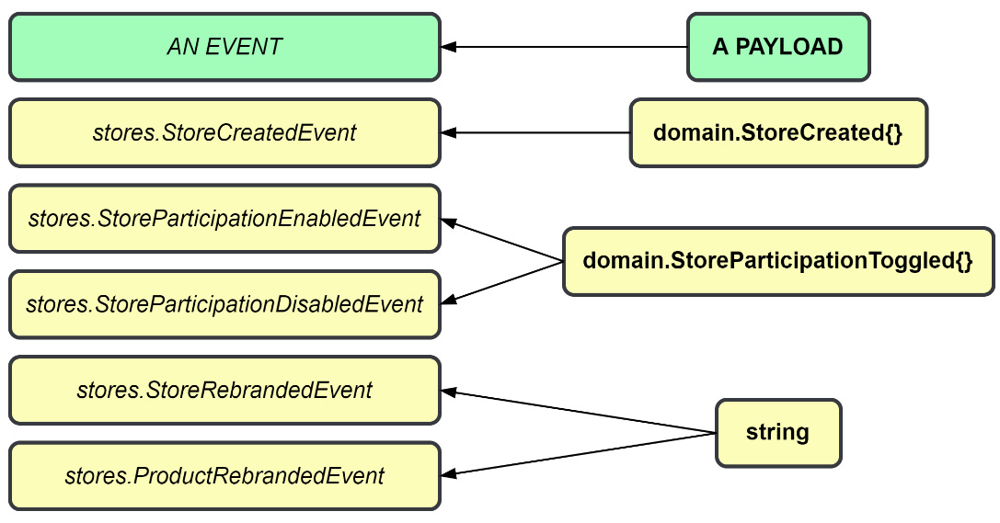

Figure 5.5: separating name from payload makes payload reuse possible.

Because aggregate events became a more specific type, the dispatcher was generalized with generics instead of duplicating dispatcher types or casting unsafely.

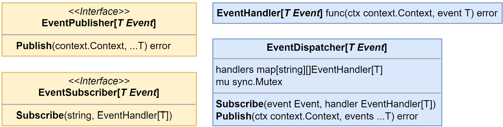

Figure 5.6: generics keep one dispatcher design without giving up type safety.

## Updating the Module Aggregates

Aggregate constructors become mandatory so embedded aggregate state is always initialized:

```go
const StoreAggregate = "stores.Store"

func NewStore(id string) *Store {
    return &Store{
        Aggregate: ddd.NewAggregate(id, StoreAggregate),
    }
}
```

Usage becomes:

```go
store := NewStore(id)
store.Name = name
store.Location = location
```

Event names were moved into constants:

```go
const (
    StoreCreatedEvent               = "stores.StoreCreated"
    StoreParticipationEnabledEvent  = "stores.StoreParticipationEnabled"
    StoreParticipationDisabledEvent = "stores.StoreParticipationDisabled"
)
```

Then emitted explicitly:

```go
store.AddEvent(StoreCreatedEvent, &StoreCreated{
    Store: store,
})
```

Handler update to read the payload from the event:

```go
func (h NotificationHandlers[T]) OnOrderCreated(
    ctx context.Context, event ddd.Event,
) error {
    orderCreated := event.Payload().(*domain.OrderCreated)
    return h.notifications.NotifyOrderCreated(
        ctx,
        orderCreated.Order.ID(),
        orderCreated.Order.CustomerID,
    )
}
```

Rule to remember:

- assert on `event.Payload()`, not on `event` itself

## The `es` Package

Not every aggregate should become event-sourced, so the extra machinery lives in a separate package.

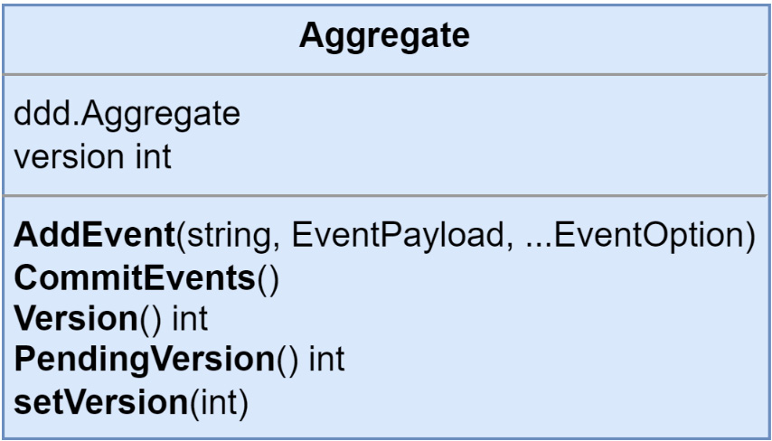

Figure 5.7: `es.Aggregate` layers stream versioning on top of `ddd.Aggregate`.

Constructor:

```go
func NewAggregate(id, name string) Aggregate {
    return Aggregate{
        Aggregate: ddd.NewAggregate(id, name),
        version:   0,
    }
}
```

Version-aware `AddEvent`:

```go
func (a *Aggregate) AddEvent(
    name string,
    payload ddd.EventPayload,
    options ...ddd.EventOption,
) {
    options = append(
        options,
        ddd.Metadata{
            ddd.AggregateVersionKey: a.PendingVersion() + 1,
        },
    )
    a.Aggregate.AddEvent(name, payload, options...)
}
```

Aggregate constructors then switch from `ddd.NewAggregate` to `es.NewAggregate`:

```go
func NewStore(id string) *Store {
    return &Store{
        Aggregate: es.NewAggregate(id, StoreAggregate),
    }
}
```

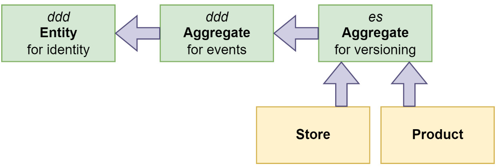

Figure 5.8: store/product now inherit both domain behavior and event-sourcing behavior through embedding.

## Events Become the Source of Truth

Event-sourced aggregates must change state by applying events, not by mutating fields first and then emitting an event afterward.

Every event-sourced aggregate needs an applier:

```go
type EventApplier interface {
    ApplyEvent(ddd.Event) error
}
```

Example `Product` applier:

```go
func (p *Product) ApplyEvent(event ddd.Event) error {
    switch payload := event.Payload().(type) {
    case *ProductAdded:
        p.StoreID = payload.StoreID
        p.Name = payload.Name
        p.Description = payload.Description
        p.SKU = payload.SKU
        p.Price = payload.Price
    case *ProductRemoved:
        // noop
    default:
        return errors.ErrInternal.Msgf(
            "%T received the event %s with unexpected payload %T",
            p, event.EventName(), payload,
        )
    }
    return nil
}
```

The old `CreateStore` shape still mutated the aggregate directly:

```go
func CreateStore(id, name, location string) (*Store, error) {
    if name == "" {
        return nil, ErrStoreNameIsBlank
    }
    if location == "" {
        return nil, ErrStoreLocationIsBlank
    }
    store := NewStore(id)
    store.Name = name
    store.Location = location
    store.AddEvent(StoreCreatedEvent, &StoreCreated{
        Store: store,
    })
    return store, nil
}
```

That is the wrong direction once the stream is authoritative.

- do not assign aggregate fields directly in the command logic
- emit an event with the change data
- let `ApplyEvent` update the state

Payloads also need to stop carrying the whole aggregate when the event is meant to be persisted.

Better persisted payload:

```go
type StoreCreated struct {
    Name     string
    Location string
}
```

Store rehydration logic:

```go
func (s *Store) ApplyEvent(event ddd.Event) error {
    switch payload := event.Payload().(type) {
    case *StoreCreated:
        s.Name = payload.Name
        s.Location = payload.Location
    case *StoreParticipationEnabled:
        s.Participating = true
    case *StoreParticipationDisabled:
        s.Participating = false
    default:
        return errors.ErrInternal.Msgf(
            "%T received the event %s with unexpected payload %T",
            s, event.EventName(), payload,
        )
    }
    return nil
}
```

Critical rule:

- persisted events are versioned contracts
- if the shape changes incompatibly, create a new event/payload version
- old events must remain readable forever

## Aggregate Repository and Event Store

Generic repository layer sits above a storage-specific event store.

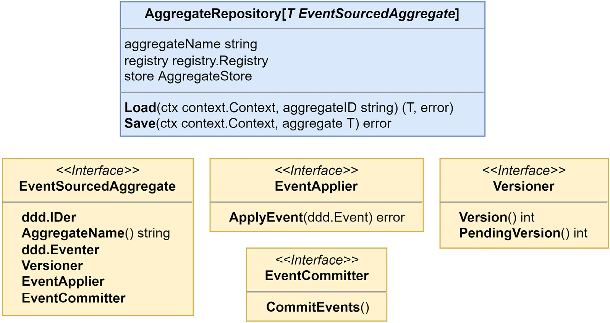

Figure 5.9: repository handles event-sourcing workflow; store handles infrastructure.

Repository responsibilities:

- `Load()` builds a fresh aggregate instance, then rehydrates it from storage
- `Save()` applies pending events, persists them, updates version, and commits/clears pending events

Load path with registry support:

```go
func (r AggregateRepository[T]) Load(
    ctx context.Context, aggregateID, aggregateName string,
) (agg T, err error) {
    var v any
    v, err = r.registry.Build(
        r.aggregateName,
        ddd.SetID(aggregateID),
        ddd.SetName(r.aggregateName),
    )
    if err != nil {
        return agg, err
    }
    var ok bool
    if agg, ok = v.(T); !ok {
        return agg, fmt.Errorf("%T is not the expected type %T", v, agg)
    }
    if err = r.store.Load(ctx, agg); err != nil {
        return agg, err
    }
    return agg, nil
}
```

## Registry and Serde

The registry exists so the system can rebuild concrete types safely from serialized data.

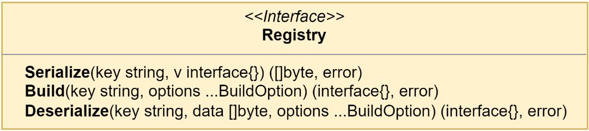

Figure 5.10: registry creates typed instances on demand.

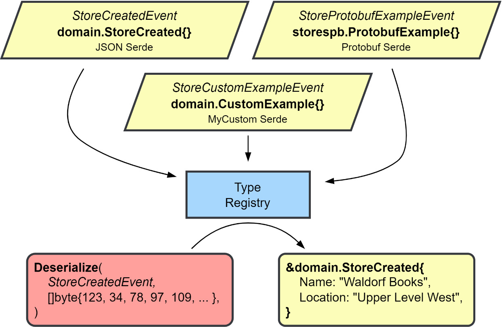

Figure 5.11: registration centralizes build/serialize/deserialize knowledge.

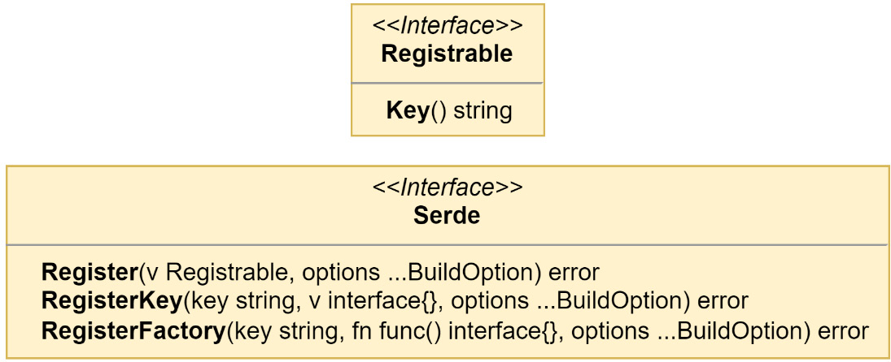

Figure 5.12: serde is attached per registered type, not sprinkled through calling code.

Why this matters:

- avoids `map[string]interface{}` style loose data handling
- keeps deserialization logic out of application code
- supports private-field setup through package-local build options like `ddd.SetID()` and `ddd.SetName()`

## Event Store Infrastructure

Storage boundary:

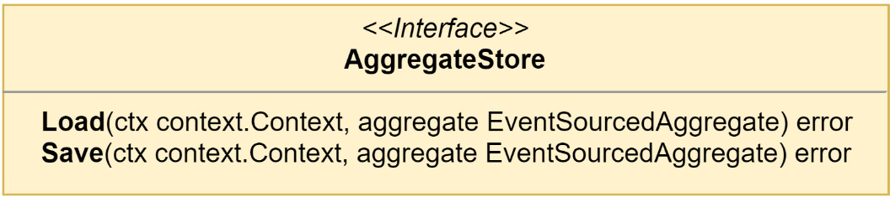

Figure 5.13: repository is domain-facing plumbing; store is infra-facing plumbing.

Event table DDL:

```go
CREATE TABLE events (
  stream_id      text        NOT NULL,
  stream_name    text        NOT NULL,
  stream_version int         NOT NULL,
  event_id       text        NOT NULL,
  event_name     text        NOT NULL,
  event_data     bytea       NOT NULL,
  occurred_at    timestamptz NOT NULL DEFAULT NOW(),
  PRIMARY KEY (stream_id, stream_name, stream_version)
);
```

Important detail:

- `(stream_id, stream_name, stream_version)` is the optimistic concurrency gate
- two writers racing for the same next version will collide at the DB level

## Just Enough CQRS

Once writes are stored as event streams, not every query still fits the same repository.

New write-side repository interface:

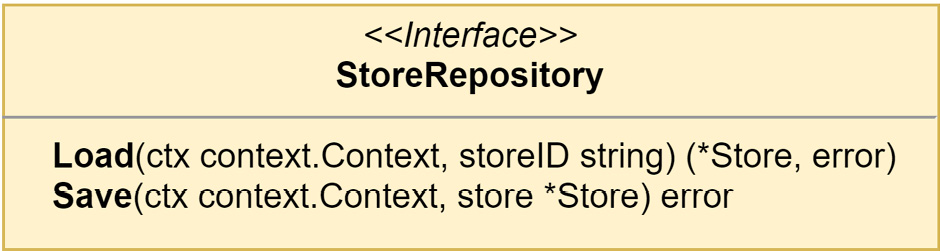

Figure 5.14: write repository shrinks to stream-oriented operations.

Repository instantiation:

```go
stores := es.NewAggregateRepository[*domain.Store](
    domain.StoreAggregate,
    reg,
    eventStore,
)
```

Then the old broad repository is split because list/filter queries do not belong on the event store side.

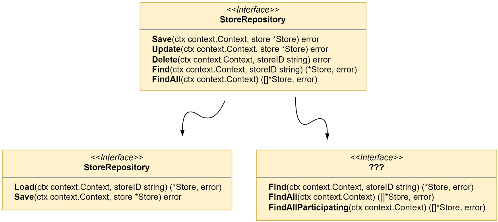

Figure 5.15: event-sourced write model forces a separate read strategy for real queries.

Rule of thumb:

- identity lookup from stream: maybe fine
- list/filter/search/reporting: build read models

## Mall Read Model

`MallRepository` becomes the query-side home for store-oriented reads.

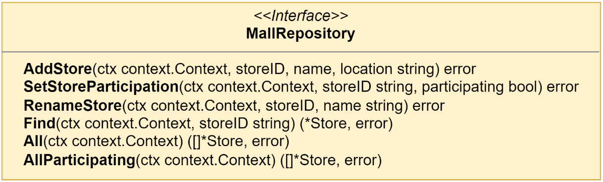

Figure 5.16: query-side API is shaped by read needs, not by event-store capabilities.

Composition root wiring:

```go
mall := postgres.NewMallRepository("stores.stores", mono.DB())
// ...
application.New(stores, products, domainDispatcher, mall)
```

Query handlers are then redirected to the read model:

```go
appQueries: appQueries{
    GetStoreHandler:
        queries.NewGetStoreHandler(mall),
    GetStoresHandler:
        queries.NewGetStoresHandler(mall),
    GetParticipatingStoresHandler:
        queries.NewGetParticipatingStoresHandler(mall),
    GetCatalogHandler:
        queries.NewGetCatalogHandler(products),
    GetProductHandler:
        queries.NewGetProductHandler(products),
}
```

Example handler shape:

```go
type GetStores struct{}

type GetStoresHandler struct {
    mall domain.MallRepository
}

func NewGetStoresHandler(mall domain.MallRepository) GetStoresHandler {
    return GetStoresHandler{mall: mall}
}

func (h GetStoresHandler) GetStores(
    ctx context.Context, _ GetStores,
) ([]*domain.Store, error) {
    return h.mall.All(ctx)
}
```

## Event Handler Refactor

To reduce boilerplate, handler functions and handler objects are unified behind one interface.

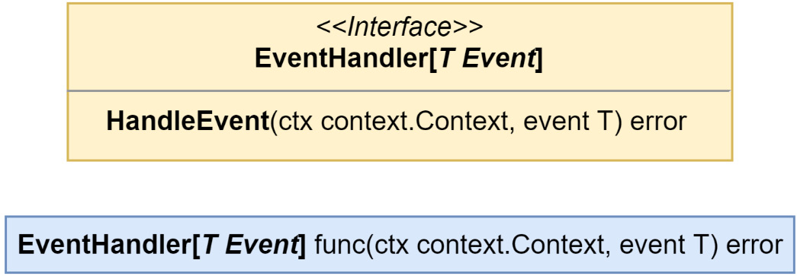

Figure 5.17: handlers can be plain funcs or full objects with shared behavior.

Function adapter example:

```go
func myHandler(ctx context.Context, ddd.Event) error {
    // ...
    return nil
}

dispatcher.Subscribe(
    MyEventName,
    ddd.EventHandlerFunc(myHandler),
)
```

This also makes shared logging easier:

```go
type EventHandlers struct {
    ddd.EventHandler
    label  string
    logger zerolog.Logger
}

var _ ddd.EventHandler = (*EventHandlers)(nil)

func (h EventHandlers) HandleEvent(
    ctx context.Context, event ddd.Event,
) (err error) {
    h.logger.Info().Msgf(
        "--> Stores.%s.On(%s)",
        h.label,
        event.EventName(),
    )
    defer func() {
        h.logger.Info().Err(err).Msgf(
            "<-- Stores.%s.On(%s)",
            h.label,
            event.EventName(),
        )
    }()
    return h.EventHandler.HandleEvent(ctx, event)
}
```

## Projecting Events into Read Models

Mall projection handler switches on event name:

```go
type MallHandlers struct {
    mall domain.MallRepository
}

var _ ddd.EventHandler = (*MallHandlers)(nil)

func (h MallHandlers) HandleEvent(
    ctx context.Context, event ddd.Event,
) error {
    switch event.EventName() {
    case domain.StoreCreatedEvent:
        return h.onStoreCreated(ctx, event)
    case domain.StoreParticipationEnabledEvent:
        return h.onStoreParticipationEnabled(ctx, event)
    case domain.StoreParticipationDisabledEvent:
        return h.onStoreParticipationDisabled(ctx, event)
    case domain.StoreRebrandedEvent:
        return h.onStoreRebranded(ctx, event)
    }
    return nil
}
```

Subscription wiring stays explicit:

```go
func RegisterMallHandlers(
    mallHandlers ddd.EventHandler,
    domainSubscriber ddd.EventSubscriber,
) {
    domainSubscriber.Subscribe(
        domain.StoreCreatedEvent, mallHandlers,
    )
    domainSubscriber.Subscribe(
        domain.StoreParticipationEnabledEvent,
        mallHandlers,
    )
    domainSubscriber.Subscribe(
        domain.StoreParticipationDisabledEvent,
        mallHandlers,
    )
    domainSubscriber.Subscribe(
        domain.StoreRebrandedEvent, mallHandlers,
    )
}
```

Catalog side follows the same pattern.

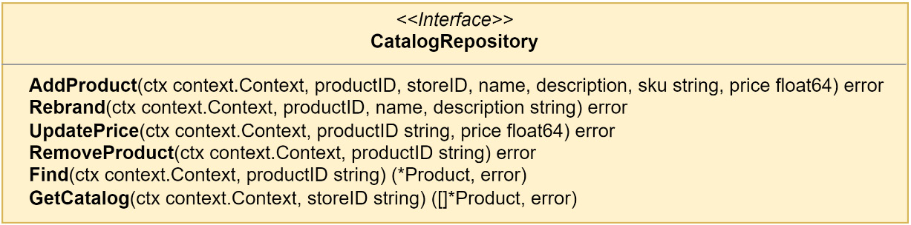

Figure 5.18: catalog is another projection, tuned for product reads rather than store streams.

Important product-side events in this design:

- `ProductAddedEvent`
- `ProductRebrandedEvent`
- `ProductPriceIncreasedEvent`
- `ProductPriceDecreasedEvent`
- `ProductRemovedEvent`

## Publishing Domain Events at the Right Time

Problem found during the refactor:

```go
if err = h.products.Save(ctx, product); err != nil {
    return err
}
if err = h.domainPublisher.Publish(
    ctx, product.GetEvents()...,
); err != nil {
    return err
}
```

Why this fails:

- `Save()` commits and clears pending events
- publishing after save means there may be nothing left to publish

Instead of coupling publisher logic directly into `AggregateRepository`, the design uses middleware around `AggregateStore`.

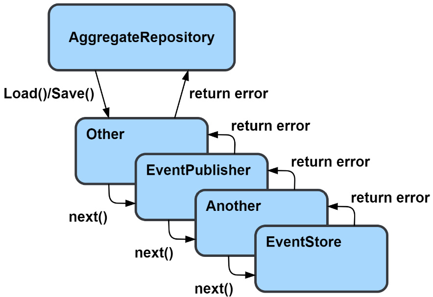

Figure 5.19: middleware adds behavior around store operations without changing repository code.

Middleware signature:

```go
func(store AggregateStore) AggregateStore
```

Chain builder:

```go
func AggregateStoreWithMiddleware(
    store AggregateStore, mws ...AggregateStoreMiddleware,
) AggregateStore {
    s := store
    for i := len(mws) - 1; i >= 0; i-- {
        s = mws[i](s)
    }
    return s
}
```

Event-publisher middleware:

```go
type EventPublisher struct {
    AggregateStore
    publisher ddd.EventPublisher
}

func NewEventPublisher(publisher ddd.EventPublisher) AggregateStoreMiddleware {
    eventPublisher := EventPublisher{publisher: publisher}
    return func(store AggregateStore) AggregateStore {
        eventPublisher.AggregateStore = store
        return eventPublisher
    }
}

func (p EventPublisher) Save(
    ctx context.Context, aggregate EventSourcedAggregate,
) error {
    if err := p.AggregateStore.Save(ctx, aggregate); err != nil {
        return err
    }
    return p.publisher.Publish(ctx, aggregate.Events()...)
}
```

Composition root update:

```go
aggregateStore := es.AggregateStoreWithMiddleware(
    pg.NewEventStore("events", db, reg),
    es.NewEventPublisher(domainDispatcher),
)
```

Key point:

- domain events are still internal and synchronous here
- middleware just guarantees publish-after-persist ordering
- this is still not broker-based async integration

## Aggregate Lifetimes and Snapshots

Two aggregate categories:

- short-lived streams: few events, replay is cheap
- long-lived streams: many events, replay can become expensive

Examples:

- short-lived: `Order`, `Basket`
- long-lived: `Store`, `Customer`

Snapshots are only for the second case.

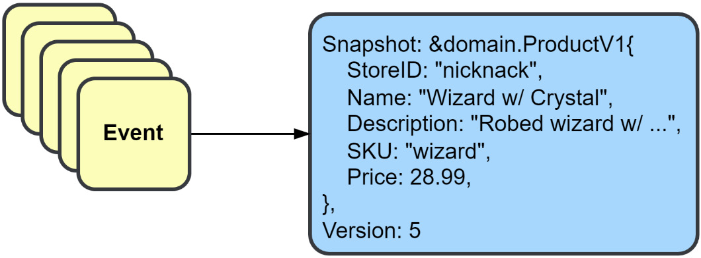

Figure 5.20: snapshot stores aggregate state plus the version it represents.

Snapshot support contract:

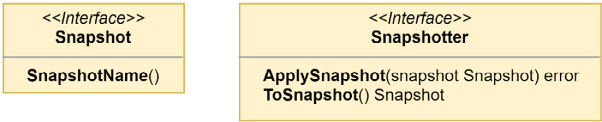

Figure 5.21: aggregates opt into snapshots by knowing how to export and apply versioned snapshot shapes.

Snapshot application example:

```go
switch ss := snapshot.(type) {
case *ProductV1:
    p.StoreID = ss.StoreID
    p.Name = ss.Name
    p.Description = ss.Description
    p.SKU = ss.SKU
    p.Price = ss.Price
default:
    return errors.ErrInternal.Msgf(
        "%T received the unexpected snapshot %T",
        p, snapshot,
    )
}
```

Snapshot rule:

- snapshot the representation, not the raw aggregate type
- use versioned snapshot DTOs like `ProductV1`, `ProductV2`
- keep `ApplySnapshot` able to read older versions

Possible snapshot strategies:

- every N events
- every time period
- every pivotal event

Practical note:

- the sample code snapshots every 3 events
- that is only for demonstration, not a serious production strategy

Snapshot table DDL:

```go
CREATE TABLE baskets.snapshots (
  stream_id        text        NOT NULL,
  stream_name      text        NOT NULL,
  stream_version   int         NOT NULL,
  snapshot_name    text        NOT NULL,
  snapshot_data    bytea       NOT NULL,
  updated_at       timestamptz NOT NULL DEFAULT NOW(),
  PRIMARY KEY (stream_id, stream_name)
);
```

Middleware wiring with snapshots added:

```go
aggregateStore := es.AggregateStoreWithMiddleware(
    pg.NewEventStore("stores.events", mono.DB(), reg),
    es.NewEventPublisher(domainDispatcher),
    pg.NewSnapshotStore("stores.snapshots", mono.DB(), reg),
)
```

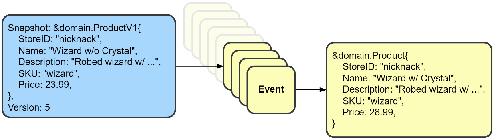

Figure 5.22: load snapshot first, then replay only the tail of the stream.

Warning:

- snapshots are a cache
- they duplicate data
- they add invalidation/versioning/privacy concerns
- only use them when replay cost is actually a problem

## Key Takeaways

- event sourcing stores aggregate history, not just current state
- event-sourced events need richer metadata than transient domain events
- aggregate state should be mutated by applying events, not by direct field writes in command logic
- generic aggregate repositories work because all event-sourced aggregates reduce to streams plus rehydration
- event sourcing usually forces some level of CQRS for practical queries
- middleware is a clean place to publish domain events after persistence
- snapshots are an optimization for long-lived streams, not a default feature

## Repo Anchors

The clearest implementation appears in `04_Event_Sourcing/`.

High-value files to read alongside the summary:

- `04_Event_Sourcing/internal/ddd/event.go`
- `04_Event_Sourcing/internal/es/aggregate.go`
- `04_Event_Sourcing/internal/es/aggregate_repository.go`
- `04_Event_Sourcing/stores/internal/domain/store.go`
- `04_Event_Sourcing/stores/module.go`

The richer stored-event contract is visible directly in the shared `ddd` package:

```go
type Event interface {
    IDer
    EventName() string
    Payload() EventPayload
    Metadata() Metadata
    OccurredAt() time.Time
}
```

The event-sourced aggregate adds version-aware event creation on top of the plain DDD aggregate:

```go
type Aggregate struct {
    ddd.Aggregate
    version int
}

func (a *Aggregate) AddEvent(name string, payload ddd.EventPayload, options ...ddd.EventOption) {
    options = append(options, ddd.Metadata{
        ddd.AggregateVersionKey: a.PendingVersion() + 1,
    })
    a.Aggregate.AddEvent(name, payload, options...)
}
```

And the `Store` aggregate shows the core event-sourcing rule: emit an event, then apply it to become current state.

```go
func CreateStore(id, name, location string) (*Store, error) {
    // validation omitted

    store := NewStore(id)
    store.AddEvent(StoreCreatedEvent, &StoreCreated{
        Name:     name,
        Location: location,
    })
    return store, nil
}

func (s *Store) ApplyEvent(event ddd.Event) error {
    switch payload := event.Payload().(type) {
    case *StoreCreated:
        s.Name = payload.Name
        s.Location = payload.Location
    case *StoreParticipationToggled:
        s.Participating = payload.Participating
    case *StoreRebranded:
        s.Name = payload.Name
    }
    return nil
}
```

The composition root in `04_Event_Sourcing/stores/module.go` also shows the full stack in one place:

1. registry + serde for aggregate/event reconstruction
2. event store and snapshot store middleware
3. event-sourced repositories for writes
4. projection repositories such as `CatalogRepository` and `MallRepository` for reads
5. domain-event handlers subscribed to update those projections

# 6: Asynchronous Connections

## Overview

- Integration events become the public async contract between modules.
- NATS JetStream provides broker-backed messaging and replayable streams.
- MallBots remains a modular monolith, but module communication is no longer limited to synchronous calls.

Core distinction carried forward from the earlier chapters:

- Chapter 4 domain events = internal coordination inside one process
- Chapter 5 event-sourced events = persisted internal history inside one bounded context
- Chapter 6 integration events = public cross-module communication through a broker

MallBots becomes meaningfully asynchronous here.

## Asynchronous Integration with Messages

The vocabulary widens from just events to messages.

- an event is a message
- a message is not always an event
- later chapters will also use commands, queries, and replies as message types

Useful payload categories introduced here:

- integration event
- command
- query
- reply

The first one actually implemented is the integration event.

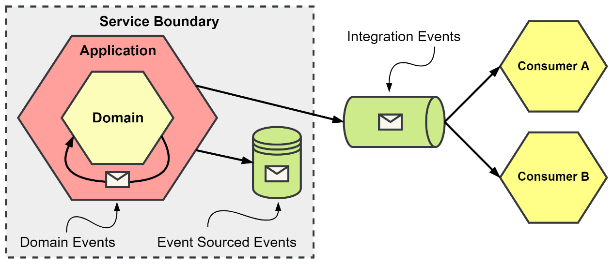

Figure 6.1: clean separation between domain, event-sourced, and integration events.

Important scope differences:

- domain events are short-lived and never leave the application
- event-sourced events are durable and still stay inside the service boundary
- integration events are public, versioned contracts for unknown consumers

That is why the code does not publish raw domain events from `stores/internal/domain` directly. It defines public protobuf events in `stores/storespb` instead.

### Integration with notification events

Notification events are the smallest integration events.

They tell downstream consumers that something happened, but not necessarily everything about the new state.

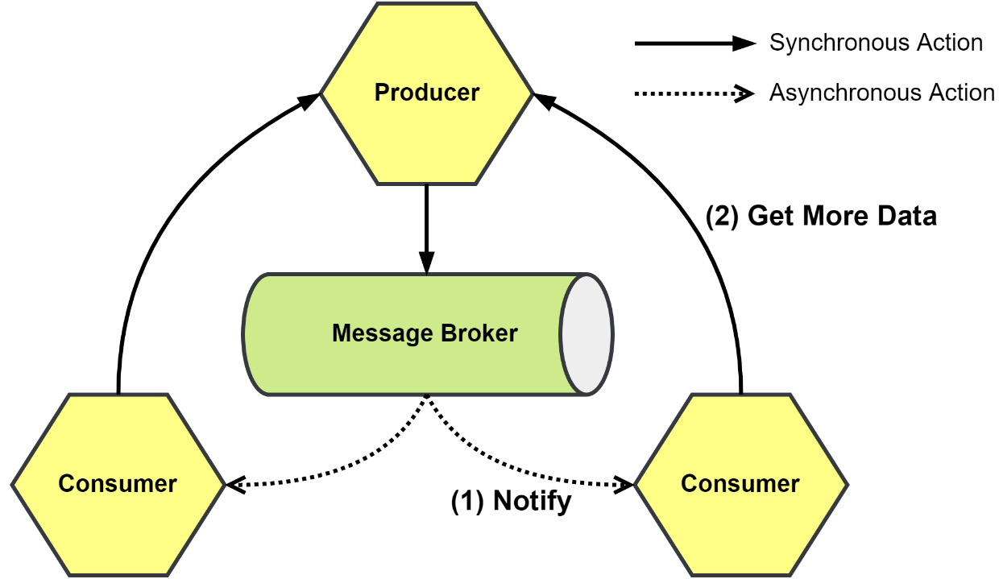

Figure 6.2: notifications reduce payload size, but consumers often need a callback to fetch details.

Typical use cases:

- very large resources
- high-volume change streams
- cases where consumers only need to know that something changed

Main limitation:

- consumers remain temporally coupled to the producer because they must call back later for more data

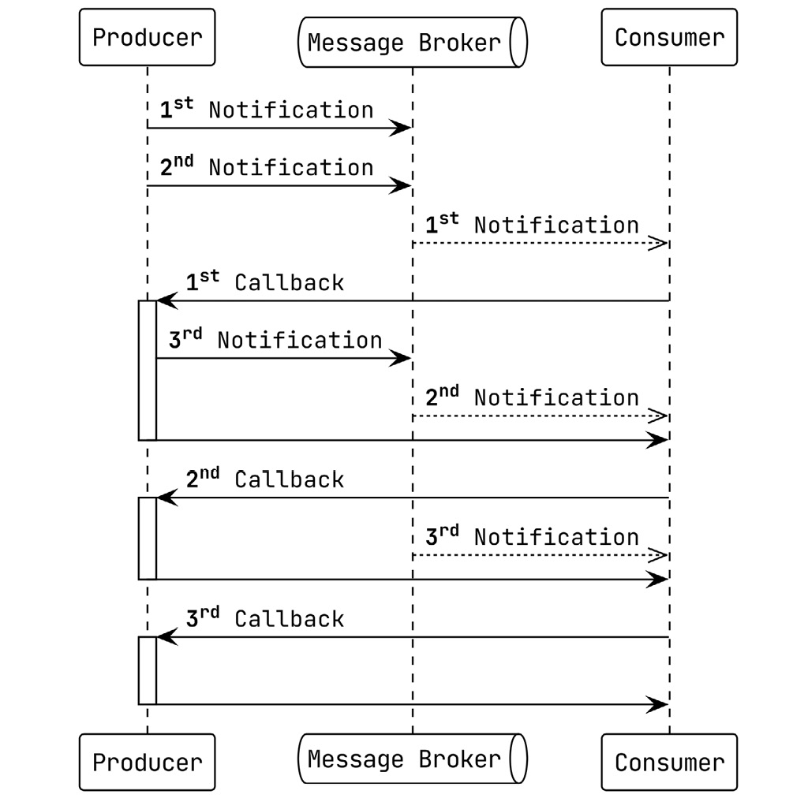

Figure 6.3: notification-based designs can save message size but create duplicate callback traffic and race conditions.

### Integration with event-carried state transfer

Notifications are contrasted with event-carried state transfer here, even though the heavier use of that pattern comes later.

Key idea:

- send enough state in the event so consumers can build or update a local copy
- avoid callback dependence when practical

Benefits:

- better temporal decoupling
- consumers can serve future reads locally
- producers do not need to absorb follow-up lookup traffic from every consumer

Important warning:

- do not turn events into dumping grounds for every field every consumer might want
- do not include data that belongs to some other domain

### Eventual consistency

As soon as modules communicate asynchronously, eventual consistency becomes part of the design.

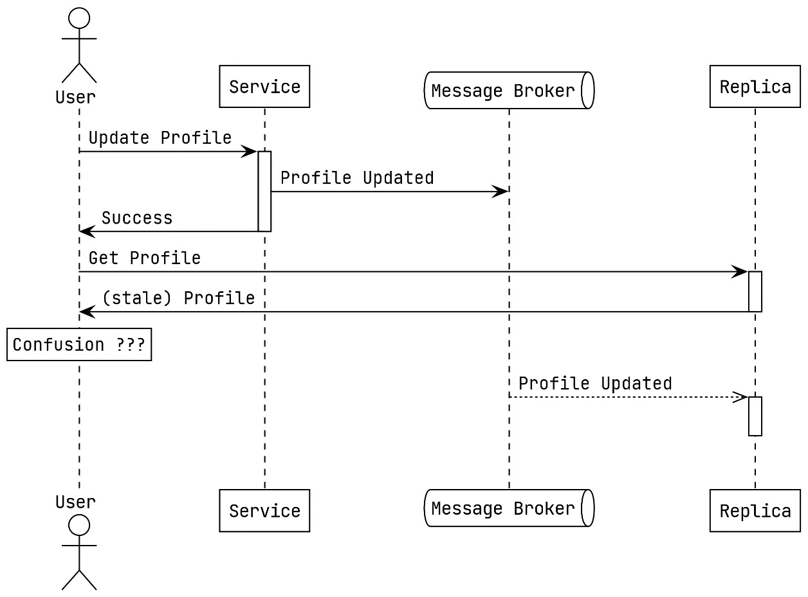

Figure 6.4: after a successful write, another read may still observe stale state until the message is consumed.

This is the main architectural trade-off introduced here:

- stronger decoupling and resilience
- weaker immediate consistency across module boundaries

Useful mental contrast:

- `03_Domain_Events` and `04_Event_Sourcing` still reacted inside one runtime flow
- `05_Asynchronous_Connections` accepts that another module may observe the update later

### Message-delivery guarantees

The delivery models that brokers and consumers have to live with are:

#### At-most-once message delivery

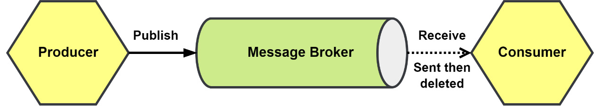

Figure 6.5: lowest coordination cost, but dropped messages are a real possibility.

Takeaway:

- simplest model
- no duplicate handling burden
- but message loss is normal, not exceptional

#### At-least-once message delivery

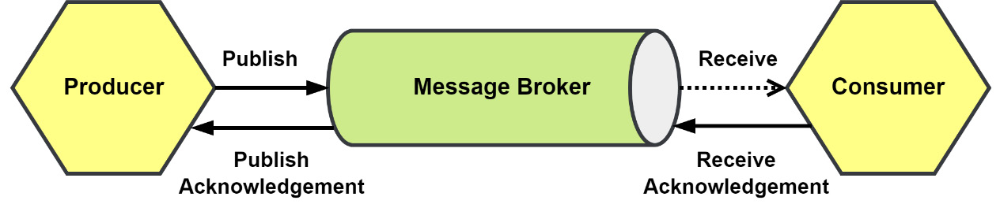

Figure 6.6: broker retries until acknowledgement, so duplicates must be expected.

Takeaway:

- safer delivery
- duplicate processing becomes the consumer's problem
- idempotency or deduplication becomes necessary

#### Exactly-once message delivery

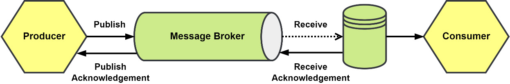

Figure 6.7: useful as an aspiration, but hard to achieve as a literal end-to-end guarantee.

Practical position:

- exactly-once delivery is extremely difficult in real systems
- exactly-once processing is usually approximated through deduplication and transactional handling

### Idempotent message delivery

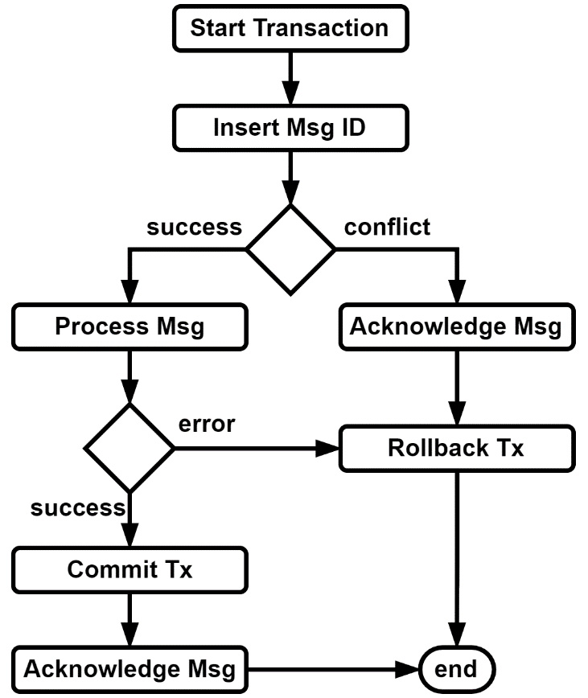

Figure 6.8: transactional deduplication is the realistic way to make at-least-once delivery safe.

Core idea:

- store processed message IDs
- if the ID was already handled, acknowledge and skip
- if not, process and commit the deduplication record atomically with the work

This is why the new message abstraction in code includes `Ack()`, `NAck()`, `Extend()`, and `Kill()` instead of assuming perfect transport.

### Ordered message delivery

Ordering is treated as a separate concern from delivery guarantees.

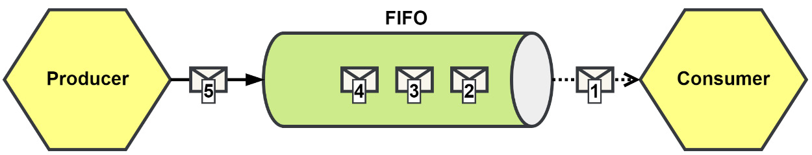

Figure 6.9: a single consumer on a FIFO queue is the simplest way to preserve order.

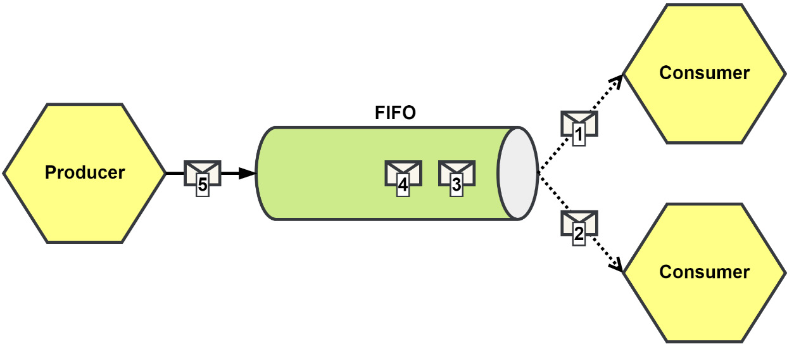

Figure 6.10: throughput increases with competing consumers, but related messages can now finish out of order.

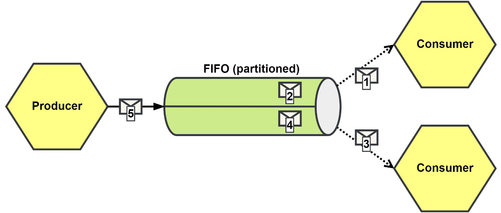

Figure 6.11: ordering usually survives by partition key, not by hoping global FIFO survives concurrency.

Practical warning that maps directly to Go consumers:

- multiple queue consumers can reorder related work
- a single consumer can still break ordering if it handles messages concurrently with goroutines

## Implementing Messaging with NATS JetStream

NATS JetStream is the broker used here.

Why JetStream matters here:

- durable streams
- replayable consumers with cursors
- deduplication support
- retention policies beyond fire-and-forget messaging

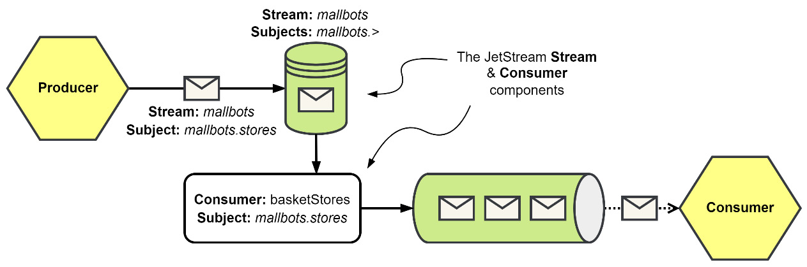

Figure 6.12: the stream stores messages; consumers represent views over that stream.

Architecturally, the new messaging support is split into two internal packages:

- `internal/am` for broker-agnostic asynchronous messaging abstractions
- `internal/jetstream` for the NATS JetStream implementation

### The `am` package

The `am` package is the new shared abstraction layer.

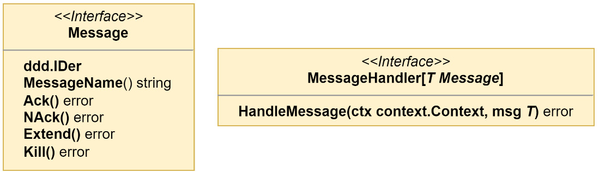

Figure 6.13: messages become first-class values with explicit acknowledgement operations.

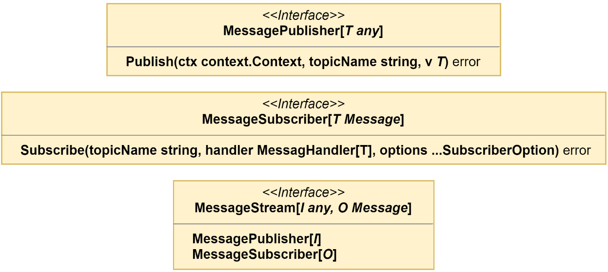

Figure 6.14: publisher and subscriber are combined into a generic stream contract.

The real code follows that structure closely:

```go
type (
    Message interface {
        ddd.IDer
        MessageName() string
        Ack() error
        NAck() error
        Extend() error
        Kill() error
    }

    MessageStream[I any, O Message] interface {
        MessagePublisher[I]
        MessageSubscriber[O]
    }
)
```

That generic design is then specialized into an event stream:

```go
type (
    EventPublisher  = MessagePublisher[ddd.Event]
    EventSubscriber = MessageSubscriber[EventMessage]
    EventStream     = MessageStream[ddd.Event, EventMessage]
)
```

That keeps the design open for future command/query/reply streams without forcing them into the broker adapter today.

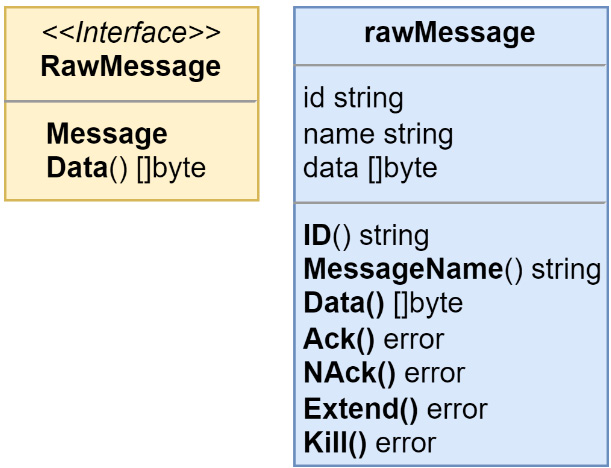

Figure 6.15: `RawMessage` is the transport-neutral intermediary between domain-level events and JetStream-specific publishing.

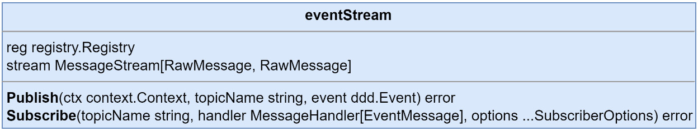

Figure 6.16: `eventStream` adapts typed `ddd.Event` values into raw messages for transport.

The producer-side serialization flow in the repo is:

```go
func (s eventStream) Publish(ctx context.Context, topicName string, event ddd.Event) error {
    metadata, err := structpb.NewStruct(event.Metadata())
    if err != nil {
        return err
    }

    payload, err := s.reg.Serialize(event.EventName(), event.Payload())
    if err != nil {
        return err
    }

    data, err := proto.Marshal(&EventMessageData{
        Payload:    payload,
        OccurredAt: timestamppb.New(event.OccurredAt()),
        Metadata:   metadata,
    })
    if err != nil {
        return err
    }

    return s.stream.Publish(ctx, topicName, rawMessage{
        id:   event.ID(),
        name: event.EventName(),
        data: data,
    })
}
```

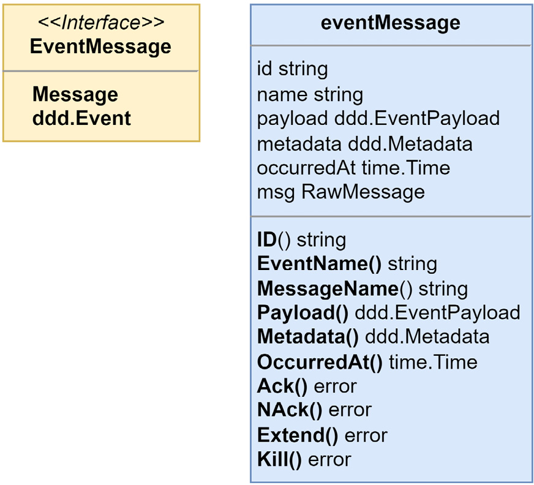

Figure 6.17: received messages are reconstructed as typed event messages, not handed around as raw bytes.

Important design choice:

- event serialization is owned by `am`
- broker mechanics are not mixed into application code
- modules consume typed events, not JetStream payloads directly

### The `jetstream` package

`internal/jetstream` is the infrastructure adapter.

Its job is narrower than `am`:

- publish `RawMessage` values to JetStream
- subscribe to subjects with `Subscribe` or `QueueSubscribe`
- translate broker delivery into `Ack`, `NAck`, `Extend`, and `Kill`

The code also exposes the operational concerns directly through subscriber configuration:

```go
type SubscriberConfig struct {
    msgFilter    []string
    groupName    string
    ackType      AckType
    ackWait      time.Duration
    maxRedeliver int
}
```

That maps theory to code cleanly:

- `groupName` supports competing consumers
- `ackWait` controls redelivery timing
- `maxRedeliver` caps retries
- `msgFilter` lets one subject carry multiple event names while consumers still stay selective

## Making the Store Management Module Asynchronous

This is the practical chapter centerpiece.

The producer is `stores` and the first consumer is `baskets`.

### Modifying the monolith configuration

The monolith gets NATS config first:

```go
type NatsConfig struct {
    URL    string `required:"true"`
    Stream string `default:"mallbots"`
}
```

This is small but important because the broker now becomes part of the app's top-level infrastructure surface.

### Updating the monolith application

The app root adds both a raw NATS connection and a JetStream context:

```go
type app struct {
    cfg config.AppConfig
    db  *sql.DB
    nc  *nats.Conn
    js  nats.JetStreamContext
    // ...
}
```

The startup code then connects and initializes the stream.

Main design point:

- broker-specific setup is contained at the monolith edge
- modules receive a `JetStreamContext`, not a pile of setup logic

#### Gracefully shutting down the NATS connection

The new `waitForStream` method uses `Drain()` so subscriptions and inflight work can finish before shutdown:

```go
func (a *app) waitForStream(ctx context.Context) error {
    closed := make(chan struct{})
    a.nc.SetClosedHandler(func(*nats.Conn) {
        close(closed)
    })
    group, gCtx := errgroup.WithContext(ctx)
    group.Go(func() error {
        <-closed
        return nil
    })
    group.Go(func() error {
        <-gCtx.Done()
        return a.nc.Drain()
    })
    return group.Wait()
}
```

That is one of the few places where the summary should stay concrete, because it captures a real production concern, not just theory.

#### Providing to the modules the JetStreamContext

The `Monolith` interface now exposes `JS()`:

```go
func (a *app) JS() nats.JetStreamContext {
    return a.js
}
```

That keeps JetStream usage in composition roots instead of leaking it into domain code.

#### Publishing messages from the Store Management module

The main producer-side rule appears here:

- integration events must be public
- they must not expose private domain internals
- they should live in the exported protocol buffer package

So the store module defines its public events in `stores/storespb/events.go`.

##### Defining our public events as protocol buffer messages

The public contract is not a domain event type. It is a protobuf message type.

Example shape:

```go
message StoreCreated {
  string id = 1;
  string name = 2;
  string location = 3;
}

message StoreParticipationToggled {
  string id = 1;
  bool participating = 2;
}
```

In the repo, those are then made registerable for serialization/deserialization:

```go
const (
    StoreAggregateChannel = "mallbots.stores.events.Store"
    StoreCreatedEvent              = "storesapi.StoreCreated"
    StoreParticipatingToggledEvent = "storesapi.StoreParticipatingToggled"
    StoreRebrandedEvent            = "storesapi.StoreRebranded"
)
```

This is one of the biggest conceptual upgrades from earlier material:

- internal event names still exist for domain logic
- separate public event names now exist for cross-module messaging

##### Making the events registerable

The protobuf payloads are registered with `ProtoSerde`, so producers and consumers can share one stable contract:

```go
func Registrations(reg registry.Registry) error {
    serde := serdes.NewProtoSerde(reg)
    if err := serde.Register(&StoreCreated{}); err != nil {
        return err
    }
    if err := serde.Register(&StoreParticipationToggled{}); err != nil {
        return err
    }
    return serde.Register(&StoreRebranded{})
}
```

##### Updating the module composition root

The `stores` module now wires an event stream alongside its existing event-sourced infrastructure:

```go
eventStream := am.NewEventStream(
    reg,
    jetstream.NewStream(mono.Config().Nats.Stream, mono.JS()),
)
```

This is exactly the same style as earlier chapters:

- new infrastructure is introduced in the composition root
- the application stays mostly unaware of the concrete transport

##### The concern of where to publish integration events from

Two publishing options appear here:

- publish directly from command handlers
- publish from domain-event handlers that translate internal events into public integration events

The code chooses the second approach.

That is consistent with the earlier refactor in Chapter 4:

- domain logic raises internal facts
- handlers react
- here one of those handlers now republishes to the broker

##### Adding integration event handlers

The store module's integration handler translates domain events into public `storespb` events:

```go
func (h IntegrationEventHandlers[T]) onStoreCreated(
    ctx context.Context, event ddd.AggregateEvent,
) error {
    payload := event.Payload().(*domain.StoreCreated)
    return h.publisher.Publish(ctx, storespb.StoreAggregateChannel,
        ddd.NewEvent(storespb.StoreCreatedEvent, &storespb.StoreCreated{
            Id:       event.ID(),
            Name:     payload.Name,
            Location: payload.Location,
        }),
    )
}
```

This is the single most important flow in the design:

1. store aggregate changes
2. internal domain event is emitted
3. integration-event handler maps it to a public protobuf event
4. event is published to JetStream

##### Finishing by connecting the handlers with the domain dispatcher

The last step is explicit subscription wiring in the composition root, just like earlier chapters.

That continuity matters:

- Chapter 4 introduced internal event handlers
- Chapter 6 reuses that same pattern as the bridge to async messaging

#### Receiving messages in the Shopping Baskets module

On the consumer side, the baskets module also registers the public `storespb` events and creates an event stream.

But instead of publishing, it subscribes.

##### Adding store integration event handlers

The receiving handlers mainly log message receipt.

That is intentional:

- Chapter 6 proves that the asynchronous transport works
- Chapter 7 starts doing useful local-state updates with those events

##### Subscribing to the store aggregate channel

The receiving adapter is small but important because it bridges message handlers to existing event-handler style:

```go
func RegisterStoreHandlers(
    storeHandlers ddd.EventHandler[ddd.Event],
    stream am.EventSubscriber,
) error {
    evtMsgHandler := am.MessageHandlerFunc[am.EventMessage](func(ctx context.Context, eventMsg am.EventMessage) error {
        return storeHandlers.HandleEvent(ctx, eventMsg)
    })

    return stream.Subscribe(storespb.StoreAggregateChannel, evtMsgHandler, am.MessageFilter{
        storespb.StoreCreatedEvent,
        storespb.StoreParticipatingToggledEvent,
        storespb.StoreRebrandedEvent,
    })
}
```

This keeps the consumer-side application code event-shaped while the transport layer remains message-shaped.

#### Verifying we have good communication

The logs demonstrate the exact new behavior:

- store command runs
- in-process handlers run
- integration event gets published
- another module later receives it asynchronously

The key difference from earlier chapters is ordering of visibility:

- producer-side command completion and consumer-side handling are no longer one synchronous chain

## Key Takeaways

- Chapter 6 adds integration events as a third event category alongside domain events and event-sourced events
- asynchronous messaging introduces eventual consistency and delivery concerns that did not matter in the earlier in-process chapters
- `internal/am` separates message abstractions from broker-specific code
- `internal/jetstream` is the infrastructure adapter for NATS JetStream
- public protobuf events in `storespb` become the async API surface of the store module
- the core producer pattern is `domain event -> integration-event handler -> broker publish`
- the core consumer pattern is `broker subscribe -> typed event reconstruction -> local handler`
- MallBots is still a modular monolith after this chapter, but no longer purely synchronous between modules

## Repo Anchors

The clearest implementation appears in `code/05_Asynchronous_Connections/`.

High-value files to read alongside the summary:

- `code/05_Asynchronous_Connections/internal/config/config.go`
- `code/05_Asynchronous_Connections/cmd/mallbots/monolith.go`
- `code/05_Asynchronous_Connections/internal/am/message.go`
- `code/05_Asynchronous_Connections/internal/am/event_messages.go`
- `code/05_Asynchronous_Connections/internal/am/subscriber_config.go`
- `code/05_Asynchronous_Connections/internal/jetstream/stream.go`
- `code/05_Asynchronous_Connections/stores/storespb/events.go`
- `code/05_Asynchronous_Connections/stores/internal/application/integration_event_handlers.go`
- `code/05_Asynchronous_Connections/stores/module.go`
- `code/05_Asynchronous_Connections/baskets/internal/handlers/stores.go`
- `code/05_Asynchronous_Connections/baskets/module.go`

The cleanest producer-side wiring is in `stores/module.go`:

```go
if err = storespb.Registrations(reg); err != nil {
    return err
}
eventStream := am.NewEventStream(reg, jetstream.NewStream(mono.Config().Nats.Stream, mono.JS()))
domainDispatcher := ddd.NewEventDispatcher[ddd.AggregateEvent]()
```

And the cleanest consumer-side hook is in `baskets/internal/handlers/stores.go`:

```go
return stream.Subscribe(storespb.StoreAggregateChannel, evtMsgHandler, am.MessageFilter{
    storespb.StoreCreatedEvent,
    storespb.StoreParticipatingToggledEvent,
    storespb.StoreRebrandedEvent,
})
```

Those two snippets capture the whole chapter: publish a stable public event contract from one module and subscribe to it from another through the broker.

# 7: Event-Carried State Transfer

## Overview

- Event-carried state transfer pushes enough data into integration events for downstream modules to keep local copies.
- Local caches reduce blocking gRPC lookups and make module boundaries more resilient.
- State moves across module boundaries, but ownership and business responsibility do not.
- A new `search` module shows how multiple event streams can be combined into a read model that did not exist before.

Core distinction carried forward from the earlier chapters:

- Chapter 4 domain events = internal reactions inside one bounded context
- Chapter 5 event-sourced events = internal write-side persistence
- Chapter 6 integration events = async public contracts
- Chapter 7 event-carried state transfer = integration events carrying enough state to build local read models and caches

## Refactoring to Asynchronous Communication

The async messaging layer is already in place from the earlier material.

This section starts using that transport for actual data sharing instead of just logging message receipt.

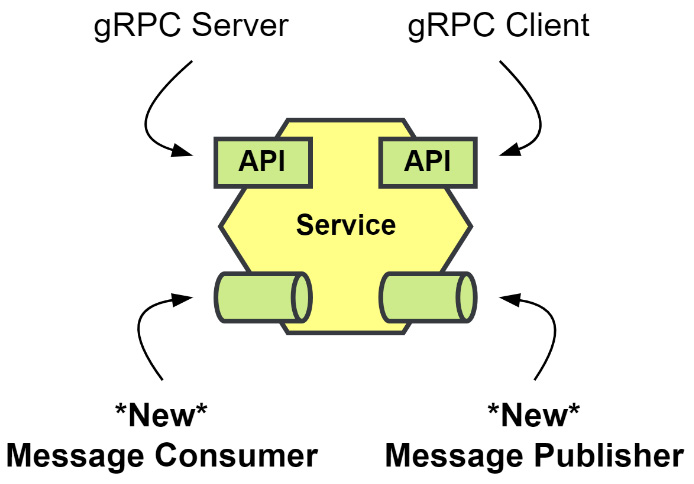

Figure 7.1: asynchronous channels become real module inputs and outputs, not just plumbing.

### Store Management state transfer

`stores` is the source of truth for store and product data, but other modules need that data too.

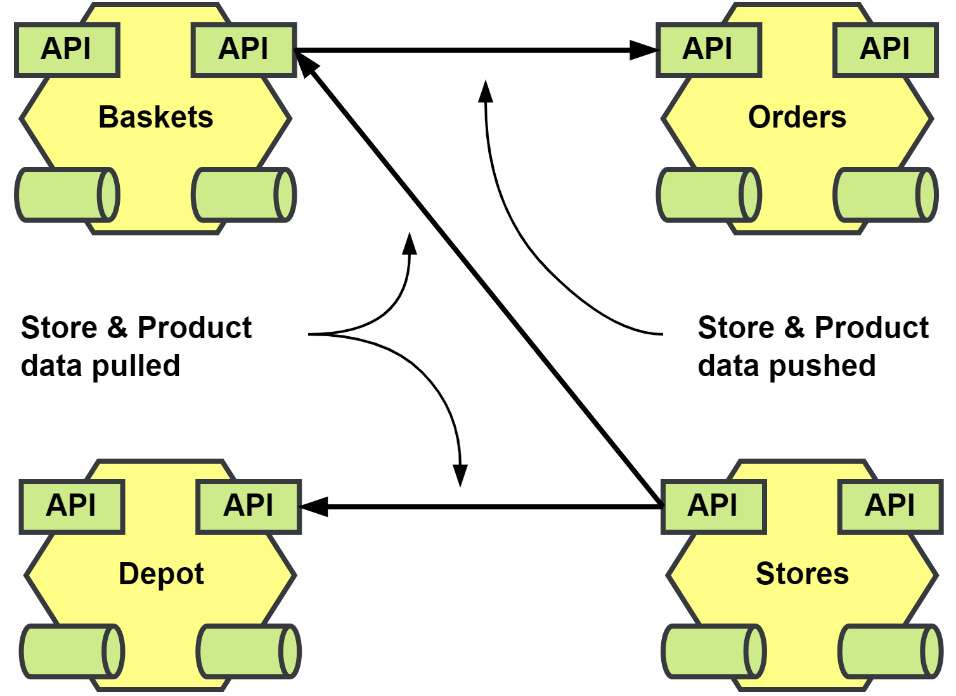

Figure 7.2: store and product data fans out through the system, sometimes by pull and sometimes by push.

The refactor direction is:

- publish richer `storespb` integration events from `stores`
- let consuming modules keep local copies of the data they need
- keep existing gRPC lookups as fallbacks when cache entries are missing

That is visible in `code/06_Event_Carried_State_Transfer/stores/module.go`:

- `storespb.Registrations(reg)` registers public event types
- `am.NewEventStream(...)` creates the broker-backed stream
- `application.NewIntegrationEventHandlers(eventStream)` maps internal domain events to public `storespb` events
- `storespb.RegisterAsyncAPI(mono.Mux())` mounts async API docs at `/stores-asyncapi/`

The producer-side translation is still the same architectural pattern introduced in Chapter 6:

```go
func (h IntegrationEventHandlers[T]) onStoreCreated(ctx context.Context, event ddd.AggregateEvent) error {
    payload := event.Payload().(*domain.StoreCreated)
    return h.publisher.Publish(ctx, storespb.StoreAggregateChannel,
        ddd.NewEvent(storespb.StoreCreatedEvent, &storespb.StoreCreated{
            Id:       event.AggregateID(),
            Name:     payload.Name,
            Location: payload.Location,
        }),
    )
}
```

Important shift:

- the event now carries enough data for consumers to store a local copy
- consumers do not need to call back just to learn the store name or location

#### Local cache for Stores and Products

Consumer modules define cache repositories instead of reading directly from the producer every time.

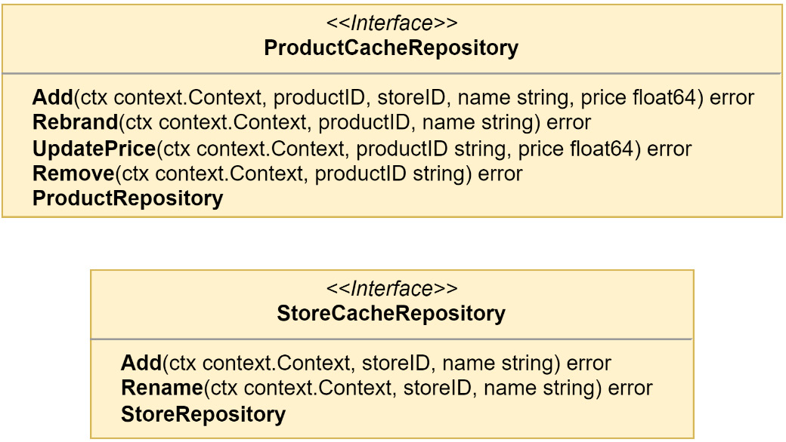

Figure 7.3: the cache repository is local to the consuming module, even though the source data belongs elsewhere.

In `baskets/module.go`, the old direct repositories become cache-backed ones:

```go
stores := postgres.NewStoreCacheRepository(
    "baskets.stores_cache",
    mono.DB(),
    grpc.NewStoreRepository(conn),
)
products := postgres.NewProductCacheRepository(
    "baskets.products_cache",
    mono.DB(),
    grpc.NewProductRepository(conn),
)
```

The new handlers stop logging and start mutating cache tables:

```go
func (h StoreHandlers[T]) onStoreCreated(ctx context.Context, event ddd.Event) error {
    payload := event.Payload().(*storespb.StoreCreated)
    return h.cache.Add(ctx, payload.GetId(), payload.GetName())
}
```

`baskets/internal/application/product_handlers.go` does the same for:

- `storespb.ProductAddedEvent`
- `storespb.ProductRebrandedEvent`
- `storespb.ProductPriceIncreasedEvent`
- `storespb.ProductPriceDecreasedEvent`
- `storespb.ProductRemovedEvent`

#### Synchronous state fallbacks

The local caches are not assumed to be warm immediately.

The Postgres cache repositories fall back to synchronous gRPC lookups on cache miss, then try to insert the retrieved value locally:

```go
func (r StoreCacheRepository) Find(ctx context.Context, storeID string) (*domain.Store, error) {
    const query = "SELECT name FROM %s WHERE id = $1 LIMIT 1"

    store := &domain.Store{ID: storeID}
    err := r.db.QueryRowContext(ctx, r.table(query), storeID).Scan(&store.Name)
    if err != nil {
        if !errors.Is(err, sql.ErrNoRows) {
            return nil, errors.Wrap(err, "scanning store")
        }
        store, err = r.fallback.Find(ctx, storeID)
        if err != nil {
            return nil, errors.Wrap(err, "store fallback failed")
        }
        return store, r.Add(ctx, store.ID, store.Name)
    }

    return store, nil
}
```

Two practical consequences matter here:

- async consumers can start working before every cache is warm
- the system still tolerates a race between an incoming event and a fallback lookup, which is why unique-violation inserts are ignored in `Add(...)`

The same pattern appears in `depot`:

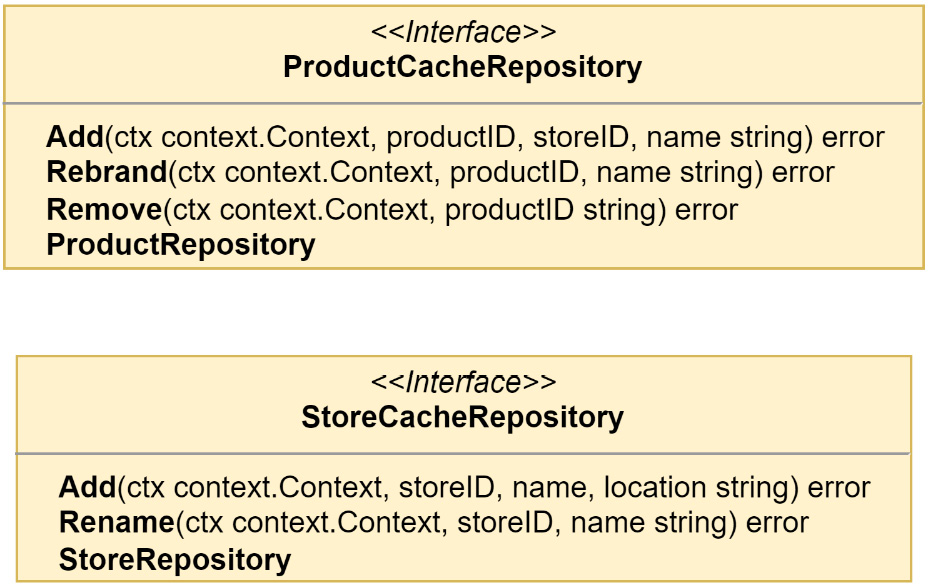

Figure 7.4: each consuming module stores only the fields it actually needs.

That is a useful anti-corruption rule:

- do not mirror the producer model blindly
- cache only the shape needed by the consuming module

### Customer state transfer

Customer data starts flowing asynchronously too, mainly for `notifications` and `search`.

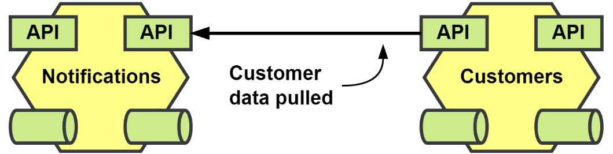

Figure 7.5: customer data is shared, but customer-related decisions still belong to the customer-owning module.

#### Transferring the state but not the responsibility

This is one of the most important rules in the material:

- data can move
- ownership does not move
- authorization/authentication and other customer-specific business rules stay with `customers`

The notifications cache interface is intentionally narrow:

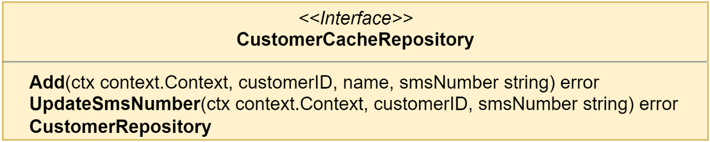

Figure 7.6: `notifications` only needs enough customer data to send messages.

In code, `customers` publishes public customer events and `notifications` consumes them:

- `customers/module.go` builds `application.NewIntegrationEventHandlers(eventStream)`
- `customers/internal/application/integration_event_handlers.go` publishes `customerspb.CustomerRegistered`, `CustomerSmsChanged`, `CustomerEnabled`, and `CustomerDisabled`
- `notifications/module.go` registers `application.NewCustomerHandlers(customers)` against the event stream

Consumer-side cache update:

```go
func (h CustomerHandlers[T]) onCustomerRegistered(ctx context.Context, event T) error {
    payload := event.Payload().(*customerspb.CustomerRegistered)
    return h.cache.Add(ctx, payload.GetId(), payload.GetName(), payload.GetSmsNumber())
}
```

This is event-carried state transfer in its cleanest form:

- a module publishes the customer state other modules need
- consumers store that state locally
- later notification handling can avoid a blocking customer lookup

### Order processing state transfer

`ordering` is pushed one step further down the decoupling path.

Instead of notifying downstream modules directly, it now publishes public order integration events.

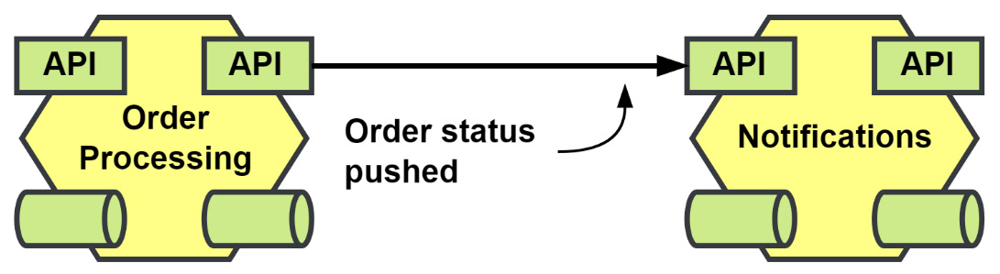

Figure 7.7: earlier notification side effects were still direct dependencies hanging off `ordering`.

The integration-event handler in `ordering/internal/application/integration_event_handlers.go` publishes richer public events such as:

- `orderingpb.OrderCreatedEvent`
- `orderingpb.OrderReadiedEvent`
- `orderingpb.OrderCanceledEvent`
- `orderingpb.OrderCompletedEvent`

Example:

```go
func (h IntegrationEventHandlers[T]) onOrderReadied(ctx context.Context, event ddd.AggregateEvent) error {
    payload := event.Payload().(*domain.OrderReadied)
    return h.publisher.Publish(ctx, orderingpb.OrderAggregateChannel,
        ddd.NewEvent(orderingpb.OrderReadiedEvent, &orderingpb.OrderReadied{
            Id:         event.AggregateID(),
            CustomerId: payload.CustomerID,
            PaymentId:  payload.PaymentID,
            Total:      payload.Total,
        }),
    )
}
```

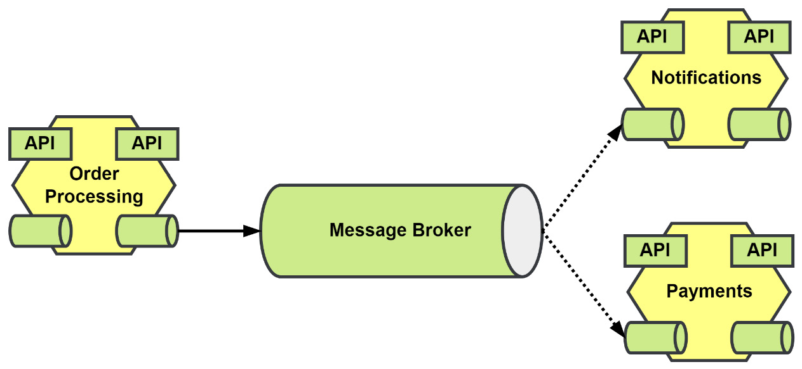

Figure 7.8: internal domain events are now bridged outward as public async events.

In `notifications/internal/application/order_handlers.go`, those public order events are converted into local application calls:

```go
func (h OrderHandlers[T]) onOrderReadied(ctx context.Context, event T) error {
    payload := event.Payload().(*orderingpb.OrderReadied)
    return h.app.NotifyOrderReady(ctx, OrderReady{
        OrderID:    payload.GetId(),
        CustomerID: payload.GetCustomerId(),
    })
}
```

That completes a longer refactor arc:

- Chapter 4 moved side effects out of command handlers and into internal event handlers
- Chapter 6 moved some of those reactions to broker-backed integration events
- Chapter 7 uses event-carried state so those consumers can work with less callback chatter and more autonomy

### Payments state transfer

The payments side is partially visible in the code.

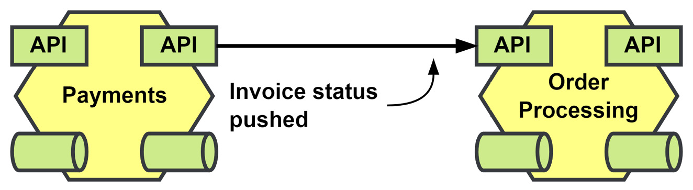

Figure 7.9: invoice payment state is a natural candidate for an async handoff.

In `payments/internal/application/application.go`, paying an invoice publishes a domain event before updating the invoice:

```go
if err = a.publisher.Publish(ctx, ddd.NewEvent(models.InvoicePaidEvent, &models.InvoicePaid{
    ID:      invoice.ID,
    OrderID: invoice.OrderID,
})); err != nil {
    return err
}
```

Then `payments/internal/application/integration_event_handlers.go` maps that to the public event `paymentspb.InvoicePaidEvent` on `paymentspb.InvoiceAggregateChannel`.

Important code note:

- the `payments` producer side is present in `code/06_Event_Carried_State_Transfer`
- the matching async consumer in `ordering` is not yet wired in this chapter's code snapshot
- `ordering` still keeps its synchronous payment dependency through `ordering/internal/grpc/payment_repository.go`

So the architectural direction is clear, but the repo snapshot is still transitional here.

### Documenting the asynchronous API

Async APIs need the same documentation discipline as REST or gRPC APIs.

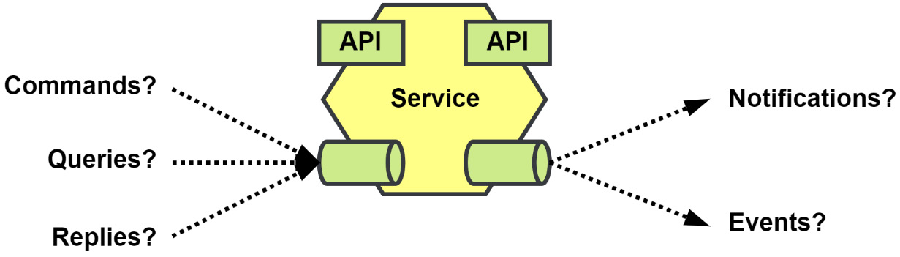

Figure 7.10: without documentation, event-driven boundaries become invisible and difficult to integrate with safely.

#### AsyncAPI

AsyncAPI documents channels and messages the way OpenAPI documents paths and HTTP verbs.

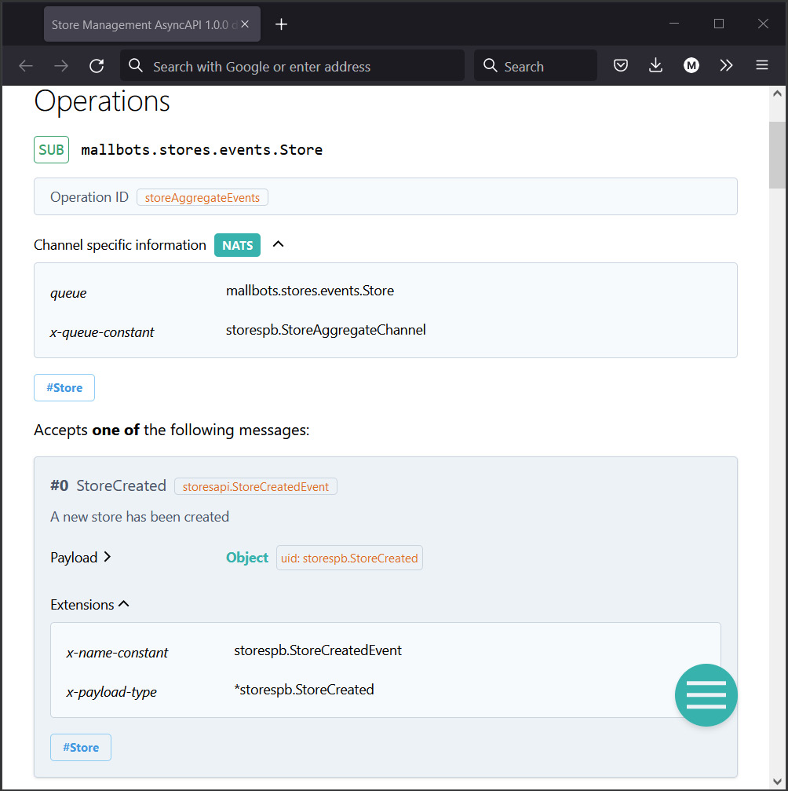

Figure 7.11: async APIs can be rendered as navigable docs, not just inferred from code.

The repo includes a concrete example in `stores/storespb/asyncapi.go` and embedded `stores/storespb/index.html`.

The important design choice is that the async contract is documented from the public `storespb` package, not from private domain types.

#### EventCatalog

EventCatalog is a second option built around generated docs from markdown-driven event definitions.

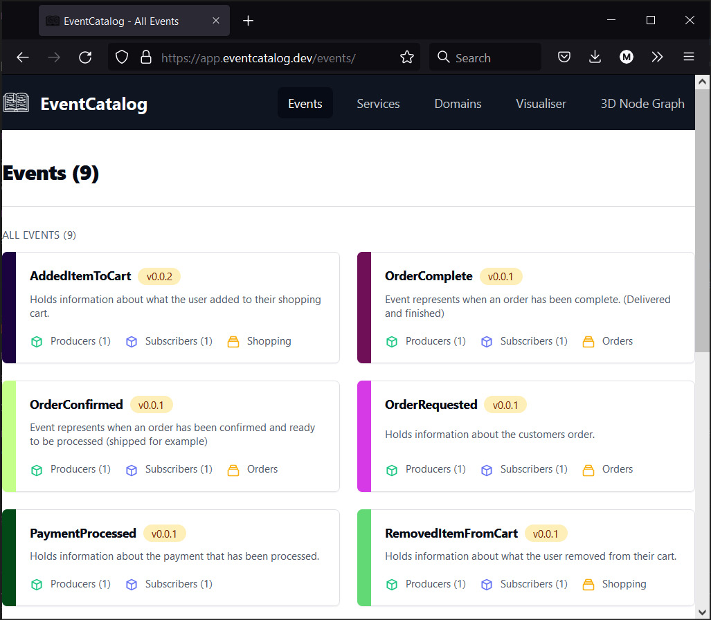

Figure 7.12: event documentation can also describe relationships between producers, consumers, and flows.

Main takeaway:

- async APIs are still APIs
- they need discoverability, naming discipline, and versioning discipline

## Adding a New Order Search Module

Event-carried state transfer enables entirely new read-only features.

The new `search` module is the clearest example of that idea.

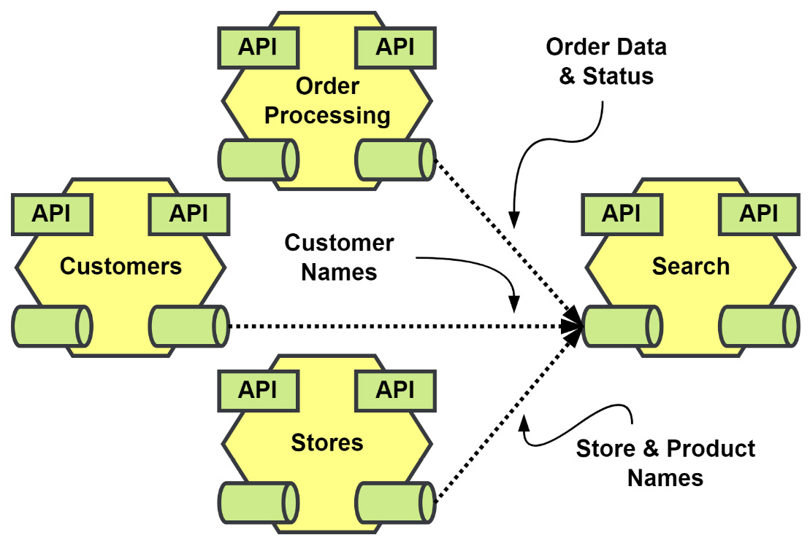

Figure 7.13: `search` depends on events from several modules instead of being embedded into one producer module.

The composition root in `search/module.go` shows the whole design:

- register `orderingpb`, `customerspb`, and `storespb`
- create one `am.EventStream`
- build local cache repositories for customers, stores, and products
- build a local order read-model repository
- register four event subscriptions: orders, customers, stores, products

Concrete wiring:

```go
reg := registry.New()
err = orderingpb.Registrations(reg)
err = customerspb.Registrations(reg)
err = storespb.Registrations(reg)
eventStream := am.NewEventStream(reg, jetstream.NewStream(mono.Config().Nats.Stream, mono.JS()))

customers := postgres.NewCustomerCacheRepository("search.customers_cache", mono.DB(), grpc.NewCustomerRepository(conn))
stores := postgres.NewStoreCacheRepository("search.stores_cache", mono.DB(), grpc.NewStoreRepository(conn))
products := postgres.NewProductCacheRepository("search.products_cache", mono.DB(), grpc.NewProductRepository(conn))
orders := postgres.NewOrderRepository("search.orders", mono.DB())
```

This module is intentionally query-focused:

- `search/internal/application/application.go` only defines `SearchOrders(...)` and `GetOrder(...)`
- all writes happen through incoming event handlers

That is a strong CQRS example:

- no aggregate lifecycle
- no command side
- only projections and query APIs

## Building Read Models from Multiple Sources

The new order search model combines order events with cached customer, store, and product data.

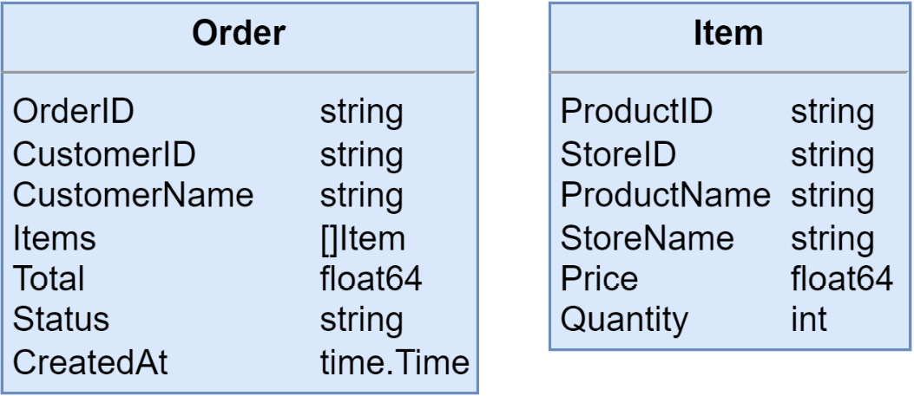

Figure 7.14: the read model is shaped for search and display, not for aggregate invariants.

The read model is built in `search/internal/application/order_handlers.go` when `orderingpb.OrderCreatedEvent` arrives.

That handler:

1. loads cached customer data
2. loads each cached product
3. loads the related stores
4. expands those into a rich `models.Order`
5. computes total and status
6. saves the assembled read model into `search.orders`

```go
func (h OrderHandlers[T]) onOrderCreated(ctx context.Context, event T) error {
    payload := event.Payload().(*orderingpb.OrderCreated)

    customer, err := h.customers.Find(ctx, payload.CustomerId)
    if err != nil {
        return err
    }

    var total float64
    items := make([]models.Item, len(payload.GetItems()))
    seenStores := map[string]*models.Store{}
    for i, item := range payload.GetItems() {
        product, err := h.products.Find(ctx, item.GetProductId())
        if err != nil {
            return err
        }
        // store lookup and item enrichment omitted here
    }

    order := &models.Order{
        OrderID:      payload.GetId(),
        CustomerID:   customer.ID,
        CustomerName: customer.Name,
        Items:        items,
        Total:        total,
        Status:       "New",
    }
    return h.orders.Add(ctx, order)
}
```

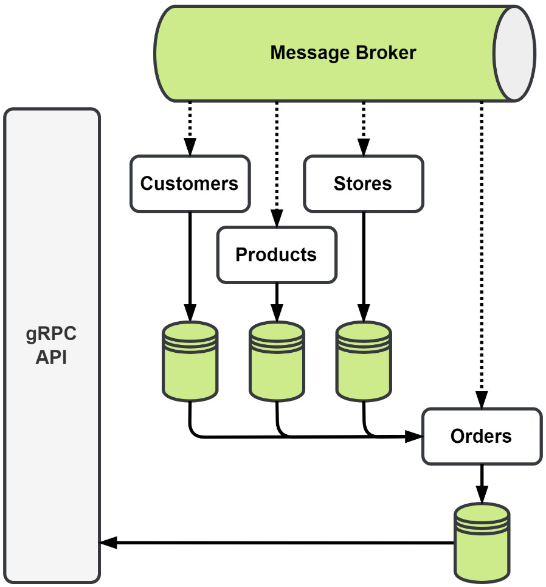

Figure 7.15: order search results are assembled from several streams and local caches at projection time.

The storage schema in `search/internal/postgres/order_repository.go` and `docker/database/8_create_search_schema.sh` reflects search needs rather than domain purity:

- `customer_name` is stored redundantly for search/display
- `items` are stored as serialized JSON/bytes
- `product_ids` and `store_ids` are denormalized for filtering
- status updates are projection updates, not aggregate state transitions

Important observation from the current code snapshot:

- `SearchOrders(...)` and `GetOrder(...)` are still `TODO` in `search/internal/application/application.go`
- the interesting implemented work is the projection-building side, not the final query API yet

That still teaches the main point clearly:

- event-driven systems make it easy to stand up a new consumer module
- that module can create a purpose-built read model without becoming part of the original owner module

## Key Takeaways

- event-carried state transfer means publishing enough state for downstream modules to keep useful local copies
- local caches reduce runtime coupling, but source-of-truth ownership stays with the original module
- fallback synchronous reads are a practical bridge while caches warm up or when events are missing
- store and customer events in this chapter are the clearest examples of cache-building consumers
- order events become the foundation for both async notifications and the new `search` projection
- async APIs need documentation too; `stores/storespb/asyncapi.go` is the concrete example in this repo
- the new `search` module is a strong CQRS read-model example built from multiple event sources
- the chapter code is still transitional in places, especially around `payments -> ordering`, which is not fully async-wired yet in this snapshot

## Repo Anchors

The clearest implementation appears in `code/06_Event_Carried_State_Transfer/`.

High-value files to read alongside the summary:

- `code/06_Event_Carried_State_Transfer/stores/module.go`
- `code/06_Event_Carried_State_Transfer/stores/internal/application/integration_event_handlers.go`
- `code/06_Event_Carried_State_Transfer/stores/storespb/asyncapi.go`
- `code/06_Event_Carried_State_Transfer/baskets/module.go`
- `code/06_Event_Carried_State_Transfer/baskets/internal/application/store_handlers.go`
- `code/06_Event_Carried_State_Transfer/baskets/internal/application/product_handlers.go`
- `code/06_Event_Carried_State_Transfer/baskets/internal/postgres/store_cache_repository.go`
- `code/06_Event_Carried_State_Transfer/baskets/internal/postgres/product_cache_repository.go`
- `code/06_Event_Carried_State_Transfer/customers/module.go`
- `code/06_Event_Carried_State_Transfer/customers/internal/application/integration_event_handlers.go`
- `code/06_Event_Carried_State_Transfer/notifications/module.go`
- `code/06_Event_Carried_State_Transfer/notifications/internal/application/customer_handlers.go`
- `code/06_Event_Carried_State_Transfer/notifications/internal/application/order_handlers.go`
- `code/06_Event_Carried_State_Transfer/ordering/module.go`
- `code/06_Event_Carried_State_Transfer/ordering/internal/application/integration_event_handlers.go`
- `code/06_Event_Carried_State_Transfer/payments/module.go`
- `code/06_Event_Carried_State_Transfer/payments/internal/application/application.go`
- `code/06_Event_Carried_State_Transfer/payments/internal/application/integration_event_handlers.go`
- `code/06_Event_Carried_State_Transfer/search/module.go`
- `code/06_Event_Carried_State_Transfer/search/internal/application/order_handlers.go`
- `code/06_Event_Carried_State_Transfer/search/internal/postgres/order_repository.go`
- `code/06_Event_Carried_State_Transfer/docker/database/8_create_search_schema.sh`

The cleanest end-to-end flow to follow is:

1. `stores/module.go`
2. `stores/internal/application/integration_event_handlers.go`
3. `baskets/module.go`
4. `baskets/internal/application/store_handlers.go`
5. `baskets/internal/postgres/store_cache_repository.go`
6. `search/module.go`
7. `search/internal/application/order_handlers.go`
8. `search/internal/postgres/order_repository.go`

## Further Reading

- [AsyncAPI](https://www.asyncapi.com/)
- [EventCatalog](https://www.eventcatalog.dev/)
- [CQRS](https://martinfowler.com/bliki/CQRS.html)
- [Anti-Corruption Layer](https://martinfowler.com/bliki/AntiCorruptionLayer.html)

# 8: Message Workflows

## Overview

- Distributed transactions coordinate work that spans multiple modules and cannot be completed atomically inside one local database transaction.
- Sagas trade the isolation guarantee of ACID for long-lived, resilient, step-by-step workflows with compensation.
- This codebase chooses an orchestrated saga for order creation rather than a choreographed event chain.
- The main implementation change is that `ordering` stops calling remote modules during `CreateOrder`; a separate coordinator drives the workflow through commands and replies.

Core distinction carried forward from the earlier material:

- earlier integration-event work broadcasts facts and shares state
- command/reply messages coordinate workflow steps
- events say something already happened
- commands ask another module to perform a specific action and replies report the result

## What Is a Distributed Transaction?

Local transactions achieve atomicity with one database engine and one commit boundary.

Distributed transactions try to keep the whole system consistent when one business operation spans several modules.

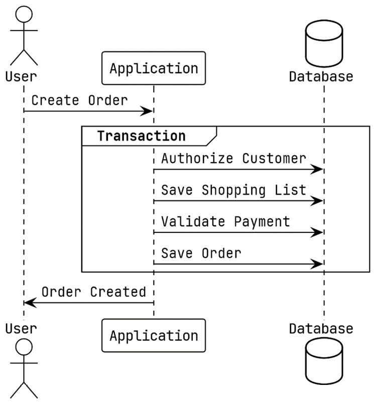

Figure 8.1: a monolithic local transaction can create the entire order in one atomic boundary.

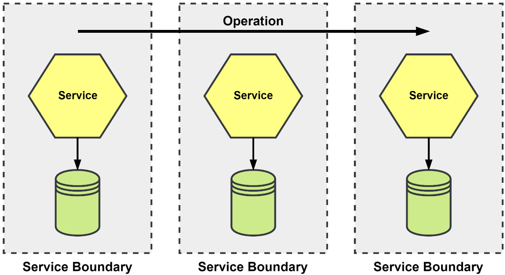

Figure 8.2: once work crosses module or service boundaries, consistency has to be coordinated across participants.

Important framing:

- local ACID transactions get atomicity, consistency, isolation, and durability from the database
- distributed workflows rarely keep full ACID semantics cheaply
- some durability and consistency guarantees can still be achieved, but isolation often has to be relaxed

The running operation in this codebase is order creation:

- authorize customer
- create shopping list
- confirm payment
- initiate shopping
- approve order

If one of those steps fails after earlier steps already succeeded, compensating work is needed to bring the system back to a consistent state.

## Comparing Various Methods of Distributed Transactions

Three approaches matter in this material:

- Two-Phase Commit (2PC)
- choreographed saga
- orchestrated saga

### Two-Phase Commit

2PC uses a coordinator with a prepare phase and a commit or abort phase.

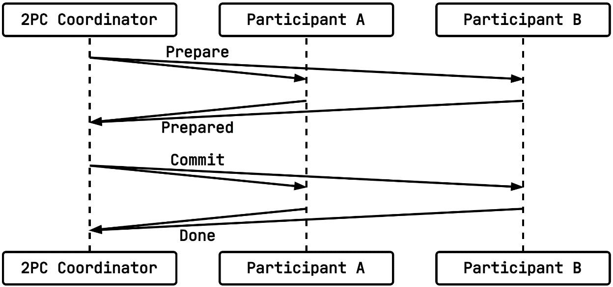

Figure 8.3: all participants hold prepared work until the coordinator decides commit or abort.

Strengths:

- strongest consistency model of the three
- closest to full ACID semantics

Costs:

- participants hold database resources while waiting
- blocked or unresolved prepared transactions hurt scalability
- operational failure modes are severe if the coordinator or a participant gets stuck

### The Saga

Sagas split one distributed transaction into a sequence of local transactions plus compensations.

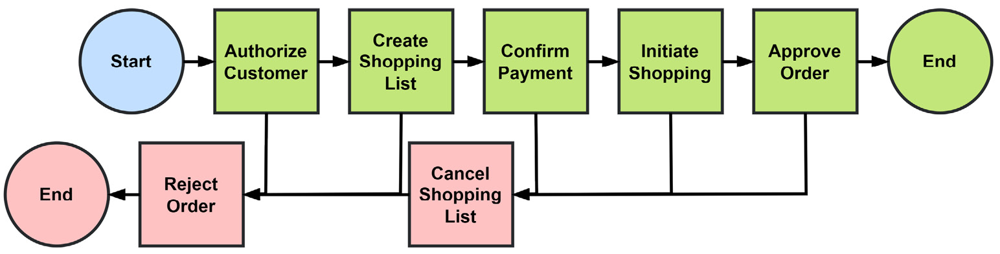

Figure 8.4: each forward action has a possible compensation that undoes earlier work if the workflow fails later.

This makes sagas:

- long-lived
- database-agnostic compared to prepared transactions
- more scalable than 2PC
- not fully isolated

#### The Choreographed Saga

In choreography, each participant reacts to events and knows when it is its turn.

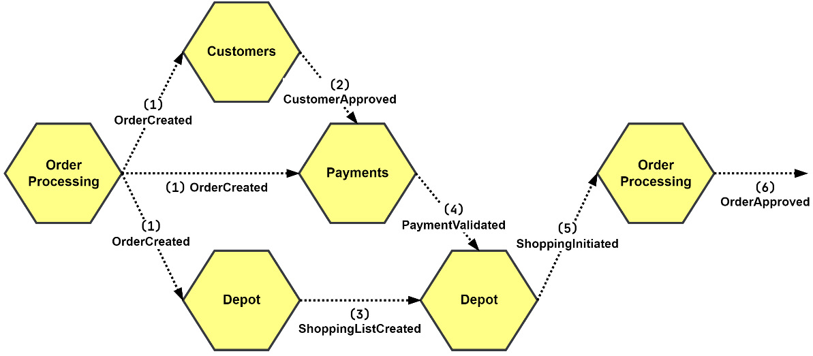

Figure 8.5: coordination is spread across the participants instead of being centralized.

Good fit:

- few participants
- simple flows
- easy-to-follow compensation logic

Weakness:

- workflow logic is scattered
- compensation dependencies are easy to miss
- a developer can overlook an event or failure path and break the workflow silently

#### The Orchestrated Saga

In orchestration, a saga execution coordinator decides the next step and reacts to replies.

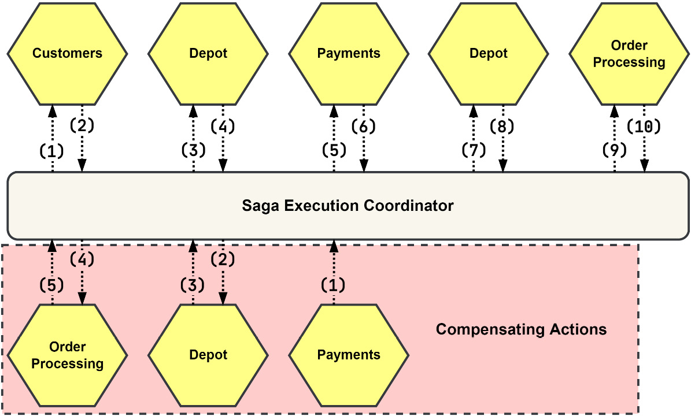

Figure 8.6: the coordinator sends commands, receives replies, and decides whether to continue or compensate.

This codebase chooses orchestration because the create-order flow has:

- multiple participants
- a meaningful compensation path
- step-specific data such as `ShoppingID` that must be captured and reused later

## Implementing Distributed Transactions with Sagas

The implementation adds two new capabilities:

- command and reply message types in `internal/ddd` and `internal/am`
- a generic saga execution coordinator in `internal/sec`

### Adding Support for the Command and Reply Messages

`07_Message_Workflows` extends the event-centric messaging layer with request/response workflow messages.

`internal/ddd/command.go` defines commands and command handlers:

```go
type CommandHandler[T Command] interface {
    HandleCommand(ctx context.Context, cmd T) (Reply, error)
}

type Command interface {
    IDer
    CommandName() string
    Payload() CommandPayload
    Metadata() Metadata
    OccurredAt() time.Time
}
```

`internal/ddd/reply.go` mirrors that for replies:

```go
type Reply interface {
    ID() string
    ReplyName() string
    Payload() ReplyPayload
    Metadata() Metadata
    OccurredAt() time.Time
}
```

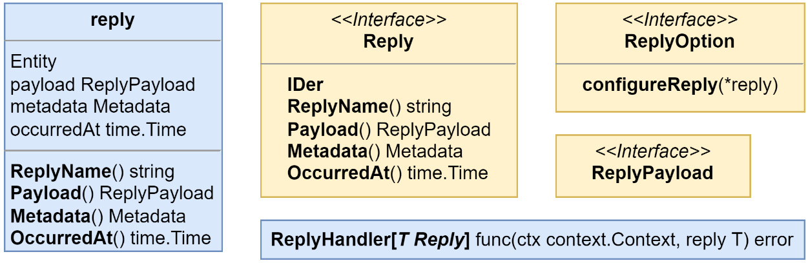

Figure 8.7: replies become first-class message types instead of being implied by synchronous RPC responses.

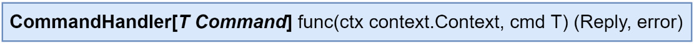

Figure 8.8: command handling returns a reply and an error so the workflow can continue based on the result.

The transport-layer wrapper is in `internal/am/command_messages.go`.

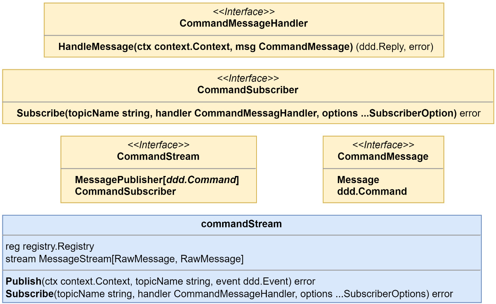

Figure 8.9: the command stream serializes commands, routes them, and publishes replies automatically.

Core behavior:

```go
reply, err = handler.HandleMessage(ctx, commandMsg)
if err != nil {
    return s.publishReply(ctx, destination, s.failure(reply, commandMsg))
}
return s.publishReply(ctx, destination, s.success(reply, commandMsg))
```

That does two important things:

- every command gets a reply message, even if the handler only returns `nil`
- correlation metadata is copied from command headers to reply headers so the orchestrator can match replies back to the running saga

### Adding an SEC Package

The new `internal/sec` package provides the generic saga machinery.

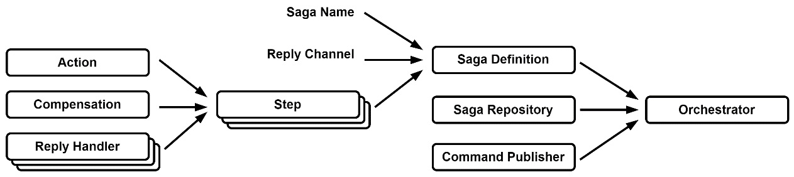

Figure 8.10: the orchestrator, saga definition, and steps split runtime coordination from workflow-specific logic.

#### The Orchestrator

The orchestrator has two jobs:

- start a saga with initial data
- react to incoming replies and decide what to do next

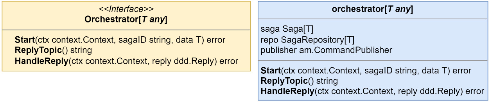

Figure 8.11: the orchestrator is the runtime engine that advances or compensates the workflow.

The core implementation is in `internal/sec/orchestrator.go`:

```go
func (o orchestrator[T]) Start(ctx context.Context, id string, data T) error {
    sagaCtx := &SagaContext[T]{ID: id, Data: data, Step: -1}
    if err := o.repo.Save(ctx, o.saga.Name(), sagaCtx); err != nil {
        return err
    }

    result := o.execute(ctx, sagaCtx)
    if result.err != nil {
        return err
    }
    return o.processResult(ctx, result)
}
```

`HandleReply(...)` loads the stored saga context, applies any reply-specific logic for the current step, reads the reply outcome metadata, and either:

- continues to the next forward step
- flips into compensation mode
- or completes the saga

#### The Saga Definition

The saga definition holds the workflow metadata and the ordered list of steps.

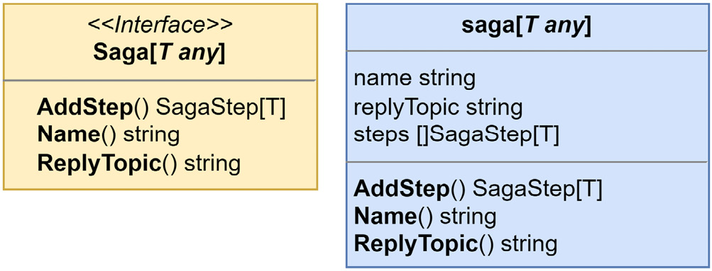

Figure 8.12: a saga definition is a reusable workflow template, while `SagaContext` is the persisted state of one running instance.

In `internal/sec/saga.go`, the persisted state is:

```go
type SagaContext[T any] struct {
    ID           string
    Data         T
    Step         int
    Done         bool
    Compensating bool
}
```

This context is what lets the workflow be reactive rather than in-memory and long-running.

#### The Steps

Steps contain the actual workflow logic.

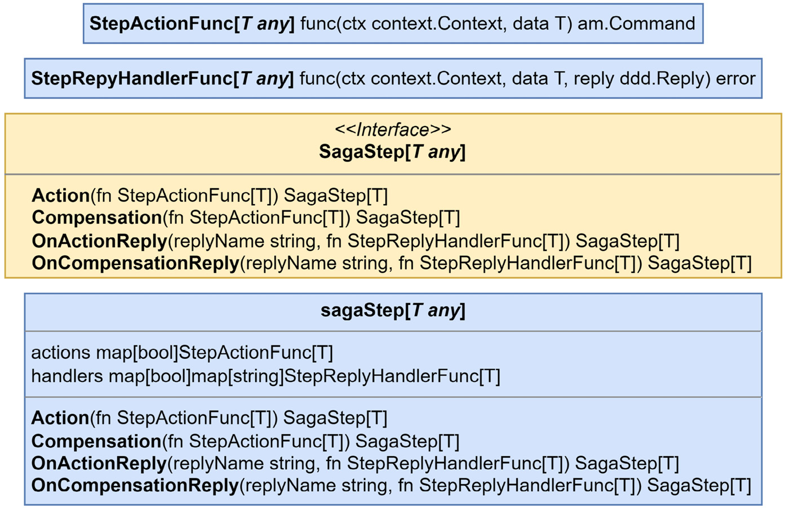

Figure 8.13: each step can define a forward action, a compensation action, and reply-specific handlers.

`internal/sec/saga_step.go` defines the step API:

```go
type SagaStep[T any] interface {
    Action(fn StepActionFunc[T]) SagaStep[T]
    Compensation(fn StepActionFunc[T]) SagaStep[T]
    OnActionReply(replyName string, fn StepReplyHandlerFunc[T]) SagaStep[T]
    OnCompensationReply(replyName string, fn StepReplyHandlerFunc[T]) SagaStep[T]
}
```

Important runtime rule:

- when compensating, the orchestrator walks backward
- when moving forward, it walks ahead
- steps without an action for the current direction are skipped

## Converting the Order Creation Process to Use a Saga

The order-creation refactor is the concrete payoff.

Before this change, `ordering/internal/application/commands/create_order.go` directly called remote collaborators during one command handler.

In `07_Message_Workflows`, `CreateOrder` becomes local again:

```go
func (h CreateOrderHandler) CreateOrder(ctx context.Context, cmd CreateOrder) error {
    order, err := h.orders.Load(ctx, cmd.ID)
    if err != nil {
        return err
    }

    event, err := order.CreateOrder(cmd.ID, cmd.CustomerID, cmd.PaymentID, cmd.Items)
    if err != nil {
        return errors.Wrap(err, "create order command")
    }

    if err = h.orders.Save(ctx, order); err != nil {
        return errors.Wrap(err, "order creation")
    }
    return h.publisher.Publish(ctx, event)
}
```

That is the most important refactor in this design:

- `ordering` creates the order and publishes `OrderCreated`
- it no longer synchronously coordinates customer authorization, shopping-list creation, payment confirmation, and approval itself
- the workflow coordination moves to a separate saga coordinator

### Adding Commands to the Saga Participants

Each participant gets command handlers that adapt command messages to existing application logic.

#### The Customers Module

`customers` receives the new `AuthorizeCustomer` command.

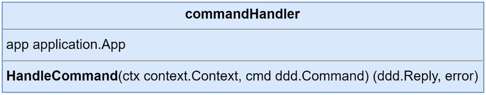

Figure 8.14: participant modules stay decoupled from the saga itself; they just expose commands on their own channel.

The handler is thin and reuses the application service:

```go
func (h commandHandlers) doAuthorizeCustomer(ctx context.Context, cmd ddd.Command) (ddd.Reply, error) {
    payload := cmd.Payload().(*customerspb.AuthorizeCustomer)
    return nil, h.app.AuthorizeCustomer(ctx, application.AuthorizeCustomer{ID: payload.GetId()})
}
```

The composition root adds:

- one shared raw JetStream-backed stream
- `am.NewCommandStream(reg, stream)`
- command handlers registered on `customerspb.CommandChannel`

#### The Depot Module

`depot` is the most interesting participant because it returns a specific reply.

It handles:

- `CreateShoppingListCommand`
- `CancelShoppingListCommand`
- `InitiateShoppingCommand`

And `CreateShoppingList` returns `CreatedShoppingListReply` with the generated shopping-list ID:

```go
func (h commandHandlers) doCreateShoppingList(ctx context.Context, cmd ddd.Command) (ddd.Reply, error) {
    payload := cmd.Payload().(*depotpb.CreateShoppingList)
    id := uuid.New().String()
    // build items
    err := h.app.CreateShoppingList(ctx, commands.CreateShoppingList{ID: id, OrderID: payload.GetOrderId(), Items: items})
    return ddd.NewReply(depotpb.CreatedShoppingListReply, &depotpb.CreatedShoppingList{Id: id}), err
}
```

That reply becomes part of the saga state for later steps.

#### The Order Processing Module

`ordering` adds command handlers for:

- `ApproveOrderCommand`
- `RejectOrderCommand`

Those handlers delegate to new local application commands:

- `ApproveOrder(ctx, commands.ApproveOrder{ID, ShoppingID})`
- `RejectOrder(ctx, commands.RejectOrder{ID})`

The approval command persists the order and publishes the resulting domain event:

```go
func (h ApproveOrderHandler) ApproveOrder(ctx context.Context, cmd ApproveOrder) error {
    order, err := h.orders.Load(ctx, cmd.ID)
    if err != nil {
        return err
    }
    event, err := order.Approve(cmd.ShoppingID)
    if err != nil {
        return err
    }
    if err = h.orders.Save(ctx, order); err != nil {
        return err
    }
    return h.publisher.Publish(ctx, event)
}
```

#### The Payments Module

`payments` adds `ConfirmPaymentCommand`, again by wrapping existing application behavior behind a command channel.

This keeps the participant model consistent:

- every participant owns its own command messages
- every participant handles its own command channel
- the orchestrator only publishes commands; it does not own participant logic

### Implementing the Create-Order Saga Execution Coordinator

The new module is `cosec`.

Its role is narrow:

- subscribe to `orderingpb.OrderCreatedEvent`
- start a create-order saga
- listen for replies on its reply topic
- publish the next command or compensating command

The composition root in `cosec/module.go` shows the full setup:

```go
stream := jetstream.NewStream(mono.Config().Nats.Stream, mono.JS(), mono.Logger())
eventStream := am.NewEventStream(reg, stream)
commandStream := am.NewCommandStream(reg, stream)
replyStream := am.NewReplyStream(reg, stream)

sagaStore := pg.NewSagaStore("cosec.sagas", mono.DB(), reg)
sagaRepo := sec.NewSagaRepository[*models.CreateOrderData](reg, sagaStore)

orchestrator := sec.NewOrchestrator[*models.CreateOrderData](
    internal.NewCreateOrderSaga(),
    sagaRepo,
    commandStream,
)
```

The saga data is stored explicitly in Postgres.

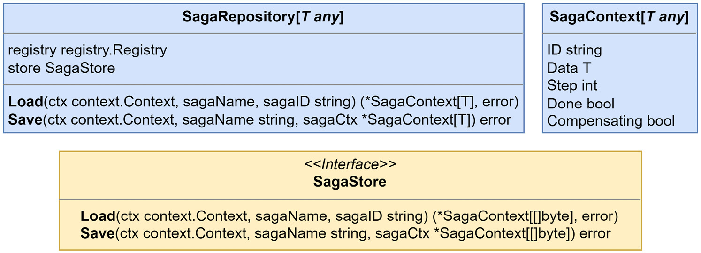

Figure 8.15: the workflow state is persisted so the orchestrator can be reactive and recoverable instead of purely in-memory.

The schema is in `docker/database/011_create_cosec_schema.sh`:

```sql
CREATE TABLE cosec.sagas (
    id           text        NOT NULL,
    name         text        NOT NULL,
    data         bytea       NOT NULL,
    step         int         NOT NULL,
    done         bool        NOT NULL,
    compensating bool        NOT NULL,
    updated_at   timestamptz NOT NULL DEFAULT CURRENT_TIMESTAMP,
    PRIMARY KEY (id, name)
);
```

`internal/postgres/saga_store.go` uses `INSERT ... ON CONFLICT ... DO UPDATE` so the current saga context is rewritten after every interaction.

The data model tracked by the saga contains:

- `OrderID`
- `CustomerID`
- `PaymentID`
- `ShoppingID`
- `Items`
- `Total`

### Defining the Saga

The create-order workflow is defined in `cosec/internal/saga.go`.

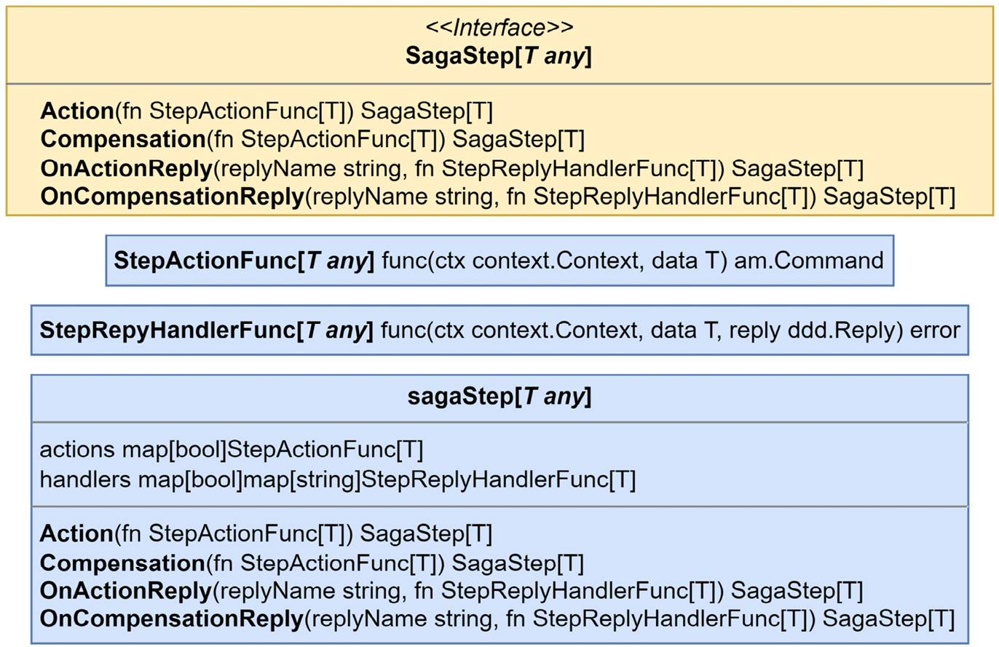

Figure 8.16: the builder-style step definition keeps the saga readable even as replies and compensations are added.

The actual steps are:

```go
// 0. -RejectOrder
saga.AddStep().
    Compensation(saga.rejectOrder)

// 1. AuthorizeCustomer
saga.AddStep().
    Action(saga.authorizeCustomer)

// 2. CreateShoppingList, -CancelShoppingList
saga.AddStep().
    Action(saga.createShoppingList).
    OnActionReply(depotpb.CreatedShoppingListReply, saga.onCreatedShoppingListReply).
    Compensation(saga.cancelShoppingList)

// 3. ConfirmPayment
saga.AddStep().
    Action(saga.confirmPayment)

// 4. InitiateShopping
saga.AddStep().
    Action(saga.initiateShopping)

// 5. ApproveOrder
saga.AddStep().
    Action(saga.approveOrder)
```

This is the exact forward workflow plus the compensation path that matters in the current implementation.

The reply handler that captures the newly created shopping-list ID is the clearest example of why replies matter:

```go
func (s createOrderSaga) onCreatedShoppingListReply(ctx context.Context, data *models.CreateOrderData, reply ddd.Reply) error {
    payload := reply.Payload().(*depotpb.CreatedShoppingList)
    data.ShoppingID = payload.GetId()
    return nil
}
```

### Main Runtime Flow

The shortest end-to-end flow to understand is:

1. `ordering` receives `BasketCheckedOut`
2. `ordering` creates the order locally and publishes `orderingpb.OrderCreatedEvent`
3. `cosec` listens for `OrderCreated` and starts a saga with `CreateOrderData`
4. the orchestrator publishes `AuthorizeCustomerCommand`
5. `customers` replies success/failure
6. the orchestrator publishes `CreateShoppingListCommand`
7. `depot` replies with `CreatedShoppingListReply`
8. the saga stores `ShoppingID`
9. the orchestrator publishes `ConfirmPaymentCommand`
10. then `InitiateShoppingCommand`
11. then `ApproveOrderCommand`
12. if a step fails, the orchestrator flips into compensation mode and walks backward through the defined compensations

The trigger handler in `cosec/internal/handlers/integration_events.go` shows how the saga starts:

```go
func (h integrationHandlers[T]) onOrderCreated(ctx context.Context, event ddd.Event) error {
    payload := event.Payload().(*orderingpb.OrderCreated)
    // compute items and total
    data := &models.CreateOrderData{
        OrderID:    payload.GetId(),
        CustomerID: payload.GetCustomerId(),
        PaymentID:  payload.GetPaymentId(),
        Items:      items,
        Total:      total,
    }
    return h.orchestrator.Start(ctx, event.ID(), data)
}
```

That is the key inversion from the earlier code:

- `ordering` publishes the fact that an order was created
- `cosec` owns the long-running coordination
- participant modules stay generic and reusable through commands and replies

## Key Takeaways

- distributed transactions appear once one business operation spans multiple modules and side effects must stay consistent
- 2PC gives stronger guarantees but holds resources and scales poorly for long workflows
- sagas replace one big atomic commit with a sequence of local commits plus compensations
- this codebase chooses an orchestrated saga because the create-order workflow has enough steps and reply-specific state to justify centralized coordination
- `internal/ddd` and `internal/am` are extended with command and reply message types so workflow steps can be requested asynchronously and correlated back to the coordinator
- `internal/sec` provides the reusable runtime pieces: orchestrator, saga definition, steps, and saga repository
- `ordering` becomes more resilient by reducing `CreateOrder` to local persistence plus event publication
- the new `cosec` module is the main architectural addition; it listens for `OrderCreated`, persists saga state, publishes commands, and reacts to replies
- the most important code idea is not the builder API but the separation of concerns: participants do local work, the orchestrator owns workflow order and compensation

## Repo Anchors

The clearest implementation appears in `code/07_Message_Workflows/`.

High-value files to read alongside the summary:

- `code/07_Message_Workflows/internal/ddd/command.go`
- `code/07_Message_Workflows/internal/ddd/reply.go`
- `code/07_Message_Workflows/internal/am/command_messages.go`
- `code/07_Message_Workflows/internal/am/reply_messages.go`
- `code/07_Message_Workflows/internal/sec/orchestrator.go`
- `code/07_Message_Workflows/internal/sec/saga.go`
- `code/07_Message_Workflows/internal/sec/saga_step.go`
- `code/07_Message_Workflows/internal/sec/saga_repository.go`
- `code/07_Message_Workflows/internal/postgres/saga_store.go`
- `code/07_Message_Workflows/cosec/module.go`
- `code/07_Message_Workflows/cosec/internal/saga.go`
- `code/07_Message_Workflows/cosec/internal/handlers/integration_events.go`
- `code/07_Message_Workflows/cosec/internal/handlers/replies.go`
- `code/07_Message_Workflows/customers/internal/handlers/commands.go`
- `code/07_Message_Workflows/depot/internal/handlers/commands.go`
- `code/07_Message_Workflows/ordering/internal/application/commands/create_order.go`
- `code/07_Message_Workflows/ordering/internal/application/commands/approve_order.go`
- `code/07_Message_Workflows/ordering/internal/application/commands/reject_order.go`
- `code/07_Message_Workflows/ordering/internal/handlers/commands.go`
- `code/07_Message_Workflows/payments/internal/handlers/commands.go`
- `code/07_Message_Workflows/docker/database/011_create_cosec_schema.sh`

The cleanest end-to-end flow to follow is:

1. `ordering/internal/handlers/integration_events.go`
2. `ordering/internal/application/commands/create_order.go`
3. `ordering/internal/handlers/domain_events.go`
4. `cosec/internal/handlers/integration_events.go`
5. `cosec/module.go`
6. `cosec/internal/saga.go`
7. `internal/sec/orchestrator.go`
8. `customers/internal/handlers/commands.go`
9. `depot/internal/handlers/commands.go`
10. `payments/internal/handlers/commands.go`
11. `ordering/internal/handlers/commands.go`
12. `internal/postgres/saga_store.go`

## Further Reading

- [Saga Pattern](https://microservices.io/patterns/data/saga.html)
- [Two-Phase Commit Protocol](https://martinfowler.com/articles/patterns-of-distributed-systems/two-phase-commit.html)
- [Compensating Transaction](https://learn.microsoft.com/en-us/azure/architecture/patterns/compensating-transaction)
