## Chapter 1: Fast

Good tests **need to be fast. There is no compromise here.**

Everybody hates long-running tests. Let’s think about your teammates’ time and mental health when they are waiting for test results. Both in CI and locally. It’s terrifying.

When you wait for a long time, you will likely start to do anything else in the meantime. After the CI passes (hopefully), you will need to switch back to this task. Context switching is one of the biggest productivity killers. It’s very exhausting for our brains. We are not robots.

I know that there are still some companies where tests can be executing for 24 hours. We don’t want to follow this approach. You should be able to run your tests locally in less than 1 minute, ideally in **less than 10s**. I know that sometimes it may require some time investment. It’s an investment with an excellent ROI *(Return Of Investment)*! In that case, you can really quickly check your changes. Also, deployment times, etc. are much shorter.

It’s always worth trying to find quick wins that can reduce tests execution the most from my experience. [Pareto principle (80/20 rule)](https://en.wikipedia.org/wiki/Pareto_principle) works here perfectly!

## Chapter 2: Testing enough scenarios on all levels

I hope that you already know that 100% test coverage is not the best idea (as long as it is not a simple/critical library).

It’s always a good idea to ask yourself the question *“how easily can it break?”*. It’s even more worth to ask this question if you feel that the test that you are implementing starts to look exactly as a function that you test. At the end we are not writing tests because tests are nice, but they should save our ass!

From my experience, **coverage like 70-80% is a pretty good result in Go**.

It’s also not the best idea to cover everything with *component* or *end-to-end tests*. First – you will not be able to do that because of the inability to simulate some error scenarios, like rollbacks on the repository. Second – it will break the first rule. These tests will be slow.

 

Tests on several layers should also overlap, so we will know that integration is done correctly.

You may think that solution for that is simple: the test pyramid! And that’s true…sometimes. Especially in applications that handle a lot of operations based on writes.

<figure>
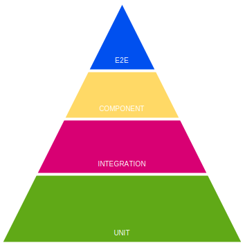
<figcaption aria-hidden="true">Testing Pyramid</figcaption>
</figure>

But what, for example, about applications that aggregate data from multiple other services and expose the data via API? It has no complex logic of saving the data. Probably most of the code is related to the database operations. In this case, we should use **reversed test pyramid** (it actually looks more like a christmas tree). When big part of our application is connected to some infrastructure (for example: database) it’s just hard to cover a lot of functionality with unit tests.

<figure>
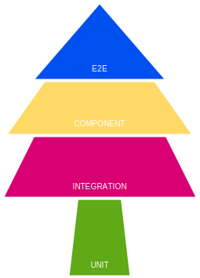
<figcaption aria-hidden="true">Christmas Tree</figcaption>
</figure>

## Chapter 3: Tests need to be robust and deterministic

Do you know that feeling when you are doing some urgent fix, tests are passing locally, you push changes to the repository and … after 20 minutes they fail in the CI? It’s incredibly frustrating. It also discourages us from adding new tests. It’s also decreasing our trust in them.

You should fix that issue as fast as you can. In that case, [Broken windows theory](https://en.wikipedia.org/wiki/Broken_windows_theory) is really valid.

## Chapter 4: You should be able to execute most of the tests locally

Tests that you run locally should give you enough confidence that the feature that you developed or refactored is still working. **E2E tests should just double-check if everything is integrated correctly.**

You will have also much more confidence when contracts between services are robust because of using gRPC[^5], protobuf, or OpenAPI.

This is a good reason to cover as much as we can at lower levels (starting with the lowest): unit, integration, and component tests. Only then E2E.

#### Implementation

We have some common theoretical ground. But nobody pays us for being the master of theory of programming. Let’s go to some practical examples that you can implement in your project.

Let’s start with the repository pattern that I described in the previous chapter.

The way how we can interact with our database is defined by the `hour.Repository` interface. It assumes that our repository implementation is stupid. All complex logic is handled by domain part of our application. **It should just save the data without any validations, etc. One of the significant advantages of that approach is the simplification of the repository and tests implementation.**

In the previous chapter I prepared three different database implementations: MySQL, Firebase, and in-memory. We will test all of them. All of them are fully compatible, so we can have just one test suite.

```go
package hour

type Repository interface {
   GetOrCreateHour(ctx context.Context, hourTime time.Time) (*Hour, error)
   UpdateHour(
      ctx context.Context,
      hourTime time.Time,
      updateFn func(h *Hour) (*Hour, error),
   ) error
}
```

*Source: [repository.go on GitHub](https://bit.ly/3aBdRbt)*

Because of multiple repository implementations, in our tests we iterate through a list of them.

It’s actually a pretty similar pattern to how we implemented [tests in Watermill](https://github.com/ThreeDotsLabs/watermill/blob/master/pubsub/tests/test_pubsub.go).

All Pub/Sub implementations are passing the same test suite.

All tests that we will write will be black-box tests. In other words – we will only cover public functions with tests. To ensure that, all our test packages have the `_test` suffix. That forces us to use only the public interface of the package. **It will pay back in the future with much more stable tests, that are not affected by any internal changes.** If you cannot write good black-box tests, you should consider if your public APIs are well designed.

All our repository tests are executed in parallel. Thanks to that, they take less than `200ms`. After adding multiple test cases, this time should not increase significantly.

```go
package main_test

// ...

func TestRepository(t *testing.T) {
   rand.Seed(time.Now().UTC().UnixNano())

   repositories := createRepositories(t)

   for i := range repositories {
      // When you are looping over the slice and later using iterated value in goroutine (here because of t.Parallel()),
      // you need to always create variable scoped in loop body!
      // More info here: https://github.com/golang/go/wiki/CommonMistakes#using-goroutines-on-loop-iterator-variables
      r := repositories[i]

      t.Run(r.Name, func(t *testing.T) {
         // It's always a good idea to build all non-unit tests to be able to work in parallel.
         // Thanks to that, your tests will be always fast and you will not be afraid to add more tests because of slowdown.
         t.Parallel()

         t.Run("testUpdateHour", func(t *testing.T) {
            t.Parallel()
            testUpdateHour(t, r.Repository)
         })
         t.Run("testUpdateHour_parallel", func(t *testing.T) {
            t.Parallel()
            testUpdateHour_parallel(t, r.Repository)
         })
         t.Run("testHourRepository_update_existing", func(t *testing.T) {
            t.Parallel()
            testHourRepository_update_existing(t, r.Repository)
         })
         t.Run("testUpdateHour_rollback", func(t *testing.T) {
            t.Parallel()
            testUpdateHour_rollback(t, r.Repository)
         })
      })
   }
}
```

*Source: [hour_repository_test.go on GitHub](https://bit.ly/3sj7H69)*

When we have multiple tests, where we pass the same input and check the same output, it is a good idea to use a technique known as *test table*. The idea is simple: you should define a slice of inputs and expected outputs of the test and iterate over it to execute tests.

```go
func testUpdateHour(t *testing.T, repository hour.Repository) {
   t.Helper()
   ctx := context.Background()

   testCases := []struct {
      Name       string
      CreateHour func(*testing.T) *hour.Hour
   }{
      {
         Name: "available_hour",
         CreateHour: func(t *testing.T) *hour.Hour {
            return newValidAvailableHour(t)
         },
      },
      {
         Name: "not_available_hour",
         CreateHour: func(t *testing.T) *hour.Hour {
            h := newValidAvailableHour(t)
            require.NoError(t, h.MakeNotAvailable())

            return h
         },
      },
      {
         Name: "hour_with_training",
         CreateHour: func(t *testing.T) *hour.Hour {
            h := newValidAvailableHour(t)
            require.NoError(t, h.ScheduleTraining())

            return h
         },
      },
   }

   for _, tc := range testCases {
      t.Run(tc.Name, func(t *testing.T) {
         newHour := tc.CreateHour(t)

         err := repository.UpdateHour(ctx, newHour.Time(), func(_ *hour.Hour) (*hour.Hour, error) {
            // UpdateHour provides us existing/new *hour.Hour,
            // but we are ignoring this hour and persisting result of `CreateHour`
            // we can assert this hour later in assertHourInRepository
            return newHour, nil
         })
         require.NoError(t, err)

         assertHourInRepository(ctx, t, repository, newHour)
      })
   }
```

*Source: [hour_repository_test.go on GitHub](https://bit.ly/3siawUZ)*

You can see that we used a very popular [`github.com/stretchr/testify`](https://github.com/stretchr/testify) library. It’s significantly reducing boilerplate in tests by providing multiple helpers for [asserts](https://godoc.org/github.com/stretchr/testify/assert).

###### `require.NoError()`

When `assert.NoError` assert fails, tests execution is not interrupted.

It’s worth to mention that asserts from `require` package are stopping execution of the test when it fails. Because of that, it’s often a good idea to use `require` for checking errors. In many cases, if some operation fails, it doesn’t make sense to check anything later.

When we assert multiple values, `assert` is a better choice, because you will receive more context.

If we have more specific data to assert, it’s always a good idea to add some helpers. It removes a lot of duplication, and improves tests readability a lot!

```go
func assertHourInRepository(ctx context.Context, t *testing.T, repo hour.Repository, hour *hour.Hour) {
   require.NotNil(t, hour)

   hourFromRepo, err := repo.GetOrCreateHour(ctx, hour.Time())
   require.NoError(t, err)

   assert.Equal(t, hour, hourFromRepo)
}
```

*Source: [hour_repository_test.go on GitHub](https://bit.ly/37uw4Wk)*

##### Testing transactions

Mistakes taught me that I should not trust myself when implementing complex code. We can sometimes not understand the documentation or just introduce some stupid mistake. You can gain the confidence in two ways:

1.  TDD - let’s start with a test that will check if the transaction is working properly.
2.  Let’s start with the implementation and add tests later.

```go
func testUpdateHour_rollback(t *testing.T, repository hour.Repository) {
   t.Helper()
   ctx := context.Background()

   hourTime := newValidHourTime()

   err := repository.UpdateHour(ctx, hourTime, func(h *hour.Hour) (*hour.Hour, error) {
      require.NoError(t, h.MakeAvailable())
      return h, nil
   })

   err = repository.UpdateHour(ctx, hourTime, func(h *hour.Hour) (*hour.Hour, error) {
      assert.True(t, h.IsAvailable())
      require.NoError(t, h.MakeNotAvailable())

      return h, errors.New("something went wrong")
   })
   require.Error(t, err)

   persistedHour, err := repository.GetOrCreateHour(ctx, hourTime)
   require.NoError(t, err)

   assert.True(t, persistedHour.IsAvailable(), "availability change was persisted, not rolled back")
}
```

*Source: [hour_repository_test.go on GitHub](https://bit.ly/2ZBXKUM)*

When I’m not using TDD, I try to be paranoid if test implementation is valid.

To be more confident, I use a technique that I call **tests sabotage**.

**The method is pretty simple - let’s break the implementation that we are testing and let’s see if anything failed.**

```go
 func (m MySQLHourRepository) finishTransaction(err error, tx *sqlx.Tx) error {
-       if err != nil {
-               if rollbackErr := tx.Rollback(); rollbackErr != nil {
-                       return multierr.Combine(err, rollbackErr)
-               }
-
-               return err
-       } else {
-               if commitErr := tx.Commit(); commitErr != nil {
-                       return errors.Wrap(err, "failed to commit tx")
-               }
-
-               return nil
+       if commitErr := tx.Commit(); commitErr != nil {
+               return errors.Wrap(err, "failed to commit tx")
        }
+
+       return nil
 }
```

If your tests are passing after a change like that, I have bad news…

##### Testing database race conditions

Our applications are not working in the void. It can always be the case that two multiple clients may try to do the same operation, and only one can win!

In our case, the typical scenario is when two clients try to schedule a training at the same time. **We can have only one training scheduled in one hour.**

This constraint is achieved by optimistic locking (described in **[The Repository Pattern](#ch008.xhtml_the-repository-pattern)** (Chapter 7)) and domain constraints (described in **[Domain-Driven Design Lite](#ch007.xhtml_domain-driven-design-lite)** (Chapter 6)).

Let’s verify if it is possible to schedule one hour more than once. The idea is simple: **let’s create 20 goroutines, that we will release in one moment and try to schedule training.** We expect that exactly one worker should succeed.

```go
func testUpdateHour_parallel(t *testing.T, repository hour.Repository) {
   // ...

    workersCount := 20
    workersDone := sync.WaitGroup{}
    workersDone.Add(workersCount)

    // closing startWorkers will unblock all workers at once,
    // thanks to that it will be more likely to have race condition
    startWorkers := make(chan struct{})
    // if training was successfully scheduled, number of the worker is sent to this channel
    trainingsScheduled := make(chan int, workersCount)

    // we are trying to do race condition, in practice only one worker should be able to finish transaction
    for worker := 0; worker < workersCount; worker++ {
        workerNum := worker

        go func() {
            defer workersDone.Done()
            <-startWorkers

            schedulingTraining := false

            err := repository.UpdateHour(ctx, hourTime, func(h *hour.Hour) (*hour.Hour, error) {
                // training is already scheduled, nothing to do there
                if h.HasTrainingScheduled() {
                    return h, nil
                }
                // training is not scheduled yet, so let's try to do that
                if err := h.ScheduleTraining(); err != nil {
                    return nil, err
                }

                schedulingTraining = true

                return h, nil
            })

            if schedulingTraining && err == nil {
                // training is only scheduled if UpdateHour didn't return an error
                trainingsScheduled <- workerNum
            }
        }()
    }

    close(startWorkers)

    // we are waiting, when all workers did the job
    workersDone.Wait()
    close(trainingsScheduled)

    var workersScheduledTraining []int

    for workerNum := range trainingsScheduled {
        workersScheduledTraining = append(workersScheduledTraining, workerNum)
    }

    assert.Len(t, workersScheduledTraining, 1, "only one worker should schedule training")
}
```

*Source: [hour_repository_test.go on GitHub](https://bit.ly/3pKAVJu)*

**It is also a good example that some use cases are easier to test in the integration test, not in acceptance or E2E level.** Tests like that as E2E will be really heavy, and you will need to have more workers to be sure that they execute transactions simultaneously.

##### Making tests fast

**If your tests can’t be executed in parallel, they will be slow.** Even on the best machine.

Is putting `t.Parallel()` enough? Well, we need to ensure that our tests are independent. In our case, **if two tests would try to edit the same hour, they can fail randomly.** This is a highly undesirable situation.

To achieve that, I created the `newValidHourTime()` function that provides a random hour that is unique in the current test run. In most applications, generating a unique UUID for your entities may be enough.

In some situations it may be less obvious, but still not impossible. I encourage you to spend some time to find the solution. Please treat it as the investment in your and your teammates’ mental health .

```go
// usedHours is storing hours used during the test,
// to ensure that within one test run we are not using the same hour
// (it should be not a problem between test runs)
var usedHours = sync.Map{}

func newValidHourTime() time.Time {
   for {
      minTime := time.Now().AddDate(0, 0, 1)

      minTimestamp := minTime.Unix()
      maxTimestamp := minTime.AddDate(0, 0, testHourFactory.Config().MaxWeeksInTheFutureToSet*7).Unix()

      t := time.Unix(rand.Int63n(maxTimestamp-minTimestamp)+minTimestamp, 0).Truncate(time.Hour).Local()

      _, alreadyUsed := usedHours.LoadOrStore(t.Unix(), true)
      if !alreadyUsed {
         return t
      }
   }
}
```

*Source: [hour_repository_test.go on GitHub](https://bit.ly/2NN5YGV)*

What is also good about making our tests independent, is no need for data cleanup. In my experience, doing data cleanup is always messy because:

- when it doesn’t work correctly, it creates hard-to-debug issues in tests,
- it makes tests slower,
- it adds overhead to the development (you need to remember to update the cleanup function)
- it may make running tests in parallel harder.

It may also happen that we are not able to run tests in parallel. Two common examples are:

- pagination – if you iterate over pages, other tests can put something in-between and move “items” in the pages.
- global counters – like with pagination, other tests may affect the counter in an unexpected way.

In that case, it’s worth to keep these tests as short as we can.

###### Please, don’t use sleep in tests!

The last tip that makes tests flaky and slow is putting the sleep function in them. Please, **don’t**! It’s much better to synchronize your tests with channels or `sync.WaitGroup{}`. They are faster and more stable in that way.

If you really need to wait for something, it’s better to use `assert.Eventually` instead of a sleep.

> `Eventually` asserts that given `condition` will be met in `waitFor` time, periodically checking target function each `tick`.
>
> ``` go
> assert.Eventually(
>     t, 
>     func() bool { return true }, // condition
>     time.Second, // waitFor
>     10*time.Millisecond, // tick
> )
> ```
>
> godoc.org/github.com/stretchr/testify/assert (https://godoc.org/github.com/stretchr/testify/assert#Eventually)

#### Running

Now, when our tests are implemented, it’s time to run them!

Before that, we need to start our container with Firebase and MySQL with `docker-compose up`.

I prepared `make test` command that runs tests in a consistent way (for example, `-race` flag). It can also be used in the CI.

```go
$ make test 

?      github.com/ThreeDotsLabs/wild-workouts-go-ddd-example/internal/common/auth [no test files]
?      github.com/ThreeDotsLabs/wild-workouts-go-ddd-example/internal/common/client   [no test files]
?      github.com/ThreeDotsLabs/wild-workouts-go-ddd-example/internal/common/genproto/trainer [no test files]
?      github.com/ThreeDotsLabs/wild-workouts-go-ddd-example/internal/common/genproto/users   [no test files]
?      github.com/ThreeDotsLabs/wild-workouts-go-ddd-example/internal/common/logs [no test files]
?      github.com/ThreeDotsLabs/wild-workouts-go-ddd-example/internal/common/server   [no test files]
?      github.com/ThreeDotsLabs/wild-workouts-go-ddd-example/internal/common/server/httperr   [no test files]
ok     github.com/ThreeDotsLabs/wild-workouts-go-ddd-example/internal/trainer 0.172s
ok     github.com/ThreeDotsLabs/wild-workouts-go-ddd-example/internal/trainer/domain/hour 0.031s
?      github.com/ThreeDotsLabs/wild-workouts-go-ddd-example/internal/trainings   [no test files]
?      github.com/ThreeDotsLabs/wild-workouts-go-ddd-example/internal/users   [no test files]
```

##### Running one test and passing custom params

If you would like to pass some extra params, to have a verbose output (`-v`) or execute exact test (`-run`), you can pass it after `make test --`.

```go
$ make test -- -v -run ^TestRepository/memory/testUpdateHour$ 

--- PASS: TestRepository (0.00s)
  --- PASS: TestRepository/memory (0.00s)
      --- PASS: TestRepository/memory/testUpdateHour (0.00s)
          --- PASS: TestRepository/memory/testUpdateHour/available_hour (0.00s)
          --- PASS: TestRepository/memory/testUpdateHour/not_available_hour (0.00s)
          --- PASS: TestRepository/memory/testUpdateHour/hour_with_training (0.00s)
PASS
```

If you are interested in how it is implemented, I’d recommend you check my [Makefile magic](https://bit.ly/2ZCt0mO).

#### Debugging

Sometimes our tests fail in an unclear way. In that case, it’s useful to be able to easily check what data we have in our database.

For SQL databases my first choice for that are [mycli for MySQL](https://www.mycli.net/install) and [pgcli for PostgreSQL](https://www.pgcli.com/). I’ve added `make mycli` command to Makefile, so you don’t need to pass credentials all the time.

```go
$ make mycli

mysql user@localhost:db> SELECT * from `hours`;
+---------------------+--------------------+
| hour                | availability       |
|---------------------+--------------------|
| 2020-08-31 15:00:00 | available          |
| 2020-09-13 19:00:00 | training_scheduled |
| 2022-07-19 19:00:00 | training_scheduled |
| 2023-03-19 14:00:00 | available          |
| 2023-08-05 03:00:00 | training_scheduled |
| 2024-01-17 07:00:00 | not_available      |
| 2024-02-07 15:00:00 | available          |
| 2024-05-07 18:00:00 | training_scheduled |
| 2024-05-22 09:00:00 | available          |
| 2025-03-04 15:00:00 | available          |
| 2025-04-15 08:00:00 | training_scheduled |
| 2026-05-22 09:00:00 | training_scheduled |
| 2028-01-24 18:00:00 | not_available      |
| 2028-07-09 00:00:00 | not_available      |
| 2029-09-23 15:00:00 | training_scheduled |
+---------------------+--------------------+
15 rows in set
Time: 0.025s
```

For Firestore, the emulator is exposing the UI at [localhost:4000/firestore](http://localhost:4000/firestore/).

<figure>
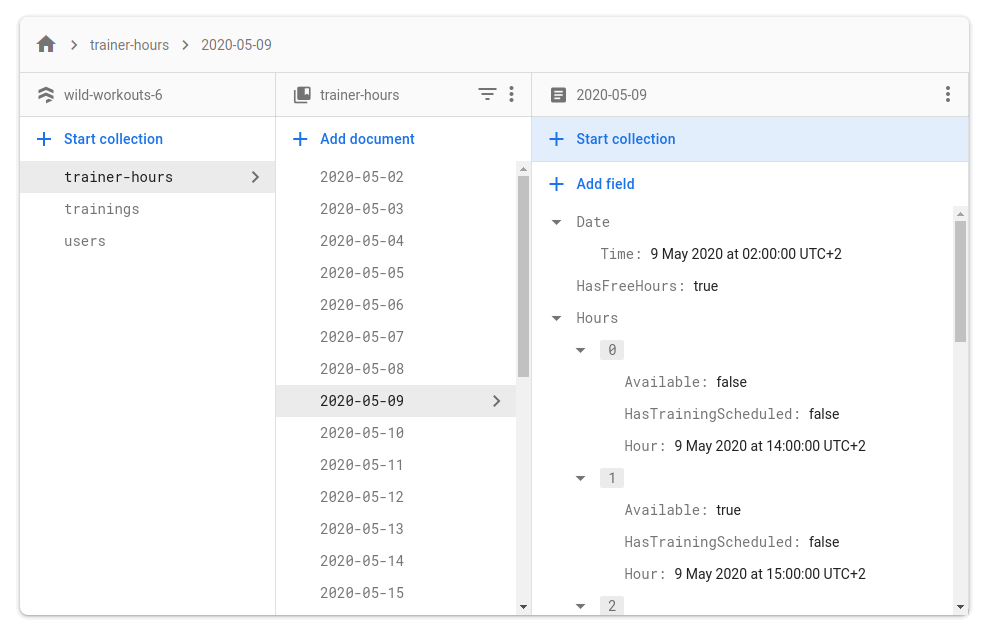
<figcaption aria-hidden="true">Firestore Console</figcaption>
</figure>

##### First step for having well-tested application

The biggest gap that we currently have is a lack of tests on the component and E2E level. Also, a big part of the application is not tested at all. We will fix that in the next chapters. We will also cover some topics that we skipped this time.

But before that, we have one topic that we need to cover earlier – Clean/Hexagonal architecture! This approach will help us organize our application a bit and make future refactoring and features easier to implement.

Just to remind, **the entire source code of Wild Workouts is [available on GitHub](https://github.com/ThreeDotsLabs/wild-workouts-go-ddd-example/)**. **You can run it locally and deploy to Google Cloud with one command.**

### Clean Architecture

*Miłosz Smółka*

The authors of [Accelerate](https://itrevolution.com/book/accelerate/) dedicate a whole chapter to software architecture and how it affects development performance. One thing that often comes up is designing applications to be “loosely coupled”.

> The goal is for your architecture to support the ability of teams to get their work done—from design through to deployment—without requiring high-bandwidth communication between teams.
>
> Accelerate (https://itrevolution.com/book/accelerate/)

If you haven’t read [Accelerate](https://itrevolution.com/book/accelerate/) yet, I highly recommend it. The book presents scientific evidence on methods leading to high performance in development teams. The approach I describe is not only based on our experiences but also mentioned throughout the book.

While coupling seems mostly related to microservices across multiple teams, we find loosely coupled architecture just as useful for work within a team. Keeping architecture standards makes parallel work possible and helps onboard new team members.

You probably heard about the *“low coupling, high cohesion”* concept, but it’s rarely obvious how to achieve it. The good news is, it’s the main benefit of Clean Architecture.

The pattern is not only an excellent way to start a project but also helpful when refactoring a poorly designed application. I focus on the latter in this chapter. I show refactoring of a real application, so it should be clear how to apply similar changes in your projects.

There are also other benefits of this approach we noticed:

- a standard structure, so it’s easy to find your way in the project,
- faster development in the long term,
- mocking dependencies becomes trivial in unit tests,
- easy switching from prototypes to proper solutions (e.g., changing in-memory storage to an SQL database).

#### Clean Architecture

I had a hard time coming up with this chapter’s title because the pattern comes in many flavors. There’s [Clean Architecture](https://blog.cleancoder.com/uncle-bob/2012/08/13/the-clean-architecture.html), [Onion Architecture](https://jeffreypalermo.com/2008/07/the-onion-architecture-part-1/), [Hexagonal Architecture](https://web.archive.org/web/20180822100852/http://alistair.cockburn.us/Hexagonal+architecture), and Ports and Adapters.

We tried to use these patterns in Go in an idiomatic way during the last couple of years. It involved trying out some approaches, failing, changing them, and trying again.

We arrived at a mix of the ideas above, sometimes not strictly following the original patterns, but we found it works well in Go. I will show our approach with a refactoring of [Wild Workouts](https://github.com/ThreeDotsLabs/wild-workouts-go-ddd-example), our example application.

I want to point out that the idea is not new at all. A big part of it is **abstracting away implementation details**, a standard in technology, especially software.

Another name for it is **separation of concerns**. The concept is so old now it exists on several levels. There are structures, namespaces, modules, packages, and even (micro)services. All meant to keep related things within a boundary. Sometimes, it feels like common sense:

- If you have to optimize an SQL query, you don’t want to risk changing the display format.
- If you change an HTTP response format, you don’t want to alter the database schema.

**Our approach to Clean Architecture is two ideas combined:** separating Ports and Adapters and limiting how code structures refer to each other.

##### Before We Start

Before introducing Clean Architecture in Wild Workouts, I refactored the project a bit. The changes come from patterns we shared in previous chapters.

The first one is using **separate models for database entities and HTTP responses**. I’ve introduced changes in the `users` service in **[When to stay away from DRY](#ch006.xhtml_when-to-stay-away-from-dry)** (Chapter 5). I applied the same pattern now in `trainer` and `trainings` as well. See the [full commit on GitHub](https://bit.ly/3kfl84g).

The second change follows **the Repository Pattern** that Robert introduced in **[The Repository Pattern](#ch008.xhtml_the-repository-pattern)** (Chapter 7). [My refactoring](https://bit.ly/3bK1Pw7) moved database-related code in `trainings` to a separate structure.

##### Separating Ports and Adapters

Ports and Adapters can be called different names, like interfaces and infrastructure. At the core, the idea is to explicitly separate these two categories from the rest of your application code.

We take the code in these groups and place it in different packages. We refer to them as “layers”. **The layers we usually use are adapters, ports, application, and domain.**

- **An adapter is how your application talks to the external world.** You have to **adapt** your internal structures to what the external API expects. Think SQL queries, HTTP or gRPC clients, file readers and writers, Pub/Sub message publishers.
- **A port is an input to your application**, and the only way the external world can reach it. It could be an HTTP or gRPC server, a CLI command, or a Pub/Sub message subscriber.
- **The application logic** is a thin layer that “glues together” other layers. It’s also known as “use cases”. If you read this code and can’t tell what database it uses or what URL it calls, it’s a good sign. Sometimes it’s very short, and that’s fine. Think about it as an orchestrator.
- If you also follow Domain-Driven Design[^6], you can introduce **a domain layer that holds just the business logic**.

If the idea of separating layers is still not clear, take a look at your smartphone. If you think about it, it uses similar concepts as well.

You can control your smartphone using the physical buttons, the touchscreen, or voice assistant. Whether you press the “volume up” button, swipe the volume bar up, or say “Siri, volume up”, the effect is the same. There are several entry points (**ports**) to the “change volume” **logic**.

When you play some music, you can hear it coming from the speaker. If you plug in headphones, the audio will automatically change to them. Your music app doesn’t care. It’s not talking with the hardware directly, but using one of the **adapters** the OS provides.

Can you imagine creating a mobile app that has to be aware of the headphones model connected to the smartphone? Including SQL queries directly inside the application logic is similar: it exposes the implementation details.

<figure>
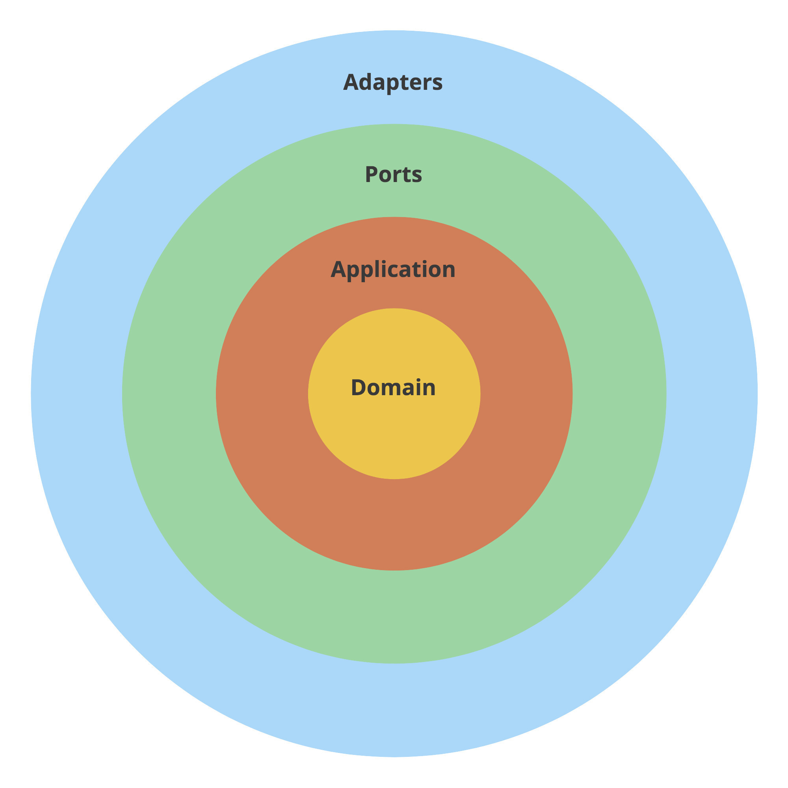
<figcaption aria-hidden="true">Clean Architecture layers</figcaption>
</figure>

Let’s start refactoring by introducing the layers in the `trainings` service. The project looks like this so far:

```go
trainings/
├── firestore.go
├── go.mod
├── go.sum
├── http.go
├── main.go
├── openapi_api.gen.go
└── openapi_types.gen.go
```

This part of refactoring is simple:

1.  Create `ports`, `adapters`, and `app` directories.
2.  Move each file to the proper directory.

```go
trainings/
├── adapters
│   └── firestore.go
├── app
├── go.mod
├── go.sum
├── main.go
└── ports
    ├── http.go
    ├── openapi_api.gen.go
    └── openapi_types.gen.go
```

I introduced similar packages in the `trainer` service. We won’t make any changes to the `users` service this time. There’s no application logic there, and overall, it’s tiny. As with every technique, apply Clean Architecture where it makes sense.

If the project grows in size, you may find it helpful to add another level of subdirectories. For example, `adapters/hour/mysql_repository.go` or `ports/http/hour_handler.go`.

You probably noticed there are no files in the `app` package. We now have to extract the application logic from HTTP handlers.

##### The Application Layer

Let’s see where our application logic lives. Take a look at the `CancelTraining` method in the `trainings` service.

```go
func (h HttpServer) CancelTraining(w http.ResponseWriter, r *http.Request) {
    trainingUUID := r.Context().Value("trainingUUID").(string)

    user, err := auth.UserFromCtx(r.Context())
    if err != nil {
        httperr.Unauthorised("no-user-found", err, w, r)
        return
    }

    err = h.db.CancelTraining(r.Context(), user, trainingUUID)
    if err != nil {
        httperr.InternalError("cannot-update-training", err, w, r)
        return
    }
}
```

*Source: [http.go on GitHub](https://bit.ly/3ul3QXN)*

This method is the entry point to the application. There’s not much logic there, so let’s go deeper into the `db.CancelTraining` method.


Inside the Firestore transaction, there’s a lot of code that doesn’t belong to database handling.

What’s worse, the actual application logic inside this method uses the database model (`TrainingModel`) for decision making:

```go
if training.canBeCancelled() {
    // ...
} else {
    // ...
}
```

*Source: [firestore.go on GitHub](https://bit.ly/3usH5S2)*

Mixing the business rules (like when a training can be canceled) with the database model slows down development, as the code becomes hard to understand and reason about. It’s also difficult to test such logic.

To fix this, we add an intermediate `Training` type in the `app` layer:

```go
type Training struct {
    UUID     string
    UserUUID string
    User     string

    Time  time.Time
    Notes string

    ProposedTime   *time.Time
    MoveProposedBy *string
}

func (t Training) CanBeCancelled() bool {
    return t.Time.Sub(time.Now()) > time.Hour*24
}

func (t Training) MoveRequiresAccept() bool {
    return !t.CanBeCancelled()
}
```

*Source: [training.go on GitHub](https://bit.ly/2P0KIOV)*

It should now be clear on the first read when a training can be canceled. We can’t tell how the training is stored in the database or the JSON format used in the HTTP API. That’s a good sign.

We can now update the database layer methods to return this generic application type instead of the database-specific structure (`TrainingModel`). The mapping is trivial because the structs have the same fields (but from now on, they can evolve independently from each other).

```go
t := TrainingModel{}
if err := doc.DataTo(&t); err != nil {
    return nil, err
}

trainings = append(trainings, app.Training(t))
```

*Source: [trainings_firestore_repository.go on GitHub](https://bit.ly/3aFfBki)*

##### The Application Service

We then create a `TrainingsService` struct in the `app` package that will serve as the entry point to trainings application logic.

```go
type TrainingService struct {
}

func (c TrainingService) CancelTraining(ctx context.Context, user auth.User, trainingUUID string) error {

}
```

So how do we call the database now? Let’s try to replicate what was used so far in the HTTP handler.

```go
type TrainingService struct {
    db adapters.DB
}

func (c TrainingService) CancelTraining(ctx context.Context, user auth.User, trainingUUID string) error {
    return c.db.CancelTraining(ctx, user, trainingUUID)
}
```

This code won’t compile, though.

```go
import cycle not allowed
package github.com/ThreeDotsLabs/wild-workouts-go-ddd-example/internal/trainings
        imports github.com/ThreeDotsLabs/wild-workouts-go-ddd-example/internal/trainings/adapters
        imports github.com/ThreeDotsLabs/wild-workouts-go-ddd-example/internal/trainings/app
        imports github.com/ThreeDotsLabs/wild-workouts-go-ddd-example/internal/trainings/adapters
```

We need to **decide how the layers should refer to each other.**

##### The Dependency Inversion Principle

A clear separation between ports, adapters, and application logic is useful by itself. Clean Architecture improves it further with Dependency Inversion.

The rule states that **outer layers (implementation details) can refer to inner layers (abstractions), but not the other way around.** The inner layers should instead depend on interfaces.

- The **Domain** knows nothing about other layers whatsoever. It contains pure business logic.
- The **Application** can import domain but knows nothing about outer layers. **It has no idea whether it’s being called by an HTTP request, a Pub/Sub handler, or a CLI command**.
- **Ports** can import inner layers. Ports are the entry points to the application, so they often execute application services or commands. However, they can’t directly access **Adapters**.
- **Adapters** can import inner layers. Usually, they will operate on types found in **Application** and **Domain**, for example, retrieving them from the database.


Again, it’s not a new idea. **The Dependency Inversion Principle is the “D” in [SOLID](https://en.wikipedia.org/wiki/SOLID)**. Do you think it applies only to OOP? It just happens that **[Go interfaces make a perfect match with it](https://dave.cheney.net/2016/08/20/solid-go-design)**.

The principle solves the issue of how packages should refer to each other. The best way to do it is rarely obvious, especially in Go, where import cycles are forbidden. Perhaps that’s why some developers claim it’s best to avoid “nesting” and keep all code in one package. **But packages exist for a reason, and that’s separation of concerns.**

Going back to our example, how should we refer to the database layer?

Because the Go interfaces don’t need to be explicitly implemented, we can **define them next to the code that needs them.**

So the application service defines: *“I need a way to cancel a training with given UUID. I don’t care how you do it, but I trust you to do it right if you implement this interface”*.

```go
type trainingRepository interface {
    CancelTraining(ctx context.Context, user auth.User, trainingUUID string) error
}

type TrainingService struct {
    trainingRepository trainingRepository
}

func (c TrainingService) CancelTraining(ctx context.Context, user auth.User, trainingUUID string) error {
    return c.trainingRepository.CancelTraining(ctx, user, trainingUUID)
}
```

*Source: [training_service.go on GitHub](https://bit.ly/2NN67Kt)*

The database method calls gRPC clients of `trainer` and `users` services. It’s not the proper place, so we introduce two new interfaces that the service will use.

```go
type userService interface {
    UpdateTrainingBalance(ctx context.Context, userID string, amountChange int) error
}

type trainerService interface {
    ScheduleTraining(ctx context.Context, trainingTime time.Time) error
    CancelTraining(ctx context.Context, trainingTime time.Time) error
}
```

*Source: [training_service.go on GitHub](https://bit.ly/3k7rPVO)*

Note that “user” and “trainer” in this context are not microservices, but application (business) concepts. It just happens that in this project, they live in the scope of microservices with the same names.

We move implementations of these interfaces to `adapters` as [`UsersGrpc`](https://bit.ly/2P3KKFF) and [`TrainerGrpc`](https://bit.ly/2P3KKFF). As a bonus, the timestamp conversion now happens there as well, invisible to the application service.

##### Extracting the Application Logic

The code compiles, but our application service doesn’t do much yet. Now is the time to extract the logic and put it in the proper place.

Finally, we can use the update function pattern from **[The Repository Pattern](#ch008.xhtml_the-repository-pattern)** (Chapter 7) to extract the application logic out of the repository.

```go
func (c TrainingService) CancelTraining(ctx context.Context, user auth.User, trainingUUID string) error {
    return c.repo.CancelTraining(ctx, trainingUUID, func(training Training) error {
        if user.Role != "trainer" && training.UserUUID != user.UUID {
            return errors.Errorf("user '%s' is trying to cancel training of user '%s'", user.UUID, training.UserUUID)
        }

        var trainingBalanceDelta int
        if training.CanBeCancelled() {
            // just give training back
            trainingBalanceDelta = 1
        } else {
            if user.Role == "trainer" {
                // 1 for cancelled training +1 fine for cancelling by trainer less than 24h before training
                trainingBalanceDelta = 2
            } else {
                // fine for cancelling less than 24h before training
                trainingBalanceDelta = 0
            }
        }

        if trainingBalanceDelta != 0 {
            err := c.userService.UpdateTrainingBalance(ctx, training.UserUUID, trainingBalanceDelta)
            if err != nil {
                return errors.Wrap(err, "unable to change trainings balance")
            }
        }

        err := c.trainerService.CancelTraining(ctx, training.Time)
        if err != nil {
            return errors.Wrap(err, "unable to cancel training")
        }

        return nil
    })
}
```

*Source: [training_service.go on GitHub](https://bit.ly/3sfA8Su)*

The amount of logic suggests we might want to introduce a domain layer sometime in the future. For now, let’s keep it as it is.

I described the process for just a single `CancelTraining` method. Refer to the [full diff](https://bit.ly/2McYKM2) to see how I refactored all other methods.

##### Dependency Injection

How to tell the service which adapter to use? First, we define a simple constructor for the service.

```go
func NewTrainingsService(
    repo trainingRepository,
    trainerService trainerService,
    userService userService,
) TrainingService {
    if repo == nil {
        panic("missing trainingRepository")
    }
    if trainerService == nil {
        panic("missing trainerService")
    }
    if userService == nil {
        panic("missing userService")
    }

    return TrainingService{
        repo:           repo,
        trainerService: trainerService,
        userService:    userService,
    }
}
```

*Source: [training_service.go on GitHub](https://bit.ly/2ZAMS9S)*

Then, in `main.go` we inject the adapter.

```go
trainingsRepository := adapters.NewTrainingsFirestoreRepository(client)
trainerGrpc := adapters.NewTrainerGrpc(trainerClient)
usersGrpc := adapters.NewUsersGrpc(usersClient)

trainingsService := app.NewTrainingsService(trainingsRepository, trainerGrpc, usersGrpc)
```

*Source: [main.go on GitHub](https://bit.ly/3dxwJdt)*

Using the `main` function is the most trivial way to inject dependencies. We’ll look into the [wire library](https://github.com/google/wire) as the project becomes more complex in future chapters.

##### Adding tests

Initially, the project had all layers mixed, and it wasn’t possible to mock dependencies. The only way to test it was to use integration tests, with proper database and all services running.

While it’s OK to cover some scenarios with such tests, they tend to be slower and not as fun to work with as unit tests. After introducing changes, I was able to [cover `CancelTraining` with a unit tests suite](https://bit.ly/3soDvqh).

I used the standard Go approach of table-driven tests to make all cases easy to read and understand.

```go
{
    Name:     "return_training_balance_when_trainer_cancels",
    UserRole: "trainer",
    Training: app.Training{
        UserUUID: "trainer-id",
        Time:     time.Now().Add(48 * time.Hour),
    },
    ShouldUpdateBalance:   true,
    ExpectedBalanceChange: 1,
},
{
    Name:     "extra_training_balance_when_trainer_cancels_before_24h",
    UserRole: "trainer",
    Training: app.Training{
        UserUUID: "trainer-id",
        Time:     time.Now().Add(12 * time.Hour),
    },
    ShouldUpdateBalance:   true,
    ExpectedBalanceChange: 2,
},
```

*Source: [training_service_test.go on GitHub](https://bit.ly/37uCGUv)*

I didn’t introduce any libraries for mocking. You can use them if you like, but your interfaces should usually be small enough to simply write dedicated mocks.

```go
type trainerServiceMock struct {
    trainingsCancelled []time.Time
}

func (t *trainerServiceMock) CancelTraining(ctx context.Context, trainingTime time.Time) error {
    t.trainingsCancelled = append(t.trainingsCancelled, trainingTime)
    return nil
}
```

*Source: [training_service_test.go on GitHub](https://bit.ly/3k7rWRe)*

Did you notice the unusually high number of not implemented methods in `repositoryMock`? That’s because we use a single training service for all methods, so we need to implement the full interface, even when testing just one of them.

We’ll improve it in **[Basic CQRS](#ch011.xhtml_basic-cqrs)** (Chapter 10).

##### What about the boilerplate?

You might be wondering if we didn’t introduce too much boilerplate. The project indeed grew in size by code lines, but that by itself doesn’t do any harm. **It’s an investment in loose coupling[^7] that will pay off as the project grows.**

Keeping everything in one package may seem easier at first, but having boundaries helps when you consider working in a team. If all your projects have a similar structure, onboarding new team members is straightforward. Consider how much harder it would be with all layers mixed ([Mattermost’s app package](https://github.com/mattermost/mattermost-server/tree/master/app) is an example of this approach).

##### Handling application errors

One extra thing I’ve added is [ports-agnostic errors with slugs](https://bit.ly/3bykevF). They allow the application layer to return generic errors that can be handled by both HTTP and gRPC handlers.

```go
if from.After(to) {
    return nil, errors.NewIncorrectInputError("date-from-after-date-to", "Date from after date to")
}
```

*Source: [hour_service.go on GitHub](https://bit.ly/3pBCSaL)*

The error above translates to `401 Bad Request` HTTP response in ports. It includes a slug that can be translated on the frontend side and shown to the user. It’s yet another pattern to avoid leaking implementation details to the application logic.

##### What else?

I encourage you to read through the [full commit](https://bit.ly/2McYKM2) to see how I refactored other parts of Wild Workouts.

You might be wondering how to enforce the correct usage of layers? Is it yet another thing to remember about in code reviews?

Luckily, it’s possible to check the rules with static analysis. You can check your project with Robert’s [go-cleanarch](https://github.com/roblaszczak/go-cleanarch) linter locally or include it in your CI pipeline.

With layers separated, we’re ready to introduce more advanced patterns.

In the next chapter, we show how to improve the project by applying CQRS.

If you’d like to read more on Clean Architecture, see [Why using Microservices or Monolith can be just a detail?](https://threedots.tech/post/microservices-or-monolith-its-detail/).

### Basic CQRS

*Robert Laszczak*

It’s highly likely you know at least one service that:

- has one big, unmaintainable model that is hard to understand and change,
- or where work in parallel on new features is limited,
- or can’t be scaled optimally.

But often, bad things come in threes. It’s not uncommon to see services with all these problems.

What is an idea that comes to mind first for solving these issues? Let’s split it into more microservices!

Unfortunately, without proper research and planning, the situation after blindly refactoring may be actually worse than before:

- **business logic and flow may become even harder to understand** – a complex logic is often easier to understand if it’s in one place,
- **distributed transactions** – things are sometimes together for a reason; a big transaction in one database is much faster and less complex than distributed transaction across multiple services,
- **adding new changes may require extra coordination**, if one of the services is owned by another team.

<figure>

<figcaption aria-hidden="true">Microservices are useful, but they will not solve all your issues…</figcaption>
</figure>

To be totally clear – I’m not an enemy of microservices. **I’m just against blindly applying microservices in a way that introduces unneeded complexity and mess instead of making our lives easier.**

Another approach is using CQRS (Command Query Responsibility Segregation) with previously described Clean Architecture[^8]. **It can solve the mentioned problems in a much simpler way.**

##### Isn’t CQRS a complex technique?

Isn’t CQRS one of these C#/Java/über enterprise patterns that are hard to implement, and make a big mess in the code? A lot of books, presentations, and articles describe CQRS as a very complicated pattern. But it is not the case.

**In practice, CQRS is a very simple pattern that doesn’t require a lot of investment.** **It can be easily extended with more complex techniques like event-driven architecture, event-sourcing, or polyglot persistence.** But they’re not always needed. Even without applying any extra patterns, CQRS can offer better decoupling, and code structure that is easier to understand.

When to not use CQRS in Go? How to get all benefits from CQRS? You can learn all that in this chapter.

Like always, I will do it by refactoring [Wild Workouts](https://github.com/ThreeDotsLabs/wild-workouts-go-ddd-example) application,

##### How to implement basic CQRS in Go

CQRS (Command Query Responsibility Segregation) was initially [described by Greg Young](https://cqrs.files.wordpress.com/2010/11/cqrs_documents.pdf). **It has one simple assumption: instead of having one big model for reads and writes, you should have two separate models. One for writes and one for reads.** It also introduces concepts of *command* and *query*, and leads to splitting application services into two separate types: command and query handlers.

<figure>
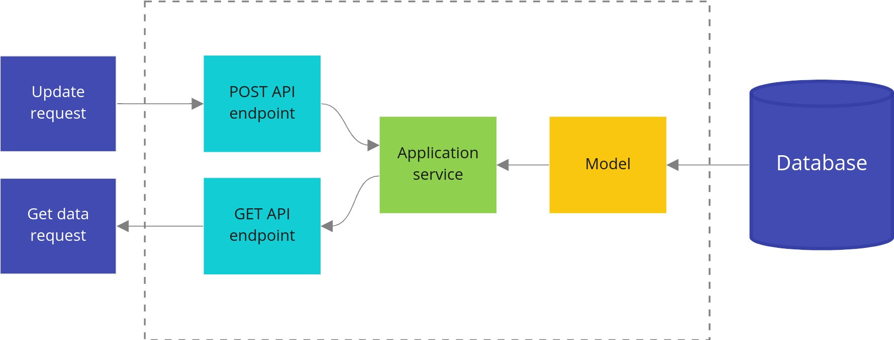
<figcaption aria-hidden="true">Standard, non-CQRS architecture</figcaption>
</figure>

<figure>
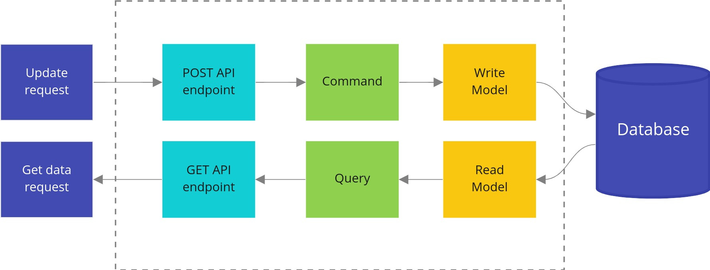
<figcaption aria-hidden="true">CQRS architecture</figcaption>
</figure>

###### Command vs Query

In simplest words: **a Query should not modify anything, just return the data. A command is the opposite one: it should make changes in the system, but not return any data.** Thanks to that, our queries can be cached more efficiently, and we lower the complexity of commands.

It may sound like a serious constraint, but in practice, it is not. Most of the operations that we execute are reads or writes. Very rarely, both.

Of course, for a query, we don’t consider side effects like logs, or metrics as modifying anything. For commands, it is also a perfectly normal thing to return an error.

As with most rules, it is ok to break them… as long as you perfectly **understand why they were introduced and what tradeoffs** you make. In practice, you rarely need to break these rules. I will share examples at the end of the chapter.

How does the most basic implementation look in practice? In the previous chapter, Miłosz introduced an application service that executes application use cases. Let’s start by cutting this service into separate command and query handlers.

###### ApproveTrainingReschedule command

Previously, the training reschedule was approved from the application service `TrainingService`.

```go
- func (c TrainingService) ApproveTrainingReschedule(ctx context.Context, user auth.User, trainingUUID string) error {
-  return c.repo.ApproveTrainingReschedule(ctx, trainingUUID, func(training Training) (Training, error) {
-     if training.ProposedTime == nil {
-        return Training{}, errors.New("training has no proposed time")
-     }
-     if training.MoveProposedBy == nil {
-        return Training{}, errors.New("training has no MoveProposedBy")
-     }
-     if *training.MoveProposedBy == "trainer" && training.UserUUID != user.UUID {
-        return Training{}, errors.Errorf("user '%s' cannot approve reschedule of user '%s'", user.UUID, training.UserUUID)
-     }
-     if *training.MoveProposedBy == user.Role {
-        return Training{}, errors.New("reschedule cannot be accepted by requesting person")
-     }
-
-     training.Time = *training.ProposedTime
-     training.ProposedTime = nil
-
-     return training, nil
-  })
- }
```

*Source: [8d9274811559399461aa9f6bf3829316b8ddfb63 on GitHub](https://bit.ly/3dwArEj)*

There were some magic validations there. They are now done in the domain layer. I also found out that we forgot to call the external `trainer` service to move the training. Oops. Let’s refactor it to the CQRS approach.

Because CQRS works best with applications following Domain-Driven Design, during refactoring towards CQRS I refactored existing models to DDD Lite as well. DDD Lite is described in more detail in **[Domain-Driven Design Lite](#ch007.xhtml_domain-driven-design-lite)** (Chapter 6).

We start the implementation of a *command* with the command structure definition. That structure provides all data needed to execute this command. If a command has only one field, you can skip the structure and just pass it as a parameter.

It’s a good idea to use types defined by domain in the command, like `training.User` in that case. We don’t need to do any casting later, and we have type safety assured. **It can save us a lot of issues with string parameters passed in wrong order.**

```go
package command

// ...

type ApproveTrainingReschedule struct {
   TrainingUUID string
   User         training.User
}
```

*Source: [approve_training_reschedule.go on GitHub](https://bit.ly/3dxwyij)*

The second part is a *command handler* that knows how to execute the command.

```go
package command

// ...

type ApproveTrainingRescheduleHandler struct {
   repo           training.Repository
   userService    UserService
   trainerService TrainerService
}

// ...

func (h ApproveTrainingRescheduleHandler) Handle(ctx context.Context, cmd ApproveTrainingReschedule) (err error) {
    defer func() {
        logs.LogCommandExecution("ApproveTrainingReschedule", cmd, err)
    }()

    return h.repo.UpdateTraining(
        ctx,
        cmd.TrainingUUID,
        cmd.User,
        func(ctx context.Context, tr *training.Training) (*training.Training, error) {
            originalTrainingTime := tr.Time()

            if err := tr.ApproveReschedule(cmd.User.Type()); err != nil {
                return nil, err
            }

            err := h.trainerService.MoveTraining(ctx, tr.Time(), originalTrainingTime)
            if err != nil {
                return nil, err
            }

            return tr, nil
        },
    )
}
```

*Source: [approve_training_reschedule.go on GitHub](https://bit.ly/3scHx4W)*

The flow is much easier to understand now. You can clearly see that we approve a reschedule of a persisted `*training.Training`, and if it succeeds, we call the external `trainer` service. Thanks to techniques described in **[Domain-Driven Design Lite](#ch007.xhtml_domain-driven-design-lite)** (Chapter 6), the command handler doesn’t need to know when it can perform this operation. It’s all handled by our domain layer.

This clear flow is even more visible in more complex commands. Fortunately, the current implementation is really straightforward. That’s good. **Our goal is not to create complicated, but simple software.**

If CQRS is the standard way of building applications in your team, it also speeds up learning the service by your teammates who don’t know it. You just need a list of available commands and queries, and to quickly take a look at how their execution works. Jumping like crazy through random places in code is not needed.

This is how it looks like in one of my team’s most complex services:

<figure>
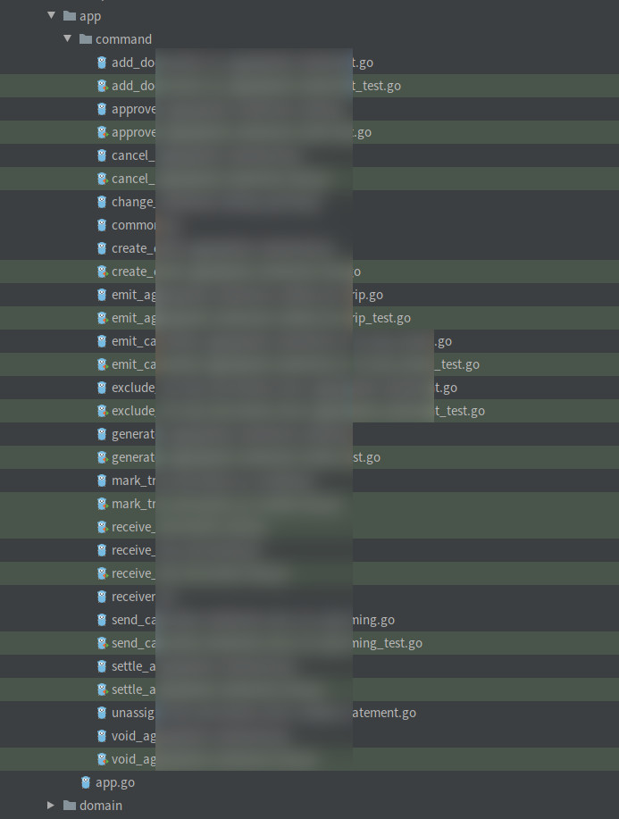
<figcaption aria-hidden="true">Example application layer of one service at Karhoo.</figcaption>
</figure>

You may ask - shouldn’t it be cut to multiple services? **In practice, it would be a terrible idea.** A lot of operations here need to be transitionally consistent. Splitting it to separate services would involve a couple of distributed transactions (*Sagas*). It would make this flow much more complex, harder to maintain, and debug. It’s not the best deal.

It’s also worth mentioning that all of these operations are not very complex. **Complexity is scaling horizontally excellently here.** We will cover the extremely important topic of splitting microservices more in-depth soon. Did I already mention that we messed it up in Wild Workouts on purpose?

But let’s go back to our command. It’s time to use it in our HTTP port. It’s available in `HttpServer` via injected `Application` structure, which contains all of our commands and queries handlers.

```go
package app

import (
   "github.com/ThreeDotsLabs/wild-workouts-go-ddd-example/internal/trainings/app/command"
   "github.com/ThreeDotsLabs/wild-workouts-go-ddd-example/internal/trainings/app/query"
)

type Application struct {
   Commands Commands
   Queries  Queries
}

type Commands struct {
   ApproveTrainingReschedule command.ApproveTrainingRescheduleHandler
   CancelTraining            command.CancelTrainingHandler
   // ...
```

*Source: [app.go on GitHub](https://bit.ly/3dykLAq)*

```go
type HttpServer struct {
   app app.Application
}

// ...

func (h HttpServer) ApproveRescheduleTraining(w http.ResponseWriter, r *http.Request) {
   trainingUUID := chi.URLParam(r, "trainingUUID")

   user, err := newDomainUserFromAuthUser(r.Context())
   if err != nil {
      httperr.RespondWithSlugError(err, w, r)
      return
   }

   err = h.app.Commands.ApproveTrainingReschedule.Handle(r.Context(), command.ApproveTrainingReschedule{
      User:         user,
      TrainingUUID: trainingUUID,
   })
   if err != nil {
      httperr.RespondWithSlugError(err, w, r)
      return
   }
}
```

*Source: [http.go on GitHub](https://bit.ly/3sgPS7p)*

The command handler can be called in that way from any port: HTTP, gRPC, or CLI. It’s also useful for executing migrations and [loading fixtures](https://bit.ly/2ZFmXOd) (we already do it in Wild Workouts).

###### RequestTrainingReschedule command

Some command handlers can be very simple.

```go
func (h RequestTrainingRescheduleHandler) Handle(ctx context.Context, cmd RequestTrainingReschedule) (err error) {
    defer func() {
        logs.LogCommandExecution("RequestTrainingReschedule", cmd, err)
    }()

    return h.repo.UpdateTraining(
        ctx,
        cmd.TrainingUUID,
        cmd.User,
        func(ctx context.Context, tr *training.Training) (*training.Training, error) {
            if err := tr.UpdateNotes(cmd.NewNotes); err != nil {
                return nil, err
            }

            tr.ProposeReschedule(cmd.NewTime, cmd.User.Type())

            return tr, nil
        },
    )
}
```

*Source: [request_training_reschedule.go on GitHub](https://bit.ly/3s6BgHM)*

It may be tempting to skip this layer for such simple cases to save some boilerplate. It’s true, but you need to remember that **writing code is always much cheaper than the maintenance. Adding this simple type is 3 minutes of work. People who will read and extend this code later will appreciate that effort.**

###### AvailableHoursHandler query

Queries in the application layer are usually pretty boring. In the most common case, we need to write a *read model interface* (`AvailableHoursReadModel`) that defines how we can query the data.

Commands and queries are also a great place for all [cross-cutting concerns](https://en.wikipedia.org/wiki/Cross-cutting_concern), like logging and instrumentation. Thanks to putting that here, we are sure that performance is measured in the same way whether it’s called from HTTP or gRPC port.

```go
package query

// ...

type AvailableHoursHandler struct {
    readModel AvailableHoursReadModel
}

type AvailableHoursReadModel interface {
    AvailableHours(ctx context.Context, from time.Time, to time.Time) ([]Date, error)
}

// ...

type AvailableHours struct {
    From time.Time
    To   time.Time
}

func (h AvailableHoursHandler) Handle(ctx context.Context, query AvailableHours) (d []Date, err error) {
    start := time.Now()
    defer func() {
        logrus.
            WithError(err).
            WithField("duration", time.Since(start)).
            Debug("AvailableHoursHandler executed")
    }()

    if query.From.After(query.To) {
        return nil, errors.NewIncorrectInputError("date-from-after-date-to", "Date from after date to")
    }

    return h.readModel.AvailableHours(ctx, query.From, query.To)
}
```

*Source: [available_hours.go on GitHub](https://bit.ly/3udkEAd)*

We also need to define data types returned by the query. In our case, it’s `query.Date`.

To understand why we don’t use structures generated from OpenAPI, see **[When to stay away from DRY](#ch006.xhtml_when-to-stay-away-from-dry)** (Chapter 5) and **[Clean Architecture](#ch010.xhtml_clean-architecture-1)** (Chapter 9).

```go
package query

import (
    "time"
)

type Date struct {
    Date         time.Time
    HasFreeHours bool
    Hours        []Hour
}

type Hour struct {
    Available            bool
    HasTrainingScheduled bool
    Hour                 time.Time
}
```

*Source: [types.go on GitHub](https://bit.ly/3dAqvtg)*

Our query model is more complex than the domain `hour.Hour` type. It’s a common scenario. Often, it’s driven by the UI of the website, and it’s more efficient to generate the most optimal responses on the backend side.

As the application grows, differences between domain and query models may become bigger. **Thanks to the separation and decoupling, we can independently make changes in both of them.** This is critical for keeping fast development in the long term.

```go
package hour

type Hour struct {
    hour time.Time

    availability Availability
}
```

*Source: [hour.go on GitHub](https://bit.ly/2M9PXut)*

But from where `AvailableHoursReadModel` gets the data? For the application layer, it is fully transparent and not relevant. This allows us to add performance optimizations in the future, touching just one part of the application.

If you are not familiar with the concept of *ports and adapters*, I highly recommend reading **[Clean Architecture](#ch010.xhtml_clean-architecture-1)** (Chapter 9).

In practice, the current implementation gets the data **from our write models database**. You can find the [`AllTrainings`](https://bit.ly/3snBZoh) read model [implementation](https://bit.ly/3snBZoh) and [tests](https://bit.ly/3snBZoh) for `DatesFirestoreRepository` in the adapters layer.

<figure>

<figcaption aria-hidden="true">Data for our queries is currently queried from the same database where write models are stored.</figcaption>
</figure>

If you read about CQRS earlier, it is often recommended to use a separate database built from events for queries. It may be a good idea, but in very specific cases. I will describe it in the *Future optimizations* section. In our case, it’s sufficient to just get data from the write models database.

###### HourAvailabilityHandler query

We don’t need to add a *read model* interface for every query. It’s also fine to use the domain repository and pick the data that we need.

```go
import (
   "context"
   "time"

   "github.com/ThreeDotsLabs/wild-workouts-go-ddd-example/internal/trainer/domain/hour"
)

type HourAvailabilityHandler struct {
   hourRepo hour.Repository
}

func (h HourAvailabilityHandler) Handle(ctx context.Context, time time.Time) (bool, error) {
   hour, err := h.hourRepo.GetHour(ctx, time)
   if err != nil {
      return false, err
   }

   return hour.IsAvailable(), nil
}
```

*Source: [hour_availability.go on GitHub](https://bit.ly/3azs1Km)*

##### Naming

Naming is one of the most challenging and most essential parts of software development. In **[Domain-Driven Design Lite](#ch007.xhtml_domain-driven-design-lite)** (Chapter 6) I described a rule that says you should stick to the language that is as close as it can be to how non-technical people (often referred to as “business”) talk. It also applies to Commands and Queries names.

You should avoid names like “Create training” or “Delete training”. **This is not how business and users understand your domain. You should instead use “Schedule training” and “Cancel training”.**

<figure>
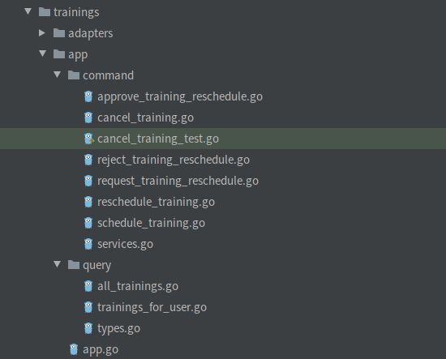
<figcaption aria-hidden="true">All commands and queries of the trainings service</figcaption>
</figure>

We will cover this topic deeper in a chapter about Ubiquitous Language. Until then, just go to your business people and listen how they call operations. Think twice if any of your command names really need to start with “Create/Delete/Update”.

##### Future optimizations

Basic CQRS gives some advantages like **better code organisation, decoupling, and simplifying models**. There is also one, even more important advantage. It is **the ability to extend CQRS with more powerful and complex** patterns.

###### Async commands

Some commands are slow by nature. They may be doing some external calls or some heavy computation. In that case, we can introduce *Asynchronous Command Bus*, which executes the command in the background.

Using asynchronous commands has some additional infrastructure requirements, like having a queue or a pub/sub. Fortunately, the [Watermill](https://github.com/ThreeDotsLabs/watermill) library can help you handle this in Go. You can find more details in [the Watermill CQRS documentation](https://watermill.io/docs/cqrs/?utm_source=introducing-cqrs-art). (BTW We are the authors of Watermill as well Feel free to contact us if something’s not clear there!)

###### A separate database for queries

Our current implementation uses the same database for reads (queries) and writes (commands). If we would need to provide more complex queries or have really fast reads, we could use the *polyglot persistence* technique. The idea is to duplicate queried data in a more optimal format in another database. For example, we could use Elastic to index some data that can be searched and filtered more easily.

Data synchronization, in this case, can be done via *events*. One of the most important implications of this approach is eventual consistency. You should ask yourself if it’s an acceptable tradeoff in your system. If you are not sure, you can just start without polyglot persistence and migrate later. It’s good to defer key decisions like this one.

An example implementation is described in [the Watermill CQRS documentation](https://watermill.io/docs/cqrs/?utm_source=cqrs-art#building-a-read-model-with-the-event-handler) as well. Maybe with time, we will introduce it also in Wild Workouts, who knows?

<figure>
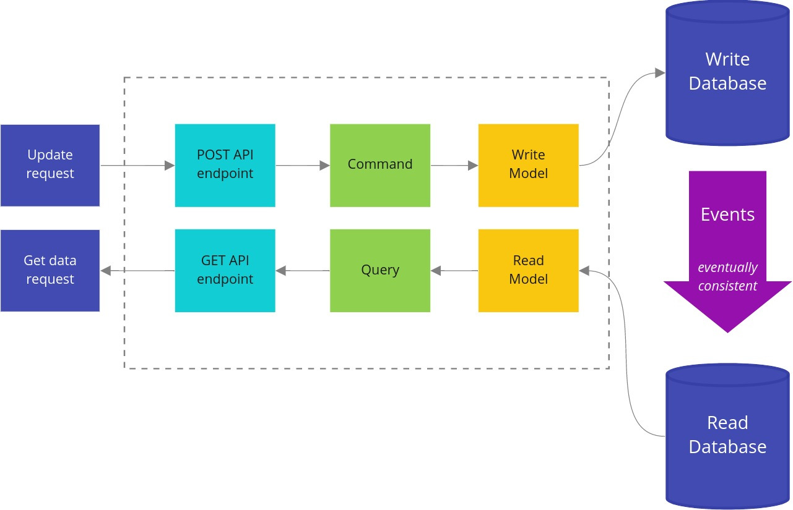
<figcaption aria-hidden="true">CQRS with polyglot persistence</figcaption>
</figure>

###### Event-Sourcing

If you work in a domain with strict audit requirements, you should definitely check out the *event sourcing* technique. For example, I’m currently working in the financial domain, and *event sourcing* is our default persistence choice. It provides out-of-the-box audit and helps with reverting some bug implications.

CQRS is often described together with *event sourcing*. The reason is that by design in event-sourced systems, we don’t store the model in a format ready for reads (queries), but just a list of events used by writes (commands). In other words, it’s harder to provide any API responses.

Thanks to the separation of *command* and *query* models, it’s not really a big problem. Our read models for queries live independently by design.

There are also a lot more advantages of event sourcing, that are visible in a financial systems. But let’s leave it for another chapter. Until then, you can check the Ebook from Greg Young – [Versioning in an Event Sourced System](https://leanpub.com/esversioning). The same Greg Young who described CQRS.

##### When to not use CQRS?

CQRS is not a silver bullet that fits everywhere perfectly. A good example is authorization. You provide a login and a password, and in return, you get confirmation if you succeeded and maybe some token.

If your application is a simple CRUD that receives and returns the same data, it’s also not the best case for CQRS. That’s the reason why `users` microservice in Wild Workouts doesn’t use Clean Architecture and CQRS. In simple, data-oriented services, these patterns usually don’t make sense. On the other hand, you should keep an eye on services like that. If you notice the logic grows and development is painful, maybe it’s time for some refactoring?

###### Returning created entity via API with CQRS

I know that some people have a problem with using CQRS for the REST API that returns the created entity as the response of a POST request. Isn’t it against CQRS? Not really! You can solve it in two ways:

1.  Call the command in the HTTP port and after it succeeds, call the query to get the data to return,
2.  Instead of returning the created entity, return `204` HTTP code with header `content-location` set to the created resource URL.

The second approach is IMO better because it doesn’t require to always query for the created entity (even if the client doesn’t need this data). With the second approach, the client will only follow the link if it’s needed. It can also be cached with that call.

The only question is how to get created entity’s ID? A common practice is to provide the UUID of the entity to be created in the command.

This approach’s advantage is that it will still work as expected if the command handler is asynchronous. In case you don’t want to work with UUIDs, as a last resort you can return the ID from the handler – it won’t be the end of the world.

```go
cmd := command.ScheduleTraining{
    TrainingUUID: uuid.New().String(),
    UserUUID:     user.UUID,
    UserName:     user.DisplayName,
    TrainingTime: postTraining.Time,
    Notes:        postTraining.Notes,
}
err = h.app.Commands.ScheduleTraining.Handle(r.Context(), cmd)
if err != nil {
    httperr.RespondWithSlugError(err, w, r)
    return
}

w.Header().Set("content-location", "/trainings/" + cmd.TrainingUUID)
w.WriteHeader(http.StatusNoContent)
```

*Source: [http.go on GitHub](https://bit.ly/37PNVr9)*

##### You can now put CQRS in your resume!

We did it – we have a basic CQRS implementation in Wild Workouts. You should also have an idea of how you can extend the application in the future.

While preparing the code for this chapter, I also refactored the `trainer` service towards DDD. I will cover this in the next chapter. Although the entire diff of that refactoring is already available on our [GitHub repository](https://bit.ly/3udkQiV).

Having every command handler as a separate type also helps with testing, as it’s easier to build dependencies for them. This part is covered by Miłosz in **[Tests Architecture](#ch013.xhtml_tests-architecture)** (Chapter 12).

### Combining DDD, CQRS, and Clean Architecture

*Robert Laszczak*

In the previous chapters, we introduced techniques like DDD Lite, CQRS, and Clean Architecture. Even if using them alone is beneficial, they work the best together. Like Power Rangers. Unfortunately, it is not easy to use them together in a real project. **In this chapter, we will show how to connect DDD Lite, CQRS, and Clean Architecture in the most pragmatic and efficient way.**

##### Why should I care?

Working on a programming project is similar to planning and building a residential district. If you know that the district will be expanding in the near future, you need to keep space for future improvements. Even if at the beginning it may look like a waste of space. You should keep space for future facilities like residential blocks, hospitals, and temples. **Without that, you will be forced to destroy buildings and streets to make space for new buildings.** It’s much better to think about that earlier.

<figure>

<figcaption aria-hidden="true">Empty district</figcaption>
</figure>

The situation is the same with the code. If you know that the project will be developed for longer than 1 month, you should keep the long term in mind from the beginning. **You need to create your code in a way that will not block your future work. Even if at the beginning it may look like over-engineering and a lot of extra boilerplate, you need to keep in mind the long term.**

It doesn’t mean that you need to plan every feature that you will implement in the future – it’s actually the opposite one. This approach helps to adapt to new requirements or changing understanding of our domain. Big up front design is not needed here. It’s critical in current times, when the world is changing really fast and who can’t adapt to these changes can get simply out of business.

<figure>

<figcaption aria-hidden="true">Full district</figcaption>
</figure>

**This is exactly what these patterns give you when they are combined – the ability to keep constant development speed. Without destroying and touching existing code too much.**

Does it require more thinking and planning? Is it a more challenging way? Do you need to have extra knowledge to do that? Sure! **But the long term result is worth that!** Fortunately, you are in the right place to learn that.

But let’s leave the theory behind us. Let’s go to the code. In this chapter, we will skip reasonings for our design choices. We described these already in the previous chapters. If you did not read them yet, I recommend doing it – you will understand this chapter better.

Like in previous chapters, we will base our code on refactoring a real open-source project. This should make the examples more realistic and applicable to your projects.

Are you ready?

##### Let’s refactor

Let’s start our refactoring with the Domain-First[^9] approach. We will start with introduction of a domain layer[^10]. Thanks to that, we will be sure that implementation details do not affect our domain code. **We can also put all our efforts into understanding the business problem. Not on writing boring database queries and API endpoints.**

Domain-First approach works good for both rescue (refactoring ) and greenfield projects.

To start building my domain layer, I needed to identify what the application is actually doing. This chapter will focus on refactoring of [`trainings`](https://bit.ly/3bt5spP) Wild Workouts microservice. I started with identifying use cases handled by the application. After previous refactoring to Clean Architecture[^11]. When I work with a messy application, I look at RPC and HTTP endpoints to find supported use cases.

One of functionalities that I identified is the **approval of training reschedule**. In Wild Workouts, a training reschedule approval is required if it was requested less than 24h before its date. If a reschedule is requested by the attendee, the approval needs to be done by the trainer. When it’s requested by the trainer, it needs to be accepted by the attendee.

```go
- func (c TrainingService) ApproveTrainingReschedule(ctx context.Context, user auth.User, trainingUUID string) error {
-  return c.repo.ApproveTrainingReschedule(ctx, trainingUUID, func(training Training) (Training, error) {
-     if training.ProposedTime == nil {
-        return Training{}, errors.New("training has no proposed time")
-     }
-     if training.MoveProposedBy == nil {
-        return Training{}, errors.New("training has no MoveProposedBy")
-     }
-     if *training.MoveProposedBy == "trainer" && training.UserUUID != user.UUID {
-        return Training{}, errors.Errorf("user '%s' cannot approve reschedule of user '%s'", user.UUID, training.UserUUID)
-     }
-     if *training.MoveProposedBy == user.Role {
-        return Training{}, errors.New("reschedule cannot be accepted by requesting person")
-     }
-
-     training.Time = *training.ProposedTime
-     training.ProposedTime = nil
-
-     return training, nil
-  })
- }
```

*Source: [8d9274811559399461aa9f6bf3829316b8ddfb63 on GitHub](https://bit.ly/3udkQiV)*

##### Start with the domain

Even if it doesn’t look like the worst code you’ve seen in your life, functions like `ApproveTrainingReschedule` tend to get more complex over time. More complex functions mean more potential bugs during future development.

It’s even more likely if we are new to the project, and we don’t have the *“shaman knowledge”* about it. **You should always consider all the people who will work on the project after you, and make it resistant to be broken accidentally by them. That will help your project to not become the legacy that everybody is afraid to touch.** You probably hate that feeling when you are new to the project, and you are afraid to touch anything to not break the system.

It’s not uncommon for people to change their job more often than every 2 years. That makes it even more critical for long-term project development.

If you don’t believe that this code may become complex, I recommend checking the Git history of the worst place in the project you work on. In most cases, that worst code started with *“just a couple simple ifs”*. The more complex the code will be, the more difficult it will be to simplify it later. **We should be sensitive to emerging complexity and try to simplify it as soon as we can.**

###### `Training` domain entity

During analyzing the current use cases handled by the `trainings` microservice, I found that they are all related to a *training*. It is pretty natural to create a `Training` type to handle these operations.

<figure>
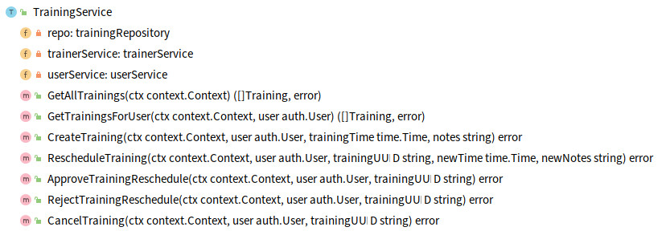
<figcaption aria-hidden="true">Methods of refactored TrainingService</figcaption>
</figure>

###### noun == entity

Is it a valid approach to discover entities? Well, not really.

DDD provides tools that help us to model complex domains without guessing (*Strategic DDD Patterns*, *Aggregates*). We don’t want to guess how our aggregates look like – we want to have tools to discover them. Event Storming technique is extremely useful here… but it’s a topic for an entire separate chapter.

The topic is complex enough to have a couple chapters about that. And this is what we will do shortly.

Does it mean that you should not use these techniques without Strategic DDD Patterns? Of course not! The current approach can be good enough for simpler projects. Unfortunately (or fortunately ), not all projects are simple.

```go
package training

// ...

type Training struct {
   uuid string

   userUUID string
   userName string

   time  time.Time
   notes string

   proposedNewTime time.Time
   moveProposedBy  UserType

   canceled bool
}
```

*Source: [training.go on GitHub](https://bit.ly/37x7Lal)*

All fields are private to provide encapsulation. This is critical to meet “always keep a valid state in the memory”[^12] rule from the chapter about DDD Lite.

Thanks to the validation in the constructor and encapsulated fields, we are sure that `Training` is always valid. **Now, a person that doesn’t have any knowledge about the project is not able to use it in a wrong way.**

The same rule applies to any methods provided by `Training`.

```go
package training

func NewTraining(uuid string, userUUID string, userName string, trainingTime time.Time) (*Training, error) {
   if uuid == "" {
      return nil, errors.New("empty training uuid")
   }
   if userUUID == "" {
      return nil, errors.New("empty userUUID")
   }
   if userName == "" {
      return nil, errors.New("empty userName")
   }
   if trainingTime.IsZero() {
      return nil, errors.New("zero training time")
   }

   return &Training{
      uuid:     uuid,
      userUUID: userUUID,
      userName: userName,
      time:     trainingTime,
   }, nil
}
```

*Source: [training.go on GitHub](https://bit.ly/3qEeQgP)*

###### Approve reschedule in the domain layer

As described in DDD Lite introduction[^13], we build our domain with methods oriented on behaviours. Not on data. Let’s model `ApproveReschedule` on our domain entity.

```go
package training

// ...s

func (t *Training) IsRescheduleProposed() bool {
   return !t.moveProposedBy.IsZero() && !t.proposedNewTime.IsZero()
}

var ErrNoRescheduleRequested = errors.New("no training reschedule was requested yet")

func (t *Training) ApproveReschedule(userType UserType) error {
   if !t.IsRescheduleProposed() {
      return errors.WithStack(ErrNoRescheduleRequested)
   }

   if t.moveProposedBy == userType {
      return errors.Errorf(
         "trying to approve reschedule by the same user type which proposed reschedule (%s)",
         userType.String(),
      )
   }

   t.time = t.proposedNewTime

   t.proposedNewTime = time.Time{}
   t.moveProposedBy = UserType{}

   return nil
}
```

*Source: [reschedule.go on GitHub](https://bit.ly/2NLBncQ)*

##### Orchestrate with command

Now the application layer can be responsible only for the orchestration of the flow. There is no domain logic there. **We hide the entire business complexity in the domain layer. This was exactly our goal.**

For getting and saving a training, we use the Repository pattern[^14].

```go
package command

// ...

func (h ApproveTrainingRescheduleHandler) Handle(ctx context.Context, cmd ApproveTrainingReschedule) (err error) {
   defer func() {
      logs.LogCommandExecution("ApproveTrainingReschedule", cmd, err)
   }()

   return h.repo.UpdateTraining(
      ctx,
      cmd.TrainingUUID,
      cmd.User,
      func(ctx context.Context, tr *training.Training) (*training.Training, error) {
         originalTrainingTime := tr.Time()

         if err := tr.ApproveReschedule(cmd.User.Type()); err != nil {
            return nil, err
         }

         err := h.trainerService.MoveTraining(ctx, tr.Time(), originalTrainingTime)
         if err != nil {
            return nil, err
         }

         return tr, nil
      },
   )
}
```

*Source: [approve_training_reschedule.go on GitHub](https://bit.ly/3k8VdLo)*

##### Refactoring of training cancelation

Let’s now take a look at `CancelTraining` from `TrainingService`.

The domain logic is simple there: you can cancel a training up to 24h before its date. If it’s less than 24h before the training, and you want to cancel it anyway:

- if you are the trainer, the attendee will have his training “back” plus one extra session (nobody likes to change plans on the same day!)
- if you are the attendee, you will lose this training

This is how the current implementation looks like:

```go
- func (c TrainingService) CancelTraining(ctx context.Context, user auth.User, trainingUUID string) error {
-  return c.repo.CancelTraining(ctx, trainingUUID, func(training Training) error {
-     if user.Role != "trainer" && training.UserUUID != user.UUID {
-        return errors.Errorf("user '%s' is trying to cancel training of user '%s'", user.UUID, training.UserUUID)
-     }
-
-     var trainingBalanceDelta int
-     if training.CanBeCancelled() {
-        // just give training back
-        trainingBalanceDelta = 1
-     } else {
-        if user.Role == "trainer" {
-           // 1 for cancelled training +1 fine for cancelling by trainer less than 24h before training
-           trainingBalanceDelta = 2
-        } else {
-           // fine for cancelling less than 24h before training
-           trainingBalanceDelta = 0
-        }
-     }
-
-     if trainingBalanceDelta != 0 {
-        err := c.userService.UpdateTrainingBalance(ctx, training.UserUUID, trainingBalanceDelta)
-        if err != nil {
-           return errors.Wrap(err, "unable to change trainings balance")
-        }
-     }
-
-     err := c.trainerService.CancelTraining(ctx, training.Time)
-     if err != nil {
-        return errors.Wrap(err, "unable to cancel training")
-     }
-
-     return nil
-  })
- }
```

You can see some kind of “algorithm” for calculating training balance delta during cancelation. That’s not a good sign in the application layer.

Logic like this one should live in our domain layer. **If you start to see some `if`’s related to logic in your application layer, you should think about how to move it to the domain layer.** It will be easier to test and re-use in other places.

It may depend on the project, but often **domain logic is pretty stable after the initial development and can live unchanged for a long time**. It can survive moving between services, framework changes, library changes, and API changes. Thanks to that separation, we can do all these changes in a much safer and faster way.

Let’s decompose the `CancelTraining` method to multiple, separated pieces. That will allow us to test and change them independently.

First of all, we need to handle cancelation logic and marking `Training` as canceled.

```go
package training

func (t Training) CanBeCanceledForFree() bool {
   return t.time.Sub(time.Now()) >= time.Hour*24
}

var ErrTrainingAlreadyCanceled = errors.New("training is already canceled")

func (t *Training) Cancel() error {
   if t.IsCanceled() {
      return ErrTrainingAlreadyCanceled
   }

   t.canceled = true
   return nil
}
```

*Source: [cancel.go on GitHub](https://bit.ly/3dwBaoJ)*

Nothing really complicated here. That’s good!

The second part that requires moving is the “algorithm” of calculating trainings balance after cancelation. In theory, we could put it to the `Cancel()` method, but IMO it would break the [Single Responsibility Principle](https://en.wikipedia.org/wiki/Single-responsibility_principle) and [CQS](https://en.wikipedia.org/wiki/Command%E2%80%93query_separation). And I like small functions.

But where to put it? Some object? A domain service? In some languages, like the one that starts with *J* and ends with *ava*, it would make sense. But in Go, it’s good enough to just create a simple function.

```go
package training

// CancelBalanceDelta return trainings balance delta that should be adjusted after training cancelation.
func CancelBalanceDelta(tr Training, cancelingUserType UserType) int {
   if tr.CanBeCanceledForFree() {
      // just give training back
      return 1
   }

   switch cancelingUserType {
   case Trainer:
      // 1 for cancelled training +1 "fine" for cancelling by trainer less than 24h before training
      return 2
   case Attendee:
      // "fine" for cancelling less than 24h before training
      return 0
   default:
      panic(fmt.Sprintf("not supported user type %s", cancelingUserType))
   }
}
```

*Source: [cancel_balance.go on GitHub](https://bit.ly/3pInEAN)*

The code is now straightforward. **I can imagine that I could sit with any non-technical person and go through this code to explain how it works.**

What about tests? It may be a bit controversial, but IMO tests are redundant there. Test code would replicate the implementation of the function. Any change in the calculation algorithm will require copying the logic to the tests. I would not write a test there, but if you will sleep better at night – why not!

###### Moving CancelTraining to command

Our domain is ready, so let’s now use it. We will do it in the same way as previously:

1.  getting the entity from the repository,
2.  orchestration of domain stuff,
3.  calling external `trainer` service to cancel the training (this service is the point of truth of “trainer’s calendar”),
4.  returning entity to be saved in the database.

```go
package command

// ...

func (h CancelTrainingHandler) Handle(ctx context.Context, cmd CancelTraining) (err error) {
   defer func() {
      logs.LogCommandExecution("CancelTrainingHandler", cmd, err)
   }()

   return h.repo.UpdateTraining(
      ctx,
      cmd.TrainingUUID,
      cmd.User,
      func(ctx context.Context, tr *training.Training) (*training.Training, error) {
         if err := tr.Cancel(); err != nil {
            return nil, err
         }

         if balanceDelta := training.CancelBalanceDelta(*tr, cmd.User.Type()); balanceDelta != 0 {
            err := h.userService.UpdateTrainingBalance(ctx, tr.UserUUID(), balanceDelta)
            if err != nil {
               return nil, errors.Wrap(err, "unable to change trainings balance")
            }
         }

         if err := h.trainerService.CancelTraining(ctx, tr.Time()); err != nil {
            return nil, errors.Wrap(err, "unable to cancel training")
         }

         return tr, nil
      },
   )
}
```

*Source: [cancel_training.go on GitHub](https://bit.ly/3dtVKGs)*

##### Repository refactoring

The initial implementation of the repository was pretty tricky because of the custom method for every use case.

```go
- type trainingRepository interface {
-  FindTrainingsForUser(ctx context.Context, user auth.User) ([]Training, error)
-  AllTrainings(ctx context.Context) ([]Training, error)
-  CreateTraining(ctx context.Context, training Training, createFn func() error) error
-  CancelTraining(ctx context.Context, trainingUUID string, deleteFn func(Training) error) error
-  RescheduleTraining(ctx context.Context, trainingUUID string, newTime time.Time, updateFn func(Training) (Training, error)) error
-  ApproveTrainingReschedule(ctx context.Context, trainingUUID string, updateFn func(Training) (Training, error)) error
-  RejectTrainingReschedule(ctx context.Context, trainingUUID string, updateFn func(Training) (Training, error)) error
- }
```

Thanks to introducing the `training.Training` entity, we can have a much simpler version, with one method for adding a new training and one for the update.

```go
package training

// ...

type Repository interface {
   AddTraining(ctx context.Context, tr *Training) error

   GetTraining(ctx context.Context, trainingUUID string, user User) (*Training, error)

   UpdateTraining(
      ctx context.Context,
      trainingUUID string,
      user User,
      updateFn func(ctx context.Context, tr *Training) (*Training, error),
   ) error
}
```

*Source: [repository.go on GitHub](https://bit.ly/3dykNIy)*

As in **[The Repository Pattern](#ch008.xhtml_the-repository-pattern)** (Chapter 7), we implemented our repository using Firestore. We will also use Firestore in the current implementation. Please keep in mind that this is an implementation detail – you can use any database you want. In the previous chapter, we have shown example implementations using different databases.

```go
package adapters

// ...

func (r TrainingsFirestoreRepository) UpdateTraining(
   ctx context.Context,
   trainingUUID string,
   user training.User,
   updateFn func(ctx context.Context, tr *training.Training) (*training.Training, error),
) error {
   trainingsCollection := r.trainingsCollection()

   return r.firestoreClient.RunTransaction(ctx, func(ctx context.Context, tx *firestore.Transaction) error {
      documentRef := trainingsCollection.Doc(trainingUUID)

      firestoreTraining, err := tx.Get(documentRef)
      if err != nil {
         return errors.Wrap(err, "unable to get actual docs")
      }

      tr, err := r.unmarshalTraining(firestoreTraining)
      if err != nil {
         return err
      }

      if err := training.CanUserSeeTraining(user, *tr); err != nil {
         return err
      }

      updatedTraining, err := updateFn(ctx, tr)
      if err != nil {
         return err
      }

      return tx.Set(documentRef, r.marshalTraining(updatedTraining))
   })
}
```

*Source: [trainings_firestore_repository.go on GitHub](https://bit.ly/3sfAdWi)*

##### Connecting everything

How to use our code now? What about our ports layer? Thanks to the refactoring that Miłosz did in **[Clean Architecture](#ch010.xhtml_clean-architecture-1)** (Chapter 9), our ports layer is decoupled from other layers. That’s why, after this refactoring, it doesn’t require almost any significant changes. We just call the application command instead of the application service.

<figure>
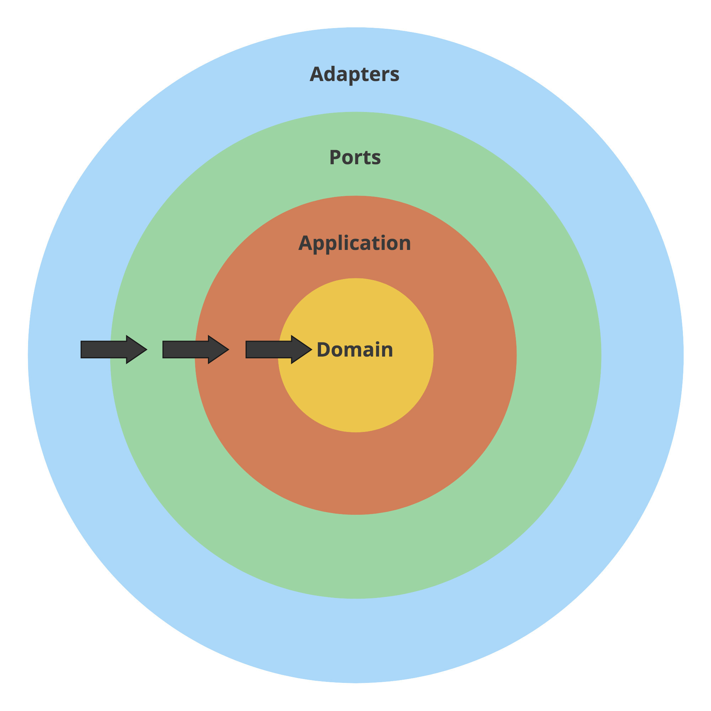
<figcaption aria-hidden="true">Clean/Hexagonal Architecture layers.</figcaption>
</figure>

```go
package ports

// ...

type HttpServer struct {
   app app.Application
}

// ...

func (h HttpServer) CancelTraining(w http.ResponseWriter, r *http.Request) {
   trainingUUID := r.Context().Value("trainingUUID").(string)

   user, err := newDomainUserFromAuthUser(r.Context())
   if err != nil {
      httperr.RespondWithSlugError(err, w, r)
      return
   }

   err = h.app.Commands.CancelTraining.Handle(r.Context(), command.CancelTraining{
      TrainingUUID: trainingUUID,
      User:         user,
   })
   if err != nil {
      httperr.RespondWithSlugError(err, w, r)
      return
   }
}
```

*Source: [http.go on GitHub](https://bit.ly/3bpwWwD)*

##### How to approach such refactoring in a real project?

It may not be obvious how to do such refactoring in a real project. It’s hard to do a code review and agree on the team level on the refactoring direction.

From my experience, the best approach is [Pair](https://en.wikipedia.org/wiki/Pair_programming) or [Mob](https://en.wikipedia.org/wiki/Mob_programming) programming. Even if, at the beginning, you may feel that it is a waste of time, the knowledge sharing and instant review will save a lot of time in the future. Thanks to great knowledge sharing, you can work much faster after the initial project or refactoring phase.

In this case, you should not consider the time lost for Mob/Pair programming. You should consider the time that you may lose because of not doing it. It will also help you finish the refactoring much faster because you will not need to wait for the decisions. You can agree on them immediately.

Mob and pair programming also work perfectly while implementing complex, greenfield projects. Knowledge sharing is especially important investment in that case. I’ve seen multiple times how this approach allowed to go very fast in the project in the long term.

When you are doing refactoring, it’s also critical to agree on reasonable timeboxes. **And keep them.** You can quickly lose your stakeholders’ trust when you spend an entire month on refactoring, and the improvement is not visible. It is also critical to integrate and deploy your refactoring as fast as you can. Perfectly, on a daily basis (if you can do it for non-refactoring work, I’m sure that you can do it for refactoring as well!). If your changes stay unmerged and undeployed for a longer time, it will increase the chance of breaking functionalities. It will also block any work in the refactored service or make changes harder to merge (it is not always possible to stop all other development around).

But when to know if the project is complex enough to use mob programming? Unfortunately, there is no magic formula for that. But there are questions that you should ask yourself: - do we understand the domain? - do we know how to implement that? - will it end up with a monstrous pull request that nobody will be able to review? - can we risk worse knowledge sharing while not doing mob/pair programming?

##### Summary

And we come to an end.

The entire diff for the refactoring is available on our [Wild Workouts GitHub](https://bit.ly/3udkQiV) (watch out, it’s huge!).

I hope that after this chapter, you also see how all introduced patterns are working nicely together. If not yet, don’t worry. **It took me 3 years to connect all the dots.** But it was worth the time spent. After I understood how everything is connected, I started to look at new projects in a totally different way. It allowed me and my teams to work more efficiently in the long-term.

It is also important to mention, that as all techniques, this combination is not a silver bullet. If you are creating project that is not complex and will be not touched any time soon after 1 month of development, probably it’s enough to put everything to one `main` package. Just keep in mind, when this 1 month of development will become one year!

### Tests Architecture

*Miłosz Smółka*

Do you know the rare feeling when you develop a new application from scratch and can cover all lines with proper tests?

I said “rare” because most of the time, you will work with software with a long history, multiple contributors, and not so obvious testing approach. Even if the code uses good patterns, the test suite doesn’t always follow.

Some projects have no modern development environment set up, so there are only unit tests for things that are easy to test. For example, they test single functions separately because it’s hard to test the public API. The team needs to manually verify all changes, probably on some kind of staging environment. You know what happens when someone introduces changes and doesn’t know they need to test it manually.

Other projects have no tests from the beginning. It allows quicker development by taking shortcuts, for example, keeping dependencies in the global state. When the team realizes the lack of tests causes bugs and slows them down, they decide to add them. But now, it’s impossible to do it reasonably. So the team writes an end-to-end test suite with proper infrastructure in place.

End-to-end tests might give you some confidence, but **you don’t want to maintain such a test suite**. It’s hard to debug, takes a long time to test even the simplest change, and releasing the application takes hours. Introducing new tests is also not trivial in this scenario, so developers avoid it if they can.

I want to introduce some ideas that have worked for us so far and should help you avoid the scenarios above.

This chapter is not about which testing library is best or what tricks you can use (although I will show a few tips). It’s closer to something I would call “test architecture”. It’s not only about “how”, but also “where”, “what”, and “why”.

There’s been a lot of discussion on different types of tests, for example, the [“test pyramid”](https://martinfowler.com/bliki/TestPyramid.html) (Robert mentioned it in **[High-Quality Database Integration Tests](#ch009.xhtml_high-quality-database-integration-tests)** (Chapter 8)). It’s a helpful model to keep in mind. However, it’s also abstract, and you can’t easily measure it. I want to take a more practical approach and show how to introduce a few kinds of tests in a Go project.

#### Why bother about tests?

But isn’t the test code not as important as the rest of the application? Can’t we just accept that keeping tests in good shape is hard and move on? Wouldn’t it speed up the development?

If you’ve been following this series, you know we base all chapters on the [Wild Workouts](https://github.com/ThreeDotsLabs/wild-workouts-go-ddd-example) application.

When I started writing this chapter, running tests locally didn’t even work correctly for me, and this is a relatively new project. There’s one reason this happened: we’re not running tests in the CI pipeline.

It’s a shock, but it seems **even a serverless, cloud-native application using the most popular, cutting edge technologies can be a mess in disguise.**

We know we should now add tests to the pipeline. It’s common knowledge that this gives you the confidence to deploy the changes to production safely. However, there’s also a cost.

Running tests will likely take a significant part of your pipeline’s duration. If you don’t approach their design and implementation with the same quality as the application code, you can realize it too late, with the pipeline taking one hour to pass and randomly failing on you. **Even if your application code is well designed, the tests can become a bottleneck of delivering the changes**.

#### The Layers

We’re now after a few refactoring sessions of the project. We introduced patterns like Repository[^15]. With the solid separation of concerns, we can much easier reason about particular parts of the project.

Let’s revisit the concept of layers we’ve introduced in previous chapters. If you didn’t have a chance to read these earlier, I recommend doing so before you continue — it’ll help you better understand this chapter.

Take a look at a diagram that will help us understand the project’s structure. Below is a generic service built with the approach used in Wild Workouts.


All external inputs start on the left. The only entry point to the application is through the **Ports** layer (HTTP handlers, Pub/Sub message handlers). Ports execute relevant handlers in the **App** layer. Some of these will call the **Domain** code, and some will use **Adapters**, which are the only way out of the service. The adapters layer is where your database queries and HTTP clients live.

The diagram below shows the layers and flow of a part of the trainer service in Wild Workouts.


Let’s now see what types of tests we would need to cover all of it.

#### Unit tests

We kick off with the inner layers and something everyone is familiar with: unit tests.


The domain layer is where the most complex logic of your service lives. However, **the tests here should be some of the simplest to write and running super fast.** There are no external dependencies in the domain, so you don’t need any special infrastructure or mocks (except for really complex scenarios, but let’s leave that for now).

As a rule of thumb, you should aim for high test coverage in the domain layer. Make sure you test only the exported code *(black-box testing)*. Adding the `_test` suffix to the package name is a great practice to enforce this.

The domain code is pure logic and straightforward to test, so it’s the best place to check all corner cases. Table-driven tests are especially great for this.

```go
func TestFactoryConfig_Validate(t *testing.T) {
    testCases := []struct {
        Name        string
        Config      hour.FactoryConfig
        ExpectedErr string
    }{
        {
            Name: "valid",
            Config: hour.FactoryConfig{
                MaxWeeksInTheFutureToSet: 10,
                MinUtcHour:               10,
                MaxUtcHour:               12,
            },
            ExpectedErr: "",
        },
        {
            Name: "equal_min_and_max_hour",
            Config: hour.FactoryConfig{
                MaxWeeksInTheFutureToSet: 10,
                MinUtcHour:               12,
                MaxUtcHour:               12,
            },
            ExpectedErr: "",
        },

        // ...
}

for _, c := range testCases {
        t.Run(c.Name, func(t *testing.T) {
            err := c.Config.Validate()

            if c.ExpectedErr != "" {
                assert.EqualError(t, err, c.ExpectedErr)
            } else {
                assert.NoError(t, err)
            }
}
```

*Source: [hour_test.go on GitHub](https://bit.ly/2NgvXqH)*

We leave the domain and enter the application layer. After introducing CQRS[^16], we’ve split it further into Commands and Queries.

Depending on your project, there could be nothing to test or some complex scenarios to cover. Most of the time, especially in queries, this code just glues together other layers. Testing this doesn’t add any value. But if there’s any complex orchestration in commands, it’s another good case for unit tests.

Watch out for complex logic living in the application layer. If you start testing business scenarios here, it’s worth considering introducing the domain layer.

On the other hand, it’s the perfect place for orchestration — calling adapters and services in a particular order and passing the return values around. If you separate it like that, application tests should not break every time you change the domain code.

**There are many external dependencies in the application’s commands and queries**, as opposed to the domain code. They will be trivial to mock if you follow Clean Architecture[^17]. In most cases, a struct with a single method will make a perfect mock here.

If you prefer to use mocking libraries or code-generated mocks, you can use them as well. Go lets you define and implement small interfaces, so we choose to define the mocks ourselves, as it’s the simplest way.

The snippet below shows how an application command is created with injected mocks.

```go
func newDependencies() dependencies {
    repository := &repositoryMock{}
    trainerService := &trainerServiceMock{}
    userService := &userServiceMock{}

    return dependencies{
        repository:     repository,
        trainerService: trainerService,
        userService:    userService,
        handler:        command.NewCancelTrainingHandler(repository, userService, trainerService),
    }
}

// ...

    deps := newDependencies()

    tr := tc.TrainingConstructor()
    deps.repository.Trainings = map[string]training.Training{
        trainingUUID: *tr,
    }

    err := deps.handler.Handle(context.Background(), command.CancelTraining{
        TrainingUUID: trainingUUID,
        User:         training.MustNewUser(requestingUserID, tc.UserType),
    })
```

*Source: [cancel_training_test.go on GitHub](https://bit.ly/2NOwgsn)*

Watch out for adding tests that don’t check anything relevant, so you don’t end up testing the mocks. Focus on the logic, and if there’s none, skip the test altogether.

We’ve covered the two inner layers. I guess this didn’t seem novel so far, as we’re all familiar with unit tests. However, the [Continuous Delivery Maturity Model](https://www.infoq.com/articles/Continuous-Delivery-Maturity-Model/) lists them only on the “base” maturity level. Let’s now look into integration testing.

#### Integration tests

After reading this header, did you just imagine a long-running test that you have to retry several times to pass? And it’s because of that 30-seconds sleep someone added that turns out to be too short when Jenkins is running under load?

**There’s no reason for integration tests to be slow and flaky. And practices like automatic retries and increasing sleep times should be absolutely out of the question.**

In our context, **an integration test is a test that checks if an adapter works correctly with an external infrastructure.** Most of the time, this means testing database repositories.

These tests are not about checking whether the database works correctly, but whether you use it correctly (the **integration** part). It’s also an excellent way to verify if you know how to use the database internals, like handling transactions.


Because we need real infrastructure, **integration tests are more challenging than unit tests to write and maintain.** Usually, we can use docker-compose to spin up all dependencies.

Should we test our application with the Docker version of a database? The Docker image will almost always be slightly different than what we run on production. In some cases, like Firestore, there’s only an emulator available, not the real database.

Indeed, Docker doesn’t reflect the exact infrastructure you run on production. However, you’re much more likely to mess up an SQL query in the code than to stumble on issues because of a minor configuration difference.

A good practice is to pin the image version to the same as running on the production. Using Docker won’t give you 100% production parity, but it eliminates the “works on my machine” issues and tests your code with proper infrastructure.

Robert covered integration tests for databases in-depth in **[High-Quality Database Integration Tests](#ch009.xhtml_high-quality-database-integration-tests)** (Chapter 8).

##### Keeping integration tests stable and fast

When dealing with network calls and databases, the test speed becomes super important. It’s crucial to run tests in parallel, which can be enabled in Go by calling `t.Parallel()`. **It seems simple to do, but we have to make sure our tests support this behavior.**

For example, consider this trivial test scenario:

1.  Check if the `trainings` collection is empty.
2.  Call repository method that adds a training.
3.  Check if there’s one training in the collection.

If another test uses the same collection, you will get random fails because of the race condition. Sometimes, the collection will contain more than one training we’ve just added.

The simplest way out of this is never to assert things like a list length, but check it for the exact thing we’re testing. For example, we could get all trainings, then iterate over the list to check if the expected ID is present.

Another approach is to isolate the tests somehow, so they can’t interfere with each other. For example, each test case can work within a unique user’s context (see component tests below).

Of course, both patterns are more complex than a simple length assertion. **When you stumble upon this issue for the first time, it may be tempting to give up and decide that “our integration tests don’t need to run in parallel”. Don’t do this.** You will need to get creative sometimes, but it’s not that much effort in the end. In return, your integration tests will be stable and running as fast as unit tests.

If you find yourself creating a new database before each run, it’s another sign that you could rework tests to not interfere with each other.

##### Warning! A common, hard-to-spot, gotcha when iterating test cases.

When working with table-driven tests, you’ll often see code like this:

```go
for _, c := range testCases {
        t.Run(c.Name, func(t *testing.T) {
                // ...
        })
}
```

It’s an idiomatic way to run tests over a slice of test cases. Let’s say you now want to run each test case in parallel. The solution seems trivial:

```go
for _, c := range testCases {
        t.Run(c.Name, func(t *testing.T) {
               t.Parallel()
                // ...
        })
}
```

Sadly, this won’t work as expected.

The [Common Mistakes](https://github.com/golang/go/wiki/CommonMistakes) page on Go’s GitHub wiki lists just two items, and both are actually about the same thing. So it seems there’s only one mistake you should worry about in Go. 🙂 However, this one is really hard to spot sometimes.

It’s not obvious initially, but adding the parallel switch makes the parent test function not wait for the subtests spawned by `t.Run`. Because of this, you can’t safely use the `c` loop variable inside the `func` closure.

Running the tests like this will usually cause all subtests to work with the last test case, ignoring all others. **The worst part is the tests will pass, and you will see correct subtest names when running `go test` with the `-v` flag.** The only way to notice this issue is to change the code expecting tests to fail and see them pass instead.

As mentioned in the wiki, one way to fix this is to introduce a new scoped variable:

```go
for _, c := range testCases {
        c := c
        t.Run(c.Name, func(t *testing.T) {
               t.Parallel()
                // ...
        })
}
```

It’s just a matter of taste, but we don’t like this approach, as it looks like some magic spell to anyone who doesn’t know what this means. Instead, we choose the more verbose but obvious approach:

```go
for i := range testCases {
        c := testCases[i]
        t.Run(c.Name, func(t *testing.T) {
               t.Parallel()
                // ...
        })
}
```

Even if you know about this behavior, it’s dangerously easy to misuse it. What’s worse, it seems that popular linters don’t check this by default — if you know of a linter that does it well, please share in the comments.

We made this mistake in the [Watermill](https://github.com/ThreeDotsLabs/watermill) library, which caused some of the tests not to run at all. You can see the fix in [this commit](https://github.com/ThreeDotsLabs/watermill/commit/c72e26a67cb763ab3dd93ecf57a2b298fc81dd19).

We covered the database repository with tests, but we also have a gRPC client adapter. How should we test this one?

It’s similar to the application layer in this regard. If your test would duplicate the code it checks, it probably makes no sense to add it. It just becomes additional work when changing the code.

Let’s consider the users service gRPC adapter:

```go
func (s UsersGrpc) UpdateTrainingBalance(ctx context.Context, userID string, amountChange int) error {
    _, err := s.client.UpdateTrainingBalance(ctx, &users.UpdateTrainingBalanceRequest{
        UserId:       userID,
        AmountChange: int64(amountChange),
    })

    return err
}
```

*Source: [users_grpc.go on GitHub](https://bit.ly/2OXVTaY)*

There’s nothing interesting to test here. We could inject a mock `client` and check whether a proper method has been called. But this won’t verify anything, and each change in the code will require a corresponding change in the test.

#### Component tests

So far, we’ve created mostly narrow, specialized tests for isolated parts of the application. Such tests work great for checking corner cases and specific scenarios, **but it doesn’t mean each service works correctly**. It’s easy enough to forget to call an application handler from a port. Also, unit tests alone won’t help us make sure the application still works after a major refactoring.

Is it now the time to run end-to-end tests across all our services? Not yet.

As there is no standard of calling test types, I encourage you to follow [Simon Stewart’s advice from his Test Sizes post](https://testing.googleblog.com/2010/12/test-sizes.html). Create a table that will make it obvious for everyone on the team what to expect from a particular test. You can then cut all (unproductive) discussions on the topic.

In our case, the table could look like this:

| Feature | Unit | Integration | Component | End-to-End |
|----|----|----|----|----|
| **Docker database** | No | Yes | Yes | Yes |
| **Use external systems** | No | No | No | Yes |
| **Focused on business cases** | Depends on the tested code | No | Yes | Yes |
| **Used mocks** | Most dependencies | Usually none | External systems | None |
| **Tested API** | Go package | Go package | HTTP and gRPC | HTTP |

To ensure each service works correctly internally, **we introduce component tests to check all layers working together.** A component test covers a single service, isolated from other services in the application.

We will call real port handlers and use the infrastructure provided by Docker. However, we will **mock all adapters reaching external services**.


You might be wondering, why not test external services as well? After all, we could use Docker containers and test all of them together.

The issue is the complexity of testing several connected services. If you have just a couple of them, that can work well enough. But remember, you need to have the proper infrastructure in place for each service you spin up, including all databases it uses and all external services it calls. It can easily be tens of services in total, usually owned by multiple teams.

<figure>
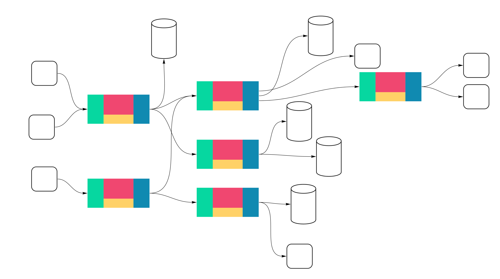
<figcaption aria-hidden="true">You don’t want this as your primary testing approach.</figcaption>
</figure>

We’ll come to this next in end-to-end tests. But for now, we add component tests because we need a fast way to know if a service works correctly.

To better understand why it’s essential to have component tests in place, I suggest looking at some quotes from *[Accelerate](https://itrevolution.com/book/accelerate/)*.

If you haven’t heard about *Accelerate* yet, it’s a book describing research on high-performing software teams. I recommend reading it to learn what can help your team get up to speed.

According to the book, this is what the best software teams said about testability.

> We can do most of our testing without requiring an integrated environment. We can and do deploy or release our application independently of other applications/services it depends on.
>
> Accelerate (https://itrevolution.com/book/accelerate/)

Wait, weren’t microservices supposed to fix teams being dependent on each other? If you think it’s impossible to achieve this in the application you work on, it’s likely because of poor architecture choices. You can fix it by applying strategic DDD patterns that we plan to introduce in future chapters.

*Accelerate* follows up with:

> Unfortunately, in real life, many so-called service-oriented architectures don’t permit testing and deploying services independently of each other, and thus will not enable teams to achieve higher performance.
>
> Accelerate (https://itrevolution.com/book/accelerate/)

We raise this point through the series: **using microservices doesn’t make your application and teams less coupled by itself. Decoupling takes a conscious design of the application’s architecture and at the system level.**

**In component tests, our goal is to check the completeness of a single service in isolation, with all infrastructure it needs.** We make sure the service accepts the API we agreed on and responds with expected results.

These tests are more challenging technically, but still relatively straightforward. We won’t be running a real service binary because we need to mock some dependencies. We have to modify the way we start the service to make it possible.

Once again, if you follow the Dependency Inversion Principle (just a reminder, it’s part of SOLID), injecting mocks at the service level should be trivial.

I’ve introduced two constructors for our `app.Application` struct, which holds all commands and queries. The first one works just like before, setting up real gRPC clients and injecting them. The second replaces them with mocks.

```go
func NewApplication(ctx context.Context) (app.Application, func()) {
    // ...

    trainerGrpc := adapters.NewTrainerGrpc(trainerClient)
    usersGrpc := adapters.NewUsersGrpc(usersClient)

    return newApplication(ctx, trainerGrpc, usersGrpc),
    // ...
}

func NewComponentTestApplication(ctx context.Context) app.Application {
    return newApplication(ctx, TrainerServiceMock{}, UserServiceMock{})
}
```

*Source: [service.go on GitHub](https://bit.ly/2Zzy0Zl)*

We can now simply run the service in a separate goroutine.

We want to run just a single service instance for all tests, so we use the `TestMain` function. It’s a simple way to insert a setup before running tests.

```go
func startService() bool {
    app := NewComponentTestApplication(context.Background())

    trainingsHTTPAddr := os.Getenv("TRAININGS_HTTP_ADDR")
    go server.RunHTTPServerOnAddr(trainingsHTTPAddr, func(router chi.Router) http.Handler {
        return ports.HandlerFromMux(ports.NewHttpServer(app), router)
    })

    ok := tests.WaitForPort(trainingsHTTPAddr)
    if !ok {
        log.Println("Timed out waiting for trainings HTTP to come up")
    }

    return ok
}

func TestMain(m *testing.M) {
    if !startService() {
        os.Exit(1)
    }

    os.Exit(m.Run())
}
```

*Source: [component_test.go on GitHub](https://bit.ly/3uidFpt)*

I’ve created the `WaitForPort` helper function that waits until the specified port is open or times out. It’s crucial, as you need to ensure that the service has properly started. **Don’t replace it with sleeps.** You will either add too much delay and make the test slow or make it too short, and it will fail randomly.

What to test in component tests? **Usually, the happy path should be enough. Don’t check for corner cases there. Unit and integration tests should already cover these.** Make sure the correct payloads are processed, the storage works, and responses are correct.

##### Calling the ports

I use HTTP clients generated by `openapi-codegen`. Similar to the server part, this makes writing tests much easier. For example, you don’t need to specify the whole REST path and worry about marshaling JSON each time.

Even though the generated clients save us a lot of boilerplate, I’ve still added the `tests/client.go` file with client wrappers for test purposes.

```go
func (c TrainingsHTTPClient) CreateTraining(t *testing.T, note string, hour time.Time) string {
    response, err := c.client.CreateTrainingWithResponse(context.Background(), trainings.CreateTrainingJSONRequestBody{
        Notes: note,
        Time:  hour,
    })
    require.NoError(t, err)
    require.Equal(t, http.StatusNoContent, response.StatusCode())

    contentLocation := response.HTTPResponse.Header.Get("content-location")

    return lastPathElement(contentLocation)
}
```

*Source: [clients.go on GitHub](https://bit.ly/2ZznyB3)*

The tests become even more readable, and it’s easy to understand what’s going on. **Making tests pass is easy enough, but it’s much harder to understand them in a code review, reading between all asserts and mocks.** It’s twice as important when modifying tests.

Instead of the snippet above, we can now use a single line that clearly states what’s happening.

```go
trainingUUID := client.CreateTraining(t, "some note", hour)
```

*Source: [component_test.go on GitHub](https://bit.ly/2NIphS3)*

Other helper methods are `FakeAttendeeJWT` and `FakeTrainerJWT`. They generate valid authorization tokens with the chosen role.

As gRPC uses structs generated from protobuf, the clients are already straightforward to use.

#### End-to-end tests

Finally, we come to the most dreaded part of our test suite. We will now leave all mocks behind.

**End-to-end tests verify your whole system working together. They are slow, error-prone, and hard to maintain.** You still need them, but make sure you build them well.

In Wild Workouts, it will be similar to running component tests, except we’re going to spin up all services inside the docker-compose. We’ll then verify a few critical paths calling just the HTTP endpoints, as this is what we expose to the external world.

If you can’t run the entire platform on docker-compose, you need to find a similar approach. It could be a separate Kubernetes cluster or namespace if you’re already using it, or some kind of staging environment.


Now comes the part where you’re going to have more questions than answers. Where should you keep end-to-end tests? Which team should own it? Where to run them? How often? Should they be part of the CI/CD pipeline or a separate thing ran from a cronjob?

I can’t give you clear answers, as this heavily depends on your teams’ structure, organizational culture, and CI/CD setup. As with most challenges, try an approach that seems the best and iterate over it until you’re happy.

We’re lucky to have just three services for the entire application, all using the same database. As the number of services and dependencies grows, your application will become harder to test this way.

Try to keep end-to-end tests short. **They should test if services correctly connect together, not the logic inside them.** These tests work as a double-check. They shouldn’t fail most of the time, and if they do, it usually means someone has broken the contract.

I said we’ll use just HTTP endpoints, as this is what is exposed publicly. There’s one exception: we’re calling users service by gRPC to add trainings balance for our test attendee. As you would expect, this endpoint is not accessible to the public.

The code is very close to what we did in component tests. The main difference is we no longer spin up the service in a separate goroutine. Instead, all services are running inside docker-compose using the same binaries we deploy on production.

```go
user := usersHTTPClient.GetCurrentUser(t)
originalBalance := user.Balance

_, err = usersGrpcClient.UpdateTrainingBalance(context.Background(), &users.UpdateTrainingBalanceRequest{
    UserId:       userID,
    AmountChange: 1,
})

require.NoError(t, err)
user = usersHTTPClient.GetCurrentUser(t)
require.Equal(t, originalBalance+1, user.Balance, "Attendee's balance should be updated")

trainingUUID := trainingsHTTPClient.CreateTraining(t, "some note", hour)

trainingsResponse := trainingsHTTPClient.GetTrainings(t)
require.Len(t, trainingsResponse.Trainings, 1)
require.Equal(t, trainingUUID, trainingsResponse.Trainings[0].Uuid, "Attendee should see the training")

user = usersHTTPClient.GetCurrentUser(t)
require.Equal(t, originalBalance, user.Balance, "Attendee's balance should be updated after a training is scheduled")
```

*Source: [e2e_test.go on GitHub](https://bit.ly/3uhiGPc)*

##### Acceptance tests

You can often find acceptance tests defined as the next level after unit and integration tests. We see them as orthogonal to the technical aspects of tests. It’s a test that focuses on a complete business feature instead of implementation details. As Martin Fowler puts it:

> Here’s the thing: At one point you should make sure to test that your software works correctly from a user’s perspective, not just from a technical perspective. What you call these tests is really not that important. Having these tests, however, is. Pick a term, stick to it, and write those tests.
>
> Acceptance Tests — Do Your Features Work Correctly? (https://martinfowler.com/articles/practical-test-pyramid.html)

In our case, component tests and end-to-end tests can both be considered acceptance tests.

If you like, you can use the [BDD](https://en.wikipedia.org/wiki/Behavior-driven_development) style for some of them — it makes them easier to read but adds some boilerplate.


#### Can we sleep well now?

> A service is not really tested until we break it in production.
>
> Jesse Robbins, according to The DevOps Handbook (https://itrevolution.com/the-devops-handbook/)

A reliable test suite will catch most of your bugs so that you can deliver consistently. But you want to be ready for outages anyway. We now enter the topic of monitoring, observability, and chaos engineering. However, this is not in the scope for today.

Just keep in mind that no test suite will give you total confidence. It’s also crucial to have a straightforward process in place that allows quick rollbacks, reverts, and undoing migrations.

#### Moving on

If you look through the [full commit](https://bit.ly/2Mj1vM2), you might notice how we inject dependencies now is not very elegant. We’re going to iterate over this in the future.

We have the test suite in place, but we still miss a critical part: it’s not running in our Continuous Integration pipeline.

Also, coming up with proper docker-compose and environment variables for tests wasn’t trivial. The current solution works but is not straightforward to understand if you don’t know what’s going on. And running the tests in an automated build will only make it more complicated.

We will cover these topics in future chapters.

### Repository Secure by Design

*Robert Laszczak*

Thanks to the tests and code review, you can make your project bug-free. Right? Well… actually, probably not. That would be too easy. These techniques lower the chance of bugs, but they can’t eliminate them entirely. But does it mean we need to live with the risk of bugs until the end of our lives?

Over one year ago, I found a pretty [interesting PR](https://github.com/goharbor/harbor/pull/8917/files) in the `harbor` project. This was a fix for the issue that **allowed to create admin user by a regular user. This was obviously a severe security issue.** Of course, automated tests didn’t found this bug earlier.

This is how the bugfix looks like:

```go
        ua.RenderError(http.StatusBadRequest, "register error:"+err.Error())
        return
    }
+
+   if !ua.IsAdmin && user.HasAdminRole {
+       msg := "Non-admin cannot create an admin user."
+       log.Errorf(msg)
+       ua.SendForbiddenError(errors.New(msg))
+       return
+   }
+
    userExist, err := dao.UserExists(user, "username")
    if err != nil {
```

One `if` statement fixed the bug. Adding new tests also should ensure that there will be no regression in the future. Is it enough? **Did it secure the application from a similar bug in the future? I’m pretty sure it didn’t.**

The problem becomes bigger in more complex systems with a big team working on them. What if someone is new to the project and forgets to put this `if` statement? Even if you don’t hire new people currently, they may be hired in the future. **You will probably be surprised how long the code you have written will live.** We should not trust people to use the code we’ve created in the way it’s intended – they will not.

**In some cases, the solution that will protect us from issues like that is good design. Good design should not allow using our code in an invalid way.** Good design should guarantee that you can touch the existing code without any fear. People new to the project will feel safer introducing changes.

In this chapter, I’ll show how I ensured that only allowed people would be able to see and edit a training. In our case, a training can only be seen by the training owner (an attendee) and the trainer. I will implement it in a way that doesn’t allow to use our code in not intended way. By design.

Our current application assumes that a repository is the only way how we can access the data. Because of that, I will add authorization on the repository level. **By that, we are sure that it is impossible to access this data by unauthorized users.**

###### What is Repository tl;dr

If you had no chance to read our previous chapters, repository is a pattern that helps us to abstract database implementation from our application logic.

If you want to know more about its advantages and learn how to apply it in your project, read **[The Repository Pattern](#ch008.xhtml_the-repository-pattern)** (Chapter 7).

But wait, is the repository the right place to manage authorization? Well, I can imagine that some people may be skeptical about that approach. Of course, we can start some philosophical discussion on what can be in the repository and what shouldn’t. Also, the actual logic of who can see the training will be placed in the *domain* layer. I don’t see any significant downsides, and the advantages are apparent. In my opinion, pragmatism should win here.

What is also interesting in this book, we focus on *business-oriented applications*. But even if the *Harbor* project is a pure system application, most of the presented patterns can be applied as well.

After introducing Clean Architecture[^18] to our team, our teammate used this approach in his game to abstract rendering engine.

*(Cheers, Mariusz, if you are reading that!)*

##### Show me the code, please!

To achieve our robust design, we need to implement three things: 1. Logic who can see the training ([domain layer](https://bit.ly/3kdFQBf), 2. Functions used to get the training (`GetTraining` in the [repository](https://bit.ly/3qE1TDP)), 3. Functions used to update the training (`UpdateTraining` in the [repository](https://bit.ly/2NqUhpB).

###### Domain layer

The first part is the logic responsible for deciding if someone can see the training. Because it is part of the domain logic (you can talk about who can see the training with your business or product team), it should go to the `domain` layer. It’s implemented with `CanUserSeeTraining` function.

It is also acceptable to keep it on the repository level, but it’s harder to re-use. I don’t see any advantage of this approach – especially if putting it to the `domain` doesn’t cost anything.

```go
package training

// ...

type User struct {
    userUUID string
    userType UserType
}

// ...

type ForbiddenToSeeTrainingError struct {
    RequestingUserUUID string
    TrainingOwnerUUID  string
}

func (f ForbiddenToSeeTrainingError) Error() string {
    return fmt.Sprintf(
        "user '%s' can't see user '%s' training",
        f.RequestingUserUUID, f.TrainingOwnerUUID,
    )
}

func CanUserSeeTraining(user User, training Training) error {
    if user.Type() == Trainer {
        return nil
    }
    if user.UUID() == training.UserUUID() {
        return nil
    }

    return ForbiddenToSeeTrainingError{user.UUID(), training.UserUUID()}
}
```

*Source: [user.go on GitHub](https://bit.ly/2NFEZgC)*

###### Repository

Now when we have the `CanUserSeeTraining` function, we need to use this function. Easy like that.

```go
func (r TrainingsFirestoreRepository) GetTraining(
    ctx context.Context,
    trainingUUID string,
+   user training.User,
) (*training.Training, error) {
    firestoreTraining, err := r.trainingsCollection().Doc(trainingUUID).Get(ctx)

    if status.Code(err) == codes.NotFound {
        return nil, training.NotFoundError{trainingUUID}
    }
    if err != nil {
        return nil, errors.Wrap(err, "unable to get actual docs")
    }

    tr, err := r.unmarshalTraining(firestoreTraining)
    if err != nil {
        return nil, err
    }
+
+   if err := training.CanUserSeeTraining(user, *tr); err != nil {
+       return nil, err
+   }
+
    return tr, nil
}
```

*Source: [trainings_firestore_repository.go on GitHub](https://bit.ly/3qE1TDP)*

Isn’t it too simple? Our goal is to create a simple, not complex, design and code. **This is an excellent sign that it is deadly simple.**

We are changing `UpdateTraining` in the same way.

```go
func (r TrainingsFirestoreRepository) UpdateTraining(
    ctx context.Context,
    trainingUUID string,
+   user training.User,
    updateFn func(ctx context.Context, tr *training.Training) (*training.Training, error),
) error {
    trainingsCollection := r.trainingsCollection()

    return r.firestoreClient.RunTransaction(ctx, func(ctx context.Context, tx *firestore.Transaction) error {
        documentRef := trainingsCollection.Doc(trainingUUID)

        firestoreTraining, err := tx.Get(documentRef)
        if err != nil {
            return errors.Wrap(err, "unable to get actual docs")
        }

        tr, err := r.unmarshalTraining(firestoreTraining)
        if err != nil {
            return err
        }
+
+       if err := training.CanUserSeeTraining(user, *tr); err != nil {
+           return err
+       }
+
        updatedTraining, err := updateFn(ctx, tr)
        if err != nil {
            return err
        }

        return tx.Set(documentRef, r.marshalTraining(updatedTraining))
    })
}
```

*Source: [trainings_firestore_repository.go on GitHub](https://bit.ly/2NqUhpB)*

And… that’s all! Is there any way that someone can use this in a wrong way? As long as the `User` is valid – no.

This approach is similar to the method presented in **[Domain-Driven Design Lite](#ch007.xhtml_domain-driven-design-lite)** (Chapter 6). It’s all about creating code that we can’t use in a wrong way.

This is how usage of `UpdateTraining` now looks like:

```go
func (h ApproveTrainingRescheduleHandler) Handle(ctx context.Context, cmd ApproveTrainingReschedule) (err error) {
    defer func() {
        logs.LogCommandExecution("ApproveTrainingReschedule", cmd, err)
    }()

    return h.repo.UpdateTraining(
        ctx,
        cmd.TrainingUUID,
        cmd.User,
        func(ctx context.Context, tr *training.Training) (*training.Training, error) {
            originalTrainingTime := tr.Time()

            if err := tr.ApproveReschedule(cmd.User.Type()); err != nil {
                return nil, err
            }

            err := h.trainerService.MoveTraining(ctx, tr.Time(), originalTrainingTime)
            if err != nil {
                return nil, err
            }

            return tr, nil
        },
    )
}
```

*Source: [approve_training_reschedule.go on GitHub](https://bit.ly/3scHx4W)*

Of course, there are still some rules if `Training` can be rescheduled, but this is handled by the `Training` domain type.

##### Handling collections

Even if this approach works perfectly for operating on a single training, you need to be sure that access to a collection of trainings is properly secured. There is no magic here:

```go
func (r TrainingsFirestoreRepository) FindTrainingsForUser(ctx context.Context, userUUID string) ([]query.Training, error) {
    query := r.trainingsCollection().Query.
        Where("Time", ">=", time.Now().Add(-time.Hour*24)).
        Where("UserUuid", "==", userUUID).
        Where("Canceled", "==", false)

    iter := query.Documents(ctx)

    return r.trainingModelsToQuery(iter)
}
```

*Source: [trainings_firestore_repository.go on GitHub](https://bit.ly/3pEIXDF)*

Doing it on the application layer with the `CanUserSeeTraining` function will be very expensive and slow. It’s better to create a bit of logic duplication.

If this logic is more complex in your application, you can try to abstract it in the domain layer to the format that you can convert to query parameters in your database driver. I did it once, and it worked pretty nicely.

But in Wild Workouts, it will add unnecessary complexity - let’s [Keep It Simple, Stupid](https://en.wikipedia.org/wiki/KISS_principle).

##### Handling internal updates

We often want to have endpoints that allow a developer or your company operations department to do some “backdoor” changes. The worst thing that you can do in this case is creating any kind of “fake user” and hacks.

It ends with a lot of `if` statements added to the code from my experience. It also obfuscates the audit log (if you have any). Instead of a “fake user”, it’s better to create a special role and explicitly define the role’s permissions.

If you need repository methods that don’t require any user (for Pub/Sub message handlers or migrations), it’s better to create separate repository methods. In that case, naming is essential – we need to be sure that the person who uses that method knows the security implications.

From my experience, if updates are becoming much different for different actors, it’s worth to even introduce a separate CQRS Commands[^19] per actor. In our case it may be `UpdateTrainingByOperations`.

##### Passing authentication via `context.Context`

As far as I know, some people are passing authentication details via `context.Context`.

I highly recommend not passing anything required by your application to work correctly via `context.Context`. The reason is simple – when passing values via `context.Context`, we lose one of the most significant Go advantages – static typing. It also hides what exactly the input for your functions is.

If you need to pass values via context for some reason, it may be a symptom of a bad design somewhere in your service. Maybe the function is doing too much, and it’s hard to pass all arguments there? Perhaps it’s the time to decompose that?

##### And that’s all for today!

As you see, the presented approach is straightforward to implement quickly.

I hope that it will help you with your project and give you more confidence in future development.

Do you see that it can help in your project? Do you think that it may help your colleagues? Don’t forget to share it with them!

### Setting up infrastructure with Terraform

*Miłosz Smółka*

We picked **Google Cloud Platform (GCP)** as the provider of all infrastructure parts of the project. We use **Cloud Run** for running Go services, **Firestore** as the database, **Cloud Build** as CI/CD, and **Firebase** for web hosting and authentication. The project is based on [Terraform](https://www.terraform.io/).

#### Infrastructure as Code

If you’re not familiar with Terraform at all, it’s a tool for keeping infrastructure configuration as text files. This technique is also known as “Infrastructure as Code”. It’s a broad topic, so I’ll mention just a few benefits:

- **Storing infrastructure configuration in a repository**. This gives you all benefits that come with version control, like the history of commits, one source of truth, and code reviews.
- **Consistency over time**. Ideally, there are no manual changes to infrastructure other than those described in the configuration.
- **Multiple environments**. When you stop treating your servers as pets, it’s much easier to create identical environments, sometimes even on demand.

#### Terraform 101

*You can skip this part if you already know Terraform basics.*

In Terraform, you define a set of **resources** in `.tf` files using [HCL](https://github.com/hashicorp/hcl) syntax. A resource can be a database, network configuration, compute instance, or even a set of permissions. Available resource types depend on the used provider (e.g., AWS, GCP, Digital Ocean).

All resources are defined in a **declarative** way. You don’t write pseudocode that creates servers. Instead, you define the desired outcome. It’s up to Terraform to come up with a way to configure what you specified. For example, it’s smart enough to create a resource only if it doesn’t exist.

Resources can refer to each other using the full name.

Besides resources, a project can also specify **input variables** to be filled by user and **output values**, that can be printed on the screen or stored in a file.

There are also **data sources** that don’t create anything but read existing remote resources.

You can find all the available resources in the specific provider documentation. Here’s an example for [Google Cloud Platform](https://www.terraform.io/docs/providers/google/index.html).

Two basic commands that you need to know are `terraform plan` and `terraform apply`.

`apply` applies all resources defined in the current directory in all files with `.tf` extension. The `plan` command is a “dry-run” mode, printing out all changes that would be applied by `apply`.

After applying changes, you will find a `terraform.tfstate` file in the same directory. This file holds a local “[state](https://www.terraform.io/docs/state/index.html)” of your infrastructure.

#### Google Cloud Project

Our Terraform configuration creates a new GCP project. It’s completely separated from your other projects and is easy to clean up.

Because some resources go beyond the free trier, you need to have a *Billing Account*. It can be an account with a linked credit card, but the \$300 credit for new accounts is also fine.

The basic part of the project definition looks like this:

```go
provider "google" {
  project = var.project
  region  = var.region
}

data "google_billing_account" "account" {
  display_name = var.billing_account
}

resource "google_project" "project" {
  name            = "Wild Workouts"
  project_id      = var.project
  billing_account = data.google_billing_account.account.id
}

resource "google_project_iam_member" "owner" {
  role    = "roles/owner"
  member  = "user:${var.user}"

  depends_on = [google_project.project]
}
```

*Source: [project.tf on GitHub](https://bit.ly/2OM8w8P)*

Let’s consider what each *block* does:

1.  Enables the GCP provider. Sets **project** name and chosen **region** from variables. These two fields are “inherited” by all resources unless overridden.
2.  Finds a billing account with the display name provided by the variable.
3.  Creates a new google project linked with the billing account. **Note the reference to the account ID.**
4.  Adds your user as the owner of the project. **Note the string interpolation.**

#### Enabling APIs

On a fresh GCP project, you can’t use most services right away. You have to first enable the API for each of them. You can enable an API by clicking a button in the GCP Console, or do the same in [Terraform](https://www.terraform.io/docs/providers/google/r/google_project_service.html):

```go
resource "google_project_service" "compute" {
  service    = "[compute.googleapis.com](http://compute.googleapis.com/)"
  depends_on = [google_project.project]
}
```

*Source: [project.tf on GitHub](https://bit.ly/3qJjLNu)*

We enable the following APIs:

- Cloud Source Repositories
- Cloud Build
- Container Registry
- Compute
- Cloud Run
- Firebase
- Firestore

##### A note on dependencies

If you’re wondering about the `depends_on` line, it’s there to set an **explicit dependency** between the service and the project. Terraform detects dependencies between resources if they refer to each other. In the first snippet, you can see this with billing account that’s referenced by the project:

```go
data "google_billing_account" "account" {
  display_name = var.billing_account
}

resource "google_project" "project" {
  # ...
  billing_account = data.google_billing_account.account.id
}
```

In the `google_project_service` resource, we don’t use `project` anywhere, because it’s already set in the `provider` block. Instead, we use `depends_on` to specify explicit dependency. This line tells Terraform to wait with creating the resource until the project is correctly created.

#### Cloud Run

<figure>
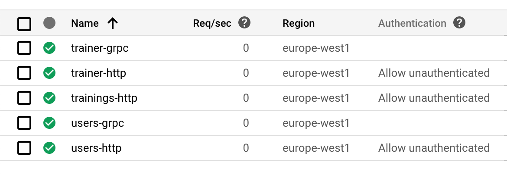
<figcaption aria-hidden="true">Cloud Run services</figcaption>
</figure>

In Cloud Run, a service is a set of Docker containers with a common endpoint, exposing a single port (HTTP or gRPC). Each service is automatically scaled, depending on the incoming traffic. You can choose the maximum number of containers and how many requests each container can handle.

It’s also possible to connect services with Google Cloud Pub/Sub. Our project doesn’t use it yet, but we will introduce it in the future versions.

You are charged only for the computing resources you use, so when a request is being processed or when the container starts.

Wild Workouts consists of 3 services: *trainer*, *trainings*, and *users*. We decided to serve public API with HTTP and internal API with gRPC.

<figure>
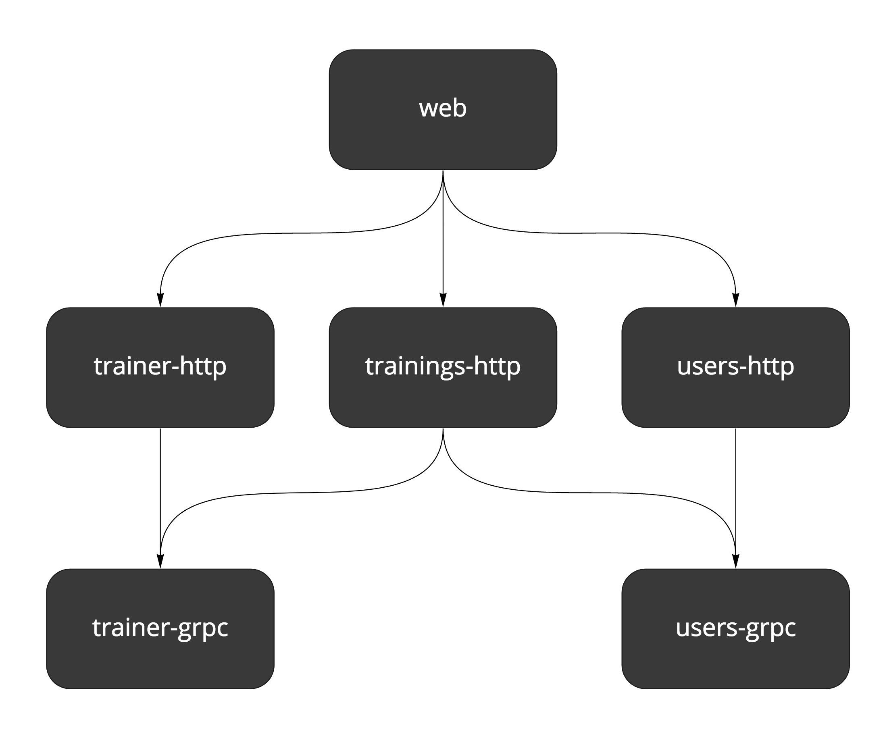
<figcaption aria-hidden="true">Services</figcaption>
</figure>

Because you can’t have two separate ports exposed from a single service, we have to expose two containers per service (except trainings, which doesn’t have internal API at the moment).

We deploy 5 services in total, each with a similar configuration. Following the [DRY](https://en.wikipedia.org/wiki/Don%27t_repeat_yourself) principle, the common Terraform configuration is encapsulated in the [service module](https://bit.ly/3aJee3R).

A [Module](https://www.terraform.io/docs/configuration/modules.html) in Terraform is a separate set of files in a subdirectory. Think of it as a container for a group of resources. It can have its input variables and output values.

Any module can call other modules by using the `module` block and passing a path to the directory in the `source` field. A single module can be called multiple times.

Resources defined in the main working directory are considered to be in a *root module*.

The module holds a definition of a single generic Cloud Run service and is used multiple times in `cloud-run.tf`. It exposes several variables, e.g., name and type of the server (HTTP or gRPC).

A service exposing gRPC is the simpler one:

```go
module cloud_run_trainer_grpc {
  source = "./service"

  project    = var.project
  location   = var.region
  dependency = null_resource.init_docker_images

  name     = "trainer"
  protocol = "grpc"
}
```

*Source: [cloud-run.tf on GitHub](https://bit.ly/3dwBuUt)*

The `protocol` is passed to the `SERVER_TO_RUN` environment variable, which decides what server is run by the service.

Compare this with an HTTP service definition. We use the same module, and there are additional environment variables defined. We need to add them because public services contact internal services via the gRPC API and need to know their addresses.

```go
module cloud_run_trainings_http {
  source = "./service"

  project    = var.project
  location   = var.region
  dependency = null_resource.init_docker_images

  name     = "trainings"
  protocol = "http"
  auth     = false

  envs = [
    {
      name = "TRAINER_GRPC_ADDR"
      value = module.cloud_run_trainer_grpc.endpoint
    },
    {
      name  = "USERS_GRPC_ADDR"
      value = module.cloud_run_users_grpc.endpoint
    }
  ]
}
```

*Source: [cloud-run.tf on GitHub](https://bit.ly/3btsm0e)*

The reference: `module.cloud_run_trainer_grpc.endpoint` points to `endpoint` output defined in the `service` module:

```go
output endpoint {
  value = "${trimprefix(google_cloud_run_service.service.status[0].url, "https://")}:443"
}
```

*Source: [outputs.tf on GitHub](https://bit.ly/3udkNDL)*

Using environment variables is an easy way to make services know each other. It would probably be best to implement some kind of service discovery with more complex connections and more services. Perhaps we will cover this in another chapter in the future.

If you’re curious about the `dependency` variable see *In-depth* down below for details.

##### Cloud Run Permissions

Cloud Run services have authentication enabled by default. Setting the `auth = false` variable in the `service` module adds additional IAM policy for the service, making it accessible for the public. We do this just for the HTTP APIs.

```go
data "google_iam_policy" "noauth" {
  binding {
    role = "roles/run.invoker"
    members = [
      "allUsers",
    ]
  }
}

resource "google_cloud_run_service_iam_policy" "noauth_policy" {
  count = var.auth ? 0 : 1

  location = google_cloud_run_service.service.location
  service  = google_cloud_run_service.service.name

  policy_data = data.google_iam_policy.noauth.policy_data
}
```

*Source: [service.tf on GitHub](https://bit.ly/3sq0aCD)*

Note the following line:

```go
count = var.auth ? 0 : 1
```

This line is Terraform’s way of making an `if` statement. `count` defines how many copies of a resource Terraform should create. It skips resources with count equal `0`.

#### Firestore

We picked Firestore as the database for Wild Workouts. See our first post[^20] for reasons behind this.

Firestore works in two modes - Native or Datastore. You have to decide early on, as the choice is permanent after your first write to the database.

You can pick the mode in GCP Console GUI, but we wanted to make the setup fully automated. In Terraform, there’s `google_project_service` resource available, but it enables the Datastore mode. Sadly, we can’t use it, since we’d like to use the Native mode.

A workaround is to use the `gcloud` command to enable it (note the `alpha` version).

```go
gcloud alpha firestore databases create
```

To run this command, we use the [null resource](https://www.terraform.io/docs/providers/null/resource.html). It’s a special kind of resource that lets you run custom provisioners locally or on remote servers. A [provisioner](https://www.terraform.io/docs/provisioners/index.html) is a command or other software making changes in the system.

We use [local-exec provisioner](https://www.terraform.io/docs/provisioners/local-exec.html), which is simply executing a bash command on the local system. In our case, it’s one of the targets defined in `Makefile`.

```go
resource "null_resource" "enable_firestore" {
  provisioner "local-exec" {
    command = "make firestore"
  }

  depends_on = [google_firebase_project_location.default]
}
```

*Source: [firestore.tf on GitHub](https://bit.ly/2ZznMYV)*

Firestore requires creating all composite indexes upfront. It’s also available as a [Terraform resource](https://www.terraform.io/docs/providers/google/r/firestore_index.html).

```go
resource "google_firestore_index" "trainings_user_time" {
  collection = "trainings"

  fields {
    field_path = "UserUuid"
    order      = "ASCENDING"
  }

  fields {
    field_path = "Time"
    order      = "ASCENDING"
  }

  fields {
    field_path = "__name__"
    order      = "ASCENDING"
  }

  depends_on = [null_resource.enable_firestore]
}
```

*Source: [firestore.tf on GitHub](https://bit.ly/3qE9iD9)*

Note the explicit `depends_on` that points to the `null_resource` creating database.

#### Firebase

Firebase provides us with frontend application hosting and authentication.

Currently, Terraform supports only part of Firebase API, and some of it is still in beta. That’s why we need to enable the `google-beta` provider:

```go
provider "google-beta" {
  project     = var.project
  region      = var.region
  credentials = base64decode(google_service_account_key.firebase_key.private_key)
}
```

*Source: [firebase.tf on GitHub](https://bit.ly/37zdkVB)*

Then we define the project, [project’s location](https://firebase.google.com/docs/projects/locations) and the web application.

```go
resource "google_firebase_project" "default" {
  provider = google-beta

  depends_on = [
    google_project_service.firebase,
    google_project_iam_member.service_account_firebase_admin,
  ]
}

resource "google_firebase_project_location" "default" {
  provider = google-beta

  location_id = var.firebase_location

  depends_on = [
    google_firebase_project.default,
  ]
}

resource "google_firebase_web_app" "wild_workouts" {
  provider     = google-beta
  display_name = "Wild Workouts"

  depends_on = [google_firebase_project.default]
}
```

*Source: [firebase.tf on GitHub](https://bit.ly/3bowwqm)*

Authentication management still misses a Terraform API, so you have to enable it manually in the [Firebase Console](https://console.firebase.google.com/project/_/authentication/providers). Firebase authentication is the only thing we found no way to automate.

<figure>
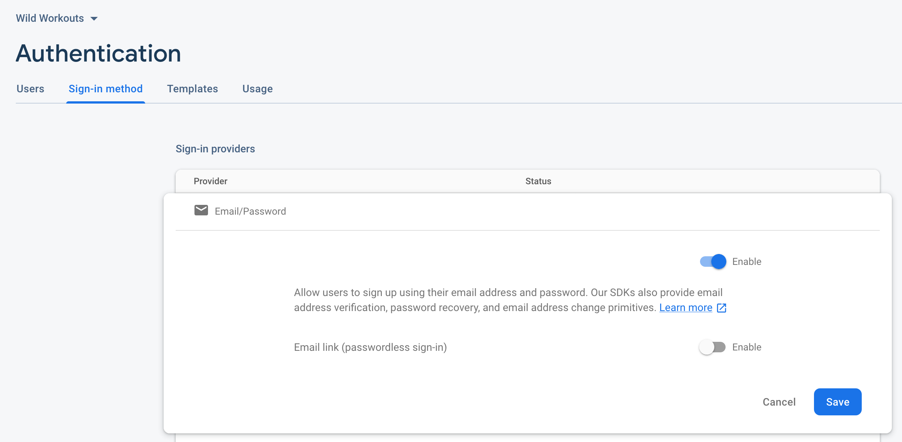
<figcaption aria-hidden="true">Cloud Run services</figcaption>
</figure>

##### Firebase Routing

Firebase also handles public routing to services. Thanks to this the frontend application can call API with `/api/trainer` instead of [`https://trainer-http-smned2eqeq-ew.a.run.app`](https://trainer-grpc-lmned2eqeq-ew.a.run.app/). These routes are defined in `web/firebase.json`.

```go
"rewrites": [
    {
      "source": "/api/trainer{,/**}",
      "run": {
        "serviceId": "trainer-http",
        "region": "europe-west1"
      }
    },
    // ...
]
```

*Source: [firebase.json on GitHub](https://bit.ly/37wRbYf)*

#### Cloud Build

Cloud Build is our Continuous Delivery pipeline. It has to be enabled for a repository, so we define a [trigger](https://www.terraform.io/docs/providers/google/r/cloudbuild_trigger.html) in Terraform and the [repository](https://www.terraform.io/docs/providers/google/r/sourcerepo_repository.html) itself.

```go
resource "google_sourcerepo_repository" "wild_workouts" {
  name = var.repository_name

  depends_on = [
    google_project_service.source_repo,
  ]
}

resource "google_cloudbuild_trigger" "trigger" {
  trigger_template {
    branch_name = "master"
    repo_name   =  google_sourcerepo_repository.wild-workouts.name
  }

  filename = "cloudbuild.yaml"
}
```

*Source: [repo.tf on GitHub](https://bit.ly/3k6hGZo)*

The build configuration has to be defined in the [`cloudbuild.yaml`](https://bit.ly/3umPOoK) file committed to the repository. We defined a couple of steps in the pipeline:

- Linting (go vet) - this step could be extended in future with running tests and all kinds of static checks and linters
- Building docker images
- Deploying docker images to Cloud Run
- Deploying web app to Firebase hosting

We keep several services in one repository, and their building and deployment are almost the same. To reduce repetition, there are a few helper bash scripts in the [`scripts`](https://bit.ly/3dGyiWv) directory.

##### Should I use a monorepo?

We decided to keep all services in one repository. We did this mainly because Wild Workouts is an example project, and it’s much easier to set up everything this way. We can also easily share the common code (e.g., setting up gRPC and HTTP servers).

From our experience, using a single repository is a great starting point for most projects. It’s essential, though, that all services are entirely isolated from each other. If there’s a need, we could easily split them into separate repositories. We might show this in the future chapters in this book.

The biggest disadvantage of the current setup is that all services and the frontend application are deployed at the same time. That’s usually not what you want when working with microservices with a bigger team. But it’s probably acceptable when you’re just starting out and creating an MVP.

As usual in CI/CD tools, the [Build configuration](https://cloud.google.com/cloud-build/docs/build-config) is defined in YAML. Let’s see the whole configuration for just one service, to reduce some noise.

```go
steps:
- id: trainer-lint
  name: golang
  entrypoint: ./scripts/lint.sh
  args: [trainer]

- id: trainer-docker
  name: gcr.io/cloud-builders/docker
  entrypoint: ./scripts/build-docker.sh
  args: ["trainer", "$PROJECT_ID"]
  waitFor: [trainer-lint]

- id: trainer-http-deploy
  name: gcr.io/cloud-builders/gcloud
  entrypoint: ./scripts/deploy.sh
  args: [trainer, http, "$PROJECT_ID"]
  waitFor: [trainer-docker]

- id: trainer-grpc-deploy
  name: gcr.io/cloud-builders/gcloud
  entrypoint: ./scripts/deploy.sh
  args: [trainer, grpc, "$PROJECT_ID"]
  waitFor: [trainer-docker]

options:
  env:
  - 'GO111MODULE=on'
  machineType: 'N1_HIGHCPU_8'

images:
- 'gcr.io/$PROJECT_ID/trainer'
```

*Source: [cloudbuild.yaml on GitHub](https://bit.ly/3uicMgI)*

A single step definition is pretty short:

- `id` is a unique identifier of a step. It can be used in `waitFor` array to specify dependencies between steps (steps are running in parallel by default).
- `name` is the name of a docker image that will be run for this step.
- `entrypoint` works like in docker images, so it’s a command that is executed on the container’s start. We use bash scripts to make the YAML definition short, but this can be any bash command.
- `args` will be passed to `entrypoint` as arguments.

In `options`, we override the machine type to make our builds run faster. There’s also an environment variable to force the use of go modules.

`images` list defines docker images that should be pushed to Container Registry. In the example above, the docker image is built in the `trainer-docker` step.

##### Deploys

Deploys to Cloud Run are done with the `gcloud run deploy` command. Cloud Build builds the docker image in the previous step, so we can use the latest image on the registry.

```go
- id: trainer-http-deploy
  name: gcr.io/cloud-builders/gcloud
  entrypoint: ./scripts/deploy.sh
  args: [trainer, http, "$PROJECT_ID"]
  waitFor: [trainer-docker]
```

*Source: [cloudbuild.yaml on GitHub](https://bit.ly/2OSRDtb)*

```go
gcloud run deploy "$service-$server_to_run" \
    --image "gcr.io/$project_id/$service" \
    --region europe-west1 \
    --platform managed
```

*Source: [deploy.sh on GitHub](https://bit.ly/3s9lJXR)*

Frontend is deployed with the `firebase` command. There’s no need to use a helper script there, as there’s just one frontend application.

```go
- name: gcr.io/$PROJECT_ID/firebase
  args: ['deploy', '--project=$PROJECT_ID']
  dir: web
  waitFor: [web-build]
```

*Source: [cloudbuild.yaml on GitHub](https://bit.ly/2ZBjCQo)*

This step uses [`gcr.io/$PROJECT_ID/firebase`](http://gcr.io/$PROJECT_ID/firebase) docker image. It doesn’t exist by default, so we use another `null_resource` to build it from [cloud-builders-community](https://github.com/GoogleCloudPlatform/cloud-builders-community.git):

```go
resource "null_resource" "firebase_builder" {
  provisioner "local-exec" {
    command = "make firebase_builder"
  }

  depends_on = [google_project_service.container_registry]
}
```

*Source: [repo.tf on GitHub](https://bit.ly/3dAqyVY)*

##### Cloud Build Permissions

All required permissions are defined in `iam.tf`. Cloud Build needs permissions for [Cloud Run](https://cloud.google.com/cloud-build/docs/deploying-builds/deploy-cloud-run) (to deploy backend services) and [Firebase](https://cloud.google.com/cloud-build/docs/deploying-builds/deploy-firebase) (to deploy frontend application).

First of all, we define account names as local variables to make the file more readable. If you’re wondering where these names come from, you can find them in the [Cloud Build documentation](https://cloud.google.com/cloud-build/docs/deploying-builds/deploy-cloud-run).

```go
locals {
  cloud_build_member = "serviceAccount:${google_project.project.number}@cloudbuild.gserviceaccount.com"
  compute_account    = "projects/${var.project}/serviceAccounts/${google_project.project.number}-compute@developer.gserviceaccount.com"
}
```

*Source: [iam.tf on GitHub](https://bit.ly/3pG9YXb)*

We then define all permissions, as described in the documentation. For example, here’s **Cloud Build member** with **Cloud Run Admin role**:

```go
resource "google_project_iam_member" "cloud_run_admin" {
  role   = "roles/run.admin"
  member = local.cloud_build_member

  depends_on = [google_project_service.cloud_build]
}
```

*Source: [iam.tf on GitHub](https://bit.ly/3bi6qVK)*

#### Dockerfiles

We have a couple of Dockerfiles defined in the project in the [`docker`](https://bit.ly/3dDa7Io) directory.

- [`app`](https://bit.ly/3smkjsT) - Go service image for local development. It uses reflex for hot code recompilation. See [our post about local Go environment](https://threedots.tech/post/go-docker-dev-environment-with-go-modules-and-live-code-reloading/) to learn how it works.
- [`app-prod`](https://bit.ly/3keqBYR) - production image for Go services. It builds the Go binary for a given service and runs it.
- [`web`](https://bit.ly/3dIJd29) - frontend application image for local development.

#### Setup

Usually, you would execute a Terraform project with `terraform apply`. This command applies all resources in the current directory.

Our example is a bit more complex because it sets up the whole GCP project along with dependencies. Makefile orchestrates the setup.

Requirements:

- `git`, `gcloud`, and `terraform` installed on your system.
- Docker
- A GCP account with a Billing Account.

##### Authentication

There are two credentials that you need for the setup.

Start with logging in with `gcloud`:

```go
gcloud auth login
```

Then you need to obtain **Application Default Credentials**:

```go
gcloud auth application-default login
```

This stores your credentials in a well-known place, so Terraform can use it.

##### Security warning!

Authenticating like this is the easiest way and okay for local development, but you probably don’t want to use it in a production setup.

Instead, consider creating a service account with only a subset of necessary permissions (depending on what your Terraform configuration does). You can then download the JSON key and store its path in the `GOOGLE_CLOUD_KEYFILE_JSON` environment variable.

##### Picking a Region

During the setup, you need to pick [Cloud Run region](https://cloud.google.com/run/docs/locations) and [Firebase location](https://firebase.google.com/docs/projects/locations). These two are not the same thing (see the lists on linked documentation).

We picked `europe-west1` as the default region for Cloud Run. It’s hardcoded on the repository in two files:

- [`scripts/deploy.sh`](https://bit.ly/2ZFxl8K) - for deploying the Cloud Run services
- [`web/firebase.json`](https://bit.ly/3dyYdzv) - for routing Cloud Run public APIs

If you’re fine with the defaults, you don’t need to change anything. Just pick Firebase location that’s close, i.e., `europe-west`.

If you’d like to use another region, you need to update the files mentioned above. It’s important to **commit your changes** on `master` before you run the setup. It’s not enough to change them locally!

##### Run it!

Clone the [project repository](https://github.com/ThreeDotsLabs/wild-workouts-go-ddd-example) and enter the `terraform` directory from the command line. A single `make` command should be enough to start. See the included [README](https://bit.ly/3qM21AW) for more details.

##### Billing warning!

This project goes beyond the Google Cloud Platform free tier. You need to have a billing account to use it. You can use the \$300 free credit given to new accounts or create a new account in the [Billing section](https://console.cloud.google.com/billing/create).

For pricing, see [Cloud Run Pricing](https://cloud.google.com/run/pricing). The best way to estimate your project cost is to use the [official calculator](https://cloud.google.com/products/calculator).

Wild Workouts should cost you up to \$1 monthly if you use it just occasionally. We recommend deleting the project after you’re done playing with it.

If you want to run it continuously, you should know that most of the cost comes from Cloud Build and depends on the number of builds (triggered by new commits on master). You can downgrade the `machineType` in `cloudbuild.yaml` to reduce some costs at the expense of longer build times.

It’s also a good idea to set up a Budget Alert in the Billing Account settings. You will then receive a notification if something triggers unexpected charges.

At the end of the setup, a new git remote will be added to your local repository, called `google`. The master branch will be pushed to this remote, triggering your first Cloud Build.

If you’d like to make any changes to the project, you need to push to the correct origin, i.e., `git push google`. You can also update the `origin` remote with `git remote set-url`.

If you keep your code on GitHub, GitLab, or another platform, you can set up a mirror instead of hosting the repository on Cloud Source Repositories.

#### In-depth

##### Env variables

All possible variables are defined in the `vars.tf` file. If a variable has no default value and you don’t provide it, Terraform won’t let you apply anything.

There are several ways to supply variables for `terraform apply`. You can pass them individually with `-var` flag or all at once with `-var-file` flag. Terraform also looks for them in `TF_VAR_name` environment variables.

We’ve picked the last option for this project. We need to use the environment variables anyway in Makefile and bash scripts. This way, there’s just one source of truth.

Make runs `set-envs.sh` at the beginning of the setup. It’s just a helper script to ask the user for all the required variables. These are then saved to `.env` file. You can edit this file manually as well.

Note Terraform does not automatically read it. It’s sourced just before running `apply`:

```go
load_envs:=source ./.env
### ...

apply:
    ${load_envs} && terraform apply
```

*Source: [Makefile on GitHub](https://bit.ly/2M7eqjU)*

##### Building docker images

Because we’re setting up the project from scratch, we run into a dilemma: we need docker images in the project’s Container Registry to create Cloud Run instances, but we can’t create the images without a project.

You could set the image name in Terraform definition to an example image and then let Cloud Build overwrite it. But then each `terraform apply` would try to change them back to the original value.

Our solution is to build the images based on the “hello” image first and then deploy Cloud Run instances. Then Cloud Build builds and deploys proper images, but the name stays the same.

```go
resource "null_resource" "init_docker_images" {
  provisioner "local-exec" {
    command = "make docker_images"
  }

  depends_on = [google_project_service.container_registry]
}
```

*Source: [docker-images.tf on GitHub](https://bit.ly/3qIqqaA)*

Note the `depends_on` that points at Container Registry API. It ensures Terraform won’t start building images until there’s a registry where it can push them.

##### Destroying

You can delete the entire project with `make destroy`. If you take a look in the Makefile, there’s something unusual before `terraform destroy`:

```go
terraform state rm "google_project_iam_member.owner"
terraform state rm "google_project_service.container_registry"
terraform state rm "google_project_service.cloud_run"
```

*Source: [Makefile on GitHub](https://bit.ly/3bpLVGP)*

These commands are a workaround for [Terraform’s lack of a “skip destroy” feature](https://github.com/hashicorp/terraform/issues/23547). They remove some resources from Terraform’s local state file. Terraform won’t destroy these resources (as far as it’s concerned, they don’t exist at this point).

We don’t want to destroy the owner IAM policy, because if something goes wrong during the destroy, you will lock yourself out of the project and won’t be able to access it.

The other two lines are related with enabled APIs — there’s a possible race condition where some resources would still use these APIs during destroy. By removing them from the state, we avoid this issue.

##### A note on magic

Our goal was to make it as easy as possible to set up the whole project. Because of that, we had to cut some corners where Terraform is missing features, or an API is not yet available. There’s also some Makefile and bash magic involved that’s not always easy to understand.

I want to make this clear because you will likely encounter similar dilemmas in your projects. You will need to choose between fully-automated solutions glued together with alpha APIs or using plain Terraform with some manual steps documented in the project.

Both approaches have their place. For example, this project is straightforward to set up multiple times with the same configuration. So if you’d like to create the exact copy of the production environment, you can have a completely separate project working within minutes.

If you keep just one or two environments, you won’t need to recreate them every week. It’s then probably fine to stick to the available APIs and document the rest.

#### Is serverless the way to go?

This project is our first approach to “serverless” deployment, and at first, we had some concerns. Is this all just hype, or is serverless the future?

Wild Workouts is a fairly small project that might not show all there is to Cloud Run. Overall we found it quite simple to set up, and it nicely hides all complexities. It’s also more natural to work with than Cloud Functions.

After the initial setup, there shouldn’t be much infrastructure maintenance needed. You don’t have to worry about keeping up a Docker registry or a Kubernetes cluster and can instead focus on creating the application.

On the other hand, it’s also quite limited in features, as there are only a few protocols supported. It looks like a great fit for services with a REST API. The pricing model also seems reasonable, as you pay only for the used resources.

#### What about vendor lock-in?

The entire Terraform configuration is now tied to GCP, and there is no way around it. If we’d like to migrate the project to AWS, a new configuration will be needed.

However, there are some universal concepts. Services running in docker images can be deployed on any platform, whether it’s a Kubernetes cluster or docker-compose. Most platforms also offer some kind of registry for images.

Is writing a new Terraform configuration all that’s required to migrate out of Google? Not really, as the application itself is coupled to Firebase and Authentication offered by GCP. We will show a better approach to this problem in future chapters in this book.

#### What’s next?

This chapter just scratches the surface of Terraform. There are many advanced topics you should take a look at if you consider using it. For example, the [remote state](https://www.terraform.io/docs/state/remote.html) is necessary when working in a team.

### Running integration tests in the CI/CD pipeline

*Miłosz Smółka*

This post is a direct follow-up to **[Tests Architecture](#ch013.xhtml_tests-architecture)** (Chapter 12) where I’ve introduced new kinds of tests to our example project.

[Wild Workouts](https://github.com/ThreeDotsLabs/wild-workouts-go-ddd-example) uses Google Cloud Build as CI/CD platform. It’s configured in a **continuous deployment** manner, meaning the changes land on production as soon as the pipeline passes. If you consider our current setup, it’s both brave and naive. We have no tests running there that could save us from obvious mistakes (the not-so-obvious mistakes can rarely be caught by tests, anyway).

In this chapter I will show how to run integration, component, and end-to-end tests on Google Cloud Build using docker-compose.

#### The current config

Let’s take a look at the current `cloudbuild.yaml` file. While it’s pretty simple, most steps are being run several times as we keep 3 microservices in a single repository. I focus on the backend part, so I will skip all config related to frontend deployment now.

```go
steps:
  - id: trainer-lint
    name: golang
    entrypoint: ./scripts/lint.sh
    args: [trainer]
  - id: trainings-lint
    name: golang
    entrypoint: ./scripts/lint.sh
    args: [trainings]
  - id: users-lint
    name: golang
    entrypoint: ./scripts/lint.sh
    args: [users]

  - id: trainer-docker
    name: gcr.io/cloud-builders/docker
    entrypoint: ./scripts/build-docker.sh
    args: ["trainer", "$PROJECT_ID"]
    waitFor: [trainer-lint]
  - id: trainings-docker
    name: gcr.io/cloud-builders/docker
    entrypoint: ./scripts/build-docker.sh
    args: ["trainings", "$PROJECT_ID"]
    waitFor: [trainings-lint]
  - id: users-docker
    name: gcr.io/cloud-builders/docker
    entrypoint: ./scripts/build-docker.sh
    args: ["users", "$PROJECT_ID"]
    waitFor: [users-lint]

  - id: trainer-http-deploy
    name: gcr.io/cloud-builders/gcloud
    entrypoint: ./scripts/deploy.sh
    args: [trainer, http, "$PROJECT_ID"]
    waitFor: [trainer-docker]
  - id: trainer-grpc-deploy
    name: gcr.io/cloud-builders/gcloud
    entrypoint: ./scripts/deploy.sh
    args: [trainer, grpc, "$PROJECT_ID"]
    waitFor: [trainer-docker]
  - id: trainings-http-deploy
    name: gcr.io/cloud-builders/gcloud
    entrypoint: ./scripts/deploy.sh
    args: [trainings, http, "$PROJECT_ID"]
    waitFor: [trainings-docker]
  - id: users-http-deploy
    name: gcr.io/cloud-builders/gcloud
    entrypoint: ./scripts/deploy.sh
    args: [users, http, "$PROJECT_ID"]
    waitFor: [users-docker]
  - id: users-grpc-deploy
    name: gcr.io/cloud-builders/gcloud
    entrypoint: ./scripts/deploy.sh
    args: [users, grpc, "$PROJECT_ID"]
    waitFor: [users-docker]
```

*Source: [cloudbuild.yaml on GitHub](https://bit.ly/3u4O8PQ)*

Notice the `waitFor` key. It makes a step wait only for other specified steps. Some jobs can run in parallel this way.

Here’s a more readable version of what’s going on:


We have a similar workflow for each service: lint (static analysis), build the Docker image, and deploy it as one or two Cloud Run services.

Since our test suite is ready and works locally, we need to figure out how to plug it in the pipeline.

#### Docker Compose

We already have one docker-compose definition, and I would like to keep it this way. We will use it for:

- running the application locally,
- running tests locally,
- running tests in the CI.

These three targets have different needs. For example, when running the application locally, we want to have hot code reloading. But that’s pointless in the CI. On the other hand, we can’t expose ports on `localhost` in the CI, which is the easiest way to reach the application in the local environment.

Luckily docker-compose is flexible enough to support all of these use cases. We will use a base `docker-compose.yml` file and an additional `docker-compose.ci.yml` file with overrides just for the CI. You can run it by passing both files using the `-f` flag (notice there’s one flag for each file). Keys from the files will be merged in the provided order.

```go
docker-compose -f docker-compose.yml -f docker-compose.ci.yml up -d
```

Typically, docker-compose looks for the `docker-compose.yml` file in the current directory or parent directories. Using the `-f` flag disables this behavior, so only specified files are parsed.

To run it on Cloud Build, we can use the `docker/compose` image.

```go
- id: docker-compose
  name: 'docker/compose:1.19.0'
  args: ['-08_file_servers_cdn', 'docker-compose.yml', '-08_file_servers_cdn', 'docker-compose.ci.yml', 'up', '-d']
  env:
    - 'PROJECT_ID=$PROJECT_ID'
  waitFor: [trainer-docker, trainings-docker, users-docker]
```

*Source: [cloudbuild.yaml on GitHub](https://bit.ly/39xjcQb)*

Since we filled `waitFor` with proper step names, we can be sure the correct images are present. This is what we’ve just added:


The first override we add to `docker-compose.ci.yml` makes each service use docker images by the tag instead of building one from `docker/app/Dockerfile`. This ensures our tests check the same images we’re going to deploy.

Note the `${PROJECT_ID}` variable in the `image` keys. This needs to be the production project, so we can’t hardcode it in the repository. Cloud Build provides this variable in each step, so we just pass it to the `docker-compose up` command (see the definition above).

```go
services:
  trainer-http:
    image: "gcr.io/${PROJECT_ID}/trainer"

  trainer-grpc:
    image: "gcr.io/${PROJECT_ID}/trainer"

  trainings-http:
    image: "gcr.io/${PROJECT_ID}/trainings"

  users-http:
    image: "gcr.io/${PROJECT_ID}/users"

  users-grpc:
    image: "gcr.io/${PROJECT_ID}/users"
```

*Source: [docker-compose.ci.yml on GitHub](https://bit.ly/2PqNMEr)*

#### Network

Many CI systems use Docker today, typically running each step inside a container with the chosen image. Using docker-compose in a CI is a bit trickier, as it usually means running Docker containers from within a Docker container.

On Google Cloud Build, all containers live inside the [`cloudbuild` network](https://cloud.google.com/build/docs/build-config#network). Simply adding this network as the default one for our `docker-compose.ci.yml` is enough for CI steps to connect to the docker-compose services.

Here’s the second part of our override file:

```go
networks:
  default:
    external:
      name: cloudbuild
```

*Source: [docker-compose.ci.yml on GitHub](https://bit.ly/3sHojEW)*

#### Environment variables

Using environment variables as configuration seems simple at first, but it quickly becomes complex considering how many scenarios we need to handle. Let’s try to list all of them:

- running the application locally,
- running component tests locally,
- running component tests in the CI,
- running end-to-end tests locally,
- running end-to-end tests in the CI.

I didn’t include running the application on production, as it doesn’t use docker-compose.

Why component and end-to-end tests are separate scenarios? The former spin up services on demand and the latter communicate with services already running within docker-compose. It means both types will use different endpoints to reach the services.

For more details on component and end-to-end tests see **[Tests Architecture](#ch013.xhtml_tests-architecture)** (Chapter 12). The TL;DR version is: we focus coverage on component tests, which don’t include external services. End-to-end tests are there just to confirm the contract is not broken on a very high level and only for the most critical path. This is the key to decoupled services.

We already keep a base `.env` file that holds most variables. It’s passed to each service in the docker-compose definition.

Additionally, docker-compose loads this file automatically when it finds it in the working directory. Thanks to this, we can use the variables inside the yaml definition as well.

```go
services:
  trainer-http:
    build:
      context: docker/app
    ports:
      # The $PORT variable comes from the .env file
      - "127.0.0.1:3000:$PORT"
    env_file:
      # All variables from .env are passed to the service
      - .env
    # (part of the definition omitted)
```

*Source: [docker-compose.yml on GitHub](https://bit.ly/31uSXWd)*

We also need these variables loaded when running tests. That’s pretty easy to do in bash:

```go
source .env
### exactly the same thing
. .env
```

However, the variables in our `.env` file have no `export` prefix, so they won’t be passed further to the applications running in the shell. We can’t use the prefix because it wouldn’t be compatible with the syntax docker-compose expects.

Additionally, we can’t use a single file with all scenarios. We need to have some variable overrides, just like we did with the docker-compose definition. My idea is to keep one additional file for each scenario. It will be loaded together with the base `.env` file.

Let’s see what’s the difference between all scenarios. For clarity, I’ve included only users-http, but the idea will apply to all services.

| Scenario | MySQL host | Firestore host | users-http address | File |
|----|----|----|----|----|
| Running locally | localhost | localhost | localhost:3002 | [.env](https://bit.ly/2PhgMyu) |
| Local component tests | localhost | localhost | localhost:5002 | [.test.env](https://bit.ly/31zBMmi) |
| CI component tests | mysql | firestore-component-tests | localhost:5002 | [.test.ci.env](https://bit.ly/2Odc5VO) |
| Local end-to-end tests | \- | \- | localhost:3002 | [.e2e.env](https://bit.ly/3dq7TKH) |
| CI end-to-end tests | \- | \- | users-http:3000 | [.e2e.ci.env](https://bit.ly/39wDwRQ) |

Services ran by docker-compose use ports 3000+, and component tests start services on ports 5000+. This way, both instances can run at the same time.

I’ve created a bash script that reads the variables and runs tests. **Please don’t try to define such a complex scenario directly in the Makefile. Make is terrible at managing environment variables.** Your mental health is at stake.

The other reason for creating a dedicated script is that we keep 3 services in one repository and end-to-end tests in a separate directory. If I need to run the same command multiple times, I prefer calling a script with two variables rather than a long incantation of flags and arguments.

The third argument in favor of separate bash scripts is they can be linted with [shellcheck](https://www.shellcheck.net/).

```go
#!/bin/bash
set -e

readonly service="$1"
readonly env_file="$2"

cd "./internal/$service"
env $(cat "../../.env" "../../$env_file" | grep -Ev '^#' | xargs) go test -count=1 ./...
```

*Source: [test.sh on GitHub](https://bit.ly/2PlQtXG)*

The script runs `go test` in the given directory with environment variables loaded from `.env` and the specified file. The `env / xargs` trick passes all variables to the following command. Notice how we remove comments from the file with `grep`.

##### Testing cache

`go test` caches successful results, as long as the related files are not modified.

With tests that use Docker, it may happen that you will change something on the infrastructure level, like the `docker-compose` definition or some environment variables. `go test` won’t detect this, and you can mistake a cached test for a successful one.

It’s easy to get confused over this, and since our tests are fast anyway, we can disable the cache. The `-count=1` flag is an idiomatic (although not obvious) way to do it.

#### Running tests

I have the end-to-end tests running after tests for all the services passed. It should resemble the way you would usually run them. **Remember, end-to-end tests should work just as a double-check, and each service’s own tests should have the most coverage.**

Because our end-to-end tests are small in scope, we can run them before deploying the services. If they were running for a long time, this could block our deployments. A better idea in this scenario would be to rely on each service’s component tests and run the end-to-end suite in parallel.

```go
- id: trainer-tests
  name: golang
  entrypoint: ./scripts/test.sh
  args: ["trainer", ".test.ci.env"]
  waitFor: [docker-compose]
- id: trainings-tests
  name: golang
  entrypoint: ./scripts/test.sh
  args: ["trainings", ".test.ci.env"]
  waitFor: [docker-compose]
- id: users-tests
  name: golang
  entrypoint: ./scripts/test.sh
  args: ["users", ".test.ci.env"]
  waitFor: [docker-compose]
- id: e2e-tests
  name: golang
  entrypoint: ./scripts/test.sh
  args: ["common", ".e2e.ci.env"]
  waitFor: [trainer-tests, trainings-tests, users-tests]
```

*Source: [cloudbuild.yaml on GitHub](https://bit.ly/31y3f84)*

The last thing we add is running `docker-compose down` after all tests have passed. This is just a cleanup.

```go
- id: docker-compose-down
  name: 'docker/compose:1.19.0'
  args: ['-08_file_servers_cdn', 'docker-compose.yml', '-08_file_servers_cdn', 'docker-compose.ci.yml', 'down']
  env:
    - 'PROJECT_ID=$PROJECT_ID'
  waitFor: [e2e-tests]
```

*Source: [cloudbuild.yaml on GitHub](https://bit.ly/3cGGo0C)*

The second part of our pipeline looks like this now:


Here’s how running the tests locally looks like (I’ve introduced this `make` target in the previous chapter). It’s exactly the same commands as in the CI, just with different `.env` files.

```go
test:
    @./scripts/test.sh common .e2e.env
    @./scripts/test.sh trainer .test.env
    @./scripts/test.sh trainings .test.env
    @./scripts/test.sh users .test.env
```

*Source: [Makefile on GitHub](https://bit.ly/3ftPIXp)*

#### Separating tests

Looking at the table from the previous chapter, we could split tests into two groups, depending on whether they use Docker.

| Feature             | Unit   | Integration | Component | End-to-End |
|---------------------|--------|-------------|-----------|------------|
| **Docker database** | **No** | **Yes**     | **Yes**   | **Yes**    |

Unit tests are the only category not using a Docker database, while integration, component, and end-to-end tests do.

Even though we made all our tests fast and stable, setting up Docker infrastructure adds some overhead. It’s helpful to run all unit tests separately, to have a first guard against mistakes.

We could use build tags to separate tests that don’t use Docker. You can define the build tags in the first line of a file.

```go
// +build docker
```

We could now run unit tests separately from all tests. For example, the command below would run only tests that need Docker services:

    go test -tags=docker ./...

Another way to separate tests is using the `-short` flag and checking [`testing.Short()`](https://golang.org/pkg/testing/#Short) in each test case.

In the end, I decided to not introduce this separation. We made our tests stable and fast enough that running them all at once is not an issue. However, our project is pretty small, and the test suite covers just the critical paths. When it grows, it might be a good idea to introduce the build tags in component tests.

#### Digression: A short story about CI debugging

While I was introducing changes for this chapter, the initial test runs on Cloud Build kept failing. According to logs, tests couldn’t reach services from docker-compose.

So I started debugging and added a simple bash script that would connect to the services via `telnet`.

To my surprise, connecting to `mysql:3306` worked correctly, but `firestore:8787` didn’t, and the same for all Wild Workouts services.

I thought this is because docker-compose takes a long time to start, but any number of retries didn’t help. Finally, I decided to try something crazy, and I’ve set up a reverse SSH tunnel from one of the containers in docker-compose.

This allowed me to SSH inside one of the containers while the build was still running. I then tried using `telnet` and `curl`, and they worked correctly for all services.

Finally, I spotted a bug in the bash script I’ve used.

```go
readonly host="$1"
readonly port="$1"

### (some retries code)

telnet "$host" "$port"
```

The typo in variables definition caused the `telnet` command to run like this: `telnet $host $host`. So why it worked for MySQL? It turns out, telnet recognizes ports defined in `/etc/services`. So `telnet mysql mysql` got translated to `telnet mysql 3306` and worked fine, but it failed for any other service.

Why the tests failed though? Well, it turned out to be a totally different reason.

Originally, we connected to MySQL like this:

```go
config := mysql.Config{
   Addr:      os.Getenv("MYSQL_ADDR"),
   User:      os.Getenv("MYSQL_USER"),
   Passwd:    os.Getenv("MYSQL_PASSWORD"),
   DBName:    os.Getenv("MYSQL_DATABASE"),
   ParseTime: true, // with that parameter, we can use time.Time in mysqlHour.Hour
}

db, err := sqlx.Connect("mysql", config.FormatDSN())
if err != nil {
    return nil, errors.Wrap(err, "cannot connect to MySQL")
}
```

*Source: [hour_mysql_repository.go on GitHub](https://bit.ly/2PlVyiT)*

I looked into environment variables, and all of them were filled correctly. After adding some `fmt.Println()` debugs, **I’ve found out the config’s `Addr` part is completely ignored by the MySQL client because we didn’t specify the `Net` field.** Why it worked for local tests? Because MySQL was exposed on `localhost`, which is the default address.

The other test failed to connect to one of Wild Workouts services, and it turned out to be because I’ve used incorrect port in the .env file.

Why I’m sharing this at all? I think it’s a great example of how working with CI systems can often look like. **When multiple things can fail, it’s easy to come to wrong conclusions and dig deep in the wrong direction.**

When in doubt, I like to reach for basic tools for investigating Linux issues, like `strace`, `curl`, or `telnet`. That’s also why I did the reverse SSH tunnel, and I’m glad I did because it seems like a great way to debug issues inside the CI. I feel I will use it again sometime.

#### Summary

We managed to keep a single docker-compose definition for running tests locally and in the pipeline. The entire Cloud Build run from `git push` to production takes 4 minutes.

We’ve used a few clever hacks, but that’s just regular stuff when dealing with CI. Sometimes you just can’t avoid adding some bash magic to make things work.

In contrast to the domain code, hacks in your CI setup shouldn’t hurt you too much, as long as there are only a few of them. Just make sure it’s easy to understand what’s going on, so you’re not the only person with all the knowledge.

### Introduction to Strategic DDD

*Robert Laszczak*

A couple of years ago, I worked in a SaaS company that suffered from **probably all possible issues with software development**. Code was so complex that adding simples changes could take months. All tasks and the scope of the project were defined by the project manager alone. Developers didn’t understand what problem they were solving. Without an understanding the customer’s expectations, many implemented functionalities were useless. The development team was also not able to propose better solutions.

Even though we had microservices, introducing one change often required changes in most of the services. The architecture was so tightly coupled that we were not able to deploy these “microservices” independently. The business didn’t understand why adding *“one button”* may take two months. In the end, stakeholders didn’t trust the development team anymore. We all were very frustrated. **But the situation was not hopeless.**

**I was lucky enough to be a bit familiar with Domain-Driven Design.** I was far from being an expert in that field at that time. But my knowledge was solid enough to help the company minimize and even eliminate a big part of mentioned problems.

Some time has passed, and these problems are not gone in other companies. Even if the solution for these problems exists and is not arcane knowledge. People seem to not be aware of that. Maybe it’s because old techniques like GRASP *(1997)*, SOLID *(2000)* or DDD (Domain-Driven Design) *(2003)* are often forgotten or considered obsolete? It reminds me of the situation that happened in the historical Dark Ages, when the ancient knowledge was forgotten. Similarly, we can use the old ideas. They’re still valid and can solve present-day issues, but they’re often ignored. **It’s like we live in Software Dark Ages.**

Another similarity is focusing on the wrong things. In the historical Dark Ages, religion put down science. In Software Dark Ages, infrastructure is putting down important software design techniques. I’m not claiming that religion is not important. Spiritual life is super important, but not if you are suffering from hunger and illness. It’s the same case for the infrastructure. **Having awesome Kubernetes cluster and most fancy microservices infrastructure will not help you if your software design sucks.**

<figure>

<figcaption aria-hidden="true">Let me try to put another flowered and useless tool in the production…</figcaption>
</figure>

#### Software Dark Ages as a system problem

**Software Dark Ages is a very strong self-perpetuating** system. You can’t fix the systemic problem without understanding the big picture. *System thinking* is a technique that helps to analyze such complex issues set. I used this technique to visualize the Software Dark Ages.

<figure>
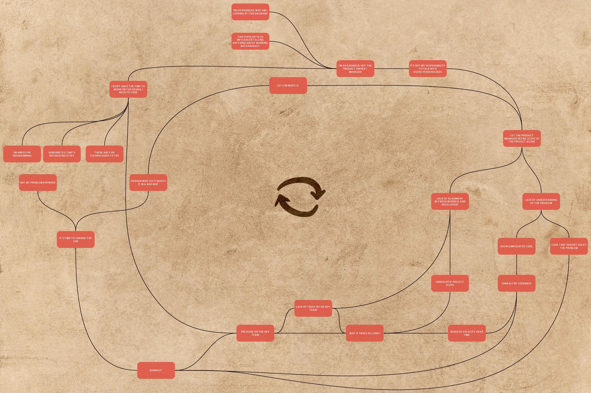
<figcaption aria-hidden="true">The ultimate guide to creating the worst team ever. See the full version.</figcaption>
</figure>

You can see one big loop of things that accelerate each other. Without intervention, problems become bigger and bigger. How can Domain-Driven Design fix that?

Unlike most famous programming gurus, we don’t want you to just believe in our story. We could just make it up. **Fortunately, we can explain why it works by science.** More precisely, with the excellent *Accelerate: The Science of Lean Software and DevOps* book based on scientific research. The research described in the book mentions the characteristics of the best, and worst-performing teams. One of the most critical factors is loosely coupled architecture.

**If you think that microservices may give you loosely coupled architecture – you are very wrong.** I’ve seen microservices that are more coupled than a monolith multiple times. This is why we need something more than just infrastructure solutions. This is the time when Domain-Driven Design (DDD) comes into play.

> This key architectural property enables teams to easily test and deploy individual components or services even as the organization and the number of systems it operates grow—that is, it allows organizations to increase their productivity as they scale.
>
> (…) employing the latest whizzy microservices architecture deployed on containers is no guarantee of higher performance if you ignore these characteristics.
>
> (…)
>
> Architectural approaches that enable this strategy include the use of bounded contexts and APIs as a way to decouple large domains into smaller, more loosely coupled units, and the use of test doubles and virtualization as a way to test services or components in isolation.
>
> ()

#### DDD doesn’t work

Maybe you know someone who tried DDD, and it didn’t work for them?

Maybe you worked with a person who didn’t understand it well, tried to force these techniques, and made everything too complex?

Maybe you’ve seen on Twitter that some famous software engineer said that DDD doesn’t work?

Maybe for you, it’s a legendary Holy Grail that someone claims work for them – but nobody has seen it yet.

<figure>

<figcaption aria-hidden="true">We know what we are doing… kinda</figcaption>
</figure>

Let’s not forget that we are living in the Software Dark Ages. There’s one problem with ideas from the previous epoch – there is a chance that some people may miss the initial point of DDD. That’s not surprising in the context of 2003 when DDD was proposed for the first time.

<figure>
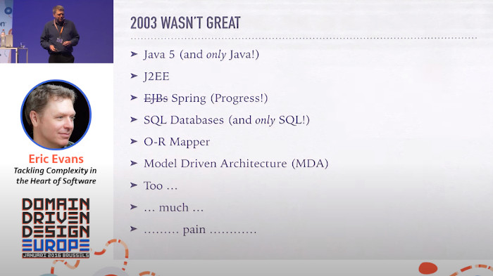
<figcaption aria-hidden="true">DDD in 2003</figcaption>
</figure>

It’s not easy to enter the DDD world. A lot of books and articles are missing the most important DDD points by oversimplifying them. They are also often explained in abstract examples that are detached from reality. It’s also not rare to see too long and too complex examples that are impossible to understand.

Let me try to explain DDD in the simplest way.

#### From the Dark Ages to the Renaissance

DDD techniques can be split into two parts. Tactical and strategic patterns. Tactical Domain-Driven Design patterns are about **how** to implement the solution in the code. There is no rocket science in the Tactical DDD – it’s all about Object-Oriented Programming good practices. But before writing the code, you need to know **what** to implement. That’s where Strategic DDD patterns come into the game.

Many sources describing DDD spend most of the time covering tactical patterns. Sometimes, they even skip strategic patterns. **You can practice DDD by using just the strategic patterns**. In some projects using tactical DDD patterns is even overkill. Unfortunetly, most **people are doing the totally opposite thing. They use just tactical patterns without the strategic part. That’s super horrifying.**

If anybody asked me if any silver bullet exists in product software engineering, I’d have only one candidate: *Domain-Driven Design Strategic Patterns*. Strategic DDD helps us to get the answer about:

- **what problem you are solving?**
- **will your solution meet stakeholders and users expectations?**
- **how complex is the project?**
- **what features are not necessary?**
- **how to separate services to support fast development in the long term?**

These questions are essential while implementing a new project, adding new functionality, or doing refactoring. **Strategic DDD patterns give us a way to answer these questions consistently and predictably.**

Some engineers tell me they are “just engineers”. They don’t care too much about who uses their software or why. They are just implementing, say, JIRA tasks – building services with some bytes on the input and some bytes on the output. Such a mindset leads to a big disconnection between engineers and their clients whose problems we, as engineers, are trying to solve. Without proper communication, it’s much harder to create solutions that help clients in the right way. This is the goal in the end – not simply to process bytes.

It’s tempting to spend a small amount of time on the planning phase of the project. To start coding as soon as possible and finish earlier. When anybody has such doubt, I like to say that *“With 5 days of coding, you can save 1 day of planning”*. The unasked questions will not magically disappear.

The best way to overcome the Software Dark Ages is to attack it from multiple angles. Let’s see how DDD patterns can attack the system.

<figure>

<figcaption aria-hidden="true">See the full version.</figcaption>
</figure>

##### Event Storming

Event Storming is a game-changer for Strategic DDD patterns and software development in general. **I can’t believe why it’s not adopted by every team in the world yet.**

**Event Storming is a workshop during which people with questions (often developers) meet with people with answers (often stakeholders).** During the session, they can quickly explore complex business domains. In the beginning, you are focusing on building an entirely working flow based on *Domain Events* (orange sticky notes). Event Storming is a super flexible method. Thanks to that, you can verify if your solution meets expected requirements. You can also explore data flow, potential problems, or UX depending on the session’s goal.

 

**Verifying if the solution has no gaps and is about what users asked takes minutes. Introducing changes and verifying ideas in the developed and deployed code is hugely more expensive. Changing a sticky note on the board is extremely cheap.**

A civil engineer or a rocket engineer can quickly see the result of a mistake. They can see that something is clearly wrong before finishing the building process. It is not so simple with software because it’s not easily seen. Most of our critical decisions will not hurt anybody. Problems with features development and maintenance will not appear in a day.

Event Storming works when you are **planning both a big project or just a single story.** It’s just a matter of how much time you would like to spend. When we are using it for one story, it can be something between 10 minutes to a couple of hours. We tend to spend between one day to a couple of days of sessions for a bigger functionality.

After the session, you should have the correct answer for the questions about:

- **what problems are you trying to solve** – instead of guessing what may be useful for the end-user or assuming that *“we know everything better”*,
- **if stakeholders are happy with a proposed solution** – rather than verifying that half-year later with the implementation,
- **complexity of the problem is easily visible** – it makes clear why adding one button may require a ton of work,
- **initial idea of how you can split your microservices by responsibilities** – instead of blindly grouping “similar things”.

In the end, you will end up with much more **trust from stakeholders** because you are planning a solution **together**. It’s a much better approach than isolated coding in the basement.

What’s excellent about Event Storming is that the outcome of a properly done session can be mapped directly to the code. It should help you avoid many discussions during development and speed up your work a lot.

<figure>
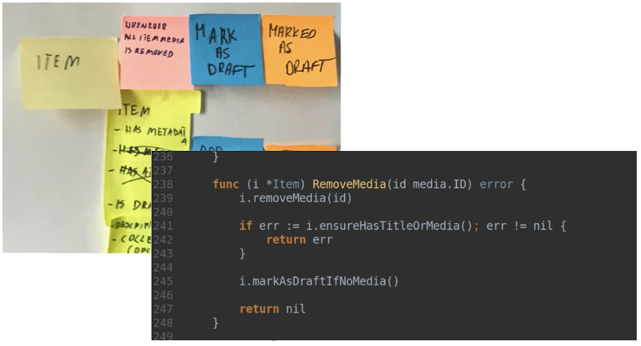
<figcaption aria-hidden="true">Transforming Event Storming directly to the code.</figcaption>
</figure>

You have to start with a clear purpose. Time can fly on a project, and before you know it, you have spent half a year on a project only to find that it’s not useful to anyone. Have you experienced that? It happens more often than you might think, which is why some people lose trust in “engineers” and how we can end up as developers without any autonomy.

It’s common to fear how much time we need to “lose” for running the session. **Thinking about time lost for running session is not the right approach. You should instead think about the benefits that you will lose if you will not run the session.** I heard the story when running one Event Storming session stopped the implementation of the project for a couple months. It may sound bad, but during the session the team found that current assumptions are totally invalid. Continuation of the project would lead to a complete failure. Even if the session may look time-consuming in the short term, the company avoided a couple of months of useless development.

##### Event Modeling

In 2018 Adam Dymitruk proposed the Event Modeling technique. The notation and idea are heavily based on the Event Storming technique but adds a couple of new features. It also puts an extra emphasis on the UX part of the session.

In general, these techniques are pretty compatible. Even if you stay with Event Storming, you may find some valuable approaches from Event Modeling that you may use.

You can read more about the technique on [eventmodeling.org](https://eventmodeling.org/posts/what-is-event-modeling/).

<figure>
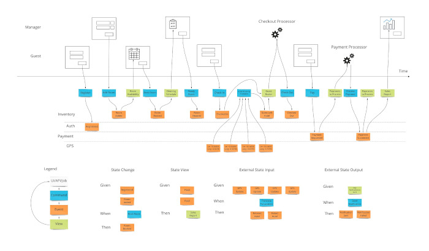
<figcaption aria-hidden="true">Event Modeling</figcaption>
</figure>

##### Bounded Context and transaction boundaries (aggregates)

**Bounded Context is another Strategic DDD pattern that helps us split big models into smaller, logical pieces.**

It’s a key for achieving **proper** services separation. If you need to touch half of the system to implement and test new functionality, your separation is wrong.

Alternative to the wrong separation is lack of separation. Often, a symptom of lack of separation is god objects (huge objects that know too much or do too much). In that case, changes will primarily affect one service. The cost of that approach is a higher risk of big system failure and higher complexity of changes.

In other words – in both cases, it will be harder to develop your project.

A great tool that helps with the discovery of *Bounded Context* and *Aggregates* is (of course) Event Storming.

<figure>
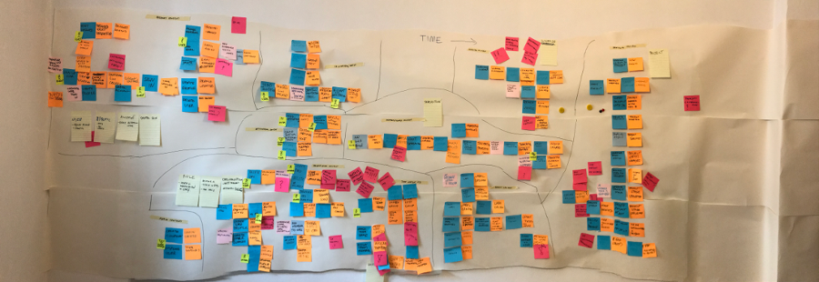
<figcaption aria-hidden="true">Event Storming artifact</figcaption>
</figure>

As a result of the session, you can visually see how you should split your services and touchpoints between them.

##### Ubiquitous Language

**Ubiquitous Language is a Strategic DDD pattern that covers building up a common language between developers, operations, stakeholders, and users.** It is the **most underestimated Strategic DDD pattern.** Because who cares about the language, right?

It took me time to see **how many communication issues between developers and non-developers are because of using a different language.** And how painful it is. I’d encourage you to pay attention to that as well. Because of miscommunication, **developers aren’t solving the right problem as nobody understands what’s expected of them**.

Would you be surprised if I told you that Event Storming will help you develop Ubiquitous Language? Running the session together with stakeholders forces you to talk with them. **It’s hard to build a solution together when you can’t understand each other.** That’s why it’s critical to not miss your stakeholders at the workshop!

 

#### Does DDD solve all problems?

Even if DDD is great, it doesn’t solve all problems that we have. It’s important to manage your expectations. **Even if we use these techniques on a high level in my team, we still have doubts if the created design is good enough.** Sometimes we don’t know how to approach the problem. Sometimes we go back from the code to the design phase. Sometimes we make bad decisions. **All of these are perfectly fine situations. There is no team in the world without these issues. It’s better to assume that it will happen and not be surprised.** But we know that without DDD, these issues would be much more significant.

While using DDD, you should pay special attention to avoid:

- Big Design Up Front,
- implementing code “for the future”,
- trying to create anything perfect,

Instead, you should: - **Focus on delivering the MVP to the user in a short time** (by short, I mean rather 1 month than 6 months). - **If you need to implement something “for the future” because it will be harder to add it later** – that’s a very bad sign. You should think about how to make it easy to add it later. - **Reconcile that even if you do your best, your design will not be perfect from the beginning** – it’s much better to improve it over time.

For some teams, it may need a lot of work to go to this level. But I can promise you from my experience that it’s possible. And the fun that you will have from delivering software again is worth it!

If you feel that you should be a tech leader to propose such improvements – you’re wrong! In the early days, when I was not a leader, I was already proposing many improvements in the teams in which I worked. You need to have good arguments with your teammates.

We always explain “why” the techniques work in our chapters. When you will use these arguments, they should be enough to convince them. If it will not work because your team is close-minded, it’s a good reason to consider changing the job.

#### Software Renaissance

It’s hard to go very deep with presented techniques within one chapter. My goal was rather to inspire you to question the status quo. **This is not how our industry should work. If you are not okay with the status quo, I hope that I inspired you to learn new techniques.** This is the best way to fight with the Software Dark Ages.

What about Strategic DDD patterns? This chapter is actually an introduction to the next part of our chapter series. **In the following months, we will deeply cover the most important Strategic DDD patterns** on a fully working example project.

**Who are you in the Software Dark Ages?**

Just an ordinary hick who blindly follows the rules imposed by others?

Inquisition, who will try to hate and stifle any unusual approach?

Alchemist, trying to create gold? Even if it’s not scientifically backed?

Or maybe you are secretly reading forbidden books in your cellar? Maybe you are looking with us to finish the Software Dark Ages and to begin the Software Renaissance?

### Intermission

That’s all in the book so far, but it’s not the end yet!

We will keep the book up-to-date with every new article coming out on our blog. You can always download the most recent version using the same link from the newsletter.

Meanwhile, we’d love to hear from you. Please let us know if the chapters were easy to understand and if the ideas were helpful. You can reach us at **contact@threedotslabs.com**

### Event Storming *(Coming soon)*

This chapter is not completed yet. When the chapter will be ready, please use the same link that you used to download this copy.

### Bounded Context *(Coming soon)*

This chapter is not completed yet. When the chapter will be ready, please use the same link that you used to download this copy.

### Ubiquitous Language *(Coming soon)*

This chapter is not completed yet. When the chapter will be ready, please use the same link that you used to download this copy.

### Aggregate *(Coming soon)*

This chapter is not completed yet. When the chapter will be ready, please use the same link that you used to download this copy.

### Value Object *(Coming soon)*

This chapter is not completed yet. When the chapter will be ready, please use the same link that you used to download this copy.

### Dependency Injection *(Coming soon)*

This chapter is not completed yet. When the chapter will be ready, please use the same link that you used to download this

[^1]: See Chapter 2: [Building a serverless application with Google Cloud Run and Firebase](#ch003.xhtml_building-a-serverless-application-with-google-cloud-run-and-firebase)

[^2]: See Chapter 14: [Setting up infrastructure with Terraform](#ch015.xhtml_setting-up-infrastructure-with-terraform)

[^3]: See Chapter 2: [Building a serverless application with Google Cloud Run and Firebase](#ch003.xhtml_building-a-serverless-application-with-google-cloud-run-and-firebase)

[^4]: See Chapter 2: [Building a serverless application with Google Cloud Run and Firebase](#ch003.xhtml_building-a-serverless-application-with-google-cloud-run-and-firebase)

[^5]: See Chapter 3: [gRPC communication on Google Cloud Run](#ch004.xhtml_grpc-communication-on-google-cloud-run)

[^6]: See Chapter 6: [Domain-Driven Design Lite](#ch007.xhtml_domain-driven-design-lite)

[^7]: See Chapter 5: [When to stay away from DRY](#ch006.xhtml_when-to-stay-away-from-dry)

[^8]: See Chapter 9: [Clean Architecture](#ch010.xhtml_clean-architecture-1)

[^9]: See Chapter 6: [Domain-Driven Design Lite](#ch007.xhtml_domain-driven-design-lite)

[^10]: See Chapter 9: [Clean Architecture](#ch010.xhtml_clean-architecture-1)

[^11]: See Chapter 9: [Clean Architecture](#ch010.xhtml_clean-architecture-1)

[^12]: See Chapter 6: [Domain-Driven Design Lite](#ch007.xhtml_domain-driven-design-lite)

[^13]: See Chapter 6: [Domain-Driven Design Lite](#ch007.xhtml_domain-driven-design-lite)

[^14]: See Chapter 7: [The Repository Pattern](#ch008.xhtml_the-repository-pattern)

[^15]: See Chapter 7: [The Repository Pattern](#ch008.xhtml_the-repository-pattern)

[^16]: See Chapter 10: [Basic CQRS](#ch011.xhtml_basic-cqrs)

[^17]: See Chapter 9: [Clean Architecture](#ch010.xhtml_clean-architecture-1)

[^18]: See Chapter 9: [Clean Architecture](#ch010.xhtml_clean-architecture-1)

[^19]: See Chapter 10: [Basic CQRS](#ch011.xhtml_basic-cqrs)

[^20]: See Chapter 2: [Building a serverless application with Google Cloud Run and Firebase](#ch003.xhtml_building-a-serverless-application-with-google-cloud-run-and-firebase)
