# Temporal 101

## Table of Contents

- [Introducing Temporal](#introducing-temporal)
  - [What Is Temporal?](#what-is-temporal)
  - [Workflows](#workflows)
- [What Is a Workflow?](#what-is-a-workflow)
  - [A Sequence of Steps](#a-sequence-of-steps)
- [Workflow Examples](#workflow-examples)
  - [Expense Report](#expense-report)
  - [Money Transfer](#money-transfer)
- [Architectural Overview](#architectural-overview)
  - [Temporal Server](#temporal-server)
  - [Temporal Cluster](#temporal-cluster)
  - [Workers](#workers)
  - [Worker Connectivity](#worker-connectivity)
- [Integrating Temporal into Other Applications](#integrating-temporal-into-other-applications)
  - [Direct Integration in an Application Frontend](#direct-integration-in-an-application-frontend)
  - [Integration Through a Backend Application](#integration-through-a-backend-application)
- [Temporal SDKs](#temporal-sdks)
  - [What Is an SDK?](#what-is-an-sdk)
  - [How to Install the Go SDK](#how-to-install-the-go-sdk)
- [The Temporal Command-Line Interface](#the-temporal-command-line-interface)
  - [What Is the Temporal CLI?](#what-is-the-temporal-cli)
  - [History of the CLI](#history-of-the-cli)
  - [How to Use temporal](#how-to-use-temporal)
  - [How to Install temporal](#how-to-install-temporal)
- [Writing a Workflow Definition](#writing-a-workflow-definition)
  - [Starting with Business Logic](#starting-with-business-logic)
  - [Converting a Go Function into a Workflow](#converting-a-go-function-into-a-workflow)
  - [Workflow Type](#workflow-type)
- [Input Parameters and Return Values](#input-parameters-and-return-values)
  - [Values Must Be Serializable](#values-must-be-serializable)
  - [Data Confidentiality](#data-confidentiality)
  - [Avoid Passing Large Amounts of Data](#avoid-passing-large-amounts-of-data)
- [Initializing the Worker](#initializing-the-worker)
  - [The Role of a Worker](#the-role-of-a-worker)
  - [Worker Initialization Code](#worker-initialization-code)
  - [The Lifetime of a Worker](#the-lifetime-of-a-worker)
  - [Choosing Names for Task Queues](#choosing-names-for-task-queues)
- [Executing a Workflow from the Command Line](#executing-a-workflow-from-the-command-line)
  - [Using the CLI to Start a Workflow](#using-the-cli-to-start-a-workflow)
  - [Using the CLI to Start a Workflow with Windows](#using-the-cli-to-start-a-workflow-with-windows)
  - [Explanation of Command Arguments](#explanation-of-command-arguments)
  - [What Happens When You Run the Command](#what-happens-when-you-run-the-command)
- [Hands-On Exercise #1: Hello Workflow](#hands-on-exercise-1-hello-workflow)
- [Executing a Workflow from Application Code](#executing-a-workflow-from-application-code)
  - [Using Application Code to Start a Workflow](#using-application-code-to-start-a-workflow)
  - [Example Starter Code](#example-starter-code)
  - [Requesting Execution](#requesting-execution)
  - [Retrieving the Result](#retrieving-the-result)
- [Viewing Workflow History with the CLI](#viewing-workflow-history-with-the-cli)
  - [Running temporal workflow show](#running-temporal-workflow-show)
  - [Interpreting Command Output](#interpreting-command-output)
  - [Viewing Detailed History](#viewing-detailed-history)
- [Viewing Workflow History from the Web UI](#viewing-workflow-history-from-the-web-ui)
  - [Accessing the Web UI](#accessing-the-web-ui)
  - [Finding and Inspecting an Execution](#finding-and-inspecting-an-execution)
  - [Namespaces](#namespaces)
- [Hands-On Exercise #2: Hello Web UI](#hands-on-exercise-2-hello-web-ui)
- [Making Changes to a Workflow](#making-changes-to-a-workflow)
  - [Preserving Input and Output Compatibility](#preserving-input-and-output-compatibility)
  - [Determinism](#determinism)
  - [Versioning](#versioning)
- [Restarting the Worker Process](#restarting-the-worker-process)
- [What Are Activities?](#what-are-activities)
  - [Activity Definitions](#activity-definitions)
  - [Activity Definition Example](#activity-definition-example)
- [Registering Activities](#registering-activities)
- [Executing Activities](#executing-activities)
- [Using Appropriate Timeouts](#using-appropriate-timeouts)
- [How Temporal Handles Activity Failure](#how-temporal-handles-activity-failure)
  - [Default Retry Behavior](#default-retry-behavior)
  - [Changing Retry Timing and Attempt Limits](#changing-retry-timing-and-attempt-limits)
- [Activity Retry Policy Example](#activity-retry-policy-example)
- [Hands-On Exercise #3: Farewell Workflow](#hands-on-exercise-3-farewell-workflow)
- [About This Example](#about-this-example)
  - [Actors in the Execution](#actors-in-the-execution)
  - [Workers and Task Queues](#workers-and-task-queues)
  - [Commands and Recovery](#commands-and-recovery)
- [Code Walkthrough](#code-walkthrough)
  - [Starting the Worker and Workflow](#starting-the-worker-and-workflow)
  - [Executing the Greeting Activity](#executing-the-greeting-activity)
  - [Executing the Farewell Activity and Recovering from Failure](#executing-the-farewell-activity-and-recovering-from-failure)
  - [Completing the Workflow](#completing-the-workflow)
- [Hands-On Exercise #4: Finale Workflow](#hands-on-exercise-4-finale-workflow)
- [Conclusion](#conclusion)
  - [Essential Points](#essential-points)
  - [Parting Words](#parting-words)

## Introducing Temporal

### What Is Temporal?

Temporal is a platform for **durable execution**: it preserves application progress across network outages, server crashes, and application crashes, allowing developers to focus on business logic rather than custom infrastructure-recovery code.

### Workflows

A **Workflow** is the main abstraction used to build a Temporal application. It is written in a general-purpose language such as Go, Java, TypeScript, or Python using a Temporal SDK. A Workflow can run for years: after a failure, Temporal reconstructs its state from recorded history and resumes execution.

## What Is a Workflow?

### A Sequence of Steps

A Workflow represents a sequence of steps needed to complete a process.

- A **Workflow Definition** is the code that defines those steps.
- A **Workflow Execution** is a running instance of that code.

## Workflow Examples

Processes such as buying concert tickets, booking a vacation, or filing an expense report consist of coordinated steps. The following examples illustrate how Workflows model those steps.

### Expense Report

An expense report is a multi-step Workflow involving several participants:

1. The employee creates the report, lists expenses, attaches receipts, and submits it.
2. The manager reviews the report and approves or rejects it.
3. If rejected, the employee is notified and may correct and resubmit it.
4. If approved, accounting reimburses the employee, sends a notification, and archives the report for possible audits.

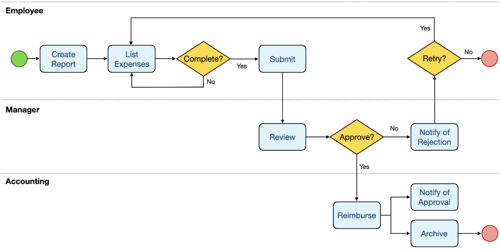

Important characteristics of this Workflow:

- **Long-running:** The process may take days, weeks, or longer.
- **Conditional:** Approval and rejection lead to different execution paths.
- **Cyclic:** A rejected report can be corrected, resubmitted, and reviewed again.
- **Human interaction:** Employees, managers, and accounting staff participate at different stages.
- **External systems:** Reimbursement involves the employer's and employee's banks.

### Money Transfer

A Workflow can be composed of smaller Workflows. For example, the reimbursement step contains two operations:

1. Withdraw money from the employer's account.
2. Deposit the same amount into the employee's account.

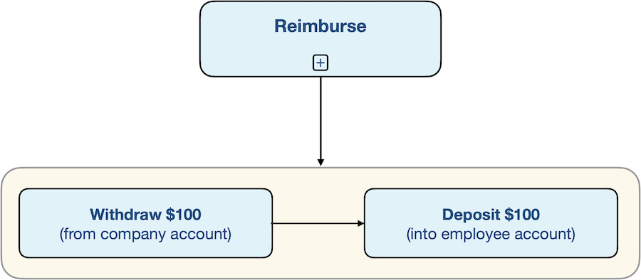

The transfer must complete both operations without applying either twice. Temporal preserves orchestration progress, but external side effects still require idempotency or deduplication because Activities can be retried; durable execution alone does not guarantee exactly-once bank transactions.

Because the accounts are typically accessed through remote procedure calls, a money transfer is a **distributed system** operation. Servers and networks can fail between the withdrawal and deposit. Without durable execution:

- The accounts could be left with inconsistent balances.
- The application could lose its current state.
- Restarting from the beginning could withdraw the money a second time instead of continuing with the deposit.

Temporal preserves Workflow progress through these failures, allowing execution to resume from the correct point instead of requiring custom recovery logic throughout the application.

## Architectural Overview

### Temporal Server

The name **Temporal** may refer to the company or its software, but without additional context it usually means the **Temporal Platform**. The platform has two sides: the Temporal Server and its clients.

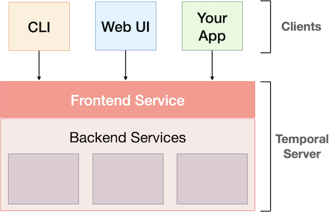

The **Temporal Server** contains:

- A **Frontend Service** that acts as an API gateway for clients
- Several backend services that manage application execution
- Horizontally scalable services, usually with multiple instances across several machines for performance and availability

The three client types used in this course are:

- Temporal CLI
- Temporal Web UI
- A Temporal Client embedded in an application

Clients send requests to the Frontend Service. It coordinates with the necessary backend services and returns a response. The Frontend Service is for software clients; it is not a user-facing frontend.

Communication with and within the cluster uses:

- **gRPC** for high-performance remote procedure calls
- **Protocol Buffers** to encode messages
- Optional **TLS** to encrypt network traffic and verify client and server identities using certificates

### Temporal Cluster

A **Temporal Cluster** is the complete deployed system: the Temporal Server running on one or more machines plus its supporting components.

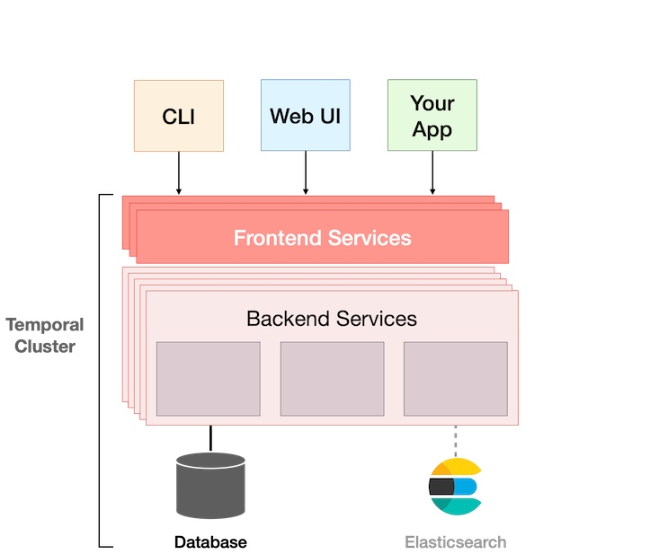

The required supporting component is persistence storage, such as Cassandra, PostgreSQL, or MySQL for a production cluster. Our local development server uses SQLite. Temporal persists:

- The current state of every Workflow Execution
- The history of Events produced during each execution
- Durable timers and queues
- Other information needed to reconstruct state after a failure

**Visibility storage** supports searching, sorting, and filtering Workflow Executions. Depending on the server version and configuration, advanced visibility can use supported SQL databases or Elasticsearch; Elasticsearch is not required for every deployment.

Common monitoring tools include:

- **Prometheus**, which collects Temporal metrics
- **Grafana**, which builds dashboards from those metrics

### Workers

The Temporal Cluster **does not execute application code**. It guarantees durable execution by orchestrating code that runs outside the cluster.

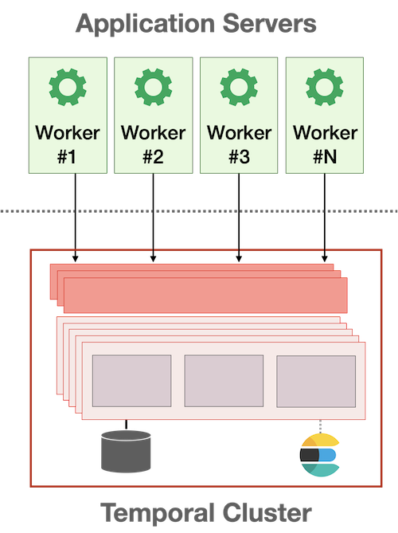

A **Worker** is part of the application and executes its Workflow and business-logic code. Workers communicate with the Temporal Cluster to coordinate Workflow Execution.

- Workers commonly run on multiple application servers for scalability and availability.
- Application servers may be in a different data center from the Temporal Cluster.
- Each Worker machine needs the application code, Worker initialization code, and all required libraries and dependencies.
- An application may also contain code that starts Workflows or checks their status.

### Worker Connectivity

A Worker uses an embedded Temporal Client to communicate with the cluster's Frontend Service.

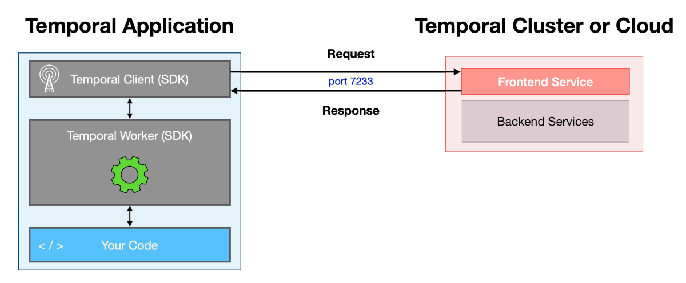

Every machine running a Worker must be able to reach the Frontend Service. By default, it listens on **TCP port 7233**.

## Integrating Temporal into Other Applications

Course exercises use the CLI and terminal code for quick iteration, but production users usually interact with Temporal indirectly. For example, a customer action in a web or mobile application may start an order-processing or financial-transaction Workflow without the customer knowing Temporal is involved.

### Direct Integration in an Application Frontend

A web or mobile frontend can use a Temporal Client or send gRPC requests directly to the Temporal Cluster, but this is atypical.

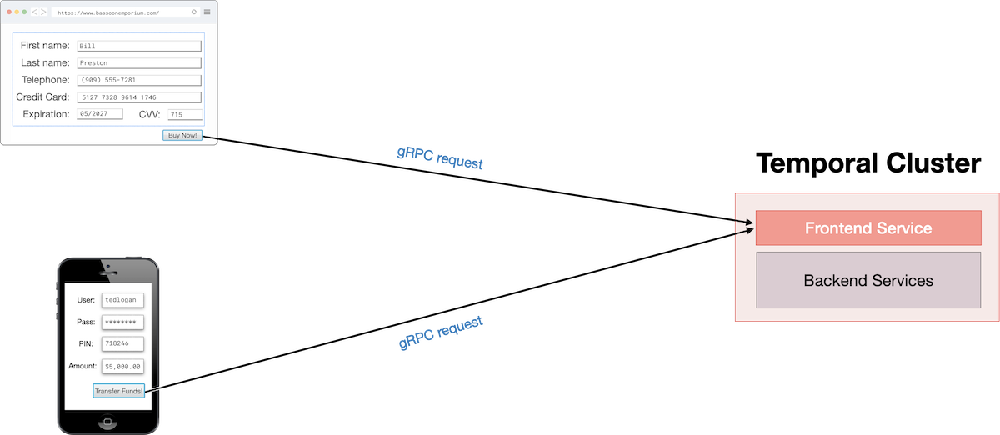

Direct integration requires the cluster's Frontend Service to accept connections from every end-user application, which makes network security and connectivity more difficult to manage.

### Integration Through a Backend Application

The typical approach is to place a backend service between the end-user application and Temporal.

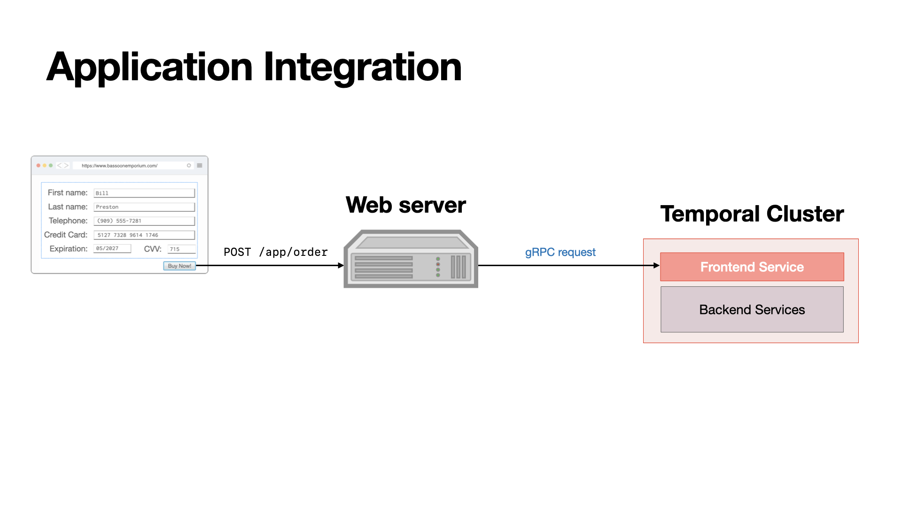

A common request flow is:

1. A user submits a form or performs an action in a web or mobile application.
2. The frontend sends an HTTP request to a backend endpoint, such as a REST order-processing endpoint.
3. The backend extracts data from the request.
4. The backend uses an embedded Temporal Client to start a Workflow Execution with that data as input.
5. The Temporal Client sends a gRPC request to the cluster's Frontend Service.

The backend can also expose endpoints that use the Temporal Client to cancel a Workflow or retrieve its result.

**Why this is preferred:** The Temporal Cluster only needs to accept inbound connections from trusted backend servers, rather than from every end user's device.

## Temporal SDKs

### What Is an SDK?

A **Software Development Kit (SDK)** is the language-specific library used to develop Temporal applications.

- Workflow code calls APIs provided by the Temporal SDK.
- The SDK uses a Temporal Client to communicate with the Temporal Cluster.

Temporal provides SDKs for several languages, including Go, Java, TypeScript, PHP, Python, and .NET.

### How to Install the Go SDK

This project's `go.mod` already declares the Go SDK dependency; Go downloads it when needed.

For a future Go project, run the following command from the module root containing `go.mod`:

```bash
go get go.temporal.io/sdk
```

Other languages use their usual package-management conventions; consult the Temporal documentation for language-specific installation instructions.

## The Temporal Command-Line Interface

### What Is the Temporal CLI?

`temporal` is Temporal's command-line interface for managing, monitoring, and debugging Temporal applications. It can:

- Start a local development server
- Start and operate Workflow Executions
- Inspect Workflow status, state, and Event History
- Send messages to running Workflows
- Manage Task Queues, Schedules, batch jobs, and deployments

This course primarily uses it to start Workflows and inspect their execution status and history.

### History of the CLI

The `temporal` CLI combines capabilities from two older tools:

- **Temporalite:** DataDog's lightweight Temporal Cluster for development
- **tctl:** Temporal's original command-line interface

`temporal` replaces `tctl`, but older learning material may still use `tctl`. Their syntax is similar, so commands are usually straightforward to translate.

### How to Use temporal

Useful command groups include `server`, `workflow`, `activity`, `task-queue`, `schedule`, and `operator`. The examples below assume `temporal` is on your PATH; in our Docker setup, prefix CLI commands with `docker compose -f docker-compose-dev.yml exec temporal`.

Help is available at every command level:

```bash
temporal --help
temporal workflow --help
temporal workflow execute --help
```

Common examples:

```bash
# Start a local development server
temporal server start-dev

# List Workflow Executions
temporal workflow list
```

The general command structure is:

```text
temporal <command> <subcommand> [flags]
```

### How to Install temporal

Our Docker image includes the CLI, so no host installation is needed. `make up` starts the dev server, and the Makefile runs CLI commands inside its container. If a host CLI is needed on this Nix-managed machine, add it through the project's Nix dev shell.

## Writing a Workflow Definition

In Go, a Temporal **Workflow Definition** is a function containing the Workflow's business logic. A basic Workflow can begin as an ordinary Go function with no Temporal-specific code.

### Starting with Business Logic

```go
package app

func GreetSomeone(name string) string {
	return "Hello " + name + "!"
}
```

This ordinary Go function receives a name and returns a customized greeting. It is not yet a Workflow Definition.

### Converting a Go Function into a Workflow

Three changes turn the function into a Temporal Workflow Definition:

1. Import the SDK's `workflow` package.
2. Add `workflow.Context` as the first parameter.
3. Include an `error` in the return values, using `nil` when no error occurred.

The examples export the function so a separate Worker package can register it.

```go
package app

import "go.temporal.io/sdk/workflow"

func GreetSomeone(ctx workflow.Context, name string) (string, error) {
	return "Hello " + name + "!", nil
}
```

The SDK supplies `workflow.Context`; `name` is the business input. This implementation always succeeds, returning the greeting and a `nil` error.

### Workflow Type

Every Workflow has a **Workflow Type**, which identifies its definition.

- In the Go SDK, the default Workflow Type is the Workflow function's name, such as `GreetSomeone`.
- Temporal does not otherwise require a particular function naming convention.
- The default can be overridden with a more user-friendly value.
- The Web UI groups and displays Workflow Executions by Workflow Type.

## Input Parameters and Return Values

### Values Must Be Serializable

Temporal stores Workflow inputs and outputs in the Workflow Execution's **Event History**. This makes past execution details available for inspection in the Web UI, but requires every input parameter and return value to be serializable.

Temporal's default Data Converter supports:

- Null and binary values
- Data supported by Go's JSON serialization
- Protocol Buffer messages

JSON-compatible values include numbers, booleans, strings, and structs with serializable exported fields. Channels, functions, and unsafe pointers cannot be used as Workflow inputs or outputs. The SDK-supplied `workflow.Context` is not a serialized input.

### Data Confidentiality

Sensitive payloads can be protected with a **Payload Codec** configured through the Data Converter, encrypting them before they enter the Temporal Cluster and decrypting them in clients and Workers.

Payload encryption is beyond this course's scope; consult the Temporal documentation when a Workflow handles confidential data.

### Avoid Passing Large Amounts of Data

Inputs and outputs are both transmitted over the network and stored in Event History, so keeping payloads small improves performance.

For example, an audio-conversion Workflow should receive a file path or URL rather than the entire audio file.

**Rule of thumb:** Store large data outside Temporal and pass a reference that the application can use to retrieve it.

The Temporal Server enforces payload and Event History limits, issuing warnings or errors when they are exceeded. Consult the current documentation for the exact limits.

## Initializing the Worker

### The Role of a Worker

A **Worker** executes Workflow code. The Temporal SDK provides the Worker implementation, while the application provides the code that configures and starts it.

When started, a Worker:

1. Connects persistently to the Temporal Cluster.
2. Polls a specific **Task Queue** for work.
3. Executes tasks using the Workflow Definitions registered with it.

**Key consequence:** A Workflow Execution cannot make progress unless a Worker capable of running its Workflow Type is available.

### Worker Initialization Code

The illustrative snippets use `app` as a placeholder import for the package containing `GreetSomeone`. Substitute your module's actual import path; Exercise #1 instead keeps its definition and Worker together in `package main`.

```go
package main

import (
	"app"
	"log"

	"go.temporal.io/sdk/client"
	"go.temporal.io/sdk/worker"
)

func main() {
	c, err := client.Dial(client.Options{})
	if err != nil {
		log.Fatalln("Unable to create client", err)
	}
	defer c.Close()

	w := worker.New(c, "greeting-tasks", worker.Options{})
	w.RegisterWorkflow(app.GreetSomeone)

	if err := w.Run(worker.InterruptCh()); err != nil {
		log.Fatalln("Unable to start worker", err)
	}
}
```

**Meaning:**

- `client.Dial` creates the Temporal Client used to communicate with the cluster.
- `defer c.Close()` releases the client's resources when the process exits.
- `worker.New` creates a Worker that polls the `greeting-tasks` Task Queue.
- `RegisterWorkflow` tells the Worker how to execute the `GreetSomeone` Workflow Type.
- `Run` starts polling and blocks until the process receives an interrupt or encounters a fatal error.

The default client connects to `localhost:7233`; other deployments may require address and authentication settings. A Worker can register multiple definitions. After `Run` starts, it long-polls for tasks, so an idle-looking terminal is normal.

### The Lifetime of a Worker

A Worker's process lifetime is independent of a Workflow Execution's lifetime.

- `Run` is blocking, so a Worker commonly runs continuously for days, weeks, or longer.
- One Worker may execute thousands or millions of short Workflow Executions.
- A Workflow Execution may last for years and outlive many individual Worker processes.
- If one Worker stops, another Worker polling the same Task Queue and registered for the same Workflow Type can continue the execution.
- If no other Worker is available, the Workflow waits and resumes when a suitable Worker starts again.

Worker downtime delays progress but does not, by itself, fail the Workflow Execution.

### Choosing Names for Task Queues

Task Queue names are case-sensitive. Use names that are descriptive but short enough to remember and type reliably.

- Prefer `greeting-tasks`: clear and concise.
- Avoid `gtq`: too cryptic.
- Avoid `task-queue-name-for-the-greeting-workflow`: unnecessarily long and error-prone.

## Executing a Workflow from the Command Line

### Using the CLI to Start a Workflow

After the Workflow Definition has been registered and its Worker is running, the CLI can request a new Workflow Execution:

```bash
temporal workflow start \
  --type GreetSomeone \
  --task-queue greeting-tasks \
  --workflow-id my-first-workflow \
  --input '"Donna"'
```

In a Unix-style shell, the outer single quotes protect the JSON string's inner double quotes. The Workflow therefore receives the Go string `Donna`, not malformed shell text.

### Using the CLI to Start a Workflow with Windows

Quoting passed to native executables varies between PowerShell versions. An input file avoids that ambiguity:

```powershell
'"Donna"' | Set-Content -Encoding ascii input.json
temporal workflow start --type GreetSomeone --task-queue greeting-tasks --workflow-id my-first-workflow --input-file input.json
```

The file contains the JSON string `"Donna"`, which the CLI supplies as the Workflow input.

### Explanation of Command Arguments

The command connects four values:

1. **Workflow Type:** Defaults to the Go Workflow Definition function name, here `GreetSomeone`.
2. **Task Queue:** Must exactly match the name used by `worker.New`, including case.
3. **Workflow ID:** An optional but recommended user-defined identifier with business meaning. Temporal generates a UUID when it is omitted.
4. **Input:** JSON-encoded arguments for the Workflow Definition.

A misspelled Task Queue name does not produce an immediate error because Task Queues are created dynamically. Instead, it creates or selects a different queue that no suitable Worker may be polling, so the Workflow Execution remains unable to progress.

Inline JSON is convenient for simple input. For larger or more complex values, store the JSON in a file and pass its path with `--input-file`.

### What Happens When You Run the Command

The cluster accepts the request and returns two identifiers:

- **Workflow ID:** The business identifier supplied by the caller, or a generated UUID.
- **Run ID:** A unique identifier for this specific Workflow Execution run.

The `start` command does not wait for or print the Workflow result because a Workflow may run for months or years. Inspect the execution and its result separately:

```bash
temporal workflow show --workflow-id my-first-workflow
```

## Hands-On Exercise #1: Hello Workflow

This exercise connects the CLI, Temporal Server, and a Go Worker to execute a greeting Workflow.

**Files:**

- `01-hello-workflow/greeting.go`: `GreetSomeone` receives a name and returns `"Hello " + name + "!"` with a `nil` error.
- `01-hello-workflow/main.go`: connects to Temporal, creates a Worker polling `greeting-tasks`, registers `GreetSomeone`, and runs until interrupted.
- `docker-compose-dev.yml`: runs the development server in Docker, exposes port `7233` and the Web UI at http://localhost:8233, and persists data in the `temporal-data` volume.
- `Makefile`: provides commands for starting the server, viewing logs, running the Worker, and executing the Workflow.

Both Go files must use `package main`. The Worker's default client address, `localhost:7233`, matches Docker's published port.

Run these commands from the course directory (`01-temporal-101`):

```bash
make up
make logs
make worker
```

Leave the Worker running, then execute the Workflow from another terminal:

```bash
make hello
```

`make worker` runs `go run ./01-hello-workflow`, including both Go files. `make hello` uses the CLI inside the Docker container to execute `GreetSomeone` on `greeting-tasks`, with Workflow ID `hello-andy-1` and JSON input `'"Andy"'`. Unlike `workflow start`, `workflow execute` waits for completion and displays the result: `"Hello Andy!"`.

**Execution flow:** CLI inside Docker → Temporal Server queues a task → Go Worker on the host runs `GreetSomeone` → server stores the result.

## Executing a Workflow from Application Code

### Using Application Code to Start a Workflow

The Temporal Client can start a Workflow from application code instead of the CLI. Both approaches request execution through the Temporal Server; a Worker still executes the Workflow Definition.

Starting Workflows from code integrates Temporal into an application. For example, a backend can start or terminate a Workflow in response to a user clicking a button in a web or mobile app. Later exercises use starter programs to avoid repeatedly typing long CLI commands.

### Example Starter Code

This starter uses the same illustrative `app` package as the Worker example.

```go
package main

import (
	"app"
	"context"
	"log"
	"os"

	"go.temporal.io/sdk/client"
)

func main() {
	if len(os.Args) != 2 {
		log.Fatalln("Usage: starter <name>")
	}

	c, err := client.Dial(client.Options{})
	if err != nil {
		log.Fatalln("Unable to create client", err)
	}
	defer c.Close()

	options := client.StartWorkflowOptions{
		ID:        "my-first-workflow",
		TaskQueue: "greeting-tasks",
	}

	we, err := c.ExecuteWorkflow(context.Background(), options, app.GreetSomeone, os.Args[1])
	if err != nil {
		log.Fatalln("Unable to execute workflow", err)
	}
	log.Println("Started workflow", "WorkflowID", we.GetID(), "RunID", we.GetRunID())

	var result string
	if err := we.Get(context.Background(), &result); err != nil {
		log.Fatalln("Unable to get workflow result", err)
	}
	log.Println("Workflow result:", result)
}
```

### Requesting Execution

The client setup is the same as in Worker initialization. Real applications can share a client between Worker and starter code; the course keeps them separate to make their roles clear.

`client.StartWorkflowOptions` supplies the Workflow ID and Task Queue, corresponding to the CLI's `--workflow-id` and `--task-queue` flags. The queue must match the Worker's queue.

`ExecuteWorkflow` receives:

- A standard Go `context.Context` for the client request—not the `workflow.Context` used inside a Workflow Definition.
- The execution options.
- The Workflow function reference, `app.GreetSomeone`, which identifies the Workflow Type; it does not invoke the function locally.
- The business input, here the name read from `os.Args[1]`.

Unlike CLI input, Go input does not need manual JSON encoding or shell quoting. Pass a supported Go value directly; the SDK's Data Converter serializes it, typically as JSON for ordinary strings and structs.

**Timing:** `ExecuteWorkflow` waits for the server's response to the start request, but does not wait for the Workflow to finish. On success, it returns a `client.WorkflowRun` handle, and the program can immediately log its Workflow ID and Run ID.

### Retrieving the Result

Waiting for the result is optional. The returned `WorkflowRun` acts as a future-like handle: calling `Get` blocks until the Workflow completes or the call returns an error.

- Declare a variable matching the Workflow's output type, here `string`.
- Pass its address so the SDK can decode the output into it.
- On successful completion, `result` contains the greeting.
- On failure, check the returned error rather than treating `result` as a successful output.

With `context.Background()`, the wait has no caller-imposed deadline and could last as long as the Workflow. A caller can use a context with a timeout to limit its wait; timing out that context does not itself cancel the Workflow Execution.

The starter can exit after starting a Workflow; execution continues independently through the server and Workers.

## Viewing Workflow History with the CLI

The Temporal Service maintains an **Event History** for each Workflow Execution. This provides insight into applications that are currently running or have recently run, including their execution progress and results.

### Running temporal workflow show

Display a Workflow's history with its Workflow ID:

```bash
temporal workflow show --workflow-id my-first-workflow
```

For our Docker-based Exercise #1, `make history` runs this command inside the container for `hello-andy-1`.

### Interpreting Command Output

The course's greeting Workflow produces a short history:

```text
Progress:
  ID           Time                     Type
    1  2025-03-10T17:38:31Z  WorkflowExecutionStarted
    2  2025-03-10T17:38:31Z  WorkflowTaskScheduled
    3  2025-03-10T17:38:31Z  WorkflowTaskStarted
    4  2025-03-10T17:38:31Z  WorkflowTaskCompleted
    5  2025-03-10T17:38:31Z  WorkflowExecutionCompleted

Results:
  Status          COMPLETED
  Result          "Hello Donna!"
  ResultEncoding  json/plain
```

Each row has an Event ID, timestamp, and type:

1. **WorkflowExecutionStarted:** The server recorded the start of the execution.
2. **WorkflowTaskScheduled:** A Workflow Task was scheduled on the Task Queue.
3. **WorkflowTaskStarted:** A Worker began processing that task.
4. **WorkflowTaskCompleted:** The Worker completed the task and reported its commands to the server.
5. **WorkflowExecutionCompleted:** The server recorded successful Workflow completion and its result.

The `Results` section shows the execution status, returned greeting, and payload encoding. Our Exercise #1 returns `"Hello Andy!"` instead. Event timestamps and exact output formatting vary between executions and CLI versions.

**Key distinction:** Completing a Workflow Task is not necessarily completing the entire Workflow. This simple Workflow finishes after one task; more complex Workflows can require many tasks over their lifetime.

### Viewing Detailed History

Add `--detailed` to inspect each Event's attributes:

```bash
temporal workflow show \
  --workflow-id my-first-workflow \
  --detailed
```

Use `make history-detailed` for the same operation in our Docker setup.

The same Events appear with additional context. Useful fields include:

| Event | Details to inspect |
| :--- | :--- |
| `WorkflowExecutionStarted` | Workflow ID, Run IDs, Workflow Type (`GreetSomeone`), Task Queue (`greeting-tasks`), input, client identity, and timeout settings |
| `WorkflowTaskScheduled` | Task Queue, attempt, and task timeout |
| `WorkflowTaskStarted` | Worker identity, scheduled Event reference, and Worker build information when present |
| `WorkflowTaskCompleted` | Scheduled/started Event references and SDK metadata such as SDK name and version |
| `WorkflowExecutionCompleted` | Returned greeting and the reference to the Workflow Task that requested completion |

Event references connect the sequence: a started task refers to its scheduled Event, a completed task refers to its scheduled and started Events, and Workflow completion refers to the completed task.

## Viewing Workflow History from the Web UI

The Web UI displays Workflow Execution status, inputs, outputs, and Event History. Like the CLI, it helps explain what happened during an execution, not just whether it succeeded.

### Accessing the Web UI

The address depends on the deployment:

- **Our Docker Compose setup:** Run `make up`, then open http://localhost:8233. Our `docker-compose-dev.yml` publishes the development server's UI port `8233`.
- **Temporal Cloud:** Access the authenticated UI at https://cloud.temporal.io.
- **Self-hosted production:** Ask the administrator for the UI hostname and port.

### Finding and Inspecting an Execution

The main page lists recent Workflow Executions in the selected namespace. Filter the list using a combination of:

- Workflow ID
- Workflow Type
- Time window
- Execution status

Timestamp display options include UTC, local time, and relative time, such as “32 minutes ago.”

Click an execution to open its detail page. It displays:

- **Identifiers and routing:** Workflow ID, Workflow Type, and Task Queue.
- **Input and output:** The values passed to the Workflow and its returned result, when available.
- **Event History:** The Events recorded during execution, which can be inspected for more detail.

### Namespaces

A **namespace** provides logical isolation within Temporal. The UI's execution table is scoped to the selected namespace, not the entire cluster.

Possible ways to organize namespaces include:

- **Environment:** `development` and `production`.
- **Team or department:** Marketing and Accounting.

Some settings and identity rules apply per namespace rather than cluster-wide. In particular, **only one running Workflow Execution can have a given Workflow ID within a namespace**. The same ID can be used independently in another namespace.

If a start request conflicts with an already-running Workflow ID, the configured conflict behavior determines whether it fails, returns a handle to the existing execution, or replaces it by terminating it and starting another. Reusing an ID after an execution closes is a separate decision governed by the Workflow ID reuse policy.

The selected namespace appears near the top of the UI. Use **Namespaces** in the navigation to view available namespaces and switch between them. The development server creates a namespace named `default`, which our current client and CLI commands use by default.

Additional namespaces can be registered using the `temporal` CLI. Application code selects a namespace through the `Namespace` field in `client.Options`; CLI requests can select one with `--namespace`.

**Key distinction:** A namespace isolates executions and namespace-level configuration; a Task Queue routes tasks to Workers within that namespace.

## Hands-On Exercise #2: Hello Web UI

This exercise uses the Web UI to inspect the Workflow Execution from Exercise #1. No code changes are needed.

1. Ensure the Docker-based Temporal server is running with `make up`.
2. Open http://localhost:8233 and select the `default` namespace.
3. View the recent Workflow Executions and find `hello-andy-1`, filtering by Workflow ID if needed.
4. Click the execution to open its detail page.
5. Locate the following information:

   | Detail | Expected value or meaning |
   | :--- | :--- |
   | Workflow Type | `GreetSomeone` |
   | Task Queue | `greeting-tasks` |
   | Status | `Completed` for the successful greeting execution |
   | Start time | When this execution began |
   | Close time | When this execution completed |
   | Input | `"Andy"` |
   | Output | `"Hello Andy!"` |

Open the **Input and Results** section (`</>`) to inspect the payloads; labels and layout may vary with the UI version. The timestamps are specific to your execution, and their display depends on the selected timezone format.

If you have not yet completed Exercise #1, run `make worker` in one terminal and `make hello` in another to create the execution. An already-completed execution can be inspected without leaving the Worker running.

## Making Changes to a Workflow

Backwards compatibility matters because one Workflow Definition can have many executions, including executions that remain active for months or years. After a Worker failure, Temporal can reconstruct an execution's state by replaying its recorded Event History and then continue processing. Updated code must remain compatible with that history and its stored payloads.

### Preserving Input and Output Compatibility

In general, avoid changing the number or types of a Workflow's business input parameters and return values. Existing executions already have serialized inputs, and callers depend on the output contract.

Temporal recommends a **single input struct** rather than multiple business input parameters, in addition to the required `workflow.Context`. Fields can evolve without changing the function's parameter type.

This still requires compatible field changes: adding an optional field is usually easier to support than renaming a field, changing its type, or making a new field mandatory. New code must handle older payloads that lack the added field. Similar care applies to output structs and consumers reading their results.

The course uses simple parameters such as `name string` to reduce complexity for Go beginners; production-oriented Go tutorials demonstrate the struct-based pattern.

### Determinism

Workflow code orchestrates work deterministically. A useful first intuition is “the same input produces the same behavior,” but Temporal's actual requirement is **replay compatibility: given the recorded history, Workflow code must produce the same sequence of commands that history expects**.

Returning the same final value is not enough if the code changes which Activities are scheduled or their order. Conversely, a Workflow can use recorded Activity results to orchestrate work whose original outcome was non-deterministic.

Avoid ordinary randomness, direct external I/O, and other uncontrolled sources of variation inside Workflow code. Use the SDK's Workflow-safe APIs for operations such as time and timers rather than ordinary wall-clock calls or sleeps.

### Versioning

Long-running executions may still depend on an old Workflow Definition when new requirements arrive. For example, changing an order Workflow from sending only an email to sending an email and a text message can alter its command sequence and conflict with an existing execution's history.

Temporal provides versioning mechanisms for introducing such changes safely:

- **SDK patching/version markers:** Keep compatible code paths in the Workflow so replay follows the version recorded for an existing execution, while new executions can follow the updated path.
- **Worker Versioning:** Route executions to appropriate Worker code versions, allowing existing executions to remain on compatible code while new executions use a new version, depending on deployment configuration.

Versioning manages compatibility; it does not make arbitrary non-deterministic Workflow code safe. Not every edit needs versioning, but changes that alter commands expected during replay require a compatibility strategy.

The free **Versioning Workflows** course explores these techniques further.

## Restarting the Worker Process

After changing application code, deploy and restart the Workers that execute it. Saving a source file does not update an already-running Go process: it continues running the previously compiled code.

The course demonstrates changing the greeting from English to Spanish:

```go
func GreetSomeone(ctx workflow.Context, name string) (string, error) {
	return "¡Hola " + name + "!", nil
}
```

For our local setup:

1. Edit `01-hello-workflow/greeting.go` and save the change.
2. If you run `make hello` before restarting the Worker, the old process still returns `"Hello Andy!"`.
3. In the terminal running `make worker`, press **Ctrl-C** to stop the Worker.
4. Run `make worker` again. `go run` compiles the updated code and starts a new Worker process.
5. In another terminal, run `make hello` to create a new execution.
6. Open http://localhost:8233, select the latest run of `hello-andy-1`, and inspect **Input and Results**. The new result should be `"¡Hola Andy!"`.

The Makefile reuses the same Workflow ID. Once the previous execution has completed, the default reuse policy permits another execution with that ID; each run has a different Run ID. Inspect the latest run rather than expecting an old completed execution's stored result to change.

Restart the **Worker**, not the Docker-based Temporal server. In a deployment with multiple Workers, all Workers serving the affected code must be updated through an appropriate rollout/versioning strategy; an old Worker can otherwise continue processing tasks with old code.

Restarting a Worker does not make replay-incompatible code changes safe; existing executions still require a compatibility strategy.

## What Are Activities?

An **Activity** encapsulates business logic that interacts with the outside world or is prone to transient failure. Unlike Workflow code, an Activity Definition does **not** need to be deterministic.

Use Activities for operations such as accessing files, making network requests, querying databases, or invoking LLMs and AI services. These resources may be unavailable, and repeated calls can produce different results. Workflow code coordinates these operations using replay-compatible commands rather than performing the external work directly.

Activity results are recorded in Event History and reused during Workflow replay. Failed attempts can be retried without restarting the entire Workflow. Because an Activity can execute more than once, side effects must tolerate retries, typically through idempotency.

### Activity Definitions

In Go, an Activity Definition is a function:

- Export it when registering it from a separate package; Temporal otherwise imposes no naming convention.
- It returns an `error`, optionally alongside a supported result value.
- Business inputs and outputs must be serializable, just like Workflow payloads. JSON-compatible values are supported; channels and unsafe pointers are not.
- It can live in the same source file as the Workflow Definition or in a separate file.

Unlike a Workflow Definition, an Activity does not require a particular first parameter. However, using **`context.Context` as the first parameter is recommended**. It provides access to Activity cancellation and SDK features such as heartbeating for long-running work. The SDK supplies this context; it is not a serialized business input.

Use `context.Context` for Activities, not the `workflow.Context` used by Workflow Definitions. Pass the Activity context into external operations so they can respond to cancellation.

### Activity Definition Example

`GreetInSpanish` requests a greeting from a microservice over HTTP. It URL-encodes the supplied name, reads the response body, and returns either the greeting or an error.

This version uses `io.ReadAll` and attaches the Activity context to the HTTP request. The local exercise's `callService` helper uses `http.Get` instead, so it does not propagate Activity cancellation to the request.

```go
package serviceworkflow

import (
	"context"
	"fmt"
	"io"
	"net/http"
	"net/url"
)

func GreetInSpanish(ctx context.Context, name string) (string, error) {
	endpoint := "http://localhost:9999/get-spanish-greeting?name=" + url.QueryEscape(name)
	req, err := http.NewRequestWithContext(ctx, http.MethodGet, endpoint, nil)
	if err != nil {
		return "", err
	}

	resp, err := http.DefaultClient.Do(req)
	if err != nil {
		return "", err
	}
	defer resp.Body.Close()

	body, err := io.ReadAll(resp.Body)
	if err != nil {
		return "", err
	}
	if resp.StatusCode >= 400 {
		return "", fmt.Errorf("HTTP error %d: %s", resp.StatusCode, body)
	}

	return string(body), nil
}
```

Here, `localhost:9999` refers to the machine or container running the Activity Worker, not necessarily the Temporal server. The greeting microservice must be reachable from that Worker.

## Registering Activities

Just as Workers must register Workflow Definitions, they must register the Activity Definitions they will execute. Registration tells the Worker which function to invoke when it receives a task for that Activity Type.

The registration calls follow the same pattern:

```go
w.RegisterWorkflow(app.GreetSomeone)
w.RegisterActivity(app.GreetInSpanish)
```

Pass the function reference, not the result of calling the function. Register definitions before starting the Worker with `Run`.

**Key distinction:** Registering an Activity makes it available to the Worker; it does not execute it. The Workflow must separately schedule the Activity using the Workflow SDK.

## Executing Activities

A Workflow requests Activity execution through the Workflow SDK. It specifies execution options, schedules the Activity, and can wait for its result.

With `time` and `go.temporal.io/sdk/workflow` imported, and `GreetInSpanish` defined in the same package:

```go
func GreetSomeone(ctx workflow.Context, name string) (string, error) {
	options := workflow.ActivityOptions{
		StartToCloseTimeout: 5 * time.Second,
	}
	ctx = workflow.WithActivityOptions(ctx, options)

	var spanishGreeting string
	err := workflow.ExecuteActivity(ctx, GreetInSpanish, name).Get(ctx, &spanishGreeting)
	if err != nil {
		return "", err
	}

	return spanishGreeting, nil
}
```

- `WithActivityOptions` derives a Workflow context carrying the execution options.
- `ExecuteActivity` requests scheduling through the server; it does not invoke the Activity directly. It returns a `workflow.Future`.
- `Get` yields through the Workflow SDK until a result or error is available, then decodes successful output into the supplied variable. Check the error before using the result.

Chaining the calls is common for sequential work. Keep Futures separately when scheduling multiple Activities before waiting for their results.

## Using Appropriate Timeouts

**Start-to-Close Timeout** limits one Activity attempt, measured from when a Worker starts processing the Activity Task. Set it slightly longer than the slowest successful attempt you reasonably expect, with a margin for normal latency variation.

The five-second value in the preceding example is illustrative, not a production default. Reassess it when the Activity's work or dependencies change. A timeout does not guarantee that the original external operation stopped, so retries may overlap with that work.

| Timeout choice | Consequence |
| :--- | :--- |
| Too short | Legitimate work times out, triggering unnecessary retries and potentially repeating external side effects. |
| Too long | If a Worker crashes, Temporal can wait unnecessarily long before timing out the attempt and scheduling recovery. |
| Matched to expected duration | Normal attempts have time to finish, while failed attempts are detected within a useful recovery window. |

For long-running Activities, heartbeats and a Heartbeat Timeout can detect stalled or lost Workers sooner than a long Start-to-Close Timeout alone.

Start-to-Close bounds each attempt; it does not bound the total time spent across retries.

## How Temporal Handles Activity Failure

### Default Retry Behavior

Temporal automatically retries retryable Activity failures, with a delay between attempts. Intermittent failures often need no application-level retry loop: if a later attempt succeeds, the Workflow receives the successful result and continues.

By default, there is no attempt-count limit. However, retries can stop because of cancellation, a non-retryable error, an applicable overall timeout, or the Workflow closing. Unlimited attempts do not guarantee eventual success.

The Workflow's Activity Future remains pending while Temporal retries. If retries stop without success, `Get` returns an error that the Workflow can handle according to its business logic.

A custom Retry Policy changes this behavior when the defaults do not fit the use case.

### Changing Retry Timing and Attempt Limits

Four properties govern retry delays and the attempt-count limit:

| Property | Meaning | Default |
| :--- | :--- | :--- |
| `InitialInterval` | Delay after the first failed attempt, before the first retry | `1 second` |
| `BackoffCoefficient` | Multiplier for subsequent retry delays | `2.0` |
| `MaximumInterval` | Upper bound on the delay between attempts | `100 × InitialInterval` |
| `MaximumAttempts` | Maximum total number of attempts, including the initial attempt | `0` (unlimited) |

With the default settings, the delays after successive failures are:

```text
1s → 2s → 4s → 8s → 16s → 32s → 64s → 100s → 100s → …
```

These are delays between attempts, not total elapsed times: each Activity attempt also takes time to execute. `MaximumInterval` caps the exponential backoff, so the default delay never grows beyond 100 seconds.

**Counting attempts:** `MaximumAttempts` includes the first execution, not just retries. A value of `1` disables retries; a value of `3` permits the initial attempt plus at most two retries.

When an Activity fails after exhausting retries, the Workflow can choose a fallback, compensate for earlier work, or return the error.

## Activity Retry Policy Example

To customize retries for an Activity:

1. Import `go.temporal.io/sdk/temporal` for `temporal.RetryPolicy`, alongside the `workflow` package.
2. Specify one or more Retry Policy properties.
3. Set `RetryPolicy` in the `workflow.ActivityOptions` used to schedule the Activity.

The following example applies a custom policy to `GreetInSpanish`:

```go
import (
	"time"

	"go.temporal.io/sdk/temporal"
	"go.temporal.io/sdk/workflow"
)

// Inside GreetSomeone, replace the earlier ActivityOptions with these settings.
options := workflow.ActivityOptions{
	StartToCloseTimeout: 5 * time.Second, // Limit each attempt, not the entire retry sequence.
	RetryPolicy: &temporal.RetryPolicy{
		InitialInterval:    15 * time.Second, // Wait 15 seconds before the first retry.
		BackoffCoefficient: 2.0,              // Double the delay after each failure.
		MaximumInterval:    60 * time.Second, // Cap retry delays at 60 seconds.
		MaximumAttempts:    100,              // Initial attempt plus at most 99 retries.
	},
}
ctx = workflow.WithActivityOptions(ctx, options)
```

The retry delays are `15s → 30s → 60s → 60s → …`. The Activity scheduling and result retrieval remain as shown in [Executing Activities](#executing-activities).

Properties left unspecified use their defaults. Choose the policy and timeout for the actual workload rather than copying these illustrative values unchanged.

## Hands-On Exercise #3: Farewell Workflow

Create an Activity that calls a microservice for a Spanish farewell, register it with the Worker, and execute it from the existing greeting Workflow. The code is now in `02-farewell-workflow`.

Before starting, stop Workers from earlier exercises with **Ctrl-C** so they do not pick up tasks intended for this exercise. Keep the Docker-based Temporal server running (`make up`).

1. **Activity — `translate.go`:** `FarewellInSpanish` calls `get-spanish-farewell` using the existing `callService` helper.
2. **Registration — `worker/main.go`:** The Worker registers both `GreetInSpanish` and `FarewellInSpanish`.
3. **Workflow — `greeting.go`:** The Workflow executes both Activities sequentially, checks their errors, and combines their results.
4. **Run the application:** From the course root (`01-temporal-101`), use three separate terminals:

   ```bash
   # Terminal 1: microservice
   make farewell-service

   # Terminal 2: Worker
   make farewell-worker

   # Terminal 3: starter
   make farewell
   ```

Inspect `greeting-workflow` in the Web UI at http://localhost:8233. The starter prints both `¡Hola, Andy!` and `¡Adiós, Andy!`.

**Optional retry experiment:** Stop the microservice, start another Workflow Execution, and inspect its pending Activity in the Web UI. Restart the microservice after a few seconds. The Workflow should complete after a subsequent Activity attempt succeeds, without restarting the Workflow or Worker.

## About This Example

The following diagrams connect the farewell exercise's processes to Temporal's task routing and durable execution model.

### Actors in the Execution

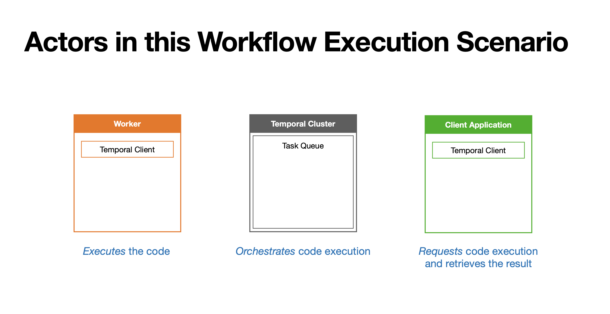

| Actor | Responsibility in our example |
| :--- | :--- |
| Worker | Runs Workflow and Activity code; uses an embedded Temporal Client to communicate with the cluster. Started with `make farewell-worker`. |
| Temporal Cluster | Orchestrates execution, manages Task Queues, and persists Event History. Started through Docker with `make up`. |
| Client application | Requests Workflow Execution and retrieves its result through a Temporal Client. Started with `make farewell`. |
| Microservice | Supplies Spanish greetings and farewells over HTTP. Called by the Activities, not by the Temporal Cluster. Started with `make farewell-service`. |

The figure shows the three Temporal-facing actors. The microservice is the external dependency used by the application's Activities.

### Workers and Task Queues

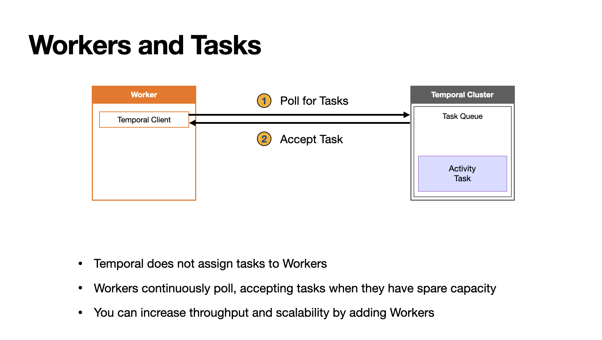

Work assignment is indirect: Workers **poll** the cluster for tasks when they have capacity. The cluster responds to those polls rather than initiating connections to push work to Worker machines. Task routing does not require a preconfigured roster of Workers, though Temporal can expose information about active pollers.

If no suitable Worker is available, work waits for one, subject to applicable timeouts. Adding Workers can increase processing capacity and reduce queueing, provided the cluster and external dependencies can support the load.

This exercise uses one Worker process for simplicity. Production applications commonly use several. Workflow Tasks and Activity Tasks are distinct task types, even when both use the name `greeting-tasks`.

### Commands and Recovery

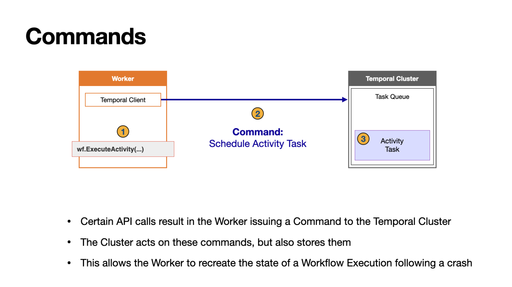

Certain Workflow SDK calls generate **Commands**, which describe what the Workflow wants the server to do. For example, `workflow.ExecuteActivity` generates a command to schedule an Activity.

The SDK sends these commands when completing a Workflow Task. The server acts on them, creates the necessary tasks, and records corresponding Events in Event History. Commands are requests from Workflow code; Events are the durable record of what happened.

The following walkthrough shows how these Commands and Events support progress and recovery in the farewell execution.

## Code Walkthrough

The farewell Workflow advances through several **Workflow Tasks**, separated by **Activity execution**. A Workflow Task runs orchestration code until it yields or finishes; an Activity Task runs the external business operation.

### Starting the Worker and Workflow

With the registered Worker polling, `make farewell` requests execution. The server records **`WorkflowExecutionStarted`**, always the first Event, and schedules a Workflow Task. The Worker accepts it and begins running `GreetSomeone`.

The initial Events are:

```text
WorkflowExecutionStarted
WorkflowTaskScheduled
WorkflowTaskStarted
```

### Executing the Greeting Activity

After configuring Activity options, the Workflow schedules `GreetInSpanish`. Its `Get` yields until the result is available, allowing the SDK to complete the current Workflow Task and send the scheduling command.

The server records the completed Workflow Task and schedules the Activity. A Worker then invokes `GreetInSpanish`, whose `callService` helper requests a greeting from the microservice. On success, the Worker reports the Activity result to the server.

```text
WorkflowTaskCompleted
ActivityTaskScheduled
ActivityTaskStarted
ActivityTaskCompleted
WorkflowTaskScheduled
WorkflowTaskStarted
```

The Activity's recorded completion triggers another Workflow Task. The Worker resumes orchestration with `spanishGreeting` available and checks the error before continuing.

### Executing the Farewell Activity and Recovering from Failure

Next, the Workflow schedules `FarewellInSpanish` and waits for its result. The current Workflow Task completes, and the server schedules another Activity Task.

**If the Worker crashes:** Restart it or start another compatible Worker polling the same queue. When necessary, the SDK replays the recorded history to reconstruct Workflow state. The successful greeting Activity's recorded result is reused; its HTTP request is not repeated during Workflow replay. An Activity whose completion was not durably recorded may still need another attempt.

**If the microservice is offline:** `FarewellInSpanish` returns an error. Temporal retries retryable failures according to the Activity's policy and applicable limits. The Workflow keeps waiting for the farewell result rather than restarting the greeting operation.

When a later attempt succeeds, the Worker reports the farewell result. The server records Activity completion and schedules another Workflow Task so orchestration can continue.

**History detail:** Intermediate retries do not necessarily appear as separate started/failed Event pairs in the final history. Inspect pending Activity details for current attempt and retry information.

### Completing the Workflow

The final Workflow Task obtains the farewell result, checks the error, and returns the combined messages. This produces a command to complete the Workflow Execution. The server records:

```text
WorkflowTaskCompleted
WorkflowExecutionCompleted
```

The client application's `we.Get` can now return the persisted output, which the starter prints. The Worker remains alive and continues polling; completing this Workflow does not terminate the Worker process.

**Two different waits:** `workflow.Future.Get` waits within orchestration for an Activity result; `client.WorkflowRun.Get` waits in the starter application for the entire Workflow result.

## Hands-On Exercise #4: Finale Workflow

**Goal:** Run a Go Workflow that invokes a Java Activity to generate a PDF course-completion certificate, demonstrating polyglot execution and file processing.

The local code is in `03-finale-workflow/`. This exercise only requires running existing code. You need Go and Java available locally, plus the Temporal dev server.

From the project root, start Temporal with `make up`, then run these commands in three separate terminals:

```bash
# Terminal 1: Java Activity Worker
make finale-java-worker

# Terminal 2: Go Workflow Worker
make finale-worker

# Terminal 3: start the Workflow with your full name
make finale
```

The `finale` target passes `"Andy Toma"` as the recipient; change that argument in the Makefile to use another full name.

The Go Worker runs `CertificateGeneratorWorkflow` on `generate-certificate-taskqueue`. The Workflow requests the Activity by its registered type name, `"CreatePdf"`, rather than referencing a Go function. The separate Java Worker executes it using a Java graphics library and returns the generated file path. Cross-language execution requires matching Activity Types, Task Queues, and compatible serialized payloads.

Wait for the starter to print `Generated certificate at:` and open the PDF at that path, typically named `101_certificate_andy_toma.pdf`. The file is created on the Java Worker's filesystem; here both Workers run locally, so no download is needed. Inspect Workflow ID `generate-certificate-workflow` at <http://localhost:8233> for its result and Event History. Stop both Workers with `Ctrl-C` when finished.

## Conclusion

### Essential Points

- **Durable execution:** Temporal preserves Workflow progress and recovers execution across failures. Workflows are code written with a Temporal SDK; in Go, both Workflows and Activities are functions.
- **Cluster versus Workers:** The Cluster orchestrates execution and maintains dynamically created Task Queues; Workers execute application code, polling for tasks when they have capacity. Add Workers to scale and restart or replace them to load code changes, preserving compatibility with existing histories.
- **Frontend Service:** Accepts client requests and routes them to backend services as needed. Client and inter-service communication use gRPC and can be secured with TLS.
- **Deployment:** Self-host a Temporal Cluster or use Temporal Cloud with consumption-based pricing. Moving between them generally requires connection, authentication, and Namespace configuration changes rather than changes to Workflow logic.
- **Namespaces:** Isolate executions within a Cluster, commonly separating environments or application ownership.
- **Activities and retries:** Put unreliable or non-deterministic operations—API calls, database queries, file I/O, and LLM invocations—in Activities. Retryable failures are retried automatically within configured limits; customize behavior with a Retry Policy.
- **Visibility:** The Web UI exposes current and retained past executions, including inputs, outputs, status, and Event History.

### Parting Words

Continue with **Temporal 102 with Go** for a deeper understanding of replay, determinism, and recovery.
